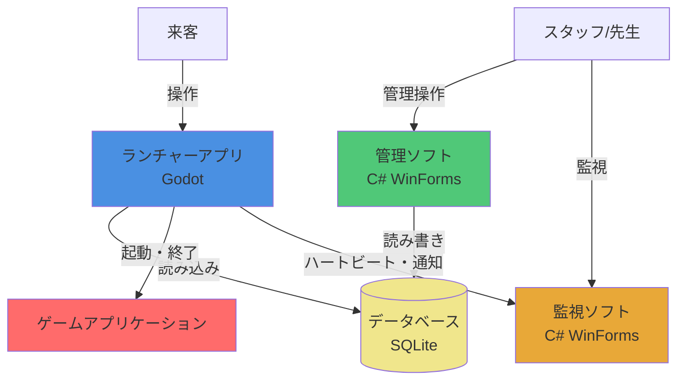
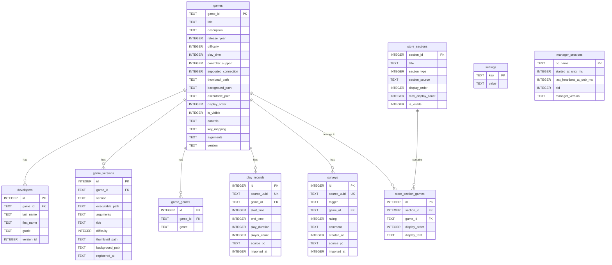

# TonePrism 仕様書

## 1. プロジェクト概要

### 1.1 プロジェクト名

TonePrism

### 1.2 目的

TonePrism は、大阪府立刀根山高校パソコン部が文化祭で展示する部員制作ゲームを、スタッフのサポートなしでも誰でも簡単に選択・起動・変更できるようにすることを目的とします。

主な目的：

- 来客が自分でゲームを選択・起動できるようにする
- スタッフ不在時でもゲームの変更・切替が可能になる
- 文化祭の展示をより円滑に運営できるようにする
- ゲーム展示の体験を向上させる

### 1.3 背景

大阪府立刀根山高校パソコン部では、部員が制作したゲームを文化祭で展示し、来客に遊んでもらう活動を行っています。従来は、エクスプローラーから直接ゲームを起動する方式を採用していましたが、以下の課題がありました：

- エクスプローラーからの起動では、来客が自分でゲームを選択・変更できない
- スタッフが不在の場合、ゲームの起動や切替ができない
- 展示の運営に人手が必要で、効率的でない

これらの課題を解決するため、誰でも簡単に操作できる統合ランチャーシステムの開発を決定しました。また、せっかく新しくシステムを作る機会なので、将来の拡張性も考慮し、様々な機能を追加できる設計とすることも目指します。

### 1.4 スコープ

#### 含むもの

このプロジェクトでは、以下の機能を含みます：

- **ゲーム選択・起動機能**（必須）
  - 来客が自分でゲームを選択できる機能
  - 選択したゲームを起動する機能
  
- **ゲーム情報の表示機能**
  - ゲームの説明表示
  - サムネイル画像や背景画像の表示
  
- **その他の機能**
  - 開発を進めながら追加機能を検討・実装（詳細は後述）

#### 含まないもの

このプロジェクトでは、以下の機能は含みません：

- **ゲーム自体の開発・制作**
  - ゲーム制作は別プロジェクトとして扱う
  
- **スタッフ向け管理機能・監視機能**
  - ゲーム追加・削除などの管理機能は、同プロジェクト内の別アプリケーション（管理ソフト）として開発
  - 展示PCの監視・スタッフ呼び出し通知の受信は、同プロジェクト内の別アプリケーション（監視ソフト）として開発
  - 注：管理ソフト（2.2章）・監視ソフト（2.3章）もこの仕様書内で仕様を定義しているが、ランチャーとは別の独立したアプリケーションとして実装
  
- **オンライン機能**（現時点では範囲外）
  - ランキング、マルチプレイなどのオンライン機能は、機能実装が進めば将来的に検討
  
- **ゲームの更新・配布機能**（現時点では範囲外）
  - 開発が進めば将来的に検討

#### スコープ外機能の将来検討

実行環境の制約（学校PC）を考慮しつつ、システムの機能実装が進めば、オンライン機能やゲーム更新・配布機能なども視野に入れています。

### 1.5 ターゲットユーザー

#### 主ターゲットユーザー

- **文化祭来客**
  - 展示を訪れる来場者
  - 自分でゲームを選択・起動したい来客
  - PC操作に不慣れな来客も含む（直感的な操作が必要）

#### サブターゲットユーザー

- **スタッフ（部員兼スタッフ）**
  - パソコン部の部員で、文化祭の展示運営を行うスタッフ
  - 来客のサポートを行う
  - ゲームの切替や簡単なトラブルシューティングを行う
  - 注：詳細な管理機能（ゲーム追加・削除など）は別ソフトウェアで対応

#### ユーザー像

- 来客は、PCゲームに不慣れな人も含まれるため、操作が直感的で分かりやすいUIが求められます
- スタッフは、展示運営中に来客をサポートしつつ、必要に応じてシステムを操作します

---

## 2. 機能要件

### 2.1 ランチャー機能（来客向け）

#### 必須機能

##### 機能1: ゲーム選択・起動機能

- **説明**: 来客が自分でゲームを選択し、選択したゲームを起動する機能
- **優先度**: 高（必須）
- **詳細**:
  - ゲーム一覧からゲームを選択できる
  - 選択したゲームを起動できる
  - ゲーム起動後、ランチャーからの制御が可能（オーバーレイメニューとの連携）

##### 機能2: ゲーム情報表示機能

- **説明**: ゲームの説明や画像などの情報を表示する機能
- **優先度**: 高（必須）
- **詳細**:
  - ゲームの説明文を表示
  - サムネイル画像や背景画像を表示
  - その他ゲームに関する情報の表示

##### 機能3: ゲームフィルター機能

- **説明**: ゲームをジャンル、製作者、制作年などでフィルター分けできる機能
- **優先度**: 中
- **詳細**:
  - ジャンルでのフィルタリング（PlayStation Storeのジャンル分類に準拠、成人を除いた22種類）
  - 製作者でのフィルタリング
  - 制作年でのフィルタリング
  - 複数条件の組み合わせフィルター

#### 追加機能（後々実装予定）

##### 機能4: オーバーレイメニュー機能

- **説明**: ゲーム中にホームボタンなどを押すと、ゲーム機のようにオーバーレイメニューが表示される機能
- **優先度**: 中
- **詳細**:
  - ゲーム中に特定のキー/ボタンでメニューを表示
  - メニューからランチャーに戻る、設定変更などが可能

##### 機能5: コントローラー・キーボードマウス両対応

- **説明**: コントローラーとキーボードマウスの両方の操作に対応する機能
- **優先度**: 中
- **詳細**:
  - コントローラーでの操作に対応
  - キーボード・マウスでの操作に対応
  - 操作方式の切り替えが可能

##### 機能6: ローカルキャッシュ機能

- **説明**: 学校サーバーからローカルにゲームをダウンロードしておき、快適に起動できる機能
- **優先度**: 中
- **詳細**:
  - 学校サーバーからゲームファイルをダウンロード
  - ローカルにキャッシュして高速起動を実現
  - キャッシュの更新・管理機能

##### 機能7: ランチャー操作説明編集機能（管理ソフト）

- **説明**: 管理ソフトからランチャーの操作説明画面（画面2）の内容（画像・テキスト）を編集できる機能
- **優先度**: 中
- **詳細**:
  - ランチャーの操作説明画面の各ページを画像とテキストで定義
  - 管理ソフトの設定画面から編集可能
  - 画像ファイルのアップロード・差し替え
  - テキストの編集
  - ページの追加・削除・順序変更
  - データベースまたは設定ファイルに保存
  - 注：ゲームの操作説明（`controls`フィールド）とは別の機能

##### 機能8: 操作翻訳機能

- **説明**: 操作説明情報から、コントローラー→キーボードなどへ操作を翻訳できる機能
- **優先度**: 低
- **詳細**:
  - コントローラー操作とキーボード操作の対応表を管理
  - 操作説明を入力方式に応じて自動翻訳

##### 機能9: 予測キャッシュ機能

- **説明**: 来客の選択を予測して、ゲームのキャッシュを事前にダウンロードする機能
- **優先度**: 低
- **詳細**:
  - 人気ゲームや過去の選択履歴を分析
  - 予測に基づいて事前ダウンロード

##### 機能10: アンケート機能
- **説明**: ゲーム終了後およびランチャー終了時にアンケートを実施し、プレイヤーのフィードバックを収集する機能
- **優先度**: 中
- **詳細**:
  - **ゲーム個別アンケート**: ゲーム終了時に表示。面白さ(1-5)、コメント（自由記述、上限 200 字）を収集。
  - **全体アンケート**: ランチャー終了時（退出時）に表示。全体の満足度(1-5)、コメントを収集。
  - **スキップ可能**: 強制すると評価品質が下がるため、両アンケートとも明示的にスキップ可能とする。スキップ時はデータを保存しない
  - **保存方式**: Launcher は SQLite に直接書き込まず、JSON として `responses/` フォルダに出力 → Manager が取り込む（drop-folder 方式 / §6.5 参照）
  - **テーブル統合**: ゲーム個別と全体アンケートは `surveys` テーブルに統合し、`trigger` 列（`'game_end'` / `'launcher_end'`）で区別する。`launcher_surveys` テーブルは廃止
  - フィードバック収集の仕組み

##### 機能11: プレイ記録機能

- **説明**: 各ゲームのプレイ回数や時間を記録して保存する機能
- **優先度**: 中
- **詳細**:
  - ゲームごとのプレイ回数を記録
  - ゲームごとのプレイ時間を記録
  - 記録データの保存・集計
  - **保存方式**: Launcher は SQLite に直接書き込まず、JSON として `responses/` フォルダに出力 → Manager が取り込む（drop-folder 方式 / §6.5 参照）

##### 機能12: 人気ランキング表示機能

- **説明**: プレイ回数などのデータから人気ランキングを算出し、UIに表示する機能
- **優先度**: 中
- **詳細**:
  - プレイ回数・時間などのデータからランキングを算出
  - ランチャーUIにランキングを表示
  - ランキングの更新

##### 機能13: デバッグ機能

- **説明**: 特定のキーを押すと、PC構成やバージョン情報、エラーログなどを表示する機能
- **優先度**: 低
- **詳細**:
  - PC構成情報の表示
  - バージョン情報の表示
  - エラーログの表示
  - スタッフ向けのトラブルシューティング支援

##### 機能14: 言語選択機能

- **説明**: 複数言語に対応し、言語を選択できる機能
- **優先度**: 低
- **詳細**:
  - 複数言語への対応
  - 言語の切り替え機能
  - 多言語リソースの管理

##### 機能15: 色覚モード機能

- **説明**: 色覚に配慮した表示モードを選択できる機能
- **優先度**: 低
- **詳細**:
  - 色覚タイプに応じた表示モード
  - アクセシビリティの向上

##### 機能16: 音量コントロール機能

- **説明**: いつでも音量をコントロールできる機能
- **優先度**: 中
- **詳細**:
  - オーバーレイメニューなどから音量調整
  - マスター音量・ゲーム音量の制御

##### 機能17: スコアボード機能

- **説明**: ゲームごとの何らかの記録を自動で集計してスコアボードを表示する機能
- **優先度**: 低
- **詳細**:
  - ゲームから記録データを受信・保存
  - 記録の自動集計
  - スコアボードの表示

##### 機能18: ニュースフィード機能

- **説明**: PS3のホーム画面のようなニュースフィード機能
- **優先度**: 低
- **詳細**:
  - ニュース・お知らせの表示
  - フィード形式での情報提供
  - 更新情報の配信

##### 機能19: ランチャー操作説明図解表示機能

- **説明**: 初めての人向けにランチャーの操作方法を画像とテキストで図解表示する機能
- **優先度**: 中
- **詳細**:
  - 初回起動時や必要に応じてランチャーの操作説明画面を表示（画面2参照）
  - 画像とテキストベースの図解で説明
  - 複数ページのスライド形式
  - 管理ソフトで編集した内容を表示

##### 機能20: スタッフ呼び出し機能

- **説明**: 来客が困った時にスタッフを呼び出せる機能
- **優先度**: 中
- **詳細**:
  - ランチャー画面やオーバーレイメニューに「スタッフを呼ぶ」ボタンを配置
  - ボタンを押すと監視ソフト（Monitor）に呼び出し通知が送信される
  - 視覚的・音声的なフィードバックで呼び出しが成功したことを来客に通知
  - Monitor側で通知音+ポップアップ表示+呼び出し履歴リストに記録（詳細は2.3章参照）
  - 緊急時やトラブルシューティング時に来客がスタッフを簡単に呼べるようにする
  - わかりやすいUI/UX

##### 機能21: 新バージョン通知バナー

- **説明**: Launcher 上で新バージョン利用可能をユーザーに通知し、Manager 経由での更新を誘導する
- **優先度**: 中
- **詳細**:
  - 起動時に GitHub Releases API で最新バージョンを確認（バックグラウンド、起動を遅延させない）
  - 新バージョンあり時：スクリーンセーバー画面または設定画面に小さな通知バナーを表示
  - 文言例: 「新バージョンが利用可能です。Manager から更新してください。」
  - Launcher 自身はアップデート操作を持たない（権限分離：来場者が触る画面で操作不可、スタッフが Manager 経由で操作）
  - バックグラウンドチェックは N 時間に 1 回（過剰な API リクエスト回避）
- **実現方式**: §3.7 リリース・配布アーキテクチャを参照
- **関連**: 機能13 アップデート機能（Manager 側、§2.2）

##### 機能22: 終了制御機能（Exit Control）

- **説明**: Alt+F4 やウィンドウの閉じるボタンによる終了を封印し、サービスモード（機能23）からのみアプリケーションを終了可能にする機能
- **優先度**: 高（必須）
- **詳細**:
  - Alt+F4 キーフック（終了要求を無視）
  - ウィンドウの×ボタンによる終了を無効化
  - アプリ終了はサービスモード内の「アプリ終了」ボタンからのみ可能
  - 生徒による誤終了・意図的な終了を完全に防止

##### 機能23: サービスモード機能

- **説明**: カラオケ機器のサービスマンモードに着想を得た、スタッフ向けの診断・管理機能。文化祭当日のトラブル切り分け・復旧を行う
- **優先度**: 中
- **詳細**:
  - **起動方法**: Ctrl+Alt+F12 キーコンボ（スタッフのみが知る）
  - **UI形式**: 全画面オーバーレイ（ランチャーの上に被せる。戻るボタンで通常画面に復帰）
  - **UIデザイン**: 質素なデバッグUI（黒背景+白テキスト基調）。ランチャー本体のテーマとは完全に独立。詳細なレイアウトは実装時に決定
  - **自動復帰**: 60秒無操作で自動的にサービスモードを閉じて通常画面に復帰（サービスモード開いたまま離れる事故の防止）
  - **機能一覧**:

    **診断・テスト:**
    1. 入力チェック+コントローラー接続状況 — ボタン/キーの反応確認、接続中デバイス名・プレイヤー番号・最後に入力があったデバイス・抜き差し検知を表示。「反応しない」がゲーム側の問題かOS側で認識していないのかを切り分け可能
    2. 音声チェック — テスト音を再生。音が出ない問題の即診断
    3. 画面表示テスト — 黒・白・赤・緑・青の全画面表示、解像度/スケーリング確認用グリッド、UIセーフエリア確認。モニター相性・拡大率・解像度ズレの事前発見用
    4. ゲーム一覧状態確認 — 各ゲームのexe存在チェック、パス切れの事前発見
    5. ゲーム起動テスト — ゲームが正常に起動するかを自動テスト。全ゲーム一括テストまたは選択したゲームだけテスト。起動後の待機秒数を設定可能。成功条件はプロセス起動確認→ウィンドウ生成確認→規定の生存時間超え（詳細は実装時に決定）。結果一覧を表示（OK/NG）
    6. ネットワーク接続テスト — 段階的に接続状況を表示。IP取得→ゲートウェイ→DNSまでが共通の幹で、そこからインターネット接続（外部接続確認・応答時間表示）とMonitor接続（先生PC接続確認・応答時間表示）に枝分かれする構造。どの段階で失敗しているか一目でわかる
    7. データベース整合性チェック — DBファイルの存在確認、テーブル存在確認、レコード数表示、読み書きテスト。「データが反映されない」問題の切り分け

    **ログ・情報:**
    8. 簡易ログ確認 — 直近のエラーログ表示（メモリバッファから現セッションのログを取得）
    9. エラー内容表示+マニュアル — 直近のエラー詳細 + エラーコード別の対処法マニュアル（例: E-2001: ゲーム実行ファイルが見つかりません→Managerでパスを確認してください）
    10. システム情報表示 — PC名、OS、解像度、Godotバージョン、Launcherバージョン等

    **設定・操作:**
    11. デバッグオーバーレイ切り替え — ON/OFFトグル。ONにするとサービスモードを閉じても画面隅にFPS・メモリ使用量・PC名・現在のシーン状態・DB/Monitor接続状態等をリアルタイム表示し続ける（マイクラのF3的な常時表示）。メモリのみ保持（再起動でOFF）
    12. フルスクリーン切り替え — フルスクリーン↔ウィンドウの切り替え。モニター違いでの表示崩れ対応用
    13. メンテナンスモード切り替え — ON/OFFトグル1つでアンケートスキップ・アイドルタイマー一時停止（スクリーンセーバーに戻らない）・操作説明スキップをまとめて切り替え。メモリのみ保持（再起動でOFFにリセット）。セットアップ・テストプレイ・展示説明時にON、本番前にOFFにするだけ
    14. ランチャーの再読み込み — DB再読み込み。再起動より軽い
    15. アプリの再起動 — OSプロセスとして再起動
    16. アプリ終了 — 確認ダイアログ付きでランチャーを終了。Alt+F4/×ボタン封印のため唯一の終了手段

  - **将来検討事項**:
    - リモートサービス情報取得 — Monitorから各PCのサービスモード情報（システム情報・エラーログ等）を遠隔で確認。来場者対応中の生徒PCを直接操作せずに診断可能。Monitor-Launcher間通信の拡張として実装

##### ログ基盤仕様

- **説明**: サービスモードと連携する、Launcher全体の統一ログシステム。既存のprint()文を置き換え、エラー追跡・デバッグ・運用監視を体系的に行う
- **優先度**: 中（サービスモードと同時に実装）
- **詳細**:
  - **ログレベル**:
    - ERROR: エラー（E-xxxxコード付き）。必ずファイルに記録
    - WARN: 警告（正常動作に影響しないが注意が必要）
    - INFO: 通常操作ログ（ゲーム起動/終了、画面遷移等）
    - DEBUG: 開発用詳細ログ（リリース時は無効化可能）
  - **ログ出力先**:
    - ファイル: `logs/launcher_YYYYMMDD.log` に日次ローテーション
    - コンソール: Godotの標準出力（開発時）
    - メモリバッファ: 直近N件をリングバッファで保持（サービスモードの簡易ログ表示用、現セッションのみ）
  - **ログフォーマット**: `[日時] [レベル] [コード] メッセージ`（例: `[2026-03-28 14:23:05] [ERROR] [E-2001] ゲーム実行ファイルが見つかりません`）
  - **各モジュールへの統合**: app_manager, error_manager, database_manager, game_launcher 等すべてのマネージャーで使用。既存のprint()文を統一ログシステムに置き換え
  - **サービスモードとの連携**:
    - 「簡易ログ確認」: メモリバッファの直近ログを表示
    - 「エラー内容表示」: ログからERROR/WARNのみフィルタして表示 + 対処法マニュアル

### 2.2 管理機能（スタッフ向け）

#### ゲーム管理機能

##### 機能1: ゲーム追加機能

- **説明**: 新しいゲームをシステムに追加する機能
- **優先度**: 高
- **詳細**:
  - **作業フロー**:
    1. 「ゲーム追加」ボタンをクリック
    2. フォルダ選択ダイアログで元のゲームフォルダを選択
    3. 管理ソフトが選択したフォルダを`games/{game_id}/`に自動コピー
    4. ゲームIDの自動生成（または手動入力）
    5. コピー完了後、ゲーム情報入力画面を表示
    6. 実行ファイルの選択（コピーしたフォルダ内から選択、自動検出機能あり）
    7. サムネイル画像の選択（自動検出機能あり）
    8. 背景画像/動画の選択（自動検出機能あり）
    9. ゲーム情報（タイトル、説明、製作者、ジャンル、制作年など）の入力
       - 製作者情報の入力時、期生欄に0を入力すると「教員」として扱われる
    10. 設定（難易度、プレイ時間、コントローラーサポートなど）の入力
    11. 「保存」をクリックしてデータベースに保存
  - **自動検出機能**:
    - 実行ファイル: `*.exe`ファイルを自動検出して候補を表示
    - サムネイル画像: `thumbnail.png`, `thumb.jpg`, `icon.png`などを自動検出
    - 背景画像/動画: `background.mp4`, `bg.mp4`, `preview.mp4`などを自動検出
  - **目的**: 管理者がエクスプローラーを直接操作せず、すべて管理ソフトから操作できるようにする
  - **UI改善**:
    - **画像プレビュー**: 選択したサムネイル・背景画像をその場でプレビュー表示
    - **テスト起動**: 登録前に実行ファイルをテスト起動して動作確認が可能
  - **gameId 重複検出**（Manager v0.8.4 で実装、#120）:
    - 「保存」押下後、ファイルコピー処理の直前に `games/{gameId}/` フォルダの存在をチェック
    - 残骸が残っていた場合は警告ダイアログで「同バージョン追加時にエラー / 別バージョン追加時に古いファイルが残る / 最悪 Launcher が古い実行ファイルを起動する可能性」を提示
    - 自動削除はせず、データ保護のため手動退避を促す方針（OK で続行 = 古いフォルダはそのまま残る、キャンセル = 追加処理を中止）

##### 機能2: ゲーム削除機能

- **説明**: 登録されているゲームをシステムから削除する機能
- **優先度**: 高
- **詳細**:
  - 削除実行は **DB レコード + `games/{game_id}/` フォルダのセット削除**（Manager v0.8.3 で実装、`DeleteGameConfirmForm`）。「DB のみ削除」のオプション分岐は持たない
    - DB 側は `games` 行と CASCADE で削除される関連レコード（developers / game_versions / game_genres / play_records / surveys / store_section_games）
    - フォルダ側は `Directory.Delete(folder, true)` で物理削除
  - 削除前の確認ダイアログ（`DeleteGameConfirmForm`）に削除対象のフォルダパスを表示し、ディスクから物理的に消える旨を警告色で明示
  - `Enter` キー誤操作を防ぐため `AcceptButton` はキャンセルに割り当て
  - フォルダが存在しない場合（手動削除済み等）は表示を「フォルダが見つかりません。DB のみ削除します」に切り替えて DB 削除のみ実行（無害）
  - 削除フローは **rename rollback パターン** (リセットと同じ 3 フェーズ、Manager v0.8.5 / #122):
    1. `games/{gameId}/` を `games/{gameId}.pending-delete-{guid}/` に rename で退避
    2. DB 削除 (CASCADE で関連レコードも削除)
    3. 退避フォルダを物理削除
  - 失敗パターン別の挙動: (1) rename 失敗 → 再試行 UI、諦めたら全体中止 (何も変わらない) / (2) DB 削除失敗 → 退避を rename で戻してロールバック → throw / (3) 退避物理削除失敗 → 再試行 UI、諦めたらゴミ退避フォルダだけ残る (DB / games は確定状態)
  - フォルダ物理削除前に DB 削除が走るので、DB 削除失敗時にフォルダだけ消える永続データロストを排除 (Codex P1 #122)
  - フォルダ削除中に `IOException`（Launcher など他プロセスがフォルダ内のファイルをロック中）や `UnauthorizedAccessException` が発生した場合は、再試行 UI (`FolderDeletionFailureDialog`) を表示
  - フォルダ削除のリトライ機構は `Services.FolderDeletionService.TryDelete` (5 回 × 200ms) を共通化して使用 (Manager v0.8.5 / #122)

##### 機能3: ゲーム情報編集機能

- **説明**: 登録されているゲームの情報を編集する機能
- **優先度**: 高
- **詳細**:
  - ゲーム名、説明文の編集
  - サムネイル画像や背景画像の更新
  - メタデータ（ジャンル、製作者、制作年など）の編集
    - 製作者情報の編集時、期生欄に0を入力すると「教員」として扱われる
  - ゲームファイルの差し替え

##### 機能4: ゲームバージョン管理機能

- **説明**: ゲームのバージョン（更新履歴）を管理し、特定のバージョンをアクティブにする機能
- **優先度**: 高
- **詳細**:
  - **バージョン追加**: 
    - 現在のバージョンをベースに新しいバージョンを作成
    - バージョン番号（例：1.0.0 -> 1.1.0）の付与
    - 更新内容（Update Note）の記録
  - **バージョン切り替え**:
    - 編集画面で対象バージョンを切り替えて情報を編集可能
    - タイトル、実行ファイルパス、画像、説明などをバージョンごとに保持
  - **アクティブ設定**:
    - ランチャーで起動するバージョン（アクティブバージョン）を選択・保存
    - 選択されたバージョンの情報がランチャーに同期される
  - **起動オプション管理**:
    - バージョンごとに異なる起動引数（Arguments）を設定可能

##### 機能5: ゲーム並び順管理機能

- **説明**: ランチャーのデフォルトソート時の並び順を変更する機能
- **優先度**: 中
- **詳細**:
  - ゲームの表示順序を変更
  - ドラッグ&ドロップや数値指定での並び替え

#### データ管理機能

##### 機能6: プレイ記録データ閲覧・エクスポート機能

- **説明**: プレイ記録データを閲覧・エクスポートする機能
- **優先度**: 中
- **詳細**:
  - ゲームごとのプレイ回数・時間の閲覧
  - データのエクスポート（CSV、JSONなど）
  - 期間指定での絞り込み表示

##### 機能7: アンケート結果閲覧・エクスポート機能

- **説明**: アンケート結果を閲覧・エクスポートする機能
- **優先度**: 中
  - ゲームごとのアンケート結果の閲覧
  - データのエクスポート（CSV、JSONなど）
  - 期間指定やゲーム指定での絞り込み表示

##### 機能8: 統計情報表示機能

- **説明**: 各種統計情報を表示する機能
- **優先度**: 中
- **詳細**:
  - 人気ランキングの確認
  - 総プレイ回数・時間の表示
  - グラフやチャートでの可視化

#### 設定管理機能

##### 機能9: ランチャー設定変更機能

- **説明**: ランチャーの各種設定を変更する機能
- **優先度**: 高
- **詳細**:
  - ランチャーの基本設定の変更
  - 表示オプションの変更
  - その他のランチャー関連設定

##### 機能10: フィルター条件管理機能

- **説明**: フィルターで使用する条件（ジャンル、製作者など）を管理する機能
- **優先度**: 中
- **詳細**:
  - ジャンルの追加・削除・編集（PlayStation Storeのジャンル分類に準拠、成人を除いた22種類）
    - 利用可能なジャンル（22種類）:
      - アクション、アドベンチャー、アーケード、パズル、RPG、カジュアル、シミュレーション、シューティング、ストラテジー、その他、ドライビング/レース、ホラー、ファミリー、スポーツ、シミュレーター、格闘、脳トレ、パーティー、リズムアクション、クイズ、教育、フィットネス
  - 製作者リストの管理
  - その他フィルター条件の管理

##### 機能11: その他設定管理機能

- **説明**: その他のシステム設定を管理する機能
- **優先度**: 中
- **詳細**:
  - カラーテーマ設定（アクセントカラーの選択・設定）
  - システム全体の設定変更
  - 必要に応じて追加される設定項目の管理
  - **データベースリセット機能**（Manager v0.8.4 で実装と整合化）:
    - 設定タブの「データベースリセット」ボタンから起動
    - 確認ダイアログ (`ResetDatabaseConfirmForm`) で「ボタンが逃げる」「確認コード入力」の二重安全機構を経て実行
    - 削除実行は **`toneprism.db` + `games/` フォルダ配下のセット削除**（旧実装は DB のみ削除で確認画面と齟齬していたが #119 で修正）
    - 実装は **rename rollback 方式**:
      1. `games/` を `games.pending-delete-{guid}/` に rename で退避（同一ボリューム rename は事実上 atomic）
      2. `toneprism.db` を削除
      3. `games/` を再作成 + DB 再初期化
      4. 退避フォルダを物理削除
    - 失敗パターン別の挙動: (1) games rename 失敗 → 何も変わらず throw / (2) DB 削除失敗 → games を rename で復元 (ロールバック) してから throw / (3) games/ 再作成 or DB 再初期化失敗 → 部分作成された games/ と toneprism.db を削除 + 退避を games/ に戻して throw（DB だけ消えた状態でバックアップ #96 から復元可能） / (4) 退避フォルダ物理削除失敗 → 戻り値で警告メッセージを返す（DB / games 再構築済み + ゴミ退避フォルダだけ残る、Launcher が起動中ゲームの実行ファイルを掴んでいると起き得る）。**いずれの中間失敗でも Manager は再起動可能**
    - **`ResetDatabase()` の戻り値**: `Services.FolderDeletionService.Result` 型 (Manager v0.8.5 で `string` から構造化)。Success=true は完全成功、Success=false は退避フォルダ削除失敗（DB / games は再構築済み）で Path / LastError に詳細あり。呼び出し側 (`SettingsSectionPanel.btnResetDatabase_Click`) は結果に関わらず `UpdateVersionInfo()` / `DatabaseReset?.Invoke()` を実行し、Success=false なら `FolderDeletionFailureDialog` で再試行ループを提供する
    - **再試行 UI** (`FolderDeletionFailureDialog`、Manager v0.8.5 / #122 Group C): 退避フォルダ削除失敗時、ユーザーが Launcher を閉じてから「再試行」ボタンを押せばロック解放されて削除成功する想定。失敗詳細 (Exception.Message) も表示。「諦める」を選んだ場合は警告 MessageBox で手動削除を案内
    - `backups/` 等の隣接フォルダは触らない（復元用に残す）
    - 確認画面 (`ResetDatabaseConfirmForm`) に「すべての展示PCの Launcher を終了してから実行」警告を表示
    - 実行前にバックアップ機能 (#96 / Manager v0.8.0) で `toneprism.db` のスナップショット取得を強く推奨

#### バックアップ機能

##### 機能12: データベースバックアップ・復元機能

- **説明**: `toneprism.db` のスナップショットを取得・管理し、障害・破損・操作ミス発生時に過去の状態へ戻せるようにする機能
- **優先度**: 高（特にプレイ記録・アンケート結果のような再現不可なデータの保全のため）
- **対応リリース**: Manager v0.8.0
- **詳細**:
  - **専用タブ「バックアップ」**を MainForm に追加
  - **手動バックアップ**: 「今すぐバックアップ」ボタンで即時実行
  - **自動バックアップ**: Manager 起動時に「前回バックアップから設定間隔（デフォルト 24h）以上経過していたら走らせる」方式
    - 設置現場の運用上、Manager は常時起動でなく時々開かれる前提のため、起動時チェック方式を採用（cron 型ではない）
  - **バックアップ方式**: SQLite Online Backup API（`SQLiteConnection.BackupDatabase`）を使用
    - Launcher が `toneprism.db` を開いている状態でもライブDBの整合性を保ったコピーが可能
    - WAL モードのチェックポイント処理も内部で適切に行われる
  - **マルチPC重複防止**: `settings.last_backup_at` を `BEGIN IMMEDIATE` トランザクションで更新する lease 方式
    - 運用上は単一Manager前提だが、防衛的な仕組みとして実装
  - **バックアップ履歴一覧**: `backup_log` テーブルを表示（開始日時 / 完了日時 / 実行PC / トリガ / サイズ / ファイルパス）。「状態」列は #200 (Manager v0.16.1) で削除 — `failed` は起動時 auto-cleanup で DB + 物理削除、`in_progress` は数秒のみで、grid を開いた時点で実質ほぼ全行「成功」になり情報量ゼロだったため。`status` の DB 3 値 + reconcile logic は不変
    - 表示時に `BackupPathResolver` でパス解決（Manager v0.8.7 / #126）。`relative_path` が記録されているレコードは現在の `toneprism.db` のあるディレクトリからの相対で動的に絶対パスを再構築 → **プロジェクト場所の移動に追従**
    - パス解決後の `File.Exists` チェックでファイルが見つからないレコードは履歴一覧に表示しない（DB レコードは保護のため残す）
    - `status='failed'` のレコードは Manager 起動時のリコンサイル処理で物理ファイル + DB レコード両方を **自動削除** （表示価値が無く、古いプロジェクトパスのゴミの主因にもなっていたため）
  - **個別削除 UI**（Manager v0.8.7 / #126）: 履歴を選んで「選択した履歴を削除...」ボタン → 確認ダイアログ → バックアップファイル + DB レコード両方を削除
  - **相対パス保存**（Manager v0.8.7 / #126）: バックアップ作成時に `relative_path`（`toneprism.db` のあるディレクトリからの相対）も記録する。dbDir 配下にある場合のみ記録、それ以外（ユーザーが絶対パスで設定）は NULL
  - **保存先設定**: デフォルトは `<DBファイルのフォルダ>/backups/`、設定で任意のフォルダに変更可能
  - **ファイル名規則**: `toneprism_YYYYMMDD_HHmmss.db` (#168 brand rename で `prism_` prefix から変更)
  - **世代管理**: 設定値 `backup_retention_count`（デフォルト 30）を超える古いバックアップは自動削除
  - **リストア機能**:
    1. 履歴一覧から復元したいバックアップを選択
    2. 警告ダイアログ表示（「全Launcher を停止してください」「現DBは退避されます」）
    3. 4桁の確認コード入力による誤操作防止（`ResetDatabaseConfirmForm` と同じパターン）
    4. 現在の `toneprism.db` を `safety_before_restore_HHmmss.db` として Online Backup API で退避
    5. SQLite 接続プールをクリア
    6. `toneprism.db` / `toneprism.db-wal` / `toneprism.db-shm` を削除
    7. 選択されたバックアップを `toneprism.db` としてコピー
    8. DB を再初期化、各パネルを再ロード
- **設定値**（`settings` テーブルに保存）:
  - `last_backup_at`（UNIX秒）: 最終バックアップ完了時刻、lease で使用
  - `backup_destination_path`（TEXT）: 保存先フォルダ。空ならデフォルト
  - `backup_auto_interval_hours`（INTEGER, デフォルト 24）: 自動バックアップ間隔
  - `backup_retention_count`（INTEGER, デフォルト 30）: 保持する世代数

#### アップデート機能

##### 機能13: アップデート機能（Manager UI）

- **説明**: Manager UI 上の「アップデート」タブから、新バージョンの検知・確認・適用までを一元管理する
- **優先度**: 高（部員のインストール作業負担軽減のため早期実装、#41 関連）
- **詳細**:
  - 起動時に GitHub Releases API で最新バージョンをバックグラウンド確認
  - 「アップデート」タブの表示内容：
    - 現在のバージョン情報一覧（Launcher / Manager / 各 Companion [Updater / WindowProbe 等、§2.4] / DB schema）
    - 新バージョンあり時：バージョン番号、リリース日、リリースノート（Markdown レンダリング）
    - 操作ボタン：「今すぐアップデート」「あとで」「このバージョンをスキップ」
  - 「今すぐアップデート」押下時のフロー：
    1. Launcher 起動中なら閉じるよう案内（必要なら kill 確認ダイアログ）
    2. GitHub Releases から zip をダウンロード（プログレスバー表示）
    3. staging エリアに展開して必須ファイル全揃いを検証
    4. Updater.exe を spawn → Manager 自身を終了 → Updater が実ファイル置換 → 新 Manager 起動
  - 「このバージョンをスキップ」を選んだバージョンは `settings` テーブルに記録、再通知しない
  - 失敗時：エラー詳細をダイアログ表示 + 「再試行」または「リリースページを手動で開く」を選択可能
- **保護されるユーザーデータ**: `toneprism.db` / `games/` / `backups/` / `responses/` / `logs/` は置換対象外
- **実現方式**: §3.7 リリース・配布アーキテクチャを参照
- **関連**: 機能21 新バージョン通知バナー（Launcher 側、§2.1）

### 2.3 監視機能（Monitor - 先生PC向け）

パソコン室内の先生PCで動作し、各展示PCの状態監視とスタッフ呼び出し通知の受信を行う監視ソフトウェア。

#### スタッフ呼び出し通知

##### 機能1: 呼び出し通知受信

- **説明**: Launcherの「スタッフを呼ぶ」ボタン押下時に通知を受信する機能
- **優先度**: 高
- **詳細**:
  - 通知音を鳴らし、どのPCからの呼び出しかをポップアップで表示
  - 呼び出し履歴リストに記録
  - 対応済みマークを付けられる
  - 通知音のON/OFF設定が可能

#### PC状態監視

##### 機能2: 各PC状況一覧

- **説明**: 各展示PCの現在の状態をリアルタイムで一覧表示する機能
- **優先度**: 高
- **詳細**:
  - PC名（ホスト名自動取得）、状態（プレイ中/アイドル/呼び出し/異常）、起動中ゲーム名、経過時間を表示
  - Launcherからのステータス更新メッセージに基づきリアルタイム更新

##### 機能3: Launcher異常検知

- **説明**: Launcherの異常終了やフリーズを検知して通知する機能
- **優先度**: 高
- **詳細**:
  - **エラー通知**: Launcherのクラッシュハンドラ（未処理例外キャッチ）からのエラー通知を受信
  - **ハートビート途絶検知**: 各Launcherは5秒間隔でハートビートを送信し、15秒間（3回分）応答がない場合に「異常」と判定
  - 異常検知時は通知音 + PC状況一覧で赤色表示

#### その他

##### 機能4: プレイ統計ダッシュボード（後日決定）

- **説明**: ゲームごとのプレイ回数・アンケート結果等をリアルタイムで表示する機能
- **優先度**: 未定
- **詳細**:
  - 実装範囲・表示内容は後日決定

##### 機能5: 設定管理

- **説明**: Monitorの各種設定を管理する機能
- **優先度**: 中
- **詳細**:
  - JSON設定ファイルをバックエンドとし、GUI設定画面からも編集可能
  - 設定項目: 通信方式（TCP/UDP or 共有フォルダ）、ポート番号/共有フォルダパス、通知音ON/OFF、通知音ファイルパス、ハートビート間隔（デフォルト5秒）、タイムアウト（デフォルト15秒）

### 2.4 Companions（主要アプリを補助する独立 exe 群）

主要 3 アプリ（Launcher / Manager / Monitor）以外の **補助 exe** をまとめる集約カテゴリ。Updater のような独立稼働ツール、WindowProbe のような Launcher 補助ツール、PauseOverlay のような常駐 GUI 等、すべてここに含める。

「補助」の定義: 主要アプリの実行中に呼び出されて働くか、主要アプリのライフサイクル外（例: アップデート時）で動く小規模な独立 exe。主要 vs 補助の境界をリポジトリ構造のトップレベルで明示することで、新規 maintainer が「Launcher / Manager / Monitor を読めばメインの挙動は分かる」「Companions は周辺ツール」と一目で判断できる。

#### 配置・技術スタック

- **配置**: リポジトリルート `Companions/<名前>/`（dev-time）。runtime も同じ構造を維持し `<install>/TonePrism/Companions/<名前>/` に配置される。
- **言語/環境**: 原則 C# / .NET Framework 4.8（Manager と同じ）。Godot や別 runtime が必要な特殊ケースが将来出たら個別判断。
- **ビルド管理**: 各 Companion は独立 csproj。`Release.ps1` が個別に msbuild する形（リポジトリルート `.sln` は現状なし、必要になった段階で追加検討）。
- **配布**: ビルド成果物を `Companions/<名前>/` 配下にコピーする dev-time の階層構造をそのまま runtime にも反映（dev / runtime で配置の非対称を作らない）。

#### 命名規約

[AGENTS.md "Naming Conventions"](AGENTS.md) と一貫:

- フォルダ名 = 短縮（`Companions/Updater/` / `Companions/WindowProbe/` 等）
- csproj 名 / アセンブリ名 / exe 名 = `TonePrism_<名前>`（process 検知 uniqueness のため prefix 維持、例: `TonePrism_Updater.exe`）
- C# namespace = `TonePrism.<名前>`

#### 構成方針

```
TonePrism/                                  # リポジトリルート
├── Launcher/                                 # 主要 (Godot)
├── Manager/                                  # 主要 (.NET 4.8 WinForms)
├── Monitor/                                  # 主要 (将来、独立コンポーネント)
└── Companions/                               # 補助 exe 集約
    ├── Updater/                              # Manager 置換 + 再起動 (§3.7.4)
    │   └── TonePrism_Updater.csproj
    ├── WindowProbe/                          # Launcher 補助: 可視/前面ウィンドウ検知 (#101 / #216 実装済)
    │   └── TonePrism_WindowProbe.csproj
    ├── (将来) PauseOverlay/                   # Launcher 補助: 中断メニュー
    │   └── TonePrism_PauseOverlay.csproj
    └── (将来) Common/                          # 共有 Win32 ヘルパー (DllImport 集約等)
        └── TonePrism_CompanionsCommon.csproj  # csproj 名は disambiguation のため "Companions" prefix を残す
```

#### Companion の呼び出し主体

| Companion | 呼び出し主体 | 起動タイミング | 詳細 |
|---|---|---|---|
| Updater | Manager (Phase 4) | Manager UI のアップデート操作 | §3.7.4 |
| WindowProbe | Launcher | ゲーム起動中 → プレイ中遷移検知 | 下記 / #101 |
| PauseOverlay | Launcher | ゲーム実行中の中断メニュー呼び出し | 下記 / #30 |

#### Launcher 系 Companion (WindowProbe / PauseOverlay) の通信規約

- **呼び出し**: Godot 側から `OS.execute()`（単発）または `OS.create_process()`（常駐）。exe path は実行時に `Companions/<名前>/TonePrism_<名前>.exe`（プロジェクトルート相対）で解決する。
- **戻り値**:
  - 単発系: 標準出力 1 行 + 終了コード
  - 常駐系: 標準出力 1 行 = 1 メッセージ (JSON 形式)、`{"event":"...","payload":{...}}` の構造で双方向通信
- **エラー**: 終了コード非ゼロ + 標準エラー出力にメッセージ

#### 各 Companion の機能（将来分含む）

##### Updater（Phase 3 で実装、SPEC §3.7.4 詳細）

Manager 自身のファイル置換 + 再起動を担う最小 CLI。Manager 動作中にファイルロックで自分自身を置換できない Windows 制約だけを解決する。Launcher / 常駐 Companions / shortcut bat の置換は Manager UI 側 (§3.7.3) が担当。

##### WindowProbe（単発クエリ、#101 / #216 で実装済）

- **説明**: 指定 PID の**プロセスツリー (PID + 全子孫)** が可視ウィンドウ / 前面ウィンドウを持つかを検知する
- **用途**:
  - Launcher の「ゲーム起動中 → プレイ中」遷移タイミングを正確化 (#101)
  - ゲーム実行中のランチャー前面化異常検知（要スタッフ対応、#216）
- **入力**: コマンドライン引数 `<pid>`
- **出力** (stdout 1 行):
  - `visible_foreground`: 可視ウィンドウあり、かつ前面
  - `visible_background`: 可視ウィンドウあり、ただし前面でない
  - `not_visible`: プロセスは存在するが可視ウィンドウなし
  - `not_found`: プロセス自体が存在しない
- **終了コード**: 0=成功 / 2=引数エラー / 1=実行時例外
- **使用 API**: `EnumWindows`, `GetWindowThreadProcessId`, `IsWindowVisible`, `GetForegroundWindow`, `CreateToolhelp32Snapshot`（プロセスツリー解決）
- **プロセスツリーを辿る理由**: Launcher は `cmd.exe /C "cd /d <dir> && game.exe"` でゲームを起動する（作業 dir 設定のため）。握る PID は cmd.exe で、ゲームウィンドウは子の game.exe に属する。ランチャー型ゲームが孫プロセスを生むケースもあるため、PID 単体ではなく子孫まで辿って可視ウィンドウを探す。
- **高頻度呼び出し前提**: Launcher が ~150ms（プレイ確定後は ~1s）間隔で繰り返し呼ぶため、起動毎のログファイル生成は行わない（結果は stdout、エラーは stderr のみ）。Launcher 側は専用スレッドで呼び出してメインスレッドをブロックしない。

##### PauseOverlay（常駐 GUI、#30 で実装予定）

- **説明**: ゲーム実行中にグローバルホットキーで呼び出せる中断メニューを提供（on-game overlay 方式：透過 WPF 常駐 + 常時最前面 + クリックスルー）
- **用途**: ボーダーレスウィンドウゲームの上に重ねて中断メニューを表示し、終了/Monitor 呼び出し/音量調整/再開等の操作を提供
- **必要技術**: WPF 透過 + 常時最前面ウィンドウ、低レベルキーボードフック (`SetWindowsHookEx`)、XInput Guide ボタン検知 (`xinput1_4.dll` ordinal #100 = `XInputGetStateEx`)
- **通信**: Launcher が `create_process` で起動、Launcher へは stdout/JSON で「閉じた / 終了選択された / Monitor 呼び出された」等を通知
- **前提**: ゲームがボーダーレスウィンドウモードで起動していること（排他フルスクリーンゲームでは on-game overlay 不可。`overlay_supported = false` フラグ + fallback ジェスチャー対応）
- **詳細**: 設計詳細は #30 を参照

#### 実装方針の検討事項

- 各 Companion を独立 `.exe` にするか、単一 `.exe` + サブコマンド (`companions.exe probe <pid>` 等) にまとめるか
- Common ライブラリの参照は静的リンクにするか動的にするか（配布物数に影響）

#### 旧仕様との差分

旧 v1.10.3〜v1.10.8 では Companions を「Launcher 専用サブコンポーネント、`GCTonePrism_Launcher/Companions/` 配下、runtime は Launcher exe と同じ dir に同梱」と定義していた。Phase 3 着手前に再定義（v1.10.9）し、Companions の意味を「主要アプリを補助する独立 exe 群、リポジトリルート `Companions/` 配下、dev/runtime 一貫配置」に拡張。Updater もこのカテゴリに含まれるようになった。同 v1.10.9 で `GCTonePrism_<Name>/` フォルダの `GCTonePrism_` prefix を外して短縮形に統一する命名整理も実施（exe / csproj 側 prefix は process 検知 uniqueness のため維持、その後 #168 brand rename で `TonePrism_` prefix に再変更）。

#### Launcher との通信規約

- **呼び出し**: Godot 側から `OS.execute()`（単発）または `OS.create_process()`（常駐）
- **戻り値**:
  - 単発系: 標準出力 1 行 + 終了コード
  - 常駐系: 標準出力 1 行 = 1 メッセージ (JSON 形式)、`{"event":"...","payload":{...}}` の構造で双方向通信
- **エラー**: 終了コード非ゼロ + 標準エラー出力にメッセージ

#### 各 Companion の機能

##### Companion 1: WindowProbe（単発クエリ、#101 / #216 で実装済）

- **説明**: 指定 PID の**プロセスツリー (PID + 全子孫)** が可視ウィンドウ / 前面ウィンドウを持つかを検知する
- **優先度**: 高
- **用途**:
  - Launcher の「ゲーム起動中 → プレイ中」遷移タイミングを正確化（旧来は固定 1 秒待機 + プロセス spawn 直後で切替。固定待機は最低表示時間として残し、遷移自体は可視ウィンドウ検出で確定）
  - ゲーム実行中のランチャー前面化異常検知（#216）
- **入力**: コマンドライン引数 `<pid>`
- **出力** (stdout 1 行): `visible_foreground` / `visible_background` / `not_visible` / `not_found`（詳細は上記「各 Companion の機能（将来分含む）」の WindowProbe 節）
- **使用 API**: `EnumWindows`, `GetWindowThreadProcessId`, `IsWindowVisible`, `GetForegroundWindow`, `CreateToolhelp32Snapshot`

##### Companion 2: PauseOverlay（常駐 GUI、将来実装）

- **説明**: ゲーム実行中にグローバルホットキーで呼び出せる中断メニューを提供（on-game overlay 方式：透過 WPF 常駐 + 常時最前面 + クリックスルー）
- **優先度**: 中（マイルストーン10〜13 範囲）
- **用途**: ボーダーレスウィンドウゲームの上に重ねて中断メニューを表示し、終了/Monitor 呼び出し/音量調整/再開等の操作を提供
- **必要技術**: WPF 透過 + 常時最前面ウィンドウ、低レベルキーボードフック (`SetWindowsHookEx`)、XInput Guide ボタン検知 (`xinput1_4.dll` ordinal #100 = `XInputGetStateEx`)
- **通信**: Launcher が `create_process` で起動、Launcher へは stdout/JSON で「閉じた / 終了選択された / Monitor 呼び出された」等を通知
- **前提**: ゲームがボーダーレスウィンドウモードで起動していること（排他フルスクリーンゲームでは on-game overlay 不可。`overlay_supported = false` フラグ + fallback ジェスチャー対応）
- **詳細**: 設計詳細は #30 を参照

#### 実装方針の検討事項

- 各 Companion を独立 `.exe` にするか、単一 `.exe` + サブコマンド (`companions.exe probe <pid>` 等) にまとめるか
- Common ライブラリの参照は静的リンクにするか動的にするか（配布物数に影響）

---

## 3. 非機能要件

### 3.1 パフォーマンス要件

- **レスポンスタイム**:
  - ゲームの重さによって起動時間は様々なため、具体的な秒数での目標は設定しない
  - 待ち時間中にプログレスバーやローディングアニメーションなどのUX要素に注力する
- **スループット**:
  - 同時起動ゲーム数は1つに制限
  - ゲームの多重起動を防止する仕組みが必要
- **リソース使用量**:
  - 想定環境: Core i3 11世代、メモリ8GB程度の学校PC
  - 限られたリソース環境でも快適に動作することを重視

### 3.2 セキュリティ要件

- **認証方式**:
  - 特に認証機能は不要（スタッフ向け管理機能も認証なしで使用）
- **認可方式**:
  - 認証機能がないため、認可も不要
- **データ保護**:
  - 個人情報に関係しないデータ（アンケート結果、プレイ記録など）については、適切に保存・管理する
  - データの安全な保存・管理を実施
- **脆弱性対策**:
  - 一般的なセキュリティベストプラクティスに従う

### 3.3 可用性

- **稼働率**:
  - 文化祭期間中は基本的に常時稼働
  - 人がいない時間も、スクリーンセーバー兼プレビュー機能としてゲームセンターのように表示し続ける
- **ダウンタイム許容範囲**:
  - 基本的にダウンタイムは最小限に抑える
  - トラブル発生時は迅速な復旧が可能なようにする

### 3.4 拡張性

- **ユーザー数**:
  - 現在の想定: 40人キャパのパソコン室が常時3/4程度埋まる（約30人）
- **データ量**:
  - ゲーム数: 現在30個程度、年間10個程度増加を想定
  - プレイ記録、アンケート結果などのデータが年々蓄積されることを考慮
- **機能追加**:
  - 将来的な機能追加（オーバーレイメニュー、ランキング機能など）に対応できるよう、拡張性を考慮した設計を採用する
  - モジュール化やプラグイン的な設計を検討

### 3.5 互換性要件

- **OS**:
  - Windowsのみ対応予定
- **ブラウザ**:
  - デスクトップアプリケーションとして開発するため、ブラウザ要件は該当なし
- **ハードウェア**:
  - 学校PCの仕様に合わせる必要があるため、顧問の先生と要相談
  - 現在想定している環境: Core i3 11世代、メモリ8GB程度

### 3.6 ログ基盤（全コンポーネント横断要件）

すべてのクライアントコンポーネント（Launcher / Manager / Monitor 等）は
本節の最低要件を満たすファイルログ機構を実装すること。
（Companions（§2.4）の log は **parent (Launcher または Manager) の log に post-hoc absorb** される想定。Companion 自身は独立 log dir を持つが Manager GUI ログビューアからは直接見えない。詳細は本節末「Companions ログ管理規約」を参照）
本節は #116 で導入された土台仕様であり、
将来の §2.1「ログ基盤仕様」(#85) でフル仕様（DEBUG・リングバッファ・エラーコード・サービスモード連携）に拡張される。

- **保存先**: default は project root (`toneprism.db` のあるディレクトリ) の `logs/<component>/` 配下、user 設定 `logs_root_path` (#201、Manager v0.15.0 以降) で **親 root を移設可能**
  - default 例: `<project_root>/logs/manager/manager_<PCname>_<YYYY-MM-DD_HHmmss>.log`
  - default 例: `<project_root>/logs/launcher/launcher_<PCname>_<YYYY-MM-DD_HHmmss>.log`
  - 移設例: `logs_root_path = D:\TonePrism_logs\` → `D:\TonePrism_logs\manager\manager_*.log` / `D:\TonePrism_logs\launcher\launcher_*.log` / `D:\TonePrism_logs\updater\updater_*.log` (Monitor component 実装時に `monitor/` も追加予定、Manager v0.15.0 時点では Monitor 未実装のため UI hint と一致させて 3 component 列挙)
  - 配置の理由: 共有上の toneprism.db と同じ場所に集約することで Manager のログビューア UI から複数 component のログを 1 箇所で閲覧可能になる + custom root 設定で SMB 共有外への分離も可能
  - 検出方法 (default 時): exe 隣から最大 10 階層遡って `toneprism.db` を探す。見つからなければ exe 隣にフォールバック（PathManager と同じ思想だが Logger 専用に重複実装することで PathManager 起動ログのキャプチャ漏れを防ぐ）。**既知制約 (R3 review High-2 + R4 review H-1)**: 以下 3 経路が `toneprism.db` 不在の異常 path で divergence するため健全 install では発火しないが、dev 環境 (`.git` 直下から exe 起動) 等で symptom 観測される可能性あり:
    - **(a) Logger 書出先**: Logger の本 fallback (= `toneprism.db` 探索 → 不在で exe 隣) と `PathManager.FindBaseDirectory` (priority-1 `toneprism.db` → priority-2 `.git` → priority-3 `Manager+Launcher` sibling) が divergence、Logger は `<exe 隣>/logs/`、PathManager (= LogSectionPanel viewer の scan 元) は `<repo>/logs/` を見るため viewer から log が見つからない
    - **(b) Manager → Launcher bridge file 書出先 (Manager 側)**: Manager は `<PathManager.BaseDirectory>/responses/launcher_logs_root.json` に書出 (= priority-1〜3 で resolve)
    - **(c) bridge file 読込先 (Launcher 側)**: Launcher `_find_project_root_for_logs()` は **toneprism.db lookup のみ** + 不在時 exe 隣 fallback (= Logger 同様、Launcher 側 PathManager autoload 後行のため独立実装)、bridge file を `<exe 隣>/responses/` から読む → Manager が `<repo>/responses/` に書いた値が Launcher に **silent に届かない** path
    根本解消は (a) Logger / (c) Launcher Logger 双方の resolution を Manager 側 PathManager.BaseDirectory / Launcher 側 PathManager autoload 経由に揃える別 PR を要する。本 PR では受容、健全 install での発火ゼロを根拠に dev 環境制約として明文化。
  - **Manager → Launcher path 伝搬**: Manager は `logs_root_path` を SQLite から読み、`<project_root>/responses/launcher_logs_root.json` に **atomic write** で path を公開。Launcher Logger は autoload 最先頭 init 時 (= DB 接続前) に当該 file を read して log dir を解決、SPEC §6.5「Launcher は SQLite に直接 write しない」原則を維持しつつ Manager 設定を反映する。本 file は §6.5 「`responses/` 直下 vs subfolder の責務分離」規約に従い **直下**に配置 (= Manager → Launcher 単方向 single-file write、`play_records/` 等の data drop と物理分離されるため取り込み logic の sweep 対象外)
  - **反映タイミング**: Manager は次回 Manager 起動時、Launcher は次回 Launcher 起動時 (= JSON file は Manager save 時即時 sync されるため、Launcher 再起動だけで反映)
- **1 起動セッション = 1 ファイル**: 日跨ぎでもローテートしない。PC 名 + 起動時刻でファイル名がユニーク
  - 利点: 複数 PC が同じファイルに書き込まないので、書き込み競合・行間 interleaving が発生しない
  - 同秒衝突対策: 連番サフィックス (`_2`, `_3` ...) でリトライ
- **レベル**: INFO / WARN / ERROR の 3 段階（#85 で DEBUG が追加される予定）
- **フォーマット**: `[YYYY-MM-DD HH:mm:ss] [LEVEL] [Module] message` 形式（PC 名はファイル名で表現するので行に含めない）
- **保持期間**: 30 日。起動時に古いファイル (mtime 基準) を自動削除。現セッションのアクティブファイルは明示的に保護
- **既存出力の自動取込**:
  - .NET (Manager 等): `Console.SetOut(...)` で `Console.WriteLine($"[Module] msg")` をフックし、INFO としてファイルにも書く
  - Godot (Launcher 等): Godot 標準ファイルログ (`user://logs/godot.log`) を 0.5 秒間隔でテールし、新規追加分を `[Godot]` プレフィックス付きでセッションファイルに転送。行頭の `WARNING:` / `ERROR:` 等を解析してレベル振り分け（`OS.add_logger` で Logger 継承する案は GDScript パーサが script 継承の Logger 型変換を蹴るため断念）
- **明示 API**: 新規コードは `Logger.Info / Warn / Error` 等で **レベルを明示指定すること** (= MUST、AGENTS.md「Cross-component Standards」と整合)。`Console.WriteLine` / `print` は legacy で動作はする (上記自動取込) が、すべて INFO 扱いになり WARN/ERROR の選別を放棄することになるため新コードでは使わない。pre-existing 分は段階的に移行する (PR #162 で Manager は全件 sweep 済、Launcher は #85 で対応予定)
- **起動・終了イベント**: 必ず INFO で記録
- **障害耐性**: ログ機構自身の例外は握り潰し、アプリ起動を止めない・無限ループを起こさない
  - Logger 内部の例外は **絶対にログに書かない**（書くと再帰してハング）
  - 初期化失敗時は警告ダイアログを出してアプリは継続

参照実装:
- `Manager/Services/Logger.cs`（Manager v0.8.8 で導入）
- `Launcher/scripts/logger.gd`（Launcher v0.5.16 で導入）

#### Companions ログ管理規約 (Manager v0.14.0、PR #199 で確立)

Companion (§2.4) は parent component (Launcher または Manager) のサポート exe であり、Manager GUI のログビューアで見える log source は **Launcher / Manager / Monitor の 3 component に収束** させる方針。Companion 自身は独立 log dir を持つが、Manager GUI からは直接見えない (= 3 component 収束が部員の mental model として理解しやすい、将来 Companion が増えても source 数は 3 のまま固定で UI 不変)。

- **各 Companion は自身の `<install>/logs/<companion>/` に log を書く** (safety net): Companion 単体 debug 時に file が残る、parent が落ちた瞬間の Companion 動作も追跡可能。
- **親 component への流入は post-hoc filtered absorb**: parent component (Launcher または Manager) が起動時に最新の Companion log を scan、`[ERROR]` / `[WARN]` 全件 + 主要 milestone (Phase 境界 / 完了 marker / spawn 結果 / FATAL marker 等) のみ抽出して parent 自身の Logger 経由で親 log file に append。verbose な詳細行 (= file copy / verify 等) は Companion 自身の file 側に隔離。
- **INFO milestone success-path 限定規約**: Companion 側で「INFO レベルで absorb される milestone marker」を出す時は **必ず success path のみ**。failure event (例: rollback、spawn 失敗、replace 失敗 等) は WARN / ERROR レベルで出す規約。これにより parent 側 absorber の MilestoneRegex を broad alternation (= anchor なし substring 一致) で書いても INFO false positive が構造的に発生しない契約となる。
- **多行 entry 継続行サポート**: `Logger.Error(string, Exception)` 等が出力する stack trace 等の継続行 (= `[ts] [LEVEL]` ヘッダを持たない行) は直前 absorb 行に追従して 1 entry に merge、parent log への書出も改行込みの単一 entry として記録する (= ERROR 1 行目だけ拾って stack trace 本体が silent に欠落する path を構造的に閉鎖)。**orphan 継続行** (= ファイル先頭にいきなり継続行から始まる異常 file、または skip された非 milestone INFO header の直後継続行) は active entry が無い state で見つかるため noise として skip する trade-off — 健全な Companion file は必ず先頭が `[Logger] <Component> 起動` の header 行から始まる契約なので通常運用では発火しない。
- **絞り込み実装**: 親 component 側に `<Companion>LogAbsorber` クラスを置き、parent 起動時の早い段階で 1 回呼出 (例外は内部で握り潰し、parent 起動を阻害しない)。重複 absorb 防止は `<install>/logs/<companion>/.absorbed` text file (= order-insensitive set persistence、1 行 1 path、prune 時に HashSet 反復順で書き直し) で管理。
- **Shutdown marker 規約**: 各 Companion の Logger は `Shutdown()` 内で **`[Logger] <Component> 終了` を出力** すること (= Manager Logger / Updater Logger 共通 pattern、`[Logger]` prefix は application 文脈で偶然出ない unique 識別子)。parent absorber 側は当該 substring の有無を判定の anchor として使う (= bare `<Component> 終了` の substring 一致は error message 中の偶然マッチを許す brittleness があるため不採用)。
- **部分 absorb 事故防止 + crash fallback**: 上記 Shutdown marker (`[Logger] <Component> 終了`) が含まれる file は通常 path で absorb、含まれていない file は **`LastWriteTime` から 10 分以上経過していれば process 終了確定** (= segfault / kill / OOM 等の abnormal terminate) として absorb 対象に含める + WARN level で `[CRASHED?]` marker 付き notice。これにより (a) Updater が Phase B/C 中の race 時に終端未達のまま mark 済になる事故を構造的に防止 + (b) crashed Updater が永久に skip され続ける silent failure path も閉じる。
- **絞り込み prefix**: absorb 行は `[<Companion> <original-timestamp>]` prefix で由来 + 元 timestamp を明示。
- **親子関係 (Companion → parent)**:
  - `Companions/Updater/` → Manager (= Manager 自身の dir 置換を Manager dead 期間に行う Phase B の特殊性、唯一 post-hoc absorb が必須な Companion)
  - 将来 `Companions/WindowProbe/` (#101) → Launcher (= Launcher 並走、技術的には realtime stdout redirect も可能だが pattern 統一のため post-hoc absorb)
  - 将来 `Companions/PauseOverlay/` (#30) → Launcher (= 同上)

参照実装:
- `Manager/Services/UpdaterLogAbsorber.cs`（Manager v0.14.0 で導入）
- LogSectionPanel の component selector は本規約に従い **tab 式** で実装、Companion 用 tab は追加しない (= 3 component 収束方針の UI 表現)。現状 Manager v0.14.0 時点では **Launcher / Manager の 2 tab** のみ実装、Monitor は component 実装着手前のため tab UI には現段階で含めない (= 動かない tab を表に出さない方針)。Monitor component 実装と同 PR で 3 tab 目を追加予定。なお `FileNameRegex` の parse 側は `monitor` を含む forward-compat (= file 落下時の parse 経路は ready)。

---

### 3.7 リリース・配布アーキテクチャ

本節は TonePrism の各コンポーネントを開発環境から本番環境（学校 LAN 上の展示用 PC または個人テスト用 PC）へ届けるための、リリース・配布・アップデートの仕組みを定義する。エンドユーザーは部員（非エンジニア寄り）であることを前提とし、操作の単純さと事故防止を重視する。

#### 3.7.1 配布形態

- **配布物**: 1 つの zip ファイルにインストーラと全コンポーネントを同梱
- **zip 内の正規構造**: zip ルートに `Install.bat` / `INSTALL_README.txt` / `show_folder_dialog.ps1` / `Launcher.bat` / `Manager.bat` を直置きし、`files/` wrapper の中に component フォルダ群を置く。`Install.bat` は `files/` を `<親>/TonePrism/` にコピーし、zip ルートの `Launcher.bat` / `Manager.bat` を `<親>/` 直下 (= TonePrism/ の 1 階層上) にコピーする規約。

  ```
  TonePrism_v<version>.zip
  ├── Install.bat                            # 初回インストール用バッチ
  ├── INSTALL_README.txt                     # 部員向けインストール手順書
  ├── show_folder_dialog.ps1                 # Install.bat の FolderBrowserDialog helper
  ├── Launcher.bat                           # 来場者用 Launcher 起動ショートカット（§3.7.5、<親>/ 直下にコピーされる）
  ├── Manager.bat                            # 運営用 Manager 起動ショートカット（同上）
  └── files/                                 # 配布物本体（中身が <親>/TonePrism/ にコピーされる）
      ├── Launcher/                          # 主要: Launcher（Godot エクスポート成果物 + プラグイン DLL）
      ├── Manager/                           # 主要: Manager（dotnet publish 成果物）
      └── Companions/                        # 補助 exe 集約 (§2.4)
          ├── Updater/                       # Manager 置換 + 再起動 (§3.7.4)
          ├── WindowProbe/                   # Launcher 補助: 可視/前面ウィンドウ検知 (#101 / #216)
          └── (将来) PauseOverlay/            # Launcher 補助 (#30)
  ```

  インストール後の構造:
  ```
  <親>/                                      # ユーザーが Install.bat で選んだ親フォルダ
  ├── Launcher.bat                           # 部員が日常的にダブルクリックする入口
  ├── Manager.bat                            # 運営担当者の入口
  └── TonePrism/                           # 本体 (部員は通常触らない)
      ├── Launcher/...
      ├── Manager/...
      └── Companions/
          ├── Updater/...
          └── WindowProbe/...
  ```

- **ルート ショートカット（`Launcher.bat` / `Manager.bat`）の設置理由**: インストール後、部員は `<親>` フォルダ (例: `D:\Games`) を開けば即 `Launcher.bat` が見える運用にする。旧設計では `<親>/TonePrism/Launcher.bat` の位置だったため、部員が `TonePrism/` サブフォルダに入る一手間が必要だったが、来場スタッフ / 部員の日常使いでは煩雑だったため Phase 2 で `<親>/` 直下に変更。中身は `start "" "%~dp0TonePrism\Launcher\TonePrism_Launcher.exe"` の最小 wrapper、Manager.bat も同様。配置自体は Install.bat の `copy /Y` 経由で行う (zip 構造上は zip ルートに置く)。

- **配布チャネル**: GitHub Releases
  - 公開リポジトリのため学校 LAN 外からもアクセス可能（家での個人テスト等に対応）
  - リリースノートは Markdown で記述、Manager UI のアップデートタブにも表示される
- **リリース命名**:
  - タグ名: `v<Launcher version>`（例: `v0.6.0`、運用上の単純化のため Launcher 版数に揃える）
  - zip ファイル名: `TonePrism_v<version>.zip`

#### 3.7.2 初回インストール

`Install.bat`（zip 同梱）を使用：

1. ユーザーが zip をダウンロードして任意の場所に展開
2. 展開したフォルダ内の `Install.bat` をダブルクリック
3. **PowerShell の `FolderBrowserDialog`** が立ち上がり、「親フォルダ」を選択（例: `\\学校サーバー\PCクラブ`、`D:\Games` 等）
   - 親フォルダ配下に `TonePrism/` サブフォルダが自動作成される
   - 入れ子防止: 親パス自体の末尾が `TonePrism` で終わる場合は警告を出して中止（`<親>\TonePrism\TonePrism\` という二重入れ子を防ぐため）。比較は **case-insensitive**（Install.bat の `if /i` による）で、`gctoneprism` / `GCTONEPRISM` 等の異 case 表記も検出する。Windows の伝統的な path 比較が case-insensitive である慣習に合わせる
   - 旧仕様で挙げていた `Manager/` 配下の存在チェックは廃止：「既存検出は `<親>\TonePrism\` ディレクトリ存在の単純チェック」に統一（次項）
4. 既存検出: `<親>\TonePrism\` が既にある場合 → 警告 + Y/N 確認
   - 警告メッセージは「通常のアップデートは Manager UI から行うのを推奨」「Manager が壊れて起動できない / クリーンインストールしたい場合のみ Y を押してください」「Y を押した場合でもゲームデータ（`toneprism.db` / `games/` / `backups/` / `responses/` / `logs/`）は維持されます」を含む
   - **Y**: 続行 → Manager.exe / Launcher.exe が稼働中の場合は「閉じてから Enter キーを押してください」と表示して手動 close 待機（自動 kill しない、§3.7.4 Updater の責務に残す）→ 全 close 後に上書きコピー（保護データは `robocopy /XF toneprism.db /XD games backups responses logs` で除外）
   - **N（または Y 以外）**: abort
5. 新規 or 上書き後、インストール完了表示
6. **Manager 起動 Y/N**: 「Manager を起動しますか？(Y/N)」プロンプト → Y なら `Manager.bat` 経由で起動、N なら終了

Install.bat = **初回インストール + 手動アップデート** 両対応（Approach C）。Manager UI 経由の正規アップデート（§3.7.3）が壊れた / 未実装の場合の復旧経路として上書きインストール機能を備える。ただし通常運用では Manager UI 経由を推奨し、Install.bat による上書きは「Manager UI が使えない緊急時のみ」という位置付け。

詳細手順は zip 同梱の `INSTALL_README.txt`、実装は `templates/Install.bat` を参照。

#### 3.7.3 アップデートアーキテクチャ

**設計原則: バンドル更新方式**

Launcher / Manager / 各 Companion (Updater / WindowProbe 等、§2.4) は常に 1 つの zip に同梱され、1 回のアップデート操作で一括更新する。個別更新は許容しない。

- 理由: Launcher / Manager は同じ DB スキーマバージョン定数を共有する（§8.2 #5）。個別更新を許すと「Manager は v1.2 想定の v13 スキーマで動くが、Launcher は v12 想定」のような整合性破綻が起こり得る。バンドル更新により構造的に回避する。
- 副次的利点: ユーザー操作が単純化（「アップデート」アクション 1 個で完結）。

**フロー（Manager UI 主導、Manager 自身の置換のみ Updater が担当）**

役割分担: ほぼ全工程を Manager が GUI で実行し、**Manager 自身が動作中はファイルロックで自分自身の .exe / DLL を置換できない** という Windows 制約だけを解決するために Updater を最小 CLI として用意する。ユーザー視点では Manager UI のプログレスバーが続き、最後の数秒だけ Updater console が一瞬出て新 Manager が立ち上がる体験。

```
[1] Manager 起動 → 起動時に GitHub Releases API で最新バージョン確認
      ↓
[2] 新バージョンあり → Manager「アップデート」タブにバナー表示
      ↓
[3] ユーザーが「今すぐアップデート」を押下
      ↓
[4] Manager: 確認ダイアログ（Launcher / 常駐 Companions 起動中なら閉じるよう案内）
      ↓
[5] Manager: GitHub Releases から zip をダウンロード（GUI プログレスバー）
      ↓
[6] Manager: staging エリア（例: `%TEMP%\TonePrism_update_<version>\`）に展開 + 内容検証
      ↓
[7] Manager: Launcher プロセス kill 確認 → `Launcher/` 配下を rename-rollback 方式で置換
      ↓
[8] Manager: 常駐 Companions プロセス kill → `Companions/<常駐の名前>/` 配下を置換
      ↓
[9] Manager: `<親>/Launcher.bat` / `<親>/Manager.bat` shortcut bat を置換
      ↓
[10] Manager: `Companions/Updater/` 自身を置換（実装上は常に staging の新 Updater で置換する。バージョン比較 / hash 確認による diff 検出は実装簡素化のため省略、毎回 1〜2 ファイルの再 copy なのでコスト無視できる）
      ↓
[11] Manager: Updater.exe を spawn → CLI 引数で staging path / Manager 設置先 / 新 Manager exe path を渡す → Manager 自身は graceful 終了
      ↓
[12] Updater (CLI): Manager プロセス完全終了を polling 待機
      ↓
[13] Updater (CLI): `Manager/` 配下を rename-rollback 方式で置換（Manager.exe + 依存 DLL のみ。user data は `<install>/` 直下にあるので置換と無関係に残る、後述）
      ↓
[14] Updater (CLI): 新 Manager.exe を起動 → Updater 自身を終了
```

**役割分担の根拠**:
- Manager 自身は **動作中のファイルロックで自分自身を置換不可**（.NET CLR が exe / 主要 DLL を握っている）→ Updater が必要
- Launcher / Companions の .exe / DLL は Manager から見て **外部プロセスの所有物**で、Launcher / Companion を kill すれば Manager が直接置換可能 → Updater 不要
- shortcut bat (`<親>/*.bat`) は通常稼働中ではない → Manager が直接置換可能
- Updater.exe 自体は通常稼働していない → Manager が直接置換可能。例外的に Updater がアップデート対象になる場合のみ、Manager が新 Updater を staging から copy してから spawn することで「新 Updater が Manager を置換」する経路を取れる

**保護されるユーザーデータ**: `toneprism.db`, `games/`, `backups/`, `responses/`, `logs/` は置換対象外。これらはユーザー固有の運用データであり、アップデートで失われてはならない。

**保護の仕組み**: ユーザーデータは **`<install>/` 直下** に配置される (§7.5.1 参照)。`<install>/Launcher/` / `<install>/Manager/` / `<install>/Companions/` の **component dir の外** にあるため、Manager UI / Updater が行う各 component dir の rename-rollback による置換は **そもそも user data に触らない** という構造的保護になっている。つまり「`Manager/` を `Manager.bak` にリネーム → 新 `Manager/` に展開 → `.bak` 削除」という一連の動作で、`<install>/toneprism.db` 等は **別 dir なので物理的に動かない**。`.bak` は binary 置換の atomic rollback 用 (途中失敗時に旧 binary を戻す) で、user data 保護とは別仕組みであることに注意。`Install.bat` の `robocopy /XF toneprism.db /XD games backups responses logs` も同じく defense-in-depth であり、source (`files/Manager/`) に user data 名が混入した場合の事故防止のため。

**失敗時のロールバック**:
- Manager 側 ([7]〜[10]): rename-rollback (`.bak` リネーム → 新ファイル展開 → 失敗時は `.bak` から復元) で各 component dir 単位の atomic 性を保証。Manager 自身は生きているので GUI でエラー表示 + リトライ可能。
- Updater 側 ([13]): 同じく rename-rollback で `Manager/` dir 単位の atomic 性を保証。失敗時は旧 Manager.bak から復元 + ログに記録。ユーザーは旧 Manager.exe が手元に残るので、最悪 zip を再ダウンロードして Install.bat 再実行で復旧可能。

**sentinel ファイル仕様 (#178 (b)、Manager v0.9.2 以降)**: アップデート完了直後の自動再起動で新 Manager 起動が「いつものメイン画面起動」と区別できず完了 feedback ゼロだった silent UX 問題を解消するため、Manager UI が完了情報を file system に persist する仕組み。

- **path**: `<install>/.update_completed` (`PathManager.BaseDirectory` 基点、toneprism.db / CHANGELOG.md と同階層。Updater spawn 後の新 Manager.exe が同 install dir で起動するため相対 path 解決確実)
- **schema** (JSON, UTF-8): `{ "completedAt": "<ISO 8601 UTC、例: 2026-05-18T14:30:45Z>", "newVersion": "<targetVersion.ToString(3)、例: 0.9.2>" }`
- **生成者**: `Manager/Controls/UpdateSectionPanel.cs:RunUpdateWorker` 末尾 (= Updater spawn 成功直後 / worker 内、Application.Exit より前、Manager v0.13.1 で挿入された再起動予告 dialog 表示よりも前)。書込み失敗は `Logger.Warn` で握り潰し処理は続行 (= dialog が出ないだけで installation は完成しているため致命的でない)。Manager v0.13.1 以降は spawn 成功 → defer block 完了 → ProcessingDialog close → 再起動予告 dialog 表示 → user OK → Application.Exit、の順で sentinel は最初の段階 (worker 内) に書き込まれているため、user が dialog 上で OK を遅延 click しても sentinel 存在は不変
- **消費者**: `Manager/MainForm.cs:TryShowUpdateCompletedDialog` (= 新 Manager の `MainForm_Load` 冒頭、bool 返却)。sentinel 存在 → JSON parse → `MessageBox.Show` で完了通知 modal 表示 → true 返却で caller が同時起動注意 MessageBox を skip。dialog 文言は **「Bundle バージョン: v0.3.2」「完了時刻: 2026-05-18 14:30」「新しい管理ソフトが起動しています。」** の 3 行構成 (= "Bundle バージョン" label で Manager 単体 version との曖昧性を解消、`CompletedAt` を `ToLocalTime + "yyyy-MM-dd HH:mm"` で embed、`CompletedAt` parse 失敗時は時刻行省略で fallback)。**設計のキモ**: 既存の「同時起動に関する注意」MessageBox を **置換** する形 (= caller `MainForm_Load` で `if (!TryShowUpdateCompletedDialog()) { 同時起動注意.Show() }` で gate)。起動時 dialog 数は常に 1 つ、sentinel あり時は完了通知 + sentinel なし時は同時起動注意、と排他切替する設計
- **寿命**: sentinel ファイル自身は読込直後に必ず削除 (parse 成功 / 失敗を問わず `finally` block で `File.Delete`)。これにより次回起動で完了 dialog が再表示される永続バグ path を物理閉鎖する。banner UI も Designer / Panel も導入しない (= MessageBox 置換設計、既存 form layout 不変)

将来 #179 (LAN-wide 同時起動の自動検出) で導入される動的 banner 機構と本 sentinel dialog は **独立 UI 要素**: sentinel dialog は post-update の自己起点完了通知 (1 度だけ、起動時 modal)、#179 banner は LAN 上の他 PC session を動的に表示する常駐 UI (= MainForm 内 Panel)。両者は別 UI で実装すべき (機能と寿命と form factor が異なる)。

#### 3.7.4 Updater コンポーネント

Windows のファイルロック制約「実行中のプロセスは自分自身を含むファイルを置き換えられない」を **Manager に対してのみ** 解決する最小 CLI ツール。Launcher / 常駐 Companions / shortcut bat は Manager UI 側 (§3.7.3) が直接置換できるため、Updater の責務は意図的に「Manager 置換 + 再起動」のみに絞られている。

- **配置**: `TonePrism/Companions/Updater/TonePrism_Updater.exe`（dev-time も runtime も同じ階層、Companions 集約配置 §2.4）
  - 通常はファイルロックを持たない（実行されていない）→ Manager から直接置換可能。Updater 自身が「実行中」になるのはアップデートの最後の数秒のみ
- **言語/環境**: C# / .NET Framework 4.8（Manager と同じ、依存 DLL の version 統一を狙う）
- **ビルド管理**: 独立 csproj。`Release.ps1` の `Build-Updater` が個別に msbuild
- **責務（最小スコープ）**:
  1. CLI 引数受け取り
  2. **Manager プロセスの完全終了を polling 待機**（caller の Manager が graceful 終了するまで）
  3. `Manager/` dir を rename-rollback 方式で置換（staging dir からコピー）。user data (`toneprism.db` / `games/` / `backups/` / `responses/` / `logs/`) は `<install>/` 直下にあり Manager dir の外なので、置換と無関係に保持される (§3.7.3「保護の仕組み」)
  4. 新 Manager.exe を起動
  5. 自分自身を終了
- **責務外**（Manager UI が担当する範囲、§3.7.3 [4]〜[10] 参照）:
  - GitHub Releases API / zip ダウンロード / staging エリア管理
  - Launcher / 常駐 Companions のプロセス終了 + 置換
  - shortcut bat の置換
  - Updater 自身の置換（次回 release 時のみ発火）
  - ユーザー向け progress UI / 進捗バー / エラーダイアログ
- **通信**: Manager → Updater 起動時に CLI 引数で渡す（実装は `Companions/Updater/Program.cs` / `CliArgs.cs` 参照）
  - `--staging <path>`: staging dir のルート（中の `files/Manager/` を新 Manager のソースとして使う）
  - `--manager-target <path>`: 既存 Manager の設置先（`<install>/Manager/`）
  - `--restart-exe <path>`: 置換後に起動する Manager.exe のフルパス
  - `--log-dir <path>` (任意): Updater のログ出力先（default `<install>/logs/updater/`）
  - `--wait-timeout <seconds>` (任意): Manager プロセス終了待ち timeout（default 60s、0 = 無制限待機）
  - `--force-kill` (任意): timeout 後の強制終了を許可（bounded retry、3 回まで）
  - `--caller-pid <PID>` (任意、**推奨**): Updater を spawn した Manager の PID。指定時は PID-only で wait/kill（同 PC の他 install の Manager や PID 再利用された unrelated プロセスを巻き添えにしない）。未指定時は `Process.GetProcessesByName("TonePrism_Manager")` の system-wide fallback。Phase 4 で Manager UI が `Process.GetCurrentProcess().Id` を渡すこと
- **Exit codes** (round 4 H-1 + M-1、Phase 4 Manager UI が再試行戦略を分岐実装するための公式仕様):
  - `0`: 成功（Manager 置換 + 再起動完了）
  - `1`: 予期しない実行時例外（Logger に stack trace 残る、運用上 bug report 対象）
  - `2`: 引数エラー（必須引数不足 / path 解析失敗 / `--restart-exe` が `--manager-target` 配下でない 等）。**parse 段階で発生するため Logger 未初期化、ログファイル (`logs/updater/`) には残らず stderr のみ**（round 6 Medium-4）。`Path.GetFullPath` 由来の `SecurityException` / `UnauthorizedAccessException` / `IOException` 等の予期しない例外は exit 1 に流れる（こちらも parse 段階なので stderr のみ）。Phase 4 Manager UI は **`RedirectStandardError = true` で stderr を必ず capture** し、log viewer に流す規約とする（exit 0-8 すべてを Manager UI 側で可観測にするため）
  - `3`: Manager プロセスが timeout 内に終了しなかった（`--force-kill` 未指定）。Manager UI は `--force-kill` 付与か手動 close 後に再試行可能
  - `4`: ファイル置換に失敗（rollback 実施済、旧 Manager 復元）。Codex round 2 P1 #3 で導入した **前回 run の rollback 失敗状態からの auto-recovery 経路**（target 不在 + `.bak` 存在を検出 → `.bak` を target に rename 戻し）も本 code を返す（旧 Manager は復元済、Phase 4 Manager UI は本 code を受信したら **即 retry が次回 run で正常 path に乗る** ことを期待できる、ログメッセージで両 case を区別可能）
  - `5`: rollback にも失敗した致命的状態（`.bak` から手動復元が必要、ログ参照）
  - `6`: 新 Manager.exe の起動に失敗（`Process.Start` が null / throw、spawn 直後 early-crash 検出、`restart-exe` (target 配下を指す path) のファイルが staging 欠落で存在しない 等。round 8 Low-2 で「target 配下に不在」表記の曖昧さ解消、target 配下でない path 指定は parse-stage で exit 2 にて reject される)。**起動失敗時は `RollbackFromBak` で旧 Manager を `.bak` から復元してから本 code を返す**（round 6 Codex P1 + Medium-5、旧仕様は `.bak` を Process.Start 前に削除していたため起動失敗で復旧不能 broken state を作る silent danger があった）。Rollback も失敗した場合は exit 5 に倒す
  - `7`: force-kill 試行が bounded retry（3 回）上限超過。permission denied 等の構造的問題、機械的再試行は無意味
  - `8`: process enumeration が連続失敗（5 回、IPC / WMI 一時障害）。短時間後の再試行で回復見込み
  - 旧仕様の「`3` が timeout / force-kill 超過 / enumeration 失敗を一括」は Phase 4 retry 戦略の障壁になるため round 4 で分割。`3` / `7` / `8` は意味が独立しており、Manager UI 側の switch 分岐対象
- **UI**: コンソールのみ。Manager が spawn する短命プロセスなので、ユーザー視点では「Manager UI のプログレスバーが終わった直後に一瞬 console が出て新 Manager が立ち上がる」体験。GUI window は持たない
  - **Console 出力 encoding** (round 4 M-4): Updater は起動時に `Console.OutputEncoding = UTF-8` を明示設定する。Phase 4 で Manager UI が `RedirectStandardOutput` で stdout を log viewer に流す前提のため、Manager UI 側も UTF-8 で読む規約とする（CP932 / Shift-JIS で読むと日本語 log が mojibake）
- **Manager の権限要件** (round 4 M-5、round 8 で起動方式更新): Updater は新 Manager.exe を `Process.Start` + **`UseShellExecute=false`** で起動する（round 8 で `true` から変更、理由は後述「起動方式の round 8 構造変更」）。Manager.exe の manifest は `requireAdministrator` を **持たない**（= 通常 user 権限で動作）前提。将来 Manager に admin 権限が必要になった場合、`UseShellExecute=false` 経由の起動は admin 権限要求に対して `Win32Exception`（ERROR_ELEVATION_REQUIRED）で fail する挙動になる（`UseShellExecute=true` の自動 UAC prompt と異なる）。設計判断としてはここを変える前に SPEC §3.7.3 / §3.7.4 を再設計すること
- **Updater の起動方式 (round 8 構造変更)**: `Process.Start` は `UseShellExecute=false` で直接 spawn する。理由: `UseShellExecute=true` (Windows shell 経由 spawn) では Process オブジェクトと実 process の handle 紐付けが間接的になり、`WaitForExit` / `HasExited` 等の応答が遅延する path がある（.NET Framework 4.8 公式ドキュメントでも明記）。round 6 で導入した early-crash check の信頼性確保のため直接 spawn に切り替え。Manager.exe は GUI app (`Application.Run` loop) なので stdout/stderr inherit でも実害なし、`.exe` 直接 spawn で問題なし
- **Manager の起動モード前提** (round 7 Low-4、round 8 で timeout 拡大): Updater は新 Manager.exe spawn 後に **`proc.WaitForExit(2000)`** で early-crash check を行う（round 8 で 500ms → 2000ms に拡大、csc cold start race condition の確率的余裕を確保）。**Manager.exe は spawn 後 2000ms 以内に exit しない GUI 常駐 process** であることが前提。Manager に将来 `--version` のような short-lived モード (spawn 直後に正常 exit するパス) が追加された場合、Updater は正常 fast-exit を「early-crash」と誤判定して RollbackFromBak → exit 6 に倒す silent assumption が発火する。Manager にそのようなモードを追加する前に SPEC §3.7.4 の early-crash check 仕様 (exitCode 判定追加 等) を再設計すること
- **ログ実装**: §3.6 ベースライン準拠、Manager の `Services/Logger.cs` を簡略化した独自 Logger（`Console.SetOut` フックなしの直接書き込み式）。出力先は `<install>/logs/updater/updater_<PCname>_<YYYY-MM-DD_HHmmss>.log`
- **Updater 自身の更新**: 通常は変更しない設計だが、変更時は **Manager 側** が新 Updater を staging から `Companions/Updater/` に copy してから spawn することで、「実行中の新 Updater が Manager を置換」する経路で同伴更新を実現する（Updater 自身に「自分を更新する」ロジックを持たせない構造）。実装は **常に staging の新 Updater で置換** する単純な path で OK（バージョン比較 / hash 確認による diff 検出は不要、Updater は 1〜2 ファイルの小規模 dir なので毎回 copy しても無視できるコスト）
- **Install.bat の起動方式**: Updater が緊急復旧経路として `Install.bat` を内部呼び出しする実装を入れる場合、**必ず `Process.Start("cmd", "/c <Install.bat path> [args]")` 形式で呼ぶこと**（`call <Install.bat>` 形式 / `Process.Start("<Install.bat>")` 直接起動は禁止）。理由: `Install.bat` の終端は `exit %EXIT_CODE%`（`exit /b` ではない）で、ダブルクリック起動時の cmd ウィンドウを確実に閉じる目的で `cmd` プロセスごと終了させる設計になっている。`call` で呼ぶと caller bat ごと巻き添えで終了する silent danger があり、`Process.Start` の直接起動だと bat の関連付け解決が environment 依存で不安定。`cmd /c` 経由なら子 cmd プロセスのみが `exit` で終了し、Updater プロセスは影響を受けない。

#### 3.7.5 Launcher 側の役割

Launcher はアップデート操作の主体ではない。これは「ゲーム来場者が普通に触る画面でアップデート操作可能になっているのは好ましくない」という権限分離の発想による。

- **日常起動**: 部員 / 来場スタッフは `<親>/Launcher.bat` をダブルクリックで起動する（§3.7.1 のルート ショートカット規約、Phase 2 で **`<親>/Launcher.bat` 直下配置として新規導入**。Phase 2 初期案では `TonePrism/Launcher.bat` 配置も検討されたが、`<親>` を開けば即起動できる UX を優先して published 前に確定）。`TonePrism/Launcher/TonePrism_Launcher.exe` の直接起動は想定しない（パス煩雑のため）
- 起動時に GitHub Releases API で新バージョン有無を確認（バックグラウンド、起動を遅延させない）
- 新バージョンあり時はスクリーンセーバー画面または設定画面に小さな通知バナーを表示
  - 文言例: 「新バージョンが利用可能です。Manager から更新してください。」
- アップデート操作はせず、誘導のみ
- 詳細仕様: §2.1 機能21

#### 3.7.6 ビルド・リリース自動化

`Release.ps1`（リポジトリルート）で以下を自動化：

1. Launcher の Godot エクスポート（`Launcher/bin/` に出力）
2. Manager / 各 Companion (Updater / WindowProbe 等、§2.4) を `msbuild /p:Configuration=Release` で個別ビルド（各プロジェクトの `bin/Release/...`。`.NET Framework 4.8` 系プロジェクトは `dotnet publish` 不可、`msbuild` 直叩き）
3. release staging エリアへの全成果物コピー
4. `Install.bat` / `INSTALL_README.txt` の同梱
5. zip 化
6. `CHANGELOG.md` の `## Bundle` セクションから該当 Bundle entry をパース（旧仕様の `release_notes/v<version>.md` ディレクトリは v1.10.6 で廃止、CHANGELOG が SoT、§3.7.7 参照）
7. `gh release create` で GitHub Releases にアップロード
8. 期待ファイル全揃いの検証（漏れがあれば失敗、リリース未投稿で停止）

実装詳細は `Release.ps1` 自体および関連 issue（#108）を参照。

#### 3.7.7 バージョン管理との関係

- 各コンポーネントは独立したバージョン番号を持つ（§8.2）
- リリース全体に **Bundle version** という独立 SemVer を割り当て、`CHANGELOG.md` の最新 `### [Bundle vX.Y.Z]` エントリで管理する
- zip のタグは Bundle version に揃える（例: `v0.1.0` / `v1.2.3`）
  - 既存の個別コンポーネント tag (`Launcher_v0.5.7` / `Manager_v0.7.6` 等) との命名衝突を避けるため、Bundle tag は接頭辞なし `v<X.Y.Z>` 形式とする
- Bundle version の bump ルール:
  - **Major**: いずれかの component に breaking change が入った時 (DB schema 変更含む)
  - **Minor**: いずれかの component で機能追加があった時
  - **Patch**: bugfix のみの時
- いずれかのコンポーネントを bump する時は **Bundle version も必ず bump する**（コンポーネント更新だけだと release を作れないため）
- 「Manager のみのバグ修正リリース」のように **特定 component だけ更新する運用も成立する**（Launcher / Updater 等は前回 release と同じ binary を再同梱、Bundle セクション内で「Launcher は変更なし」と明記）
- リリース時の GitHub Releases 本文は `Release.ps1` が `CHANGELOG.md` の該当 Bundle セクション (`### [Bundle v<X.Y.Z>]`) をパースして自動で渡す。`release_notes/` ディレクトリは持たない (CHANGELOG が SoT、重複記述を避ける)
- 各コンポーネントの個別バージョンは Bundle セクション内で「Launcher: v0.5.16 同梱」のように明記する。詳細な変更内容は `## Launcher` / `## Manager` 等のコンポーネント別セクションを参照する形にする (AGENTS.md "CHANGELOG Section Roles" 参照)
- DB スキーマバージョン整合性は §3.7.3 のバンドル更新方式により自動保証される（§8.2 #5 参照）
- **CHANGELOG.md は zip 同梱規約** (#108 Phase 4): リリース zip の `bundle/files/CHANGELOG.md` (#175 Phase 4.1 以降、旧 path は `files/CHANGELOG.md`) に repo root の CHANGELOG.md を同梱する。Install.bat の `robocopy bundle\files\* <install>\` で `<install>/CHANGELOG.md` 直下 (= `Launcher/` `Manager/` 等と同階層) に展開される。**Manager UI (Phase 4「アップデート」タブ) は本 path を parse して「現在の installed Bundle version」を抽出する** (`Services/ChangelogParser.cs` が `### [Bundle vX.Y.Z]` の最上段 entry から `Version` を取得)。配置選定の根拠: (a) project 全体の SoT という semantic に整合 (CHANGELOG は Launcher / Manager / Companions / Bundle / Release Tooling を横断する、Manager 専属ではない)、(b) File Explorer から install dir を開いたユーザーから直接見える位置 (`<install>/Manager/` の中に埋もれない)、(c) 累積更新ノート用に staging CHANGELOG.md を信頼できる accurate source として再利用可能。Updater は `<install>/` 直下を touch しない (Manager dir 置換のみ) ため、Manager UI Phase 4 のアップデートフロー [7]〜[10] が `FileReplacer.ReplaceFile` で staging から copy する責務を持つ (shortcut bat = `<install_parent>/Launcher.bat` / `<install_parent>/Manager.bat` と同 pattern、単体 file 置換)。新規 `bundle_version.txt` を作る代替案 (= 廃案) より、CHANGELOG.md 1 ファイル同梱で「version 文字列 + 累積 release notes」を 1 SoT で得られる利点で採用。`Release.ps1` の `Copy-Templates` で同梱、`Assert-ExpectedFiles` + `New-BundleManifest` 共通の `$script:BundleManifestFiles` 配列 (= bundle/ をルートとした相対 path、例: `files\CHANGELOG.md` は zip 内 `bundle\files\CHANGELOG.md` に対応 — #175 Phase 4.1 round 1 Low-4 で例示明示) で structural fence + manifest 同梱で Manager 側 validate fence drift closure の SoT も担う (#175 Phase 4.1、詳細は §3.7.8)。
- **apply 側 forward compat (Phase 4.1+、#177)**: Phase 4.1 (#175) で validate 側 (`UpdateDownloader.ValidateStaging`) を manifest 経由化した後、apply 側 (`UpdateSectionPanel.RunUpdateWorker` Step 5-9 + defer block + `ValidateBundleVersion` Step 4) も hardcoded path を捨てて **`manifest.Layout` 経由 path 解決** に移行した (#177)。manifest schema に `layout` field を additive 追加 (= `schema_version=1` 維持) し、category → zip 内相対 path の mapping (`launcher_dir` / `manager_dir` / `companions_dir` / `updater_dir` / `launcher_bat` / `manager_bat` / `changelog_md` の 7 key) を持つ。Manager 側は `manifest?.Layout?.<Key> ?? "<legacy hardcoded>"` null-coalesce fallback pattern で、新 manifest (v0.3.2+) は layout 経由、旧 manifest (v0.3.1) / 旧構造 (v0.3.0、manifest 自体不在) は hardcoded legacy path に倒れる設計、新旧 zip を同 code path で処理する forward compat を獲得。これにより将来の `bundle/files/Launcher/` → `bundle/Launcher/` のような **Manager UI apply 経路の dir 構造変更** を Manager コード変更ゼロで吸収できる (= Release.ps1 `$script:BundleLayout` の value 1 箇所更新 + 同 PR で `$script:BundleManifestFiles` の path 同期更新で完結)。**Manager dir (`manager_dir`) は本機構の例外** (#177 round 1 Medium-1): Manager 自身の dir 置換は Updater 責務で、Updater (`Companions/Updater/`) は本 PR で touch されていないため `manager_dir` key は manifest に書き出されるが現状 consumer 不在の **scaffolding slot**。Updater 側の layout 経由 path 解決対応は別 PR で消化予定、その時点で本 forward compat 機構が Manager UI + Updater の両 apply 経路を cover することになる。
- **Schema 進化方針** (#177 で明文化): manifest の `schema_version` bump 判断は以下の区別:
  - **既存 field の semantics 変更** (例: `files` の型を `[string]` → `[{name, sha256}]` に拡張、`bundle_version` の format 変更、field 削除等) は **schema_version bump 必須**。旧 reader が `as object[]` cast 等で偶然 null を取って silent な validate skip → broken release 誤判定の path を防ぐため (Phase 4.1 round 1 Medium-1 の schema_version != 1 reject fence と同 spirit)
  - **新 optional field の追加** (= 旧 reader が `TryGetValue` で無視できる additive change、本 PR の `layout` 追加が初の事例) は **schema_version=1 のまま forward compat 維持**。`JavaScriptSerializer.DeserializeObject` が `IDictionary<string, object>` に展開してから必要 field のみ取り出す implementation により、未知 field は POCO 側で参照しなければ黙殺される標準 JSON forward compat pattern
  - 本方針は SPEC / Release.ps1 / Manager 側 `BundleManifest` docstring の 3 箇所で SoT 同期 (= 将来 review で「なぜ bump しない?」と問われた時の根拠を 1 箇所に集約)

#### 3.7.8 新規コンポーネント追加時のチェックリスト

新規クライアントコンポーネント（Monitor の本格実装、新規 Companion、将来追加される独立 .exe 等）をリリースに含める際は、以下の更新が必要になる。リリース成果物の構成が変わる「横断的変更」であり、1 箇所でも漏れると配布物の整合性が崩れる。

実装着手前にこのリストを確認し、対応漏れが無いよう PR 内で全項目を更新すること：

- [ ] **§3.7.1 配布形態**: 配布物リスト（zip 同梱対象）に追加
- [ ] **§3.7.3 アップデートフロー**: バンドル更新対象として明示。主要 (Launcher / Manager / Monitor) なら Manager UI 側 [7]〜[10] のループに対象 dir を追加。補助 exe なら `Companions/<name>/` 配下に置く（§2.4）
- [ ] **§3.7.5 Launcher 側の役割**: 権限分離の都合上、新コンポーネントが通知バナー / アップデート操作の主体となる場合は併せて記述
- [ ] **§7.5.1 全体構成**: 開発リポジトリ構成 (dev-time) と本番インストール構成 (runtime) の両方に追加。主要 = リポジトリ直下 `<Name>/`、補助 = `Companions/<Name>/` の配置規約に従う
- [ ] **§変更履歴**: 新規エントリ追加
- [ ] **AGENTS.md "Naming Conventions"**: 新規コンポーネントが命名規約（dir 短縮 / csproj+exe は `TonePrism_` prefix）に従っているか確認
- [ ] **CHANGELOG `## Bundle` セクションに新エントリ追加**: 新規コンポーネント追加は機能追加なので **Bundle minor bump 以上**（§3.7.7）
- [ ] **`Release.ps1`**: 該当コンポーネントの `dotnet publish` / `godot --export-*` 等のビルドステップ追加、release staging へのコピー処理、期待ファイル検証リスト（`Assert-ExpectedFiles` の `$expected` 配列）への登録
- [ ] **`Release.ps1 $script:BundleManifestFiles` 配列に新コンポーネントの file path を追加** (#175 Phase 4.1 以降): zip 内 `bundle/bundle_manifest.json` の `files` field の SoT。`Assert-ExpectedFiles` (staging 検証) と `New-BundleManifest` (manifest 生成) の両方が本配列を参照するため、本配列 1 箇所の更新で SoT 同期される。manifest は zip 同梱されて Manager 側 `UpdateDownloader.ValidateStaging` が読み込む forward compat 機構の中核。
- [ ] **`Release.ps1 $script:BundleLayout` hashtable + Manager `BundleLayout` POCO の同期更新** (#177 Phase 4.1+ 以降): manifest `layout` field の SoT (apply 側 path 解決用)。新コンポーネントが Manager apply 経路で置換対象になる場合 (= Launcher / Companion / shortcut bat / CHANGELOG 等)、本 hashtable に新 key を追加 (snake_case wire format) + Manager 側 `Services/UpdateDownloader.cs:BundleLayout` クラスに対応 property 追加 (PascalCase C# 慣例、`ReadBundleManifest` 内 dict 経由 manual `TryGetLayoutString` で wire 名 literal 参照、`JavaScriptSerializer` の POCO 自動 mapping は使わない) + `UpdateSectionPanel.RunUpdateWorker` の apply path 参照箇所も新 key 経由に書換え + (`changelog_md` のように `ValidateBundleVersion` でも使う key なら) 該当 caller の signature 同期、の **4 件並列同期**。SPEC §3.7.7「apply 側 forward compat」参照。**build-time fence 不在の注意** (#177 round 1 Low-1): `$script:BundleManifestFiles` ↔ `Assert-ExpectedFiles` のような release 時 hard fence は layout には無く、Manager POCO 不在 / mismatch は release を止めない。partial populate は Manager 側 `ReadBundleManifest` の Logger.Warn で runtime に flag されるが、PR review + 手動 end-to-end test が最終 drift 検出 fence。将来別 issue で `Assert-BundleLayoutPocoSync` 等の build-time fence を追加する余地あり (Manager POCO source 解析 + key 名比較)。
- [ ] ~~**`Manager/Services/UpdateDownloader.cs` の `ValidateStaging`**: `rootExpected` / `filesExpected` 配列を `Release.ps1 Assert-ExpectedFiles` と同期~~ (**#175 Phase 4.1 で物理解消**): 旧設計は Manager 側に hardcoded list を持ち SPEC §3.7.8 同期 fence で drift 防止していたが、新 release で zip 構造が変わると旧 Manager が新 zip を reject する forward compat 問題があった (PR #161 round 1 C1 で実発生、v0.3.0 → v0.3.1 移行時にも再発見)。Phase 4.1 で **manifest 経由検証** に移行し、Manager 側は `bundle/bundle_manifest.json` を読んで「list 通り存在するか」だけ check する形に変更。新規 caller は本配列を touch せず、`Release.ps1 $script:BundleManifestFiles` を更新するだけで forward compat が自動成立する (= drift 不可)。なお legacy hardcoded list (`ValidateStagingLegacy`) は v0.3.0 install からの backward compat fallback として残置、新規 entry の追加対象ではない
- [ ] **`Launcher/version.gd` の format を変更する場合は `Manager/Services/VersionInventory.cs` の 3 regex (`MajorRegex` / `MinorRegex` / `PatchRegex`) も同期更新する**: Manager UI Phase 4 の「アップデート」タブが Launcher 版数表示に本ファイルを parse、`const MAJOR: int = N` 形式を literal match する。型注釈削除 (`const MAJOR = 0`) / rename (`MAJOR_VERSION`) で silent null 返却 → UI が「Launcher: 不明」と表示する cross-component coupling (PR #161 round 5 M-5 で文書化)。version.gd 側にも `# DO NOT CHANGE FORMAT: Manager parses this file` コメントを残置
- [ ] **`Release.ps1 Get-BundleReleaseNotes` の regex を変更する場合は `Manager/Services/ChangelogParser.cs` の `BundleEntryRegex` も同期更新する (逆も同様)**: 両者は CHANGELOG.md の Bundle entry 抽出を「論理同型」で実装、Release 側が GitHub Releases 本文に流す内容と Manager UI が表示する内容が drift しないことを保証する pair。terminator pattern (`^### |^-{3,}\s*$|^## |\Z`) / version capture (`v(\d+\.\d+\.\d+(?:-[a-zA-Z0-9.-]+)?)`) / body lazy match を両者で literal 一致に保つ (PR #161 round 5 M-4 で `^-{3,}\s*$` に厳密化、round 6 L-4 で本同期項目を SPEC 追加)
- [ ] **Manager UI アップデート機構（§3.7.3）**: 新コンポーネントが Manager 直接置換対象（主要 Launcher / 補助 Companion 系）なら、Manager のアップデートフロー [7]〜[10] のループに対象 dir を追加。プロセス kill 必要なら kill ロジックも追加
- [ ] **Updater (`Companions/Updater/`)**: Updater の責務は **Manager 置換 + 再起動のみ**（§3.7.4）。新コンポーネントが Manager 以外の場合は **Updater は触らない**（Manager UI 側でカバーする）。例外: 新コンポーネントが「自分自身を置換できない別の常駐プロセス」だった場合のみ Updater 側にも待機 / 置換ロジック追加を検討（現状はそのような component なし）。**Phase 3 Updater 着手時の追加チェック**: 緊急復旧経路として `Install.bat` を内部呼び出しする実装を入れる場合、必ず `Process.Start("cmd", "/c <Install.bat path> [args]")` 形式で呼ぶこと（`call <Install.bat>` 形式 / `Process.Start("<Install.bat>")` 直接起動は禁止）。理由詳細と trade-off は §3.7.4 「Install.bat の起動方式」参照
- [ ] **`README.md`**: 「現在の状態」セクション・ディレクトリ構成セクションを更新
- [ ] **`CHANGELOG.md`**: 該当コンポーネントの新規追加 / 更新エントリ

AGENTS.md からも本節へのリンクを張ってある（毎セッション読まれるので忘却防止）。

#### 3.7.9 Release.bat の cmd.exe 互換性ノート

`Release.bat` は cmd.exe の罠を複数潜り抜けて Japanese 出力 + 引数 forwarding + 終了 code dispatch を実現している。本節は本体 docstring から分離した詳細経緯のアーカイブ (PR #140 round 9 M3 / #143 で SPEC 側へ移管)。Release.bat 本体は「Usage + ASCII boundary 注記 + 本節への参照」の最小構成。

##### 3.7.9.1 ファイル形式の制約

- **エンコーディング**: UTF-8 (no BOM) + CRLF 行末。`.gitattributes` で `*.bat eol=crlf` を強制
- **BOM 失敗症状**: 一部 Windows cmd.exe ビルドは UTF-8 BOM を認識せず、BOM バイト (`EF BB BF`) を CP932 テキストとして 1 行目に連結する。最初の行が `'_@echo' is not recognized as ... command` のような fatal token error になり、`@echo off` 自体が機能しない。以降 echo enabled で REM 全行 + CP932 mojibake が console にぶちまけられる。**BOM は絶対に追加しないこと** (現代のエディタが BOM を提案しても無視)
- **ASCII 境界 (REM / echo を非対称に扱う)**: `chcp 65001` 行 (`Release.bat` の switch 実行行) より物理的に上の REM / echo は常に console codepage (JP locale = CP932) でパースされるため ASCII 必須。`chcp 65001` 行より下の挙動は 2 経路に分岐: (a) **chcp 65001 成功 path** → UTF-8 console に切替済で Japanese 安全、(b) **skip path** (§3.7.9.2 の `corrupted format` / `not captured` 経路) → codepage 不変、`chcp 65001` 行より下も CP932 のまま Japanese は mojibake。本 project では **REM と echo を非対称に扱う** 安全側設計を採用:
  - **REM (pre / post WARN-zone 問わず ASCII pure)**: REM 行は user 出力を生まないため Japanese は反映 value ゼロ、一方で cmd parser tokenizer に多バイト列が紛れ込むと skip path で silent rot を招く path が長期的に積もる。reader 向け技術メモは英訳 or section anchor 形式で書く
  - **echo (`:runps` ラベル冒頭の予告 WARN より後なら Japanese OK)**: echo は user-facing 出力で Japanese 排除は user value を失う。`:runps` ラベル冒頭で `[WARN] Codepage switch was skipped; the following Japanese output may be garbled.` を ASCII で先行通知してから以降の echo に Japanese を許容 (§3.7.9.4 「文字化け回避策の連動」参照)。WARN 以前 (= `chcp 65001` 直後から `:runps` 冒頭まで) の echo は予告前なので Japanese 不可
  
  `Release.bat` の `==== ASCII boundary (only when chcp 65001 succeeded above) ====` REM block (`chcp 65001` 切替の直後、`set SCRIPT_DIR=%~dp0` 直前に配置) は本境界の在処と条件を読み手に示す marker

##### 3.7.9.2 chcp 65001 切替 + 復元 (3-way branch)

`chcp` 出力をパースして元 codepage を変数 capture → UTF-8 切替 → exit 時に復元する flow:

```
chcp output captured + numeric  → chcp 65001、exit 時に restore
chcp output captured + invalid  → SKIP chcp 65001 (corrupted format)
chcp output not captured        → SKIP chcp 65001 (redirect filter 等)
```

切替を skip するのが safe default: codepage 65001 を caller の cmd window に leak するのは「切替に成功した場合のみ起き得る」ため。

**chcp 出力形式**: 各 locale で「label: number」共通だが label 部分は localized:
- English locale (cp437/cp1252): `Active code page: 932`
- Japanese locale (cp932): localized label (non-ASCII) + 同じ「label: number」レイアウト
- 共通: `delims=:` で 2 番目のトークンを取れる

**leading space の strip (findstr 前段の必須 normalize)**: `for /f delims=:` で取り出した chcp 値は典型的に ` 932` のように leading space 付き (cmd の出力フォーマット由来)。これを `set ORIGINAL_CODEPAGE=%ORIGINAL_CODEPAGE: =%` (= `%VAR: =%` 構文、変数値内の全 space 削除) で pure decimal に normalize してから次段の findstr に渡す。strip を省略すると findstr `^[0-9][0-9]*$` (pure decimal regex) が leading space で fail → 数値 capture 成功 case でも skip path に落ちる silent rot path が発生

**capture 値の validation**: `findstr /R "^[0-9][0-9]*$"` で純 decimal を確認。失敗時 (unknown locale / findstr 不在 / minimal WinPE 等) は `||` branch で変数をクリア → 切替 skip path に流す。「非数値」と「findstr 不在」を区別しないのは意図的 (どちらも切替 skip の safe default)

##### 3.7.9.3 delayed expansion `!` 副作用

`setlocal enabledelayedexpansion` は `!FORWARDED_ARGS!` の concatenation に必要だが、`!` を含む引数値は delayed expansion token として消費される副作用がある。現在の pass-through 引数 (`-DryRun` / `-Force` / `-NoPause` / `-Version` / `-SkipUpload` / `-Offline` / `-GodotExe` / `-GodotPatch` / `-MsBuildExe` / `-NugetExe`) は `!` を含まないので実害なし。将来 `!` を含む arbitrary text を取る pass-through 引数を追加する場合は要再設計

##### 3.7.9.4 exit code dispatch を top-level goto label で行う理由

cmd の bat parser はファイルを console codepage (JP locale = CP932、§3.7.9.1 参照) で読むため、`if cond (echo マルチバイト...)` ブロック内で日本語が mis-tokenize して `'fragment' is not recognized` error を吐く path がある。これを回避するため exit code dispatch は **top-level goto label** で実装 (Install.bat 統一 pattern)。

```cmd
if %EXIT_CODE% EQU 0 goto :ec_success
if %EXIT_CODE% EQU 2 goto :ec_skip_conflict
if %EXIT_CODE% EQU 3 goto :ec_skip_n
goto :ec_fail
:ec_success
echo Release.bat: 正常終了
goto :ec_done
...
```

各 `echo` 行を top-level に出すことで block 内 multi-byte parse を回避。

**文字化け回避策の連動** (§3.7.9.2 chcp skip path + 本 top-level goto + ASCII prefix の 3 段防御):

- **予告 WARN** (skip path で文字化けする旨を ASCII で先行通知): Release.bat の `:runps` ラベル冒頭の `if not defined ORIGINAL_CODEPAGE` ブロックで `[WARN] Codepage switch was skipped; the following Japanese output may be garbled.` を ASCII で再 echo (powershell.exe 呼び出し **前**、Japanese 出力の前に予告を入れる位置)
- **ASCII prefix** (失敗の発生自体は cp932 でも判別可能): exit code dispatch の `[FAIL] Release.ps1 が exit code N で終了しました` は英文 prefix `[FAIL]` のみ ASCII で出すことで、codepage 切替 skip 時も**失敗の発生自体は判別可能** (本文の日本語 `が exit code` / `で終了しました` は cp932 console で mojibake する可能性あり、ただし上記予告 WARN で文脈は明示済み)

##### 3.7.9.5 exit code 体系

Release.ps1 と一致 (caller CI は `%ERRORLEVEL%` で 4 通り区別):
- `0`: 正常終了
- `1`: 失敗
- `2`: タグ衝突 skip (-Force なし)
- `3`: Y/N の N 回答 skip

##### 3.7.9.6 codepage 復元のタイミング

`chcp %ORIGINAL_CODEPAGE%` は `pause` の **後** に実行する。理由: `pause` 中も直前 echo の Japanese 表示を維持するため。`pause` 前に復元すると caller cmd window で codepage は戻るが、直前の Japanese 出力が CP932 で解釈されて mojibake する。

##### 3.7.9.7 encoding fence (pre-commit hook + CI 安全網)

§3.7.9.1 の規約「`.bat` / `.cmd` は UTF-8 (no BOM) + CRLF 厳守」と REM/echo 非対称扱いを **物理 fence** として実装する 2 段防御 (#157)。`.gitattributes` の `*.bat eol=crlf` だけでは BOM 侵入を防げない (PR #156 開発過程で Write ツールが BOM を付けて `@echo off` が機能不全になる incident が発生済) ため、commit 前 + push 後の 2 段で encoding 違反を catch する:

**1 段目: pre-commit hook (`.githooks/pre-commit` + `.githooks/check-bat-encoding.ps1`)**:
- `.githooks/pre-commit` は POSIX shell wrapper、`.githooks/check-bat-encoding.ps1 -Mode Staged` を delegate 呼び出し
- バイト列検査は PS の `[System.IO.File]::ReadAllBytes` で行う (POSIX shell の `od` / `hexdump` 依存より portable)
- staged `.bat` / `.cmd` (`--diff-filter=AMR` = Added / Modified / Renamed; D / C / T 等は対象外) を逐次検証。バイト source は検査項目によって 2 つに分かれる (`.gitattributes` の `*.bat eol=crlf` 正規化が CRLF 検査の blob 経路を原理的に成り立たせないため hybrid 設計):
  - **BOM 検査 + strict UTF-8 validity 検査**: **git index の blob から `git cat-file -p :<path>` で取得** (working tree ではなく、= partial staging で staged blob と working tree が乖離する case でも実際に commit される内容を検査)。先頭 3 byte が `EF BB BF` なら BOM 違反 → exit 1。残りバイト列を strict UTF-8 (`[System.Text.UTF8Encoding]::new($false, $true)`) で decode 試行、`DecoderFallbackException` で Shift-JIS / ANSI / CP932 等の non-UTF-8 を検出 → exit 1
  - **CRLF 検査**: **working tree から `[System.IO.File]::ReadAllBytes` で取得**。`.gitattributes` `eol=crlf` smudge で blob は常に LF 化されているため blob 検査では原理的に検出不能、working tree のみが「Write-tool / editor が LF-only にした」状態を捕捉できる source。任意の `\n` (0x0A) の直前が `\r` (0x0D) でなければ LF-only 違反 → exit 1
- git invocation 失敗時 (corrupted index / 権限問題 / 未来の git I/F 変更等) は **fail-closed** で exit 1 (primary fence が tooling error で silent pass する path を排除)
- 失敗時は `[FAIL]` prefix message + 復旧 PowerShell one-liner を ASCII で表示
- bypass: `git commit --no-verify` (推奨しない)

**有効化** (各 contributor が repo clone 後に 1 度実行):
```powershell
.\Install-Hooks.ps1
```
`Install-Hooks.ps1` は `git config core.hooksPath .githooks` を設定するだけの idempotent helper。`.git/hooks/` への copy 方式を採らない理由は (a) hook 自体が version control 下、(b) 更新は `git pull` で自動伝播、(c) `.git/hooks/` との drift 源を排除、の 3 点。

**2 段目: GitHub Actions (`.github/workflows/check-bat-encoding.yml`)**:
- `windows-latest` runner + `pwsh` で `check-bat-encoding.ps1 -Mode All` を実行 (全 tracked `.bat` / `.cmd` を再検証)
- 対象 trigger: `main` への push + PR (どちらも `**/*.bat` / `**/*.cmd` / hook script / `.gitattributes` を含む change に限定、windows-latest minutes 節約)
- **CI で primary に catch するのは BOM + strict UTF-8 validity の 2 種**。CRLF は `actions/checkout@v4` 経由の fresh checkout で `.gitattributes eol=crlf` smudge が必ず先に発火するため、Mode All の CRLF 検査は通常 dead path (= 必ず PASS)。CRLF 違反は hook 側 fence の専管。本 CI は self-hosted runner 等 smudge が効かない環境変更時の defence-in-depth として CRLF 検査も維持
- pre-commit hook を install していない contributor の push を catch する **安全網** であり、pre-commit が primary fence (commit を block する物理層は hook 側のみ)

**bypass policy**: `--no-verify` での hook skip は **推奨しない** (AGENTS.md 「hooks (`--no-verify`) を skip しない」原則と整合)。やむを得ず bypass した場合は CI 側の workflow で fail を catch する設計、bypass は短期的な incident response 用途のみ。

#### 3.7.10 ドキュメントの役割分担 (#106)

本プロジェクトのドキュメントは読み手と更新頻度・SoT 性質ごとに 4 つに役割分担する。重複記述を避け、各情報の SoT を 1 箇所に定める。

| ドキュメント | 読み手 | 役割 | SoT 性質 | 配置 / 公開 |
| --- | --- | --- | --- | --- |
| `templates/INSTALL_README.txt` | 部員（インストール担当） | **インストール手順の詳細** | **版数固定**（zip 同梱、その版の手順を保証）・オフライン参照可 | release zip ルートに同梱 (§3.7.1) |
| 部員向けマニュアル (`docs/`) | 部員・運営スタッフ・顧問 | **運用マニュアル**（日々の起動 / Manager 操作 / 当日運用 / トラブル対応） | **可変**（最新の運用知識を随時更新） | MkDocs Material で GitHub Pages 公開 (`https://ken1208git.github.io/TonePrism/`) |
| `README.md` | 開発者（+ 各導線への入口） | 開発環境セットアップ + 2 種類の読み手の入口案内 | 可変 | repo ルート（GitHub レンダリング） |
| `SPECIFICATION.md` | 開発者 | 技術仕様の SoT | 可変 | repo ルート |

- **インストール手順は `INSTALL_README.txt` が SoT**。`docs/usage/install.md` は概要 + GitHub Releases / 同梱説明書への誘導に留め、手順本体を二重に書かない（版数固定の手順とオフライン参照性は zip 同梱物の責務）。
- **運用マニュアル (`docs/`) はドリフトを前提に多層で守る**: (1) AGENTS.md 「## Documentation」で UI / 操作 / エラーコード / インストール手順 / 設定の変更時に `docs/` 更新要否の提案を必須化、(2) `docs/index.md` 冒頭に対象 Bundle 版数を手動明記 + 各ページ最終更新日を `git-revision-date-localized` で自動表示、(3) CI (`.github/workflows/docs.yml`) の `mkdocs build --strict` で内部リンク切れ / ページ削除を検知。
- 設定: `mkdocs.yml`（サイト設定・ナビ）/ `requirements-docs.txt`（ビルド依存）/ `.github/workflows/docs.yml`（Pages 公開 CI）。公開には GitHub repo 設定で Pages source を「GitHub Actions」にする初回手動設定が必要。
- 手動配布版 `README.txt`（旧 v0.5.7 / v0.7.6 同梱想定）は廃止済。部員向けインストール説明は `INSTALL_README.txt` に一本化する。
- **学校専用 + 一般版の方針**: 本マニュアルは **大阪府立刀根山高校パソコン部の運用に特化**する（公開リポのため個人情報は載せず役割ベースで記述）。`docs/` 内は `usage/`（製品の使い方＝汎用）と `operations/`（刀根山固有の運用）に分離。将来 TonePrism を一般展開する場合のマニュアルは**別リポ/別サイト**とし、`usage/` を種にコピーする（live-share/submodule 等の共有機構は採らない＝読み手2系統には結合コストが見合わない）。
- **実装済みのみ記載**: 未実装機能（例: Launcher 終了制御 #84 / スタッフ呼び出し #83 / 音量 #82 / オーバーレイ #30 / フィルター #29 等）は「実装予定」と明示し、動作するものとして書かない。機能 landing 時に該当章を更新（AGENTS.md「## Documentation」のドリフト防止に従う）。

---

### 3.8 Manager LAN-wide 同時起動検出機構 (#179、Manager v0.10.0 以降)

学校 LAN 上で `toneprism.db` を SMB 共有運用する前提のため、Manager を **複数 PC で同時起動** するとデータ破損 risk がある (SQLite 同時 write 競合)。本仕様は DB 経由の自動検出 + 競合 risk 操作前の dialog 表示で、user の自己管理依存を解消する機構を定義する。

#### 3.8.1 構成要素

- **`manager_sessions` table** (DB v13、§7.3 参照): 各 PC で稼働中の Manager process が `pc_name = Environment.MachineName` で 1 row 占有する SoT。heartbeat 周期で `last_heartbeat_at_unix_ms` を update、起動時に stale row を自動 cleanup。
- **`ManagerSessionService`** (`Manager/Services/ManagerSessionService.cs`): heartbeat thread の lifecycle 管理 + 起動時 cleanup + 他 PC 検出 API を提供。`MainForm` から `Initialize` / `DetectOtherActiveSessions` / `Shutdown` で利用される。
- **`SessionConflictDialog`** (`Manager/Services/SessionConflictDialog.cs`): 他 PC 検出時の modal 警告 dialog の SoT。`SessionConflictDialogContext` enum (`Startup` / `EditOperation`) で文言切替。
- **`Program.cs` Named Mutex**: 同 PC 重複起動を物理 block (= LAN table は他 PC 検出専用、責務分離)。

#### 3.8.2 動作仕様

- **heartbeat 間隔**: 10 秒 (50 PC 同時稼働で ~5 query/sec、SMB DB の許容範囲)。`ManagerSessionService.HeartbeatIntervalSeconds` private const で hardcoded、override 経路は実装なし (PR #184 round 2 Medium-2 で `SettingsKeys` 側の予約 constant も YAGNI で removal 済、将来 tunability が確定したら settings key 追加 + service 側で読込み実装する)。
- **heartbeat UPSERT 戦略** (round 3 H-2 で UPDATE → UPSERT 変更): heartbeat は `UPDATE WHERE pc_name = ...` ではなく `INSERT OR REPLACE` (= 5 field 全部 set) で実行する。理由: 他 PC が `Initialize` で `DeleteStaleSessions` を走らせた瞬間に自 row を物理 DELETE する path があり (= network blip で自 heartbeat が 30 秒以上遅延 + 別 PC 新規起動)、その後の UPDATE は row 不在で silent no-op となり **自 PC が他 PC から永久不可視化** する silent failure があった。UPSERT で row 不在時も自動 reanimate、network blip 回復後に自動復帰する設計。
- **stale timeout**: 30 秒 (heartbeat 間隔 × 3、crash detection balance)。起動時に `DELETE FROM manager_sessions WHERE last_heartbeat_at_unix_ms < (now - 30000)` で自動 cleanup。
- **検出 trigger** (= dialog 表示の起点):
  - **起動時** (`MainForm_Load` 冒頭): `_sessionService.Initialize` 直後に `DetectOtherActiveSessions` → 検出時 `SessionConflictDialog` (Startup context)、user Cancel で Manager 終了。
  - **編集操作前** (user 操作開始時): 各 SectionPanel (`GameSectionPanel` / `StoreSectionPanel` / `SettingsSectionPanel` / `BackupSectionPanel`) の save handler 内 + 5 Form (`AddGameForm` / `EditGameForm` / `VersionUpForm` / `StoreSectionForm` / `BackupSettingsForm`) の OK button click handler 内で `MainForm.CheckSessionConflictBeforeWrite(operationDescription)` (SectionPanel 経路) または `SessionConflictHelper.CheckBeforeWrite(this, ...)` (Form 経路) を呼出し → 検出時 `SessionConflictDialog` (EditOperation context)、user Cancel でその操作中止。**callsite 総数 18 箇所**:
    - **1 段目 fence 13 callsite** (SectionPanel ShowDialog 前 / save 直前、round 1 で導入、round 5 で `btnResetDatabase` のみ 2 段階化): GameSectionPanel 4 (btnAddGame / btnEditGame / btnVersionUp / btnDeleteGame) + StoreSectionPanel 4 (btnAdd / btnEdit / btnDelete + MoveSection 内 btnMoveUp/Down 集約 1) + SettingsSectionPanel 2 (btnResetDatabase の 2 段階 check) + BackupSectionPanel 3 (btnBackupNow / btnRestore / btnDelete)
    - **2 段目 fence 5 callsite** (Form OK click handler 内、配置 timing は callsite ごとに異なる): 各 callsite の配置と理由:
        - `AddGameForm`: **`CopyGameFolder` の前** (= pre-copy、#187 round 2 reorder): `ProcessingDialog` 経路の file copy が 30 秒〜5 分と長いため、post-copy 配置だと Cancel 時の copy 損失 + parent gameFolder rollback complexity を抱える。pre-copy reorder で Cancel 時の即時 feedback + 「何も作成されない」clean state を達成、trade-off で copy 中 race を 2 段目で catch しないが 1 段目 fence (= SectionPanel) で代替
        - `VersionUpForm`: **`NewVersion` 構築前** (= pre-copy、構造的に post-copy 不能): VersionUpForm 自体は DB write を持たず、close 後に caller (`GameSectionPanel`) が `CopyDirectoryWithProgress` + `AddGameVersion` を実行する構造のため、post-copy 配置は VersionUpForm 内に物理的に存在しない (= AddGameForm と同じ pre-copy 結果になるが、理由は構造的不能、設計選択ではない)
        - `EditGameForm` / `StoreSectionForm` / `BackupSettingsForm`: **DB write 直前** (= round 6 案 B / round 7 H-1 の旧配置を維持): これらは `ProcessingDialog` 経路の長 file copy を持たないため fence 位置による Cancel 損失 cost が AddGameForm ほど大きくない、modal 内 race を最小化する旧 post-copy 配置を維持
    - read-only 系 (Refresh / OpenLogFolder / 各 list の選択操作 等) + Settings の export / import 等は対象外。
    - **設定タブ commit-on-Apply 2 callsite** (#201、Manager v0.16.0): `SettingsSectionPanel` のログ / バックアップ section は **editing model を「適用 / 元に戻す」式 (commit-on-Apply)** に変更。control 変更は即 DB 保存せず未保存状態を持ち、per-section「適用」ボタン押下時に CheckBeforeWrite を 1 回呼ぶ — `ApplyLogSection` (`"ログ設定の適用"`) + `ApplyBackupSection` (`"バックアップ設定の適用"`) の **2 callsite**。旧実装 (PR #196 / #202) は各 control の ValueChanged / Leave / CheckedChanged / SelectedIndexChanged ごとに CheckBeforeWrite を呼ぶ per-control immediate-save (= 設定 7 項目で最大 7 callsite、上記「18 callsite 総数」には未計上だった drift) で、変更ごとに dialog が連発する UX 難があった。#201 でこれを 2 callsite に集約。「元に戻す」(Revert) は DB 再読込のみで DB write しないため CheckBeforeWrite 不要。tab 切替 / フォーム終了 / DB リセット時に未保存があれば 3-button 確認 dialog (保存 / 破棄 / キャンセル) を出し、「保存」分岐が上記 Apply を呼ぶため CheckBeforeWrite はそこで走る。**両 section 同時 dirty 時の「保存」は section ごとに Apply するため CheckBeforeWrite が最大 2 連続出る + 片側 Cancel で部分適用 (= 一方保存済 / 他方 dirty 維持で留まる) になりうる** (= per-section 集約の一貫粒度として受容、再 Apply で回復可能)。`btnResetDatabase` の 2 段 check (= 上記 1 段目 fence の SettingsSectionPanel 2 callsite) は破壊的 action のため commit-on-Apply の対象外、即時 2 段 check を維持。
  - **check 位置の判断軸** (round 5 Medium-1 で原則確立、round 6 Medium-1 で案 B フェンス強化、#187 round 2 で AddGameForm の reorder 反映): 「ShowDialog 前」(= user 親切性、編集 modal を開く前に他 PC 警告を見せて編集作業を無駄にしない) と「最終 DB write 直前」(= race fence、modal 開いてる間に他 PC が起動する race を catch) の trade-off。**学校 LAN 運用での実発生確率と user 親切性を優先して ShowDialog 前 check を 1 段目 fence として全 callsite に統一** (= user が編集途中で警告に切られる UX 退行を回避)。**さらに 2 段目 fence として 5 Form (`AddGameForm` / `EditGameForm` / `VersionUpForm` / `StoreSectionForm` / `BackupSettingsForm`) の OK button click handler 内に check を追加** (= round 6 Medium-1 案 B + 中止=編集画面に戻る、round 7 H-1 で BackupSettingsForm 追加、#187 round 2 で AddGameForm の配置 timing を reorder): Cancel 選択時は `DialogResult.OK` を設定せず Form を閉じないことで「中止=編集画面に戻る」semantics に倒し、user の入力作業を破棄せず保持する。**2 段目 fence の配置 timing は callsite ごとに異なる** (詳細は上記 callsite 列挙の各 Form 行を参照): pre-copy (AddGameForm / VersionUpForm) と DB write 直前 (EditGameForm / StoreSectionForm / BackupSettingsForm) の 2 種類。`btnResetDatabase` (= DB 全削除 + 再構築) は Form ではなく ConfirmForm 経由のため ConfirmForm OK 後にも 2 段階 check で同等 race fence を確保。これで modal 内 race window は 5-10 分 → 数秒に圧縮、modal 内 race は実質「OK button click から DB write 着手までの数秒」のみ受容仕様として残る (= heartbeat UPSERT で永久不可視化はしない、次の操作で検出される)。
- **dialog button**: `MessageBoxButtons.OKCancel` + `MessageBoxIcon.Stop` + `MessageBoxDefaultButton.Button2 (Cancel)` (= 反射押下による続行 path 抑制)。OK = 続行 (data 喪失 risk 承知)、Cancel = 中止 (context に応じて Manager 終了 / 操作中止)。
- **dialog 文言**: 技術用語 (「データ破損」「競合」) を避け、部員が「何が起きるか」を想像できる具体表現 (「お互いに上書きされて消える恐れ」「他 PC の人に確認してから」) で統一。
- **Startup context** title: `【危険】他 PC で Manager が起動中です`。body の主旨: 「両方の PC で同時に Manager を使うと、編集内容や バックアップがお互いに上書きされて消える恐れがあります」+ 検出 PC list (pc_name + 最終確認 N 秒前、最大 5 件 + 残件数要約)。
- **EditOperation context** title: `【危険】他 PC で誰かが作業中です`。body の主旨: 「**このまま {operationDescription} を実行すると、他 PC の編集内容と お互いに上書きされて消える恐れがあります**」(round 2 Medium-1 で「保存すると {op} の内容と...」から汎用文「{op} を実行すると...」に変更、operation 種別が削除 / 初期化 / 並び替え 等で grammatical に成立しなかった drift を解消)。

#### 3.8.3 同 PC 重複起動 block (Named Mutex)

- **目的**: LAN table の `pc_name` PRIMARY KEY は同 PC 1 row のみ許容するため、同 PC 重複起動は table 経由検出できない (= `INSERT OR REPLACE` で前者の row が silent 上書きされ、2 process が同 row を交互に取り合う)。Named Mutex で物理 prevention に倒し、責務を分離する。
- **実装** (`Program.cs:Main()`): `Application.Run` 直前で `new Mutex(initiallyOwned: true, name: "Global\\TonePrism_Manager_SingleInstance_" + installPathHash, out createdNew)`、`createdNew=false` で modal dialog 表示 + return (Application.Run 不到達)。
- **mutex name**: install path の MD5 hash (前 16 文字) を含めて dev 環境と本番 install を分離。`Global\` prefix で Windows session 全体に effective (= 同 user の別 RDP session でも block)。
- **lifetime**: process 終了で自動 release。Mutex 取得失敗時の dialog 文言: `既に同じ PC で Manager が起動中です。 / 2 つ目を起動すると編集内容や設定がお互いに上書きされて消える恐れがあります。 / もう一方を閉じてから再度お試しください。` (= 同 dialog text に「上書きされて消える」具体表現を踏襲)。

#### 3.8.4 crash 時の挙動

- **stale row 自動 cleanup**: `Initialize` 起動時に `last_heartbeat_at_unix_ms < (now - 30000)` の row を DELETE で自動回収。Manager crash で self row 残存しても次回起動 (= 30 秒以上後) で消える設計。
- **network 切断時の false positive + 自動復帰** (round 3 H-2 で挙動見直し): local PC で DB 到達不能 → heartbeat upsert 失敗 → 他 PC から見ると stale → 他 PC が新規起動で自 row を `DeleteStaleSessions` で物理 DELETE する path がある (= 期待される自動 cleanup の副作用)。**この case でも本 PR の UPSERT heartbeat 戦略 (= §3.8.2 参照) により、自 PC の DB 到達が回復した瞬間に次の heartbeat で row を自動 reanimate** するため、永久不可視化はしない。network blip 中の最大 30 秒間は他 PC から「自分が唯一」と誤判定される可能性が残るが、blip 回復で自動復帰する tolerance 設計。物理閉鎖 (= 完全な network resilience) は将来別 issue で対応余地あり。

#### 3.8.5 fail-soft 戦略

- DB 不到達 / SQLite BUSY/LOCKED 永続失敗等の log level (round 5 Medium-2 で明確化):
  - **`ManagerSessionService.Initialize` 失敗 → `Logger.Error`**: 検出機能が以降一切働かない致命傷 (= heartbeat thread 未起動、self row 未登録、他 PC からも自 PC からも不可視のまま固定)、log triage で Error 優先度で拾う必要あり。Manager 自体は起動 + 操作可能、検出機能のみ退化 (= 旧運用「同時起動注意 MessageBox」の自己管理依存に一時 fallback)
  - **`DetectOtherActiveSessions` 単発失敗 → `Logger.Warn`**: 一時的失敗 (= SMB BUSY / network blip 等)、次回 check で回復可能、起動時 + 編集操作前の各 trigger で都度 retry されるため永続停止しない。Warn で trail を残しつつ user は MessageBox 出ず通過 (空 list 返却で fail-soft)
- 編集操作前 check も `_sessionService == null` で fail-soft (= MainForm.Load 完了前 / Initialize 失敗時は `DialogResult.OK` 返却で block しない)。

**起動時 UI freeze 受容仕様** (PR #184 round 2 Medium-3 で明示化、round 4 Medium-4 で試算補正): `ManagerSessionService.Initialize` + `DetectOtherActiveSessions` は `MainForm_Load` (= UI thread) から sync 呼出されており、内部で 3 DB query (`DeleteStaleSessions` / `UpsertSelfSession` / `SelectOtherActiveSessions`) が `DatabaseConnection.ExecuteWithRetry` 経由で実行される。**worst case 試算**: `busy_timeout=10000` ms × `ExecuteWithRetry` の `maxRetries=3` = 1 query あたり最大 ~30 秒 block、3 query 直列で **最大 ~90 秒** UI freeze する受容仕様とする。さらに `OpenConnectionWithJournalMode` の PRAGMA 4 連発でもそれぞれ block 可能性があるため worst case はさらに延びる余地あり。設計判断の根拠:
  - heartbeat thread 本体は `Task.Run` で async 化済、freeze は **起動時の最初の 3 query** に限定 (= 通常 path では 100 ms 以下)
  - 起動時 background 化案 (= `Task.Run` 経由 + 完了 callback で SessionConflictDialog 表示) は scope creep、現在の sync path は実装シンプル + 失敗時 fail-soft で実害コントロール下
  - SMB 共有が安定運用される学校 LAN では 90 秒 worst case が実発生する頻度は極低 (= 過去 backup 系で 10 秒 block 観測なし、3 query 直列の同時 contention は ~1% 以下)
  - 改善余地として `ExecuteWithRetry` の `maxRetries` を起動時 session check に限り 1 に絞る (= worst case ~30 秒に縮小)、または background 化、等の選択肢があるが本 PR scope 外、別 issue 候補
  - 旧記述 (round 2 で「~30 秒」と表記) は `maxRetries` を計算に入れない試算誤り、round 4 で `~90 秒` に補正

**2 段目 fence の pre-copy 配置 (= AddGameForm + VersionUpForm)** (round 6 Medium-1 で構造的非対称化として導入、#187 round 2 reorder で AddGameForm も pre-copy に明示的選択): 当初は `VersionUpForm` のみが「caller (`GameSectionPanel`) が file copy + DB write を持つ構造」由来で post-copy 配置不能だった構造的非対称だったが、`AddGameForm` も #187 で post-copy → pre-copy に **設計選択として** reorder された結果、2 callsite が pre-copy 配置となった (理由は各々別):
- `AddGameForm` (#187 round 2): post-copy 配置 (= round 6 案 B) が Cancel 時に 30 秒〜5 分の copy 損失 + parent gameFolder rollback complexity を抱えていたため、pre-copy reorder で構造的に simplify した **設計選択**。1 段目 fence (= SectionPanel) で代替されるため copy 中 race を 2 段目で catch しないことを許容
- `VersionUpForm` (round 6 から): Form 内に file copy 経路が存在しないため post-copy 配置が物理的に不能、**構造的不能** で pre-copy 配置

両者とも copy 中 (30 秒 ~ 5 分) の race を 2 段目 fence で catch しない受容仕様。Cancel 選択時の「中止=編集画面に戻る」semantics は維持されるため user の入力破棄は防げる。

**parent gameFolder retention の非対称性** (#187 round 2 で明文化): `AddGameForm` の rollback path には 4 種類 (= 2 段目 fence Cancel / ProcessingDialog Cancel / SQLite exception catch / general Exception catch) があり、parent gameFolder の扱いが異なる:
- **2 段目 fence Cancel** (pre-copy): 何も作成されない → parent retention の問題なし (= #187 reorder で構造的解消)
- **ProcessingDialog Cancel / SQLite catch / general Exception catch** (= file copy 開始後の path): `CopyGameFolder` 内で `Directory.CreateDirectory(gameBaseFolder)` により親 gameFolder が新規作成された後の rollback で、version subfolder のみ削除 + parent gameFolder は retain (= 旧 #120 retain 設計を継承、他 version 共存 case を保護)。次回 OK 押下で同 gameId なら `existingFolder check` (= #120) が誤 trigger する path は引き続き存在する受容仕様。将来 `parentCreatedThisCall` flag 等で対称化可能だが scope 外、別 issue 候補

#### 3.8.6 Launcher session tracking (PR3b で実装、Launcher v0.5.18 / Manager v0.11.0 以降)

本機構の Manager 側 (= `manager_sessions` table) は **Manager 間** の同時起動検出専用。**Manager と Launcher の競合** (= Manager 編集中に Launcher が SQLite read で file lock 競合する path) は §3.8.7 の Launcher session tracking で別途検出する。**設計原則**: SPEC §6.5 と §3.x 序論で「Launcher は SQLite に直接書き込まず、JSON ファイルを `responses/` 等の drop folder に出力 → Manager が取り込む drop-folder 方式」と明示されているため、Launcher session tracking は `manager_sessions` table と非対称の path (= JSON drop folder + Manager polling) で実装する。詳細仕様は §3.8.7 参照。

#### 3.8.7 Launcher session tracking 動作仕様 (PR3b、Launcher v0.5.18 / Manager v0.11.0 以降)

PR #184 で Manager-Manager の競合は `manager_sessions` table で検出可能になったが、**Manager-Launcher の競合** (= Manager 編集中に Launcher が SQLite read 中だと SQLite file lock + WAL 競合で「DB を開けません」error / INSERT stall / 最悪 toneprism.db 破損) は依然人間頼りだった。Launcher 側 SQLite write 禁止原則 (= §6.5 / §3.x 序論) を遵守するため、`manager_sessions` table とは非対称の JSON drop folder 方式で Manager 側から Launcher 稼働状況を検出する。

##### 3.8.7.1 構成要素

- **Launcher autoload `SessionHeartbeat`** (`Launcher/scripts/session_heartbeat.gd`): heartbeat 周期で JSON file 書出 + 終了時 cleanup
- **Manager `LauncherSessionService`** (`Manager/Services/LauncherSessionService.cs`): on-demand polling + stale 判定 + in-memory cache (DB table 化なし、SQLite write ゼロ)
- **Manager `LauncherSessionInfo` DTO** (`Manager/Models/LauncherSessionInfo.cs`): polling 結果の軽量 DTO、`ManagerSessionInfo` と対称
- **共有 disk format**: `<base>/responses/launcher_sessions/<pc_name>.json` (heartbeat 専用 sub-folder、§6.5 の 3-state folder pattern とは別 path、本仕様で例外として明文化)

##### 3.8.7.2 JSON schema (literal 定義 = Manager 側 / Launcher 側 両 implementation の SoT)

```json
{
  "pc_name": "PC-A",
  "started_at_unix_ms": 1715379600000,
  "last_heartbeat_at_unix_ms": 1715379630000,
  "pid": 12345,
  "launcher_version": "0.5.18"
}
```

**型 / 単位の整合** (round 2 L-5 で明文化、Manager / Launcher cross-language で symmetric 設計):
- `pc_name`: string (= Launcher 側 `COMPUTERNAME` 環境変数、Windows NetBIOS name 規約)。JSON 内の `pc_name` field は **オリジナル** 値で、filename (`<pc_name>.json`) には **`_sanitize_filename` で path 禁止文字 (`/ \ : * ? " < > |`) を `_` 置換した sanitized 値** が使われる (PR3b round 3 M-1 で導入、`logger.gd:213-219` と同 logic、CI / testing で malformed env var injection された場合の `FileAccess.open` silent 失敗を予防)。Manager 側は **primary path で JSON 内 `pc_name` を読込 (= オリジナル値で表示)**、fallback path (= field 欠落 or parse 失敗) のみ `Path.GetFileNameWithoutExtension(path)` で sanitized 値に倒れる。
- `started_at_unix_ms` / `last_heartbeat_at_unix_ms`: **int64** (= UTC Unix epoch milliseconds、Launcher 側 `Time.get_unix_time_from_system() * 1000`、Manager 側 `DateTimeOffset.UtcNow.ToUnixTimeMilliseconds()`、13 桁で Int64 範囲内)
- `pid`: **int64** (= Windows PID は理論上 32-bit unsigned だが crossing-language 整合のため両側で int64 で扱う、Launcher 側 GDScript `OS.get_process_id()` は Variant int64 / Manager 側 `long`、JSON 書出は literal int で書かれる)
- `launcher_version`: string (= `Launcher/version.gd` の `Version.get_version_number()`、SemVer 数値部 `X.Y.Z` のみ、leading `v` なし)

##### 3.8.7.3 動作仕様

- **heartbeat 周期**: 10 秒 (= `manager_sessions` と統一、SMB 負荷許容 = 50 PC × 6 query/min = 5 query/sec)
- **stale timeout**: 30 秒 (= heartbeat × 3 ratio、`manager_sessions` と統一)
- **atomic write** (Launcher 側): `<pc_name>.json.tmp` に仮書込 → `<pc_name>.json` に rename で atomic 反映 (= partial-write 防止、SPEC §6.5 と同 pattern)
- **on-demand polling** (Manager 側): 検出 trigger が起動時 + 編集操作前のみのため Timer 不要、`DetectActiveLauncherSessions` 呼出時に `responses/launcher_sessions/` を re-scan
- **stale 判定 baseline**: JSON 内 `last_heartbeat_at_unix_ms` primary + file mtime secondary fallback。SMB directory cache (~10 秒、§6.5 参照) 由来の mtime drift を JSON content で補正する 2 段 logic
- **Launcher 終了時 cleanup**: `NOTIFICATION_PREDELETE` で self JSON 削除 (clean shutdown 即時反映)。削除失敗 / crash 時は Manager 側 30 秒 stale fallback で fail-safe
- **directory 自動作成**: Manager / Launcher 両側で `responses/launcher_sessions/` 不在時に `make_dir_recursive` / `Directory.CreateDirectory` で自動作成

##### 3.8.7.4 検出 trigger

`manager_sessions` の既存 trigger (= 起動時 + 13 callsite の編集操作前) と **同 trigger に統合**、検出結果は `SessionConflictDialog` で merge 表示:
- **起動時** (`MainForm_Load`): `_sessionService.DetectOtherActiveSessions()` (Manager) + `_launcherSessionService.DetectActiveLauncherSessions()` (Launcher) の OR で dialog 表示判定
- **編集操作前** (`MainForm.CheckSessionConflictBeforeWrite` 経由、13 callsite): 同 OR で判定
- **dialog merge 表示**: 検出 list を行毎に component 種別区別 (`PC-A (Manager v0.11.0、最終確認: 5 秒前)` / `PC-B (Launcher v0.5.18、最終確認: 12 秒前)`)、最大 5 件 + 残件数要約は merge count
- **dialog title (Startup context)**: `【危険】他 PC で Manager / Launcher が稼働中です` (= Manager 主眼から汎用化)
- **dialog title (EditOperation context)**: `【危険】他 PC で誰かが作業中です` (= 既存維持、Launcher 検出時も「作業中」と読める汎用表現)

**5 件 cap の trade-off 受容** (PR3b round 2 M-4 + round 3 M-2): merge 表示 list は最大 5 件、Manager → Launcher の表示順で枠を消化する設計とする (= Manager session が 5 件以上検出された場合、Launcher session は primary list に 1 件も表示されず残件数要約 line `Manager X 件 / Launcher Y 件 表示外` で告知)。各 category 別 cap (= 案 a: Manager 3 / Launcher 2 等) や round-robin interleave (= 案 b) は採用しない。理由: 学校 LAN (~10 PC 程度) で同時 Manager 5 台が並走するのは実運用上稀 (= 顧問 1-2 人 + 部員専用 PC は Launcher only) で、最 likely な「Manager 1-2 + Launcher 数台」混在 case では Launcher も primary list に表示される。Manager 5 件以上 + Launcher 1 件以上を踏むエッジケースは UX risk として残るが、merge count 要約で告知すれば「他に Launcher 検出あり」は user が認知可能。cap 緩和 (5 → 8 等、案 c) は将来 user feedback で大規模 LAN 運用が確認されたら別 issue 余地。

##### 3.8.7.5 fail-soft 戦略

- **Launcher 側 write 失敗** (SMB 一時不到達 / disk full 等): `push_warning` trail のみ、Launcher 起動 / ゲームプレイは止めない (= 部員視点で何も起きない、fail-soft 原則)。Launcher autoload `Logger` の Godot log tail (= `_classify_godot_line`) で `WARNING:` prefix を検出して WARN レベルに自動分類、launcher_*.log file に書出される。明示 `Logger.warn(...)` 直 call は Godot 4 built-in `Logger` class との name 衝突で GDScript パーサーが built-in に解決して static method lookup に失敗するため使用不可、#85 (Launcher 統一ログ基盤 sweep) 完了後に明示 API へ移行予定
- **Manager 側 polling 失敗** (directory 不在 / SMB エラー): 空 list 返却で fail-soft、Warn trail で個別 file skip
- **JSON parse 失敗 / field 欠落**: individual file skip + Warn log、他 file の検出は継続。`last_heartbeat_at_unix_ms` 欠落時は file mtime fallback で stale 判定
- **on-demand polling の SMB block 受容**: 50 PC 環境で最大 1-2 秒 UI block、§3.8.5「Initialize + Detect 90 秒受容仕様」と同 framing

##### 3.8.7.6 同 PC = Manager 起動 PC 上の Launcher 検出

**同 PC 上の Launcher も検出に含める** (= 除外しない、安全側設計): Manager 編集中に同 PC 上で Launcher が SQLite read 中だと file lock 競合する path が実際にあるため、自 PC 検出を冗長と見なさず dialog 表示する。user は「自分が起動した Launcher だ」と認識すれば Launcher を × で閉じれば済む (= 知らずに編集して file lock で hang するより安全)。除外 option は別 PR 余地。

**UX cost の受容** (PR3b round 3 M-3 で明文化): `CheckSessionConflictBeforeWrite` は 13 callsite (= SectionPanel 1 段目 + 5 Form 2 段目 fence) で編集操作前に毎回 detect するため、**同 PC で Launcher を放置したまま Manager で編集操作する場合、操作毎に同 dialog が pop up し続ける**。これは安全側設計 (= file lock 競合 risk が同 PC でも実在する) の trade-off として受容する。user は「dialog で同 PC Launcher 検出を確認 → Launcher を × で閉じる → 編集続行」が想定運用 path。放置 path の操作毎 dialog UX cost を体感的に問題と判断した場合、除外 option (= `Environment.MachineName` で自 PC filter) を別 PR で追加可能、SPEC §3.8.7.6 のこの段落も同時更新する。

##### 3.8.7.7 非対称性 (`manager_sessions` table との比較)

| 観点 | Manager (§3.8.1-3.8.5) | Launcher (§3.8.7) |
|---|---|---|
| データ persist | SQLite `manager_sessions` table | JSON file `responses/launcher_sessions/<pc_name>.json` |
| heartbeat method | DB UPSERT (heartbeat thread) | JSON atomic write (Timer node) |
| Manager 側読込 | DB SELECT (DetectOtherActiveSessions) | file enumeration + parse (DetectActiveLauncherSessions) |
| polling | heartbeat thread + on-demand detect | on-demand poll のみ (= 周期 polling なし) |
| 設計制約 | Manager は SQLite write OK | Launcher は SQLite write 禁止 (= §6.5 原則) |

両 path とも `SessionConflictDialog` に集約され、UI / dialog 文言 / Cancel semantics は統一。

---

## 4. UI/UX設計

### 4.1 画面設計

#### ランチャー（来客向け）の画面

##### 画面1: スクリーンセーバー画面

- **画面名**: スクリーンセーバー画面
- **目的**: 人がいない時間にゲームセンターのように表示し続ける、スクリーンセーバー兼プレビュー画面

- **画面状態1: ロゴ表示画面（初期状態）**
  - **レイアウト**:
    - フルスクリーン表示
    - 画面中央にロゴを表示
    - 背景に各ゲームのプレイ映像をレンガ状（グリッド状）に配置して動的に表示
    - 「AボタンまたはEnterキーを押してスタート」などのメッセージを表示
  - **操作**:
    - AボタンまたはEnterキーを押すとゲーム選択画面に遷移
  - **タイマー**:
    - 一定時間（例：30秒）操作がないと自動的に画面状態2に遷移

- **画面状態2: ゲームプレビュースライドショー**
    - **レイアウト**:
      - フルスクリーン表示
      - 各ゲームのプレイ動画がタイトルと共にフルスクリーンで次々と流れる
      - 1つのゲームを一定時間（例：10-15秒）表示後、次のゲームに自動遷移
    - **操作**:
      - 任意のボタンまたはキーを押すと画面状態1（ロゴ表示画面）に戻る

- **画面遷移**:
  - 画面状態1 → 画面状態2（タイマー経過時）
  - 画面状態2 → 画面状態1（操作時）
  - 画面状態1 → ゲーム選択画面（Aボタン/Enterキー押下時）

##### 画面2: ランチャー操作説明画面

- **画面名**: ランチャー操作説明画面
- **目的**: 初めての人向けにランチャーの操作方法を画像とテキストで説明する画面
- **表示形式**:
  - 画像とテキストベースで説明を表示
  - 複数ページ構成（スライド形式）
  - 図解を豊富に含める
  - 管理ソフトで内容を編集可能
- **説明内容**:
  - ランチャーからゲームを選ぶ手順
  - ゲームを切り替えたいときの案内
  - 席を離れるときの案内
  - 場内の注意事項
  - その他、管理ソフトで設定した説明内容
- **主要要素**:
  - 説明画像（各ページごと）
  - 説明テキスト
  - スキップ機能（説明をスキップして次の画面へ進む）
  - 次へ/戻るボタン（ページ送り）
  - ページ番号表示（例：「1 / 5」）
- **レイアウト**:
  - フルスクリーン表示
  - 動画を中心に配置
  - 操作ボタン（スキップ、一時停止など）を適切な位置に配置
- **遷移**:
  - 最後のページで「次へ」を押す、またはスキップボタン押下でゲーム選択画面に遷移
  - 初回起動時のみ表示（設定でスキップ可能にするか検討）

##### 画面3: ゲームメイン画面（Steamストア風）

- **画面名**: ゲームメイン画面
- **目的**: Steamストアの最初の画面のように、グラフィカルにゲームを表示する画面
- **背景**:
  - 基本的に無地（ダークテーマの背景色）
- **レイアウト構成**:
  - **上部エリア（メインカード）**:
    - 画面の上部を占める大型のゲームカード（サイズ可変）
    - ゲームの背景画像（`background_path`）を使用
    - カードの左下にゲームタイトルを表示
  - **スクロール可能エリア**:
    - メインカードの下にスクロール可能なコンテンツを配置
    - 人気ランキングセクション（複数のゲームカードを横並びに配置）
    - ジャンル別セクション（各ジャンルごとに複数のゲームカードを横並びに配置）
    - 各ゲームカードは背景画像（`background_path`）を使用
    - 各カードの左下にタイトルを表示
- **ナビゲーション**:
  - キーボード（方向キー）、マウス、コントローラーで操作可能
  - スクロールでコンテンツを閲覧
  - ゲームカードを選択・決定でゲーム起動または詳細表示
- **主要要素**:
  - 大型のメインゲームカード（可変サイズ）
  - 人気ランキングセクション（ゲームカードの横並び）
  - ジャンル別セクション（各ジャンルごとにゲームカードの横並び）
  - ゲームタイトル表示（各カードの左下）
- **注意事項**:
  - フィルター機能や並び替え機能はこの画面には含めない（画面4のゲーム一覧選択画面で実装）

##### 画面4: ゲーム一覧選択画面

- **画面名**: ゲーム一覧選択画面
- **目的**: 登録されているゲームの一覧を表示し、選択できる画面
- **表示モード**: 2つの表示モードを切り替え可能
  - カルーセル表示モード（デフォルト）
  - グリッド表示モード

- **カルーセル表示モード（デフォルト）**:
  - **レイアウト**:
    - フルスクリーン表示
    - 左側に縦に並んだゲームサムネイル（カルーセル方式）
    - 背景全体に選択中のゲームの背景映像（`background_path`）を表示
    - 右下側にゲーム詳細情報を表示
  - **サムネイルカルーセル**:
    - 右側に縦にサムネイル（`thumbnail_path`）が並ぶ
    - 上下キー/ボタンで移動してゲームを選択
    - 選択中のゲームがハイライト表示
  - **詳細情報表示エリア（右下）**:
    - ゲームタイトル
    - リリース年
    - その他の詳細情報（説明、ジャンル、製作者など）
    - プレイボタン
  - **操作**:
    - 上下キー/ボタンでサムネイルを移動してゲームを選択
    - プレイボタンを押すとゲームを起動
    - グリッド表示ボタンでグリッド表示モードに切り替え

- **グリッド表示モード**:
  - **レイアウト**:
    - フルスクリーン表示
    - ゲーム一覧をグリッド形式で表示
    - フィルター・ソート機能を表示（上部またはサイドバー）
  - **ゲームカード**:
    - サムネイル（`thumbnail_path`）
    - ゲームタイトル
    - その他の情報（オプション）
  - **操作**:
    - ゲームカードを選択すると、カルーセル表示モードに戻り、そのゲームが選択された状態になる
    - フィルター・ソート機能でゲームを絞り込み・並び替え

- **画面遷移**:
  - カルーセル表示 ↔ グリッド表示（グリッド表示ボタンで切り替え）
  - プレイボタン押下でゲーム起動

##### 画面5: オーバーレイ画面

- **画面名**: オーバーレイ画面
- **目的**: ゲーム中に表示されるオーバーレイメニュー
- **表示方法**:
  - ゲーム画面全体が薄黒くなる（背景を暗転）
  - その上にメニューを表示
- **レイアウト**:
  - フルスクリーン表示
  - **左半分**: メニューリスト
    - 「ゲームを続ける」
    - 「オプション」
    - 「ゲームを終了する」
    - 「音量調整」
    - その他のメニュー項目
  - **右半分**: 操作説明図
    - JSONとリンクした操作説明図を表示
    - 現在選択中のゲームの操作説明（`controls`フィールドから取得）
    - 図解形式で表示
- **表示トリガー**:
  - **コントローラー**: ホームボタンやロゴボタン（PSコントローラーのPSボタンなど）
  - **キーボード**: Homeキー
- **操作**:
  - メニュー項目を選択して実行
  - 「ゲームを続ける」でオーバーレイを閉じてゲームに戻る
  - 「オプション」でオプション画面に遷移
  - 「ゲームを終了する」でゲームを終了
  - 「音量調整」で音量を調整
  - ESCキーやBボタンでオーバーレイを閉じる（ゲームを続ける）
- **操作説明図**:
  - 右半分に表示される操作説明は、現在のゲームの`controls`フィールドから取得
  - キーボード操作とコントローラー操作の両方を表示可能
  - 図解形式でわかりやすく表示

##### 画面6: オプション画面

- **画面名**: オプション画面
- **目的**: 各種設定やオプションを変更する画面
- **表示形式**:
  - フルスクリーン表示またはオーバーレイ表示
  - 設定項目をカテゴリ別にリスト形式で配置
- **設定項目（一般的な設計）**:
  - **音量設定**:
    - スライダーで音量を調整
    - マスター音量、ゲーム音量など（将来実装予定）
  - **言語選択**:
    - ドロップダウンまたはリストから言語を選択
  - **色覚モード設定**:
    - トグルまたはリストから色覚モードを選択
  - **その他の設定項目**:
    - 将来追加される設定項目に対応
- **レイアウト**:
  - 設定項目を縦にリスト形式で配置
  - 各設定項目の右側に設定値を表示・変更
  - 下部または上部に「戻る」ボタンを配置
- **操作**:
  - 上下キー/ボタンで設定項目を移動
  - 左右キー/ボタンまたは決定ボタンで設定値を変更
  - 「戻る」ボタンまたはESC/Bボタンで前の画面に戻る
- **設定の保存**:
  - 設定変更は自動保存（または保存ボタンで保存、今後決定）
- **注意事項**:
  - 詳細な設定項目やUIは今後決定予定

#### 管理ソフト（スタッフ向け）の画面

##### 画面7: ゲーム管理画面

- **画面名**: ゲーム管理画面
- **目的**: ゲームの追加・編集・削除を行う画面
- **表示形式（一般的な設計）**:
  - ウィンドウまたはフルスクリーン表示
  - Windowsダイアログ風のUI（WinForms）
- **主要要素**:
  - **ゲーム一覧表示**:
    - テーブル、リスト、またはカード形式でゲーム一覧を表示
    - ゲーム名、ID、表示順序、表示/非表示などの情報を表示
  - **操作ボタン**:
    - 「ゲーム追加」ボタン
    - 「編集」ボタン（選択したゲームを編集）
    - 「削除」ボタン（選択したゲームを削除）
  - **並び順変更機能**:
    - ドラッグ&ドロップ、または上下ボタンで並び順を変更
  - **ゲーム情報入力フォーム（追加・編集時）**:
    - モーダルダイアログまたは別パネルで表示
    - ゲーム情報の各フィールドを入力できるフォーム
    - ファイル選択ダイアログ（実行ファイル、画像ファイルなど）
- **レイアウト**:
  - 左側または上部にゲーム一覧を配置
  - 右側または下部に編集フォームを配置（編集時）
  - 操作ボタンを適切な位置に配置
- **注意事項**:
  - 詳細なレイアウトやUIは今後決定予定

##### 画面8: データ閲覧画面

- **画面名**: データ閲覧画面
- **目的**: プレイ記録やアンケート結果などのデータを閲覧・エクスポートする画面
- **表示形式（一般的な設計）**:
  - ウィンドウまたはフルスクリーン表示
  - Windowsダイアログ風のUI（WinForms）
- **主要要素**:
  - **タブまたはセクション分け**:
    - プレイ記録データ
    - アンケート結果
    - 統計情報
  - **データ表示**:
    - プレイ記録データをテーブル形式で表示
    - アンケート結果をテーブル形式で表示
    - 統計情報をグラフやチャートで表示（将来実装予定）
  - **フィルター・期間指定**:
    - 期間指定（開始日、終了日）
    - ゲーム指定による絞り込み
  - **エクスポート機能**:
    - 「エクスポート」ボタン
    - ファイル保存ダイアログで保存形式（CSV、JSONなど）を選択
- **レイアウト**:
  - 上部にフィルター・期間指定UIを配置
  - 中央にデータテーブル、グラフを配置
  - 下部またはツールバーにエクスポートボタンを配置
- **注意事項**:
  - 詳細なレイアウトやグラフ表示の実装は今後決定予定

##### 画面9: 設定画面（管理ソフト）

- **画面名**: 設定画面（管理ソフト）
- **目的**: システム全体の設定を管理する画面
- **表示形式（一般的な設計）**:
  - ウィンドウまたはフルスクリーン表示
  - Windowsダイアログ風のUI（WinForms）
- **主要要素**:
  - **タブまたはカテゴリ分け**:
    - ランチャー設定
    - フィルター条件管理
    - カラーテーマ設定
    - その他のシステム設定
  - **ランチャー設定**:
    - デフォルトソート順などの設定
  - **フィルター条件管理**:
    - ジャンルの追加・削除・編集
    - 製作者リストの管理
  - **カラーテーマ設定**:
    - アクセントカラーの選択（カラーピッカーまたはプリセットから選択）
    - テーマ名の設定
  - **設定の保存・適用**:
    - 「保存」ボタンで設定を保存
    - 「適用」ボタンでランチャーに設定を反映（必要に応じて）
- **レイアウト**:
  - 左側にカテゴリ一覧（タブまたはリスト）
  - 右側に選択したカテゴリの設定項目を配置
  - 下部に「保存」「キャンセル」ボタンを配置
- **注意事項**:
  - 詳細なレイアウトや設定項目は今後決定予定

#### 監視ソフト（先生PC向け）の画面

##### 画面10: 監視メイン画面

- **画面名**: 監視メイン画面
- **目的**: 各展示PCの状態とスタッフ呼び出し履歴を常時表示する画面
- **表示形式**:
  - 1画面構成（常時表示前提、タブ切り替えなし）
  - Windowsダイアログ風のUI（WinForms）
- **主要要素**:
  - **PC一覧テーブル（上部）**:
    - PC名（ホスト名）、状態（プレイ中/アイドル/呼び出し/異常）、起動中ゲーム名、経過時間
    - 異常時は行を赤色で表示
    - 呼び出し中は行を黄色で表示
  - **呼び出し履歴リスト（下部）**:
    - 時刻、PC名、対応状況（未対応/対応済み）
    - 未対応の呼び出しは強調表示
    - 行をクリックして「対応済み」マークを付けられる
  - **通知ポップアップ**:
    - 呼び出し・異常検知時にポップアップ表示 + 通知音
- **レイアウト**:
  - 上部にPC一覧テーブルを配置
  - 下部に呼び出し履歴リストを配置
  - SplitContainerで上下の比率を調整可能

##### 画面11: 設定画面（監視ソフト）

- **画面名**: 設定画面（監視ソフト）
- **目的**: 監視ソフトの通信・通知設定を管理する画面
- **表示形式**:
  - モーダルダイアログ
- **主要要素**:
  - 通信方式の選択（TCP/UDP or 共有フォルダ）
  - ポート番号 / 共有フォルダパスの設定
  - 通知音ON/OFF
  - 通知音ファイルの選択
  - ハートビート間隔（デフォルト5秒）
  - タイムアウト時間（デフォルト15秒）

#### サービスモード画面（ランチャー内）

##### 画面12: サービスモード画面

- **画面名**: サービスモード画面
- **目的**: スタッフ向けの診断・管理機能を提供するオーバーレイ画面
- **表示形式**:
  - 全画面オーバーレイ（CanvasLayer、ランチャーの上に被せる）
  - Ctrl+Alt+F12 で表示/非表示を切り替え
  - 60秒無操作で自動的に閉じる（自動復帰タイマー）
- **UIデザイン**:
  - 質素なデバッグUI（黒背景+白テキスト基調）
  - ランチャー本体のテーマとは完全に独立
  - 詳細なレイアウトは実装時に決定
- **主要要素**:
  - **メニュー一覧**: 機能23で定義された16項目をカテゴリ別に表示
    - 診断・テスト（7項目）
    - ログ・情報（3項目）
    - 設定・操作（6項目）
  - **戻るボタン**: サービスモードを閉じて通常画面に復帰
  - **各機能のサブ画面**: メニュー項目選択で遷移（詳細は実装時に決定）

### 4.2 ユーザーフロー

#### 来客の基本的な操作フロー

```text
1. 起動
   ↓
2. スクリーンセーバー画面（任意の操作で次へ）
   ↓
3. 操作説明画面（初回のみ、スキップ可能）
   ↓
4. ゲームメイン画面（Steamストア風）
   ↓
5. ゲーム選択
   ↓
6. ゲーム一覧選択画面またはゲーム詳細から起動
   ↓
7. ゲームプレイ中
   ↓
8a. オーバーレイメニューから設定変更・ホームに戻る
   ↓
8b. ゲーム終了
   ↓
9. アンケート表示（オプション機能実装時）
   ↓
10. ゲーム選択画面に戻る
```

#### 主要な遷移フロー

- **スクリーンセーバー → 操作説明 → ゲームメイン画面**
  - 起動時または長時間操作がない場合にスクリーンセーバーが表示
  - 任意のキー/ボタン操作で次の画面へ遷移

- **ゲームメイン画面 → ゲーム選択 → ゲーム起動**
  - Steamストア風のメイン画面からゲームを選択
  - ゲーム一覧画面またはゲーム詳細から起動

- **ゲーム中 → オーバーレイメニュー**
  - 特定のキー/ボタンでオーバーレイメニューを表示
  - ホームに戻る、設定変更、音量調整などが可能

- **ゲーム終了 → アンケート → ゲーム選択画面**
  - ゲーム終了後、アンケートが表示（オプション）
  - アンケート後またはスキップでゲーム選択画面に戻る

#### スタッフの操作フロー（管理ソフト）

```text
1. 管理ソフト起動
   ↓
2. ゲーム管理画面（ゲーム追加・編集・削除）
   または
   データ閲覧画面（プレイ記録・アンケート結果の確認）
   または
   設定画面（システム設定の変更）
   ↓
3. 操作完了
```

### 4.3 デザインガイドライン

#### デザインシステム

ダークテーマをベースとしたカスタムデザインを採用します。

#### カラースキーム

- **アクセントカラー**: 管理ソフトでカラーテーマ（アクセントカラー）を設定可能
- **カラーテーマ設定機能**:
  - 管理ソフトからアクセントカラーを選択・設定できる
  - プリセットカラーパレットから選択、またはカスタムカラーを設定可能
  - 設定したカラーテーマはランチャー全体に反映される
- **カラーパレット構成**:
  - 背景色（ダークテーマ）
  - サーフェス色（カードやパネル用）
  - テキスト色（プライマリ、セカンダリ）
  - アクセントカラー（設定可能）
  - エラー、警告、成功などのセマンティックカラー

#### タイポグラフィ

- **日本語対応**: 日本語の可読性を考慮したフォントを選択
- **フォント階層**:
  - 見出し（H1-H6）
  - 本文テキスト
  - キャプション、補助テキスト
- **フォントサイズ**: アクセシビリティを考慮し、適切なサイズを設定

#### アイコン

- **アイコンサイズ**: 統一されたサイズ体系を使用

#### コンポーネント

- **ボタン**:
  - 塗りつぶし、アウトライン、テキストなどの種類
  - ホバー、フォーカス、プレス状態の視覚的フィードバック

- **カード**:
  - 影による立体感
  - 角丸
  - ゲームカード表示に使用

- **メニュー**:
  - オーバーレイメニュー、ドロップダウンメニューなど

- **入力フィールド**:
  - テキスト入力、選択など
  - 管理ソフトのフォームで使用

- **その他**:
  - ダイアログ、スナックバー、プログレスバーなど

#### アニメーション・トランジション

- **画面遷移**: スムーズなトランジションアニメーション
- **インタラクション**: ボタンクリック、ホバー時の視覚的フィードバック
- **ローディング**: プログレスバーやローディングアニメーション
- **実装方針**: 基本的なアニメーションを実装（過度に複雑なものは避ける）

#### 共通ダイアログシステム

- **CommonDialog**:
  - 全システム共通のデザインを持つモーダルダイアログ
  - `DialogManager` (AutoLoad) で管理
  - **入力ブロック仕様**: ダイアログ表示時は `get_tree().paused = true` を適用し、バックグラウンドのシーンへの入力を完全に遮断する

#### アイドルタイマー仕様

- **30秒無操作**:
  - 「操作がありません」警告ダイアログを表示
  - カウントダウン（残り30秒）を表示
  - 任意の入力でリセット
- **60秒無操作（警告から30秒後）**:
  - スクリーンセーバー画面（画面1）へ自動遷移
  - ゲーム実行中は無効化

---

## 5. 技術仕様

### 5.1 アーキテクチャ概要

システムは以下の3つの主要コンポーネントで構成されます：

1. **ランチャーアプリケーション（Godot）**
   - 来客向けのUI表示・操作
   - ゲーム選択、情報表示
   - オーバーレイメニュー表示
   - スクリーンセーバー機能
   - 監視ソフトへのハートビート送信・スタッフ呼び出し通知送信

2. **管理ソフトウェア（C# WinForms）**
   - スタッフ向けのゲーム管理機能
   - データ閲覧・エクスポート機能
   - 設定管理機能

3. **監視ソフトウェア（C# WinForms）**
   - 先生PC（パソコン室内）で動作
   - スタッフ呼び出し通知の受信・表示
   - 各展示PCの状態監視
   - Launcher異常検知（エラー通知+ハートビート途絶検知）

#### データ共有

- ランチャーと管理ソフトは、共通のSQLiteデータベースファイルを参照
- ランチャーと監視ソフトは、TCP/UDPまたは共有フォルダ経由でリアルタイム通信
- SQLiteデータベースでデータを共有

#### Launcher-Monitor間通信仕様

- **通信方式**: TCP/UDP または 共有フォルダ（パソコン室での疎通確認後に決定）
  - **TCP/UDP方式**: Launcherから直接ネットワーク通信。リアルタイム性が高い
  - **共有フォルダ方式**: LauncherがJSONファイルを共有フォルダに書き込み、MonitorがFileSystemWatcherで検知。ファイアウォール制限に強い
- **PC識別**: 各Launcherがホスト名を自動取得して送信
- **データフォーマット**: JSON
- **メッセージ種別**:
  - `heartbeat`: ハートビート（5秒間隔）。PC名、状態、起動中ゲーム名を含む
  - `call`: スタッフ呼び出し通知。PC名、タイムスタンプを含む
  - `error`: エラー通知。PC名、エラー内容、タイムスタンプを含む
  - `status`: ステータス更新。PC名、状態変更（ゲーム起動/終了/アイドル等）を含む
- **Launcher側実装**:
  - Godot標準機能で実装（外部依存なし）
  - TCP/UDP: `PacketPeerUDP` または `StreamPeerTCP`
  - 共有フォルダ: `FileAccess` でJSON書き込み
  - ハートビート: `Timer` ノードで5秒間隔
  - クラッシュハンドラ: 未処理例外キャッチ時にエラー通知送信

#### アーキテクチャの将来拡張性

- 後々、OSアクセス部分（オーバーレイ機能、グローバルキーフック、プロセス管理等）をC#に移行する可能性を検討
- 現時点ではGodotで実装し、必要に応じてC#のネイティブライブラリやプロセス間通信を導入

### 5.2 技術スタック

#### ランチャーアプリケーション

##### フロントエンド

- **ゲームエンジン/フレームワーク**: Godot Engine 4.6
- **言語**: GDScript（メイン）
- **UI**: Godotの組み込みUIシステム
- **デザインシステム**: ダークテーマベースのカスタムデザイン

##### データ管理

- **データ形式**: SQLite
- **データベースアクセス**: GodotのSQLiteプラグインまたはGDScriptのSQLiteライブラリ
- **プロセス管理**: GodotのProcess API

##### 将来的な検討事項

- OSアクセス部分（オーバーレイ、グローバルキーフックなど）をC#に移行する可能性
- GDExtensionや外部ライブラリによる拡張を検討

#### 管理ソフトウェア

##### 管理ソフトのフロントエンド

- **フレームワーク**: Windows Forms (WinForms)
- **言語**: C#
- **UI**: WinFormsのフォームベースUI
- **デザイン**: Windowsダイアログ風のUI

##### 管理ソフトのデータ管理

- **データ形式**: SQLite（ランチャーと共通の`toneprism.db`ファイルを参照）
- **データベース**: SQLite（System.Data.SQLiteまたはMicrosoft.Data.SQLite）
- **ファイル操作**: .NET Frameworkの標準ライブラリ（ゲームフォルダのコピー・管理に使用）

##### 機能

- ゲーム管理（追加・編集・削除）
- データ閲覧・エクスポート
- 設定管理（カラーテーマ設定含む）

#### インフラ・開発環境

- **OS**: Windows
- **開発環境**:
  - Godot Editor
  - Visual Studio または Visual Studio Code（C#開発用）
- **バージョン管理**: Git
- **CI/CD**: 未定（将来検討）
- **監視**: 監視ソフト（Monitor）で各展示PCの状態監視・スタッフ呼び出し通知受信

### 5.3 システム構成図



---

## 6. データ仕様

このシステムはローカルアプリケーションのため、HTTP APIではなく、SQLiteデータベースベースのデータ共有を行います。

### 6.1 データ共有方式

ランチャーと管理ソフトは、共通のデータストレージを介してデータを共有します。

- **方式**: SQLiteデータベース
- **データ保存場所**: アプリケーションと同じフォルダ内（例: `C:\TonePrism\toneprism.db`）
- **データベースファイル**: `toneprism.db`（すべてのテーブルが1つのファイルに統合）
- **アクセス方式**:
  - ランチャー: 読み取り専用または読み書き（プレイ記録、アンケート結果の保存など）
  - 管理ソフト: 読み書き（ゲーム情報の追加・編集・削除、設定の変更など）

### 6.2 データ構造

本システムでは、すべてのデータをSQLiteデータベースで管理します。

データ構造の詳細は、**7.3 SQLiteデータベース設計**のセクションを参照してください。

主なデータ種別：

- **ゲーム情報データ**: `games`テーブルに格納（ゲームの基本情報、メタデータなど）
- **製作者情報データ**: `developers`テーブルに格納（ゲームと多対多の関係）
- **プレイ記録データ**: `play_records`テーブルに格納（イベントログ方式：プレイ開始/終了時刻、プレイ時間、プレイヤー数）
- **アンケートデータ**: `surveys`テーブル（ゲーム別：★評価+コメント）、`launcher_surveys`テーブル（全体：★評価+お気に入りゲーム+コメント）に格納
- **設定データ**: `settings`テーブルに格納（キーバリューストア形式）

各データのフィールド定義とリレーションについては、**7.3 SQLiteデータベース設計**を参照してください。

### 6.3 データファイル形式

#### 採用方式: SQLiteデータベース

本システムでは、SQLiteデータベースを採用します。

- **データベースファイル**: `toneprism.db`（アプリケーションと同じフォルダに配置）
- **特徴**:
  - 単一のデータベースファイルにすべてのテーブルが統合
  - クエリが柔軟、パフォーマンスが良い
  - データの整合性を保ちやすい（トランザクション、リレーション制約）
  - 複雑な検索・フィルタリングが高速
  - 管理ソフトでの編集が容易

#### 選択方針

- **採用方式**: SQLiteデータベース（初期実装から採用）
- **理由**:
  - データの整合性を保ちやすい（トランザクション、リレーション制約）
  - 複雑な検索・フィルタリングが高速
  - 管理ソフトでの編集が容易
  - プレイ記録やアンケートなどの蓄積型データにも適している
- **データベースファイル**: `toneprism.db`（アプリケーションと同じフォルダに配置）

### 6.4 データアクセスパターン

#### ランチャーのデータアクセス

- **読み取り**: ゲーム一覧、設定の読み込み（SQLite に直接アクセス）
- **書き込み**: **SQLite に直接書き込まない**。プレイ記録・アンケート結果は JSON ファイルとして `responses/` フォルダに出力し、Manager 側で取り込む（drop-folder 方式 / §6.5 参照）

#### 管理ソフトのデータアクセス

- **読み取り**: 全てのデータの読み込み
- **書き込み**: ゲーム情報の追加・編集・削除、設定の変更、`responses/` フォルダからのアンケート・プレイ記録取り込み

### 6.5 データの整合性

- **DELETE モード + busy_timeout による同時アクセス対応** (#103):
  - `toneprism.db` は学校 SMB ファイルサーバー上で共有運用するため、SQLite 公式が動作保証外と明言している WAL モード（`toneprism.db-shm` のメモリマップトファイルが SMB で整合性を保証されない）を避け、**`journal_mode=DELETE`** を採用する
  - 接続時に `PRAGMA journal_mode=DELETE` / `PRAGMA busy_timeout=10000` / `PRAGMA synchronous=NORMAL` / `PRAGMA foreign_keys=ON` を実行し、既存データベースにも適用される
  - 接続文字列にも `Busy Timeout=10000` を併設（System.Data.SQLite ライブラリ側のフォールバック）
  - `busy_timeout=10000` により書き込み競合時は SQLite 内部で最大 10 秒待機する「書き込み待機列」として動作し、即時 SQLITE_BUSY を返さない。学校 SMB の遅延を考慮した値
  - 書き込み中は他プロセスからの読み取りもブロックされるが、Manager は時々の操作・Launcher は実質 Read-Only（アンケート/プレイ記録は drop-folder 経由）のため運用上問題ない

- **リトライ機構**:
  - busy_timeout を超える本物のデッドロック対策として、Manager `DatabaseConnection.ExecuteWithRetry` が `Busy/Locked` 例外を**最大 3 回・固定 100ms 間隔**で再試行する
  - 学校サーバー経由での使用に最適化（busy_timeout が主防衛線、ExecuteWithRetry が二重防衛層）

- **エラーハンドリング**:
  - SQLiteExceptionを具体的に処理し、ユーザーに分かりやすいエラーメッセージを表示
  - データベースロック時、破損時、読み取り専用時など、エラー種別に応じた適切なメッセージを表示

#### Launcher 書き込みの drop-folder 方式

ネットワーク共有上で複数 Launcher PC が同時に SQLite へ書き込むと、ロック競合・データ破損のリスクがある。これを根本的に避けるため、Launcher は SQLite に直接書き込まず、JSON ファイルを drop フォルダに出力する方式を採用する:

- **書き込み（Launcher 側）**:
  - プレイ記録・アンケートは 1 件 1 ファイルの JSON として `responses/<category>/` の **category 別 subfolder** に出力（= プレイ記録は `responses/play_records/`、アンケートは `responses/surveys/`）
  - 書き込みは「仮ファイル名で書く → 完了後に最終ファイル名へリネーム」の atomic 方式（途中状態の JSON を Manager に読まれないため）
  - JSON には `type`（`survey` / `play_record`）、`source_pc`（`COMPUTERNAME` 環境変数）、`created_at`（UNIX秒）等を含める
  - 1 度書いたら追記しない（書き込み中の読み取り対策）

- **取り込み（Manager 側）**: 3-state folder + 2-phase 方式

  drop フォルダは category 別 subfolder の中に 3 つの状態を持つフォルダ構造で管理する:

  ```
  responses/
  ├─ launcher_sessions/      ← Launcher session heartbeat 専用 (§3.8.7、Launcher → Manager 状態通知)
  │   └─ <pc_name>.json
  ├─ launcher_logs_root.json ← Manager → Launcher への path 伝搬 (§3.6、Manager 側 single-file write)
  ├─ play_records/           ← プレイ記録 drop (= Launcher → Manager データ取込)
  │   ├─ *.json              ← pending: Launcher が atomic 書き込み
  │   ├─ imported/           ← Manager が INSERT 成功時にここへ移動（バックアップ前の保全用）
  │   └─ failed/             ← INSERT / パース失敗時の隔離先（無限リトライ防止）
  └─ surveys/                ← アンケート drop (= 同上、別 category)
      ├─ *.json
      ├─ imported/
      └─ failed/
  ```

  **`responses/` 直下 vs subfolder の責務分離**:
  - **直下**: Manager ↔ Launcher の **system / IPC 用 file** (= `launcher_logs_root.json` 等の single-file write、追跡される file 数は固定)。取り込み logic の sweep 対象外。
  - **subfolder (category 別)**: **data drop 用** (= プレイ記録 / アンケート等、Launcher が大量に書き出して Manager が取り込む、追跡される file 数は使用量に比例)。各 subfolder 内が 3-state folder pattern (`*.json` / `imported/` / `failed/`)。
  - これにより「将来 Manager → Launcher 伝搬 file が増えても直下に追加可能 + data drop と物理分離」「`launcher_sessions/` も IPC 用 subfolder として一般化された規約に乗る (= 旧版での『例外』表現は不要)」が実現される。

  処理は **取り込みフェーズ**（軽量・高頻度）と **バックアップフェーズ**（startup / 手動 / 定期）に分離:

  - **取り込みフェーズ** — タブ切り替え時など軽量にしたい場面で実行
    1. 各 category subfolder (`responses/play_records/`、`responses/surveys/`) の **直下** `*.json` をスナップショット（以降ループ中に追加されたファイルは触らない、subfolder の `imported/` `failed/` は対象外）
    2. 1 件ずつ SQLite に INSERT
    3. 成功 → 同 subfolder の `imported/` へ **移動**（削除しない）
    4. 失敗 → 同 subfolder の `failed/` へ移動 + ログ警告
    - SQLite バックアップは走らない。タブ切り替えがキビキビ動く

  - **バックアップフェーズ** — 既存の v0.8.0 バックアップ機能と統合
    1. **取り込みフェーズを再実行**（取りこぼし防止）
    2. SQLite Online Backup API で `toneprism.db` のスナップショット取得
    3. バックアップ成功後、全 category subfolder の `imported/` の中身を全削除（クリーンアップ）

  - **トリガ別動作**:

    | トリガ | 取り込み | バックアップ | `imported/` 削除 |
    | --- | :---: | :---: | :---: |
    | Manager 起動（auto-backup 条件成立時） | ✅ | ✅ | ✅ |
    | Manager 起動（auto-backup 条件不成立） | ✅ | × | × |
    | アンケート/プレイ記録タブ切り替え | ✅ | × | × |
    | 「更新」ボタン押下 | ✅ | × | × |
    | 「今すぐバックアップ」ボタン | ✅ | ✅ | ✅ |
    | 定期バックアップ（将来実装） | ✅ | ✅ | ✅ |

  - **重複 INSERT 対策**（クラッシュ耐性）:
    - JSON ファイル名にランダム UUID を含める（例: `survey_1715379600_PC-A_a3f2b8.json`）
    - DB 側に `source_uuid TEXT UNIQUE` 列を追加し、`INSERT OR IGNORE` で重複時はスキップ
    - これで「INSERT 成功 → ファイル移動失敗」のような中途半端な状態でも、再実行時に重複行が増えない

  - **障害時の挙動**:
    - 取り込みフェーズ中に Manager クラッシュ → `imported/` のファイルは DB に既に入ってるので問題なし。次回起動で残りを処理
    - バックアップフェーズ中に失敗 → `imported/` 残存 → 次回バックアップで救済
    - Launcher がクラッシュして JSON が部分書き込み → atomic write（`.tmp` → rename）で防止

- **タイムスタンプの粒度**:
  - SMB のディレクトリ一覧キャッシュ（既定 ~10 秒）の影響で、PC-A の書き込みが直後に PC-B から見えない場合がある
  - 実害は「次回取り込み時に処理される」だけなので、リアルタイム性を要求しない仕様として割り切る

- **IPC 用 subfolder (`responses/launcher_sessions/`)** — heartbeat 専用:
  - PR3b (Launcher v0.5.18 / Manager v0.11.0) で導入された **Launcher session tracking** は、上述「直下 vs subfolder の責務分離」のうち **subfolder 側だが data drop ではなく IPC 系** という変則カテゴリ。data drop subfolder (`play_records/` / `surveys/`) との違い:
    - 1 PC 1 file の heartbeat 用途 (content だけ update、file は増えない) → 3-state pattern (`imported/` / `failed/`) を持たない
    - SQLite への INSERT 経路を持たない (= 取り込みフェーズの sweep 対象外)
    - 命名規約も data drop の `<type>_<unix_ts>_<source_pc>_<random_uuid>.json` 形式とは別の **`<pc_name>.json`** (= 1 PC 1 file が本質)
  - 詳細は §3.8.7 参照。なお `launcher_logs_root.json` (§3.6) は **直下** に置く IPC file で別経路 (= Manager → Launcher 単方向 single-file write、subfolder 化不要)

- **想定規模（年間）**:
  - アンケート: ~100 件（任意回答）
  - プレイ記録: 数千件（毎プレイ自動記録）
  - 運用上、Manager が長期間起動されないと drop フォルダが肥大化するため、展示日は毎朝 Manager を起動して取り込みを行う運用とする

- **任意フィールドの NULL 扱い**:
  - `surveys.comment` 等の任意入力フィールドは **NULLABLE**（NOT NULL 制約を付けない）
  - JSON に該当フィールドが無い or `null` → DB は `NULL` で INSERT
  - JSON に空文字 `""` → DB は `''` で INSERT
  - 「ユーザーが書かなかった (NULL)」と「空欄を送信した (`''`)」を区別できるように設計
  - 集計時は用途に応じて `WHERE comment IS NOT NULL AND comment != ''` などで実コメントのみ抽出

---

## 7. データベース設計

### 7.1 データモデル概要

本システムでは、SQLiteデータベースを採用します。すべてのデータが1つのデータベースファイル（`toneprism.db`）に統合されます。

#### データ保存方式

- **採用方式**: SQLiteデータベース
  - すべてのテーブルが1つのデータベースファイル（`toneprism.db`）に統合
  - ゲーム情報、プレイ記録、アンケート結果、設定などすべてをデータベースで管理
  - データの整合性、検索性能、管理の容易さを実現

#### データファイル構成

- **データベースファイル**: `toneprism.db`（アプリケーションと同じフォルダに配置）
  - `games`テーブル: ゲーム情報データ
  - `developers`テーブル: 製作者情報データ
  - `play_records`テーブル: プレイ記録データ
  - `surveys`テーブル: アンケートデータ
  - `settings`テーブル: システム設定データ

#### ゲームファイルの配置

- **ゲームファイル**: `games/` フォルダ内に配置
  - フォルダ構造: `games/{game_id}/`（game_idはデータベースのgamesテーブルのgame_idと一致）
  - 各ゲームフォルダには実行ファイル、画像ファイルなどが格納される
  - ゲームファイルは管理ソフトが自動的にコピー・管理する（管理者がエクスプローラーで直接操作する必要はない）

- **パスの保存方式**:
  - `games`テーブルのパスフィールド（`thumbnail_path`, `background_path`, `executable_path`）は、`games/{game_id}/`フォルダからの相対パスで保存される
  - これにより、プロジェクト全体を別の場所に移動してもパスが有効なまま維持される
  - 管理ソフトがファイルを保存・読み込みする際に、相対パスと絶対パスを適切に変換する

### 7.2 データモデル概要図

SQLiteデータベースの構造：

```text
toneprism.db (SQLiteデータベースファイル)
  ├─ gamesテーブル (ゲーム情報)
  │    ├─ game_id (PRIMARY KEY)
  │    ├─ title
  │    ├─ description
  │    ├─ release_year
  │    ├─ genre (TEXT, JSON形式またはカンマ区切り)
  │    ├─ difficulty
  │    ├─ play_time
       ├─ controller_support
       ├─ thumbnail_path
       ├─ background_path
       ├─ executable_path
       ├─ display_order
       ├─ is_visible
       ├─ controls (JSON形式)
       ├─ key_mapping (JSON形式)
       ├─ arguments
       └─ version

  ├─ developersテーブル (製作者情報)
  │    ├─ id (PRIMARY KEY, AUTOINCREMENT)
  │    ├─ game_id (FOREIGN KEY → games.game_id)
  │    ├─ last_name
  │    ├─ first_name
  │    └─ grade

  ├─ play_recordsテーブル (プレイ記録・イベントログ方式 / drop-folder 方式で取り込み)
  │    ├─ id (PRIMARY KEY, AUTOINCREMENT)
  │    ├─ source_uuid (UNIQUE, 重複INSERT防止)
  │    ├─ game_id (FOREIGN KEY → games.game_id)
  │    ├─ start_time (UNIX秒)
  │    ├─ end_time (UNIX秒)
  │    ├─ play_duration
  │    ├─ player_count
  │    ├─ source_pc
  │    └─ imported_at (UNIX秒)

  ├─ surveysテーブル (アンケート統合・drop-folder 方式で取り込み)
  │    ├─ id (PRIMARY KEY, AUTOINCREMENT)
  │    ├─ source_uuid (UNIQUE, 重複INSERT防止)
  │    ├─ trigger ('game_end' | 'launcher_end')
  │    ├─ game_id (FOREIGN KEY → games.game_id, trigger='launcher_end' のとき NULL)
  │    ├─ rating (1-5)
  │    ├─ comment
  │    ├─ created_at (UNIX秒)
  │    ├─ source_pc
  │    └─ imported_at (UNIX秒)

  # launcher_surveysテーブルは #35 実装時に廃止予定（surveys テーブルへ統合）

  ├─ settingsテーブル (システム設定・KVS形式)
  │    ├─ key (PRIMARY KEY)
  │    └─ value

  └─ backup_logテーブル (データベースバックアップ履歴 - v0.8.0で追加)
       ├─ id (PRIMARY KEY, AUTOINCREMENT)
       ├─ started_at (UNIX秒)
       ├─ completed_at (UNIX秒、NULL=進行中)
       ├─ pc_name
       ├─ file_path
       ├─ file_size_bytes
       ├─ status ('in_progress' | 'success' | 'failed')
       ├─ error_message
       └─ trigger_type ('manual' | 'auto' | 'safety')
```

### 7.3 SQLiteデータベース設計

SQLiteデータベースのテーブル設計：

#### テーブル1: games

- **テーブル名**: `games`
- **説明**: ゲーム情報を格納するテーブル
- **カラム**:

  | カラム名 | データ型 | 制約 | 説明 |
  | --- | --- | --- | --- |
  | game_id | TEXT | PRIMARY KEY | ゲームID（一意の識別子） |
  | title | TEXT | NOT NULL | ゲームタイトル |
  | description | TEXT | | 説明文 |
  | release_year | INTEGER | | リリース年 |
  | genre | TEXT | | ジャンルの配列（JSON形式またはカンマ区切り、PlayStation Storeのジャンル分類に準拠、成人を除いた22種類） |
  | min_players | INTEGER | | 最小プレイヤー数 |
  | max_players | INTEGER | | 最大プレイヤー数 |
  | difficulty | INTEGER | CHECK(1-3) | 難易度（1-3の3段階） |
  | play_time | INTEGER | CHECK(1-3) | プレイ時間の分類（1=～5分、2=5分～15分、3=15分以上） |
  | controller_support | INTEGER | DEFAULT 0 | コントローラーサポート（0=false, 1=true） |
  | supported_connection | INTEGER | DEFAULT 0 | 通信対戦対応（0=なし, 1=LAN, 2=Online） |
  | thumbnail_path | TEXT | | サムネイル画像のパス（相対パス：games/{game_id}/フォルダからの相対パス） |
  | background_path | TEXT | | 背景画像のパス（相対パス：games/{game_id}/フォルダからの相対パス） |
  | executable_path | TEXT | NOT NULL | 実行ファイルのパス（相対パス：games/{game_id}/フォルダからの相対パス） |
  | display_order | INTEGER | | 表示順序（数値が小さいほど先に表示） |
  | is_visible | INTEGER | DEFAULT 1 | 表示/非表示（0=false=非表示、1=true=表示） |
  | controls | TEXT | | 操作説明（JSON形式） |
  | key_mapping | TEXT | | キーマッピング設定（JSON形式、NULL可） |
  | arguments | TEXT | | ゲーム実行ファイルへの起動引数（任意） |
  | version | TEXT | | 現行バージョン文字列（`game_versions.version` を参照する代表値、NULL 可） |

#### テーブル2: developers

- **テーブル名**: `developers`
- **説明**: 製作者情報を格納するテーブル（gamesと多対多の関係）
- **カラム**:

  | カラム名 | データ型 | 制約 | 説明 |
  | --- | --- | --- | --- |
  | id | INTEGER | PRIMARY KEY AUTOINCREMENT | 製作者ID |
  | game_id | TEXT | FOREIGN KEY | ゲームID（games.game_idを参照） |
  | last_name | TEXT | | 姓（NULL可） |
  | first_name | TEXT | NOT NULL | 名 |
  | grade | TEXT | | 学年（0を指定すると「教員」と表記） |
  | version_id | INTEGER | | バージョンID（バージョンごとの製作者管理用） |

#### テーブル3: play_records

- **テーブル名**: `play_records`
- **説明**: プレイ記録を格納するテーブル（イベントログ方式：プレイごとに1行記録）

##### 現行スキーマ（Manager v0.8.1 / DB v11 時点）

`MigrateV10ToV11` で SPEC v1.5.1 (2026-03-28) 由来の旧累計方式 drift を修正済み。Launcher は現状 SELECT のみ（書き込みは未実装）。

  | カラム名 | データ型 | 制約 | 説明 |
  | --- | --- | --- | --- |
  | id | INTEGER | PRIMARY KEY AUTOINCREMENT | レコードID |
  | game_id | TEXT | FOREIGN KEY | ゲームID（games.game_idを参照、ON DELETE CASCADE） |
  | start_time | TEXT | | プレイ開始日時（ISO8601 文字列） |
  | end_time | TEXT | | プレイ終了日時（ISO8601 文字列） |
  | play_duration | INTEGER | | プレイ時間（秒） |
  | player_count | INTEGER | | プレイヤー数 |

##### drop-folder 設計（#35 実装時に v11 → v12 で移行予定）

Launcher が JSON として `responses/` フォルダに出力 → Manager が取り込む方式（§6.5 参照）。現行スキーマからの主な変更点: タイムスタンプを INTEGER (UNIX秒) に統一、`source_uuid` で重複 INSERT 防止、`source_pc` / `imported_at` で取り込みメタデータを保持。

  | カラム名 | データ型 | 制約 | 説明 |
  | --- | --- | --- | --- |
  | id | INTEGER | PRIMARY KEY AUTOINCREMENT | レコードID |
  | source_uuid | TEXT | UNIQUE NOT NULL | 重複 INSERT 防止用のランダム UUID（Launcher が JSON 生成時に付与） |
  | game_id | TEXT | FOREIGN KEY | ゲームID（games.game_idを参照） |
  | start_time | INTEGER | NOT NULL | プレイ開始時刻（UNIX秒） |
  | end_time | INTEGER | NOT NULL | プレイ終了時刻（UNIX秒） |
  | play_duration | INTEGER | | プレイ時間（秒、`end_time - start_time` と同義） |
  | player_count | INTEGER | | プレイヤー数 |
  | source_pc | TEXT | | 記録元 PC 名（Windows `COMPUTERNAME` 環境変数の値） |
  | imported_at | INTEGER | NOT NULL | Manager が SQLite に取り込んだ時刻（UNIX秒） |

#### テーブル4: surveys

- **テーブル名**: `surveys`
- **説明**: アンケート結果を格納するテーブル（★評価+コメント形式）

##### 現行スキーマ（Manager v0.8.1 / DB v11 時点）

`MigrateV10ToV11` で SPEC v1.5.1 (2026-03-28) 由来の旧 JSON 形式 drift を修正済み。ゲーム個別アンケート用のシンプルな構造。Launcher は書き込み未実装（現状ゼロ件）。

  | カラム名 | データ型 | 制約 | 説明 |
  | --- | --- | --- | --- |
  | id | INTEGER | PRIMARY KEY AUTOINCREMENT | アンケートID |
  | game_id | TEXT | FOREIGN KEY | ゲームID（games.game_idを参照、ON DELETE CASCADE） |
  | rating | INTEGER | CHECK(rating BETWEEN 1 AND 5) | ★評価（1〜5段階） |
  | comment | TEXT | | コメント |
  | created_at | TEXT | DEFAULT CURRENT_TIMESTAMP | 回答日時 |

##### drop-folder 設計（#35 実装時に v11 → v12 で移行予定）

ゲーム個別アンケートとランチャー全体アンケートを `trigger` 列で区別する統合テーブルへ。Launcher が JSON として `responses/` フォルダに出力 → Manager が取り込む（§6.5 参照）。`launcher_surveys` テーブルはこの設計移行時に廃止される。

  | カラム名 | データ型 | 制約 | 説明 |
  | --- | --- | --- | --- |
  | id | INTEGER | PRIMARY KEY AUTOINCREMENT | アンケートID |
  | source_uuid | TEXT | UNIQUE NOT NULL | 重複 INSERT 防止用のランダム UUID（Launcher が JSON 生成時に付与） |
  | trigger | TEXT | NOT NULL CHECK(trigger IN ('game_end', 'launcher_end')) | アンケートのトリガ種別 |
  | game_id | TEXT | FOREIGN KEY | ゲームID（games.game_idを参照）。`trigger='game_end'` のとき必須、`'launcher_end'` のとき NULL |
  | rating | INTEGER | NOT NULL CHECK(rating BETWEEN 1 AND 5) | ★評価（1〜5段階） |
  | comment | TEXT | | 自由記述コメント（NULL 可、UI 上限 200 字） |
  | created_at | INTEGER | NOT NULL | アンケート提出時刻（UNIX秒、Launcher 側で記録） |
  | source_pc | TEXT | | 記録元 PC 名（Windows `COMPUTERNAME` 環境変数の値） |
  | imported_at | INTEGER | NOT NULL | Manager が SQLite に取り込んだ時刻（UNIX秒） |

#### テーブル5: settings

- **テーブル名**: `settings`
- **説明**: システム設定を格納するテーブル（キーバリューストア形式）
- **カラム**:

  | カラム名 | データ型 | 制約 | 説明 |
  | --- | --- | --- | --- |
  | key | TEXT | PRIMARY KEY | 設定キー |
  | value | TEXT | | 設定値（JSON形式も可） |

#### テーブル6: game_versions

- **テーブル名**: `game_versions`
- **説明**: ゲームのバージョン管理テーブル（バージョンごとに実行ファイル・画像・メタデータを管理）
- **カラム**:

  | カラム名 | データ型 | 制約 | 説明 |
  | --- | --- | --- | --- |
  | id | INTEGER | PRIMARY KEY AUTOINCREMENT | バージョンID |
  | game_id | TEXT | NOT NULL, FOREIGN KEY | ゲームID（games.game_idを参照） |
  | version | TEXT | NOT NULL | バージョン文字列 |
  | executable_path | TEXT | NOT NULL | 実行ファイルのパス（相対パス） |
  | arguments | TEXT | | 起動引数 |
  | description | TEXT | | バージョン説明 |
  | title | TEXT | | タイトル（バージョン別） |
  | genre | TEXT | | ジャンル（バージョン別） |
  | min_players | INTEGER | | 最小プレイヤー数（バージョン別） |
  | max_players | INTEGER | | 最大プレイヤー数（バージョン別） |
  | difficulty | INTEGER | | 難易度（バージョン別） |
  | play_time | INTEGER | | プレイ時間分類（バージョン別） |
  | controller_support | INTEGER | DEFAULT 0 | コントローラーサポート（バージョン別） |
  | supported_connection | INTEGER | DEFAULT 0 | 通信対戦対応（バージョン別） |
  | thumbnail_path | TEXT | | サムネイル画像パス（バージョン別） |
  | background_path | TEXT | | 背景画像パス（バージョン別） |
  | update_note | TEXT | | 更新ノート |
  | registered_at | TEXT | NOT NULL | 登録日時 |

#### テーブル7: game_genres

- **テーブル名**: `game_genres`
- **説明**: ジャンル正規化テーブル（gamesと多対多の関係）
- **カラム**:

  | カラム名 | データ型 | 制約 | 説明 |
  | --- | --- | --- | --- |
  | id | INTEGER | PRIMARY KEY AUTOINCREMENT | ID |
  | game_id | TEXT | FOREIGN KEY | ゲームID（games.game_idを参照） |
  | genre | TEXT | | ジャンル名 |

#### テーブル8: store_sections

- **テーブル名**: `store_sections`
- **説明**: ストアセクション管理テーブル
- **カラム**:

  | カラム名 | データ型 | 制約 | 説明 |
  | --- | --- | --- | --- |
  | section_id | INTEGER | PRIMARY KEY AUTOINCREMENT | セクションID |
  | title | TEXT | NOT NULL | セクションタイトル |
  | section_type | INTEGER | DEFAULT 0 | セクション表示タイプ |
  | section_source | TEXT | DEFAULT 'manual' | セクションのデータソース |
  | display_order | INTEGER | DEFAULT 0 | 表示順序 |
  | max_display_count | INTEGER | DEFAULT 5 | 最大表示件数 |
  | is_visible | INTEGER | DEFAULT 1 | 表示/非表示 |

#### テーブル9: store_section_games

- **テーブル名**: `store_section_games`
- **説明**: セクションとゲームの紐付けテーブル
- **カラム**:

  | カラム名 | データ型 | 制約 | 説明 |
  | --- | --- | --- | --- |
  | id | INTEGER | PRIMARY KEY AUTOINCREMENT | ID |
  | section_id | INTEGER | NOT NULL, FOREIGN KEY | セクションID（store_sections.section_idを参照） |
  | game_id | TEXT | NOT NULL, FOREIGN KEY | ゲームID（games.game_idを参照） |
  | display_order | INTEGER | DEFAULT 0 | セクション内の表示順序 |
  | display_text | TEXT | DEFAULT '' | 表示テキスト |

#### テーブル10: launcher_surveys（**廃止予定**）

- **テーブル名**: `launcher_surveys`
- **状態**: **#35 アンケート機能の実装（drop-folder 設計移行）と同時に廃止予定**
- **現行スキーマ（Manager v0.8.1 / DB v11 時点、廃止までの暫定）**:

  | カラム名 | データ型 | 制約 | 説明 |
  | --- | --- | --- | --- |
  | id | INTEGER | PRIMARY KEY AUTOINCREMENT | アンケートID |
  | rating | INTEGER | CHECK(rating BETWEEN 1 AND 5) | ★評価（1〜5段階） |
  | favorite_game_id | TEXT | FOREIGN KEY | お気に入りゲームID（games.game_idを参照、ON DELETE SET NULL） |
  | comment | TEXT | | コメント |
  | created_at | TEXT | DEFAULT CURRENT_TIMESTAMP | 回答日時 |

- **廃止理由**: ランチャー全体アンケートを `surveys` テーブルに統合し、`trigger` 列（`'launcher_end'`）で区別する設計に変更したため。「最も気に入ったゲーム」（旧 `favorite_game_id`）は、ゲーム個別アンケート（`trigger='game_end'`）の評価平均から算出可能なため不要と判断
- **マイグレーション**: 既存データが存在する場合は、`surveys` テーブルへ移行（`trigger='launcher_end'`, `game_id=NULL`, `rating`/`comment`/`created_at` を移送、`favorite_game_id` は破棄）してからテーブルを DROP する

#### テーブル11: backup_log

- **テーブル名**: `backup_log`
- **説明**: データベースバックアップの実行履歴を格納するテーブル（Manager v0.8.0 / DB スキーマ v9 で追加。v10 で `trigger_type` の CHECK 制約に `'safety'` を追加。v12 で `relative_path` 列を追加）
- **カラム**:

  | カラム名 | データ型 | 制約 | 説明 |
  | --- | --- | --- | --- |
  | id | INTEGER | PRIMARY KEY AUTOINCREMENT | 履歴ID |
  | started_at | INTEGER | NOT NULL | 開始時刻（UNIX秒） |
  | completed_at | INTEGER | | 完了時刻（UNIX秒、NULL=進行中） |
  | pc_name | TEXT | NOT NULL | 実行PC名（`Environment.MachineName`） |
  | file_path | TEXT | | バックアップファイルのフルパス（成功時のみ） |
  | relative_path | TEXT | | `toneprism.db` のあるディレクトリからの相対パス（v12 / Manager v0.8.7 で追加 #126）。プロジェクト場所の移動に追従するため。dbDir 配下に無いケース（ユーザー指定の絶対保存先）では NULL。`BackupPathResolver` で表示・復元時に解決 |
  | file_size_bytes | INTEGER | | バックアップファイルサイズ（成功時のみ） |
  | status | TEXT | NOT NULL CHECK ('in_progress', 'success', 'failed') | 実行状態（`failed` は Manager 起動時に物理ファイル + DB レコード両方を自動掃除する） |
  | error_message | TEXT | | エラーメッセージ（失敗時のみ） |
  | trigger_type | TEXT | NOT NULL CHECK ('manual', 'auto', 'safety') | 実行トリガ種別（v10 で 'safety' を追加。リストア前の自動退避） |

  **関連 settings キー**（同テーブル内に保存）:

  | キー | デフォルト | 説明 |
  | --- | --- | --- |
  | `last_backup_at` | 0 | 最終バックアップ完了時刻（UNIX秒）。マルチPC実行時の lease で使用 |
  | `backup_destination_path` | （空文字列） | バックアップ保存先フォルダ。空ならデフォルト（`<DBフォルダ>/backups/`） |
  | `backup_auto_interval_hours` | 24 | 自動バックアップの間隔（時間） |
  | `backup_retention_count` | 30 | 保持する世代数（これを超えた古いバックアップは自動削除） |

#### テーブル12: manager_sessions

- **テーブル名**: `manager_sessions`
- **説明**: Manager の LAN-wide 同時起動検出に使う session tracking テーブル (#179、Manager v0.10.0 / DB スキーマ v13 で追加)。各 PC で稼働中の Manager process が `pc_name = Environment.MachineName` で 1 row 占有、10 秒間隔の heartbeat で `last_heartbeat_at_unix_ms` を update。起動時に stale row (`last_heartbeat < now - 30000` ms) を自動 cleanup。詳細は §3.8 参照。
- **カラム**:

  | カラム名 | データ型 | 制約 | 説明 |
  | --- | --- | --- | --- |
  | pc_name | TEXT | PRIMARY KEY | PC 名 (`Environment.MachineName`)。同 PC 1 row のみ。同 PC 重複起動は Named Mutex で物理 block (§3.8.3)、本 table は LAN 上の他 PC 検出専用 |
  | started_at_unix_ms | INTEGER | NOT NULL | session 開始時刻 (UTC Unix epoch ms) |
  | last_heartbeat_at_unix_ms | INTEGER | NOT NULL | 最終 heartbeat 時刻 (UTC Unix epoch ms)。10 秒間隔で update、30 秒以上経過で stale 扱い |
  | pid | INTEGER | NOT NULL | Manager process ID (`Process.GetCurrentProcess().Id`)。crash 後の forensic 用途、検出ロジックは pc_name のみで完結 |
  | manager_version | TEXT | NOT NULL | Manager の version (例: "0.10.0"、`Assembly.GetExecutingAssembly().GetName().Version.ToString(3)`)。検出 dialog で他 PC の version 不一致を user に通知する材料 |

### 7.4 リレーション

SQLiteデータベースの場合のリレーション：

- `developers.game_id` → `games.game_id` (多対1)
- `game_versions.game_id` → `games.game_id` (多対1)
- `game_genres.game_id` → `games.game_id` (多対1)
- `play_records.game_id` → `games.game_id` (多対1)
- `surveys.game_id` → `games.game_id` (多対1, `trigger='launcher_end'` のとき NULL)
- `store_section_games.section_id` → `store_sections.section_id` (多対1)
- `store_section_games.game_id` → `games.game_id` (多対1)

**ER図（SQLite版）**:



### 7.5 ファイル/フォルダ構成

#### 7.5.1 全体構成

開発リポジトリ構成（dev-time）と本番インストール構成（runtime、§3.7 で詳述）の両方を以下に示す。

##### 開発リポジトリ構成（dev-time）

```
TonePrism/                  # 開発リポジトリのルート
├── Launcher/                 # 主要: ランチャー本体（Godot プロジェクト）
│   ├── bin/                  # ← Godot エクスポート成果物（gitignored、§3.7.6 で生成）
│   └── (各種 .tscn / .gd / addons/ など)
├── Manager/                  # 主要: 管理ソフト（C# WinForms プロジェクト）
│   └── bin/                  # ← .NET 標準のビルド成果物（gitignored）
├── Monitor/                  # 主要: 監視ソフト（C# WinForms プロジェクト、未着手）
├── Companions/               # 補助 exe 集約（§2.4 参照、主要ではない独立 exe をまとめる）
│   ├── Updater/              # アップデーター（§3.7.4 参照、Manager 置換 + 再起動）
│   │   └── bin/              # ← .NET 標準のビルド成果物（gitignored）
│   ├── WindowProbe/          # Launcher 補助: 可視/前面ウィンドウ検知（#101 / #216）
│   │   └── bin/              # ← .NET 標準のビルド成果物（gitignored）
│   └── (将来) PauseOverlay/   # Launcher 補助（#30 で実装予定）
├── Release.ps1               # ビルド + 配布 zip 作成 + GitHub Releases アップロード（§3.7.6）
├── templates/                # Install.bat / INSTALL_README.txt 等の元データ
├── tools/sqlite3/            # 開発・運用補助（§7.5.4）
└── (SPECIFICATION.md / CHANGELOG.md / AGENTS.md など)
```

トップレベル命名規約は [AGENTS.md "Naming Conventions"](AGENTS.md) を参照: dir 名は短縮（`Launcher/`, `Manager/`, `Companions/Updater/` 等）、csproj / アセンブリ / exe 名は `TonePrism_<Name>` prefix 維持（process 検知 uniqueness のため）。

##### 本番インストール構成（runtime）

Install.bat により以下の構造で展開される（dev-time と同じ階層を維持）:

```
<親フォルダ>/TonePrism/      # インストールのルート（§3.7.2 で自動作成）
├── Launcher/                 # Launcher 実行ファイル一式（TonePrism_Launcher.exe / .pck / プラグイン DLL）
├── Manager/                  # Manager 実行ファイル一式（TonePrism_Manager.exe + 依存 DLL）
├── Companions/               # 補助 exe 集約（§2.4。Phase 3 以降で Updater 配布開始）
│   ├── Updater/              # TonePrism_Updater.exe（§3.7.4、Manager 置換時のみ稼働）
│   └── WindowProbe/          # TonePrism_WindowProbe.exe（#101 / #216、ゲーム実行中に Launcher が呼ぶ）
├── games/                    # ゲームデータ格納フォルダ
│   ├── {game_id}/
│   │   ├── v1.0.0/
│   │   │   ├── game.exe
│   │   │   └── ...
│   │   ├── thumbnail.png
│   │   └── background.mp4
│   └── ...
├── responses/                # アンケート/プレイ記録 drop フォルダ（§7.5.3）
├── backups/                  # DB バックアップ（機能12）
├── logs/                     # ファイルログ（§3.6）
│   ├── manager/
│   ├── launcher/
│   └── updater/              # Updater 起動時のセッションログ（§3.7.4）
├── toneprism.db                  # SQLite データベース
└── (Install.bat / INSTALL_README.txt はインストール時に消費して残らない or 残してもよい)
```

`toneprism.db` / `games/` / `backups/` / `responses/` / `logs/` はアップデート時に保護される（§3.7.3）。

**バージョンフォルダの命名規則:**
- `v` + `メジャー.マイナー.パッチ` 形式（例: `v1.0.0`, `v2.1.5`）
- `v` のプレフィックスは必須（管理ソフトが自動付与）
- バージョンごとのフォルダ内にゲームの実行ファイル一式が格納される
- サムネイルや背景画像などの共通アセットはゲームルートフォルダに置くことも可能だが、基本的にはバージョンフォルダ内またはルートフォルダどちらでも参照可能（相対パスで解決）

#### 7.5.2 データベースファイル

- **ファイル名**: `toneprism.db`
- **配置場所**: プロジェクトルート直下
- **形式**: SQLite 3
- **バージョン管理**: `Pragma user_version` を使用してスキーマバージョンを管理

#### 7.5.3 アンケート・プレイ記録 drop フォルダ

- **フォルダ名**: `responses/`（フォルダ名は実装時に確定）
- **配置場所**: プロジェクトルート直下（`toneprism.db` と同じ階層）
- **目的**: Launcher が出力した JSON ファイルを Manager が取り込むまでの一時保管場所（drop-folder 方式 / §6.5 参照）
- **3-state フォルダ構成**:

  ```
  responses/
  ├─ *.json        ← pending: Launcher が atomic 書き込みする場所
  ├─ imported/     ← Manager が INSERT 成功時に移動する場所（バックアップ前の保全用）
  └─ failed/       ← INSERT/パース失敗時の隔離先（無限リトライ防止）
  ```

- **ファイル命名規則**: 衝突と重複 INSERT を避けるため `{type}_{unix_ts}_{source_pc}_{random_uuid}.json` 形式（命名は実装時に確定）
- **書き込み手順**（Launcher）:
  - 仮ファイル名（例: `xxx.json.tmp`）に書き出す
  - 書き込み完了後に最終ファイル名へリネーム（atomic）
- **取り込み済みファイルの扱い**:
  - 取り込みフェーズで `imported/` へ移動
  - バックアップフェーズで SQLite バックアップ成功確認後にまとめて削除
- **取り込み失敗ファイルの扱い**: `failed/` フォルダに移動 + Manager ログに警告（手動確認用に保持）

#### 7.5.4 開発・運用補助ツール（`tools/` フォルダ）

- **フォルダ名**: `tools/`
- **配置場所**: プロジェクトルート直下
- **目的**: SPEC やマイグレーション検証、運用時の DB 状態確認に使うコマンドラインツールを同梱（インストール不要）
- **構成**:

  ```
  tools/
  └─ sqlite3/
     ├─ sqlite3.exe          ← メインの SQLite CLI
     ├─ sqldiff.exe          ← 2つの DB ファイルの差分検出
     ├─ sqlite3_analyzer.exe ← DB の容量・統計分析
     ├─ sqlite3_rsync.exe    ← rsync 風 DB 同期
     └─ VERSION.txt          ← 同梱バージョンと使い方の案内
  ```

- **ライセンス**: SQLite はパブリックドメイン
- **典型的な使い方**（プロジェクトルートから）:

  ```powershell
  .\tools\sqlite3\sqlite3.exe toneprism.db "PRAGMA integrity_check;"
  .\tools\sqlite3\sqlite3.exe toneprism.db "PRAGMA journal_mode;"
  .\tools\sqlite3\sqlite3.exe toneprism.db "PRAGMA table_info(surveys);"
  ```

- **更新手順**: `tools/sqlite3/VERSION.txt` を参照

---

### 7.6 スキーマ管理ワークフロー

`toneprism.db` のスキーマを変更する際は、以下のワークフローを必ず守ること。
本節は v1.5.1 (2026-03-28) で `surveys` / `play_records` のスキーマ定義を更新したものの
マイグレーション未実装で実 DB と SPEC が drift していた事故（Manager v0.8.1 の
`MigrateV10ToV11` で事後修正）の再発防止として設けられた運用規約。

#### 7.6.1 マイグレーション実装の必須化

- `Manager/SchemaManager.cs` の `CreateTables()` 内のスキーマ定義を変更したら：
  1. 対応する `MigrateVxToVy()` 関数を追加する
  2. `CurrentDbVersion` をインクリメントする
- **`CREATE TABLE IF NOT EXISTS` は新規 DB 用**。既存 DB ではテーブルが存在する場合に何もしないため、
  既存運用 DB に変更を反映するには ALTER TABLE / DROP+CREATE+データ移行 を伴う
  明示的なマイグレーション関数が必要。

#### 7.6.2 検証

- マイグレーション実装後は `tools/sqlite3/sqlite3.exe` で
  変更前後の `PRAGMA table_info(<tableName>);` を実行し、想定スキーマと一致するか手動検証する。
- Manager 起動時の `VerifySchema()` でも `ExpectedSchema` 辞書との自動比較が走るが、
  手動検証も併用する（自動チェックは `ExpectedSchema` との比較のみで、本書 §7.3 とは比較しない）。

#### 7.6.3 ExpectedSchema ↔ SPEC §7.3 同期義務

- `SchemaManager.cs` 末尾の `ExpectedSchema` 辞書を更新したら、本書 §7.3 のテーブル定義表
  （およびできれば §7.2 階層図 / §7.4 ER 図）も同時に更新すること。
- `VerifySchema()` は `ExpectedSchema` との比較しか行わず、SPEC は読まないため、
  SPEC 側の drift は人間が見つける必要がある。

#### 7.6.4 過去事例

- **SPEC v1.5.1 (2026-03-28)**: `surveys` / `play_records` のスキーマを変更したが
  マイグレーション未実装のため drift が温存。Manager v0.8.1 の `MigrateV10ToV11` で修正。
- 詳細は §変更履歴 v1.9.1 / v1.9.2 を参照。

---

## 8. 開発計画

### 8.1 フェーズ

#### フェーズ1: 必須機能の実装（MVP）

- **期間**: 約2-3ヶ月（想定）
- **成果物**:
  - **管理ソフトの基本機能**（データベース作成・初期化、ゲーム追加機能）
  - 基本的なランチャーアプリケーション
  - ゲーム選択・起動機能
  - ゲーム情報表示機能
  - スクリーンセーバー画面
  - 基本的なUI実装
- **タスク**:
  - **管理ソフトの基本機能（優先実装）**:
    - C# WinFormsプロジェクトのセットアップ
    - SQLiteデータベースの作成・初期化機能
    - ゲーム追加機能（最小限：フォルダ選択、コピー、基本情報入力、データベース保存）
    - これによりテストデータを簡単に作成できるようにする
  - Godotプロジェクトのセットアップ
  - 基本的な画面構成の実装（スクリーンセーバー、ゲーム選択画面）
  - SQLiteデータベース読み込み機能
  - ゲーム起動・終了処理の実装
  - 基本的なUIコンポーネントの実装

#### フェーズ2: 基本的な追加機能

- **期間**: 約1-2ヶ月（想定）
- **成果物**:
  - ゲームフィルター機能
  - オーバーレイメニュー機能
  - 操作説明画面（画像・テキストベース）
  - オプション画面
  - コントローラー・キーボード両対応
- **タスク**:
  - フィルター機能の実装
  - オーバーレイメニューの実装（GodotまたはC#での実装検討）
  - 操作説明画面の実装（画像・テキスト表示、ページ送り機能）
  - 音量調整などの基本設定機能
  - コントローラー入力の対応

#### フェーズ3: データ管理機能

- **期間**: 約1-2ヶ月（想定）
- **成果物**:
  - プレイ記録機能
  - アンケート機能
  - 人気ランキング表示機能
  - 統計情報表示機能
- **タスク**:
  - プレイ記録の記録・保存機能
  - アンケートフォームの実装
  - ランキング算出・表示機能
  - 統計情報の集計・表示機能

#### フェーズ4: 管理ソフトの完全版実装

- **期間**: 約1-2ヶ月（想定）
- **成果物**:
  - 管理ソフトの機能拡張（フェーズ1で実装した基本機能の拡張）
  - ゲーム編集・削除機能
  - データ閲覧・エクスポート機能（CSV、JSON形式）
  - 設定管理機能（カラーテーマ設定、フィルター条件管理など）
- **タスク**:
  - ゲーム編集機能の実装
  - ゲーム削除機能の実装
  - データ閲覧画面の実装
  - データエクスポート機能の実装
  - 設定画面の実装
  - 管理ソフトUIの改善・完成

#### フェーズ5: 高度な機能・最適化

- **期間**: 約1-2ヶ月（想定、機能実装が進めば）
- **成果物**:
  - ローカルキャッシュ機能
  - 予測キャッシュ機能（オプション）
  - スコアボード機能（オプション）
  - その他の追加機能
- **タスク**:
  - サーバーからのダウンロード・キャッシュ機能
  - パフォーマンス最適化
  - その他、優先度の低い機能の実装

### 8.2 マイルストーン

**注意**: マイルストーン番号は開発の進捗管理用です。各アプリケーションの実際のバージョン番号は「リリース予定バージョン」を参照してください。

#### マイルストーン1: Godotプロジェクトセットアップ完了

- **リリース予定バージョン**: Launcher v0.1.0
- **開発段階**: 開発版・アルファ版
- **対応フェーズ**: フェーズ1の初期段階
- **目標期間**: 1週間
- **主要機能**:
  - Godotプロジェクトのセットアップ
  - プロジェクト構造の決定（フォルダ構成）
  - SQLiteプラグイン/ライブラリの導入
  - 基本的なデータベース接続の確認
- **達成条件**:
  - Godotプロジェクトが正常に起動する
  - 空のデータベースファイル（toneprism.db）が作成されている
  - GodotからSQLiteに接続できる（SELECT文が実行できる）
- **技術的達成項目**:
  - Godotエンジンのインストール・セットアップ
  - SQLiteプラグイン/ライブラリの導入（GDScriptまたはC#）
  - Launcher/フォルダとManager/フォルダの作成 (旧 dir 名 `GCTonePrism_Launcher/` / `GCTonePrism_Manager/` から v1.10.9 でリネーム)
  - 空の toneprism.db ファイルの作成
  - 接続確認用の簡単なスクリプト作成

#### マイルストーン2: 管理ソフト基本機能完成

- **リリース予定バージョン**: Manager v0.1.0
- **開発段階**: 開発版・アルファ版
- **対応フェーズ**: フェーズ1の初期段階（優先実装）
- **目標期間**: 1-2週間
- **主要機能**:
  - C# WinFormsプロジェクトのセットアップ
  - SQLiteデータベースの作成・初期化機能
  - ゲーム追加機能（最小限）
  - テストデータの作成
- **達成条件**:
  - 管理ソフトが正常に起動する
  - データベースにテーブルを作成できる
  - ゲームを追加してデータベースに保存できる
  - 2-3個のテストゲームを登録済み
- **技術的達成項目**:
  - C# WinFormsプロジェクトのセットアップ
  - System.Data.SQLite または Microsoft.Data.SQLite の導入
  - データベーステーブルの作成（games, developers, play_records, surveys, settings）
  - ゲーム追加フォームの実装（フォルダ選択、ファイルコピー、基本情報入力）
  - データベースへの保存処理
- **重要性**:
  - このマイルストーンで作成したテストデータを、マイルストーン4（データベース連携）以降で使用する
  - 管理ソフトがないと、以降の開発でテストデータを手動で作成する必要があり非効率

#### 追加：エラーハンドリング仕様（E-xxxx）

- **エラーコード体系**:
  - `E-1xxx`: データベース関連 (NOT_FOUND, CONNECTION_FAILED)
  - `E-2xxx`: ゲーム実行関連 (EXECUTION_FAILED, NOT_FOUND)
  - `E-3xxx`: リソース関連 (IMAGE/FONT NOT_FOUND)
  - `E-9xxx`: システム関連 (UNKNOWN, CONFIG_ERROR)
- **表示**:
  - `ErrorManager` シーンを使用し、共通のエラーダイアログを表示
  - ユーザーには「スタッフをお呼びください」等の簡潔なメッセージを表示し、詳細な技術情報はログ出力に留める（または管理者モードでのみ表示）

#### マイルストーン3: 基本画面・画面遷移

- **リリース予定バージョン**: Launcher v0.2.0
- **開発段階**: 開発版・アルファ版
- **対応フェーズ**: フェーズ1の初期段階
- **目標期間**: 1-2週間
- **主要機能**:
  - スクリーンセーバー画面の実装（ロゴ表示、基本レイアウト）
  - 画面遷移の基本実装
  - 基本的なUI要素の配置
- **達成条件**:
  - 起動時にスクリーンセーバー画面が表示される
  - 画面遷移が動作する（キー入力で次画面へ）
- **技術的達成項目**:
  - Godotのシーン管理
  - 基本的なUIノードの配置

#### マイルストーン4: データベース連携

- **リリース予定バージョン**: Launcher v0.4.0 (完了)
- **開発段階**: 実装完了
- **対応フェーズ**: フェーズ1の中間段階
- **目標期間**: 1-2週間
- **主要機能**:
  - SQLiteデータベースからのデータ読み込み
  - ゲーム情報の取得（管理ソフトで作成したテストデータで動作確認）
  - データアクセス層の実装
- **達成条件**:
  - データベースからゲーム情報を読み込める
  - ゲーム一覧を取得できる
- **技術的達成項目**:
  - SQLiteクエリの実装
  - データモデルクラスの実装

#### マイルストーン5: ゲーム表示・選択機能

- **リリース予定バージョン**: Launcher v0.4.0 (完了)
- **開発段階**: 実装完了
- **対応フェーズ**: フェーズ1の中間段階
- **目標期間**: 1-2週間
- **主要機能**:
  - ゲームメイン画面の基本レイアウト（Steamストア風）
  - データベースから取得したゲーム一覧の表示
  - ゲームカードの表示（タイトル、サムネイル、基本情報）
  - ゲーム選択機能（クリックで選択可能）
- **達成条件**:
  - ゲーム一覧が画面に表示される
  - ゲームを選択できる（UI操作可能）
- **技術的達成項目**:
  - UIコンポーネント（ゲームカード）の実装
  - データバインディングの実装

#### マイルストーン6: ゲーム起動機能

- **リリース予定バージョン**: Launcher v0.4.0 (完了)
- **開発段階**: 実装完了
- **対応フェーズ**: フェーズ1の後期段階
- **目標期間**: 1-2週間
- **主要機能**:
  - ゲームの起動処理
  - ゲームプロセスの管理（起動・終了の検知）
  - ゲーム終了後にランチャーに戻る
- **達成条件**:
  - 選択したゲームを起動できる
  - ゲーム終了を検知できる
  - ゲーム終了後にランチャーに戻れる
- **技術的達成項目**:
  - OSプロセス管理の実装
  - ゲームプロセスのモニタリング

#### マイルストーン7: UI完成・ゲーム情報詳細表示

- **リリース予定バージョン**: Launcher v0.5.0
- **開発段階**: 開発版・ベータ版
- **対応フェーズ**: フェーズ1の最終段階
- **目標期間**: 1-2週間
- **主要機能**:
  - 統一されたデザインのUI実装
  - ゲーム詳細情報の表示（説明文、製作者情報など）
  - スクリーンセーバーの完成（プレビュースライドショー機能）
  - UIの視覚的改善・統一
- **達成条件**:
  - 統一されたデザインでUIが完成している
  - すべての基本画面が実装されている
- **技術的達成項目**:
  - UIコンポーネントの実装
  - アニメーション・トランジションの実装

#### マイルストーン8: MVP完成

- **リリース予定バージョン**: Launcher v1.0.0, Manager v0.2.0
- **開発段階**: 初回リリース（MVP）
- **対応フェーズ**: フェーズ1完了時点
- **目標期間**: 総計2-3ヶ月
- **主要機能**:
  - すべての必須機能が実装済み
  - 基本的なエラーハンドリング
  - 動作確認・テスト完了
- **達成条件**:
  - ゲームの選択・起動が正常に動作する
  - 文化祭での基本的な運用が可能
  - 重大なバグが解消されている
- **技術的達成項目**:
  - 全機能の統合
  - 基本的なテスト完了

#### マイルストーン9: 監視ソフト基本機能完成

- **リリース予定バージョン**: Monitor v0.1.0
- **開発段階**: 初回リリース
- **対応フェーズ**: フェーズ2前期
- **目標期間**: 1-2ヶ月
- **主要機能**:
  - 監視ソフト（Monitor）の基本機能実装
  - スタッフ呼び出し通知の受信・表示（音+ポップアップ+履歴リスト）
  - 各PC状況一覧のリアルタイム表示
  - Launcher異常検知（エラー通知+ハートビート途絶検知）
  - Launcher側: ハートビート送信・呼び出し通知送信・ステータス更新の実装
  - 設定管理（JSON設定ファイル+GUI設定画面）
- **達成条件**:
  - Launcherの「スタッフを呼ぶ」ボタンでMonitorに通知が届く
  - 各展示PCの状態がMonitorにリアルタイム表示される
  - Launcher異常終了時にMonitorで検知・通知される
- **技術的達成項目**:
  - Launcher-Monitor間通信の実装（TCP/UDP or 共有フォルダ）
  - ハートビート送受信の実装
  - FileSystemWatcher or ネットワーク受信の実装

#### マイルストーン10: 基本機能完成

- **リリース予定バージョン**: Launcher v1.1.0
- **開発段階**: 機能追加
- **対応フェーズ**: フェーズ2完了時点
- **目標期間**: 1-2ヶ月
- **主要機能**:
  - ゲームフィルター機能（ジャンル、製作者、制作年でのフィルタリング）
  - オーバーレイメニュー機能（ゲーム中にメニュー表示、ホームに戻る）
  - 操作説明画面（画像・テキストベースでの説明、スキップ機能）
  - オプション画面（基本設定の変更）
  - コントローラー・キーボード両対応
  - サービスモード機能（診断・テスト、ログ確認、メンテナンスモード、終了制御）
  - ログ基盤整備（統一ログシステム、ファイル出力、メモリバッファ）
- **達成条件**:
  - フィルター機能が正常に動作する
  - オーバーレイメニューからゲームに戻れる
  - コントローラーとキーボードの両方で操作可能
  - サービスモードから全診断機能が動作する
  - Alt+F4/×ボタンが封印され、サービスモードからのみ終了可能
- **技術的達成項目**:
  - 入力デバイスの抽象化レイヤー実装
  - オーバーレイシステムの実装（GodotまたはC#）
  - 統一ログシステムの実装（ログレベル、ファイル出力、メモリバッファ）

#### マイルストーン11: データ管理機能完成

- **リリース予定バージョン**: Launcher v1.2.0
- **開発段階**: 機能追加
- **対応フェーズ**: フェーズ3完了時点
- **目標期間**: 1-2ヶ月
- **主要機能**:
  - プレイ記録機能（プレイ回数、プレイ時間の記録）
  - アンケート機能（ゲーム終了後のアンケート表示、結果保存）
  - 人気ランキング表示機能（プレイ回数、プレイ時間に基づくランキング）
  - 統計情報表示機能（基本的な統計グラフ・チャート）
- **達成条件**:
  - プレイ記録が正確に記録される
  - アンケート結果がデータベースに保存される
  - ランキングが正しく表示される
- **技術的達成項目**:
  - SQLiteへのプレイ記録・アンケート結果の保存
  - 統計情報の集計クエリ実装

#### マイルストーン12: 管理ソフト完全版完成

- **リリース予定バージョン**: Manager v1.0.0
- **開発段階**: メジャーリリース（大きな機能追加）
- **対応フェーズ**: フェーズ4完了時点
- **目標期間**: 1-2ヶ月
- **主要機能**:
  - 管理ソフトの機能拡張（マイルストーン2で実装した基本機能の拡張）
  - ゲーム編集機能（既存ゲーム情報の編集）
  - ゲーム削除機能
  - データ閲覧・エクスポート機能（CSV、JSON形式）
  - 設定管理機能（カラーテーマ設定、フィルター条件管理など）
  - **データベースバックアップ・復元機能**（Manager v0.8.0 で先行実装、機能12参照）
  - 管理ソフトUIの改善・完成
- **達成条件**:
  - 管理ソフトからゲームの編集・削除が可能
  - プレイ記録やアンケート結果の閲覧・エクスポートが可能
  - 設定の変更がランチャーに反映される
  - バックアップ・復元が手動・自動の両方で動作する
- **技術的達成項目**:
  - データ編集機能の実装
  - データエクスポート機能の実装
  - 設定管理機能の実装
  - データベースバックアップ機能の実装（SQLite Online Backup API）

#### マイルストーン13: 完全版リリース

- **リリース予定バージョン**: Launcher v2.0.0, Manager v1.1.0
- **開発段階**: 完全版（機能追加・最適化）
- **対応フェーズ**: フェーズ5完了時点
- **目標期間**: 1-2ヶ月（オプション機能の実装状況による）
- **主要機能**:
  - ローカルキャッシュ機能（サーバーからのゲームダウンロード・キャッシュ）
  - 予測キャッシュ機能（人気ゲームの事前ダウンロード）
  - スコアボード機能（ゲームごとの記録を自動集計・表示）
  - パフォーマンス最適化
  - ※ 自動アップデート通知機能（旧マイルストーン13）は §2.1 機能21 / §2.2 機能13 / §3.7 へ再定義し、本マイルストーンより前倒しで実装（#41）
- **達成条件**:
  - 全ての主要機能が実装完了
  - パフォーマンステストをクリア
  - 本番運用可能な状態
- **技術的達成項目**:
  - キャッシュシステムの実装
  - パフォーマンス最適化の完了
  - エラーハンドリングの強化

---

#### バージョン管理方針

このプロジェクトでは、**5つのバージョンシステム**を使用します：

##### 1. プロジェクトマイルストーン

- **用途**: 開発進捗の管理、GitHub Milestonesとの連携
- **形式**: マイルストーン1, マイルストーン2, ..., マイルストーン13
- **管理場所**: 本仕様書、CHANGELOG.md

##### 2. Launcherバージョン（ランチャー本体）

- **用途**: ランチャーアプリケーションの実際のバージョン
- **形式**: Semantic Versioning（v0.1.0, v1.0.0, v1.1.0...）
- **管理場所**: コード内（`Launcher/version.gd`）、Gitタグ（`launcher-vX.Y.Z`）
- **セマンティックバージョニング（SemVer）**を採用:
  - **メジャーバージョン（x.0.0）**: 大きな機能追加、後方互換性のない変更
  - **マイナーバージョン（0.x.0）**: 新機能の追加、後方互換性のある変更
  - **パッチバージョン（0.0.x）**: バグ修正、後方互換性のある小さな修正
- **v0.x.x**: 開発中のバージョン（アルファ版・ベータ版）
  - v0.1.0 - v0.6.0: アルファ版（内部開発・テスト用）
  - v1.0.0以降: 正式リリース版

##### 3. Managerバージョン（管理ソフト）

- **用途**: 管理ソフトウェアの実際のバージョン
- **形式**: Semantic Versioning（v0.1.0, v1.0.0, v1.1.0...）
- **管理場所**: コード内（`Manager/Properties/AssemblyInfo.cs`）、Gitタグ（`manager-vX.Y.Z`）
- LauncherとManagerは独立してバージョンアップ可能

##### 4. Monitorバージョン（監視ソフト）

- **用途**: 監視ソフトウェアの実際のバージョン
- **形式**: Semantic Versioning（v0.1.0, v1.0.0, v1.1.0...）
- **管理場所**: コード内（`TonePrism_Monitor/Properties/AssemblyInfo.cs`）、Gitタグ（`monitor-vX.Y.Z`）
- Launcher・Manager・Monitorは独立してバージョンアップ可能

##### 5. Database Schema Version（データベース構造）

- **用途**: データベース（toneprism.db）の構造バージョン管理
- **形式**: 整数（1, 2, 3...）
- **管理場所**: `PRAGMA user_version`（SQLite内部）、コード内定数
- **マイグレーション方針**:
  - **前方互換性（Auto-Migration）**:
    - アプリ起動時に古いDBバージョンを検知した場合、自動的に構造変更（ALTER TABLEなど）を行い、データを保持したまま最新バージョンへ更新する
  - **整合性維持**:
    - LauncherとManagerの両方で同じバージョン定数を持ち、バージョン不一致によるデータ破損を防ぐ
- **実装ワークフロー**: §7.6「スキーマ管理ワークフロー」を参照。
- **配布での整合性保証**: §3.7 リリース・配布アーキテクチャで定めた「バンドル更新方式」により、Launcher と Manager は常に同じリリース zip に含まれる版で更新される。これによりスキーマバージョン定数の不一致が構造的に発生しない（個別更新を許さない設計の主な動機）。

詳細なバージョン管理戦略については、`.cursorrules`の「バージョン管理戦略」セクションを参照してください。

---

## 9. 参考資料

### 技術関連

- **Godot Engine**
  - [Godot 4.6公式ドキュメント](https://docs.godotengine.org/en/stable/)
  - [godot-sqlite プラグイン](https://github.com/2shady4u/godot-sqlite)
  - Godot GDScriptチュートリアル

- **C# / Windows Forms**
  - Microsoft公式ドキュメント（Windows Forms）
  - .NET Framework/C#の学習リソース

- **データ形式**
  - JSON仕様（JSON.org）
  - SQLite公式ドキュメント（将来参照用）

### デザイン・UI関連

- **デザイン参考**
  - SteamストアのUIデザイン（参考として）
  - PS5のUIデザイン（参考として）

### プロジェクト固有

- **本企画関連**
  - 文化祭反省会資料

---

## 変更履歴

| 日付 | バージョン | 変更内容 | 変更者 |
| --- | --- | --- | --- |
| 2026-05-21 | 1.10.37 | §2.4 Companions の **WindowProbe を実装済みに更新** (#101 / #216)。(a) 構造図の `(将来) WindowProbe/` を実装済表記に変更。(b) WindowProbe の出力語彙を旧 3 値 (`visible` / `not_visible` / `not_found`) から **4 値** (`visible_foreground` / `visible_background` / `not_visible` / `not_found`) に拡張し、前面ウィンドウ判定 (`GetForegroundWindow`) を追加。これは #216「ゲーム実行中のランチャー前面化異常検知」を同じ WindowProbe 基盤で実現するため。(c) **プロセスツリー走査**を仕様化: Launcher は `cmd.exe /C "cd /d <dir> && game.exe"` でゲームを起動するため握る PID は cmd.exe で、ゲームウィンドウは子の game.exe に属する。よって PID 単体ではなく `CreateToolhelp32Snapshot` で PID + 全子孫を辿って可視/前面ウィンドウを探す。(d) 高頻度呼び出し前提 (Launcher が ~150ms / プレイ確定後 ~1s 間隔で poll、専用スレッドでメインスレッド非ブロック) のため起動毎ログファイルは作らず stdout/stderr のみ、を明文化。固定 1 秒待機は最低表示時間として残し、起動中→プレイ中の遷移自体は可視ウィンドウ検出 (検出なしは 60s フォールバックで強制 PLAYING) で確定する設計に。**前面化異常監視 (#216) の arm 条件は「可視ゲーム窓を実際に一度でも観測した」時のみ**で、初回起動の Defender / SmartScreen スキャンで窓出現が遅れている間 (窓が無い) に「窓が無い＝異常」と誤発報するのを防ぐ (タイムアウトの強制 PLAYING では arm しない)。Launcher にエラーコード `2005 (GAME_LAUNCHER_FOREGROUND_ANOMALY)` を追加。 | Kenshiro Kuroga & Claude |
| 2026-05-21 | 1.10.36 | §3.7.10「ドキュメントの役割分担」を新規追加 (#106)。`INSTALL_README.txt`（インストール手順 / 版数固定 / オフライン）・部員向けマニュアル `docs/`（運用マニュアル / 可変 / MkDocs Material → GitHub Pages 公開）・`README.md`（開発者入口 + 2 読み手の案内）・`SPECIFICATION.md`（技術 SoT）の 4 役割と SoT を定義。インストール手順は INSTALL_README が SoT で `docs/install.md` は概要 + 誘導のみ（二重管理回避）。docs サイトのドリフトは AGENTS.md「## Documentation」での更新提案必須化 + `docs/index.md` の対象 Bundle 版数手動明記 + `git-revision-date-localized` の最終更新日自動表示 + CI `mkdocs build --strict` の 3 層で防止。手動配布版 `README.txt` は廃止し INSTALL_README に一本化。本 SPEC bump は Release Tooling v0.1.20 と同 PR、アプリ component のコード変更は無し。 | Kenshiro Kuroga & Claude |
| 2026-05-20 | 1.10.35 | §3.x バックアップ履歴一覧の列定義から「状態」列を削除 (#200、Manager v0.16.1)。`failed` は起動時 `AutoCleanupFailedEntries` で DB + 物理ファイル両方が自動掃除され、`in_progress` は backup 実行中の数秒〜数十秒のみのため、grid を開いた時点で実質ほぼ全行「成功」になり情報量ゼロ (= 部員視点で「全部成功と書いてある列」のノイズ) だった。失敗通知は status bar (PR #196 G 系の自動バックアップ message) で覆えるため列常設不要。`status` の DB 3 値 (success / failed / in_progress) + RefreshDisplay 冒頭の reconcile logic (= in_progress → success/failed 確定 / 実在チェック) は不変、表示列のみ削除。実装: `BackupSectionPanel` の status 列定義 + status 表示 / tooltip / 背景色を返す 4 helper (`GetStatusDisplay` / `GetStatusTooltip` / `GetStatusBackColor` / `GetStatusSelectionBackColor`) を撤去。issue #200 の (a) 列ごと削除案を採用 (= (c) color chip 案より素直、「全件 OK」の緑 cue は失うが実運用ほぼ全行成功で情報損失なし)。 | Kenshiro Kuroga & Claude |
| 2026-05-20 | 1.10.34 | §3.8.2 に **設定タブ commit-on-Apply editing model** (#201、Manager v0.16.0) を追記。`SettingsSectionPanel` のログ / バックアップ section を immediate save (= control 変更ごとに即 CheckBeforeWrite + SetString) から **per-section「適用 / 元に戻す」式** に改修。control 変更は dirty flag を立てるだけで DB write せず、「適用」ボタンで CheckBeforeWrite 1 回 + DB flush、「元に戻す」で DB 再読込。CheckBeforeWrite callsite は旧 per-control immediate-save (= 設定 7 項目で最大 7 callsite、§3.8.2 の 18 callsite 総数には未計上だった drift) から **2 callsite (`ApplyLogSection` / `ApplyBackupSection`)** に集約。tab 切替 (`tabControl1.Deselecting`) / フォーム終了 (`MainForm_FormClosing`) 時に未保存があれば 3-button 確認 dialog (保存 / 破棄 / キャンセル) を出し、「保存」分岐が Apply を呼んで CheckBeforeWrite がそこで走る。`btnResetDatabase` の 2 段 check は破壊的 action のため commit-on-Apply 対象外で immediate 維持。UI 改修: grpLog / grpBackup 各々に「適用 / 元に戻す」ボタン + 「未保存の変更があります」マーカー追加。「dirty flag + UI-is-buffer」モデル (= 別 buffer dict なし、UI control が pending 値を保持、Revert は既存 `LoadLogSettings` / `LoadBackupSettings` の再利用) で実装。本改修は PR #202 (v1.10.33) で「後続 PR で α 拡張」と予告していた editing model 改修の実装。**Round 1 review fix**: (Medium-1) `logger.gd` コメントの旧 method 名 `SaveLogsRootIfChanged` 残置 sweep 漏れ (= C# のみ Grep して `.gd` 漏れ) を `ApplyLogSection` に修正。(Low-2) dirty flag の意味を「DB 差分あり」でなく「touch 済」と field docstring で明示 (= numeric/checkbox/combo は revert-to-same でも dirty 維持の許容挙動)。(Low-3) DB リセット直後に `LoadLogSettings` / `LoadBackupSettings` を呼んで設定 section を新 DB default 値に再ロード + dirty clear、commit-on-Apply の UI=buffer モデルで リセット後 stale 値表示 + 次回「適用」で新 DB に stale pending を書込む path を閉鎖。 **Round 2 review fix**: (Medium-1) `MainForm_FormClosing` 未保存ガードのコメント「subscription 順序非依存」がガード本体配置 (= `if (e.Cancel) return;` の後) と矛盾していた drift を「他 handler 先 cancel なら skip、現状 hook は本 handler のみ」に訂正。(Low-1) 両 section dirty 時「保存」で CheckBeforeWrite 最大 2 連続 + 片側 Cancel で部分適用になりうる挙動を §3.8.2 + CHANGELOG に明記 (= per-section 集約の一貫粒度として受容)。(Low-2) `btnResetDatabase_Click` 冒頭に未保存ガードを追加、DB リセット完了後の section 再ロードで未保存編集が無確認破棄される穴を閉鎖 (= tab 切替 / フォーム終了と同じ 3-button ガード対象に統一)。(Low-3) `lblLogUnsaved` / `lblBackupUnsaved` の AutoSize + 明示 Size 併記を解消。 **Round 3 review fix (実機 smoke test)**: (a) タブ切替で未保存警告が出ない bug を修正 — 原因 2 つ: (1) `Selecting` event 発火時点で `SelectedTab` が既に新タブに変わっており `SelectedTab == tabSettings` 判定が false でガードが skip されていた → `Deselecting` event (`e.TabPage` = 離脱するタブ) に切替えて timing 非依存化、(2) TextBox.Leave / NumericUpDown 入力確定が tab 切替 event より後に発火し dirty 未確定 → `ActiveControl = null` で focus を強制 commit してから判定。FormClosing 経路はフォーム非アクティブ化で focus が先に抜けるため不要だった非対称も解消。(b) 未保存確認 dialog を標準 MessageBox (YesNoCancel + 冗長な本文注記) から custom 3-button Form (`UnsavedSettingsDialog`、button label に直接「保存 / 破棄 / キャンセル」) に置換。 **Round 4 review fix**: (Medium-1) `MainForm_FormClosing` にも `ActiveControl = null` の focus 強制 commit を tab 切替経路と**対称**に配置、× ボタン close 時に active control の Leave が FormClosing より先に発火する保証が WinForms version / focus 状態依存である脆い前提を消去 (= 「設定 textbox/numeric を編集途中で × クリック」で dirty 未確定のまま warning skip される path を閉鎖)。(Low-1) CHANGELOG / SPEC「Added」本文の event 名を shipped code に合わせ `Selecting` → `Deselecting` に訂正。(Low-2) `lblLogUnsaved` / `lblBackupUnsaved` に `Name` プロパティ設定を追加 (= 同時追加 button 群との Designer 一貫性)。 | Kenshiro Kuroga & Claude |
| 2026-05-20 | 1.10.33 | §3.6 ログ基盤の「保存先」項目を **unified logs root** semantic に書換え (PR #199 後続、Manager v0.15.0 + Launcher v0.6.2)。旧 v0.14.0 の `log_destination_path` setting は Manager log のみを直配置する Manager-only semantic だったが、user の mental model「親 logs/ フォルダを移設する設定」と乖離していたため、**全 component (Manager / Launcher / Updater / 将来 Monitor) を 1 root 配下に統一**する `logs_root_path` setting に再設計。root 配下に `manager/` `launcher/` `updater/` `monitor/` subdir が各 Logger により自動作成される。Manager → Launcher への path 伝搬は `<project_root>/responses/launcher_logs_root.json` の atomic write file 経由、SessionHeartbeat (§3.8.7) と同 pattern + SPEC §6.5「Launcher は SQLite に直接 write しない」原則を維持。Launcher Logger は autoload 最先頭 init (DB 接続前) で本 file を read して log dir を決定、parse 失敗 / file 不在は default `<project_root>/logs/launcher/` に fallback。**migration**: v0.14.0 setting `log_destination_path` 残存値は v0.15.0 初回起動時に `Program.ReadInitialLogSettingsWithMigration` (= R2 review Medium #4 で migration check と read を 1 SQLite 接続に統合した関数) で `logs_root_path` に value copy + 旧 key DELETE + `Program.WriteLogsRootMigrationSentinel` で sentinel file 書出、MainForm が sentinel 経由で一回限り MessageBox 通知 (= 部員向け subdir 構造説明)。**反映タイミング**: Manager は次回 Manager 起動時 (Logger.Initialize / PathManager.LogsRootDirectory が起動時 1 回 set のため)、Launcher は次回 Launcher 起動時 (Manager save 時の JSON file 即時 sync 経由)。**LAN 重複起動 check**: SettingsSectionPanel.SaveLogsRootIfChanged は既存 CheckBeforeWrite + rollback pattern を踏襲、Cancel 時は UI 値 rollback + JSON write skip。設定タブの editing model (= immediate save vs commit-on-OK) 自体は本 PR scope 外、後続 PR (#201 issue) で「適用 / 元に戻す」式 (= α 拡張) に改修予定。**`responses/` directory layout 規約も同 PR で β 化 (= 直下 vs subfolder 責務分離)**: SPEC §6.5 のプレイ記録 / アンケート drop-folder 設計を `responses/*.json` 直下混在 path から `responses/play_records/{,imported/,failed/}` / `responses/surveys/{,imported/,failed/}` の category 別 subfolder + 3-state nest に書換え、「直下 = Manager ↔ Launcher の system / IPC 用 file (= `launcher_logs_root.json` 等)」「subfolder = data drop」の明確な責務分離を確立。本 PR で導入した `launcher_logs_root.json` を直下に置く設計が将来のプレイ記録取り込み logic (= 直下 sweep + `imported/` `failed/` move) と誤認衝突する path を構造的に閉鎖 (= 直下 sweep の対象外 / IPC file との物理分離)。プレイ記録 / アンケートの実装はまだ未着手のため code 変更ゼロ、SPEC §6.5 書換えのみで完結。SessionHeartbeat (`responses/launcher_sessions/`) も「IPC 用 subfolder」として旧版の「例外」表現から一般化規約に乗る形に整理。 **Round 2 review fix (Critical #1 + High #2-3 + Medium #4-6 + Low #7-9)**: (a) migration sentinel JSON の wire format を snake_case → 真の camelCase (`migratedFrom` / `migratedAt`) に修正、`JavaScriptSerializer` の case-insensitive deserialize で PascalCase DTO に bind 可能化、**migration dialog が永久不発火する Critical bug** を構造的閉鎖 (= `UpdateCompletedSentinel` と統一)。(b) migration dialog 文言「30 日後自動削除」の嘘 promise を「不要であれば手動削除」に修正 (= `CleanupOldLogs` は新 subdir のみ sweep のため旧 dir 直下 file は永続)。(c) `LogSectionPanel` クラス header docstring を unified root semantic 反映に書換え。(d) migration check + read を `ReadInitialLogSettingsWithMigration` 1 関数 + 1 SQLite 接続に統合、round 3 review L-3「1 起動 1 接続」最適化を継承 (= SMB 共有 DB の latency 退行を解消)。(e) `PathManager.LogsRootDirectory` getter の field 書込 fallback を除去、setter は 2 回目以降 `InvalidOperationException` で immutable invariant 厳格化。(f) DTO docstring「camelCase」誤記を訂正。(g) `WriteCurrentLogsRoot` docstring を「near-atomic」に正確化 (= reader 側 safe path のため許容)。(h) Logger メッセージの「次回起動時反映」重複を「次回 Manager / Launcher 起動時」に明確化、UI hint label と同期。(i) `SettingsKeys.LogDestinationPath` const を migration code SQL から const concatenation で 4 箇所 reference、orphan 解消。 **Round 3 review fix (Critical-1 + High-1-2 + Medium-1-3 + Low-1-2)**: (j) sentinel JSON schema docstring (MainForm.cs:953) が snake_case のまま残置していた R2 fix 漏れを sweep、camelCase に書換え。(k) 廃止関数名 `TryAutoMigrateLegacyLogPath` の docstring / CHANGELOG / SPEC 上 9 箇所参照を `ReadInitialLogSettingsWithMigration` (= read + migration 統合関数) / `WriteLogsRootMigrationSentinel` (= sentinel writer) に置換、R2 review Medium #4 統合 fix の catalog ↔ call-site drift を解消。(l) High-2: Logger と PathManager の project root resolution divergence (= `toneprism.db` 不在 + `.git` 直下起動 case で Logger fallback と PathManager priority-2 が異なる path に倒れる) を SPEC §3.6 「検出方法」記述に「既知制約」fence で明文化、本 PR scope では受容 (= 健全 install では発火せず、根本解消は別 PR で Logger 側 resolution を PathManager 経由に揃える要)。(m) Medium-1 + Low-2: migration dialog 文言に「Launcher / Updater の古いログは `<install>/logs/launcher/` / `<install>/logs/updater/` にあります」を追記、v0.14.0 で `log_destination_path` を custom 設定していた user が「migratedFrom 配下を全部消せば clean」と誤読する path を文言レベルで予防。(n) Medium-2: `LauncherLogsRootBridge.WriteCurrentLogsRoot` docstring の「実害なし」表現を「Launcher 1 セッション分が user 意図と異なる場所に書かれる、user 通知なし」と honest 化、LAN 50 PC 同時起動等の window 衝突確率を別 PR 候補として明示。(o) Medium-3 + Low-1: SettingsKeys.LogDestinationPath docstring の関数名 drift 訂正 + 廃止条件明示 + SPEC §3.6 移設例の monitor 列挙除外 (= UI hint label との catalog ↔ call-site 整合、Monitor 実装 PR で再追加予定)。 **Round 4 review fix (H-1 + H-2 + M-1 + M-2 + M-3 + M-4 + L-1 + L-2 + L-3 + L-4)**: (p) H-1: SPEC §3.6「既知制約」fence を Logger fallback (旧 R3 High-2 cover) + Manager 側 bridge file 書出 + Launcher 側 bridge file 読込 の 3 経路に拡張、dev 環境 (`.git` 直下起動) で bridge IPC が silent に Launcher に届かない path も明文化。(q) H-2: `WriteCurrentLogsRoot` docstring に「multi-Manager race による transient mismatch + 次回 Manager 起動 Self-heal」path を追記、Bridge を SQLite re-read 化は別 PR で検討と note。(r) M-1: `Program.cs` + `LauncherLogsRootBridge.cs` の 2 callsite に copy-paste されていた `EscapeJsonString` を `Services/JsonEscape.cs` (新 helper) に集約、将来 schema 拡張時の silent drift 予防。(s) M-2: `SettingsSectionPanel` 内 control / field / method 名を `LogDest*` → `LogsRoot*` に rename (txtLogsRoot / lblLogsRootHint / _lastSavedLogsRoot / SaveLogsRootIfChanged / TxtLogsRoot_Leave)、UI hint / SettingsKeys / CHANGELOG が新 semantic に揃った状態で内部 control 名のみ旧 semantic に取り残されていた drift 解消、後続 #201 PR の editing model 全面書換え時の戻り作業も予防。(t) M-3: csproj `<Compile>` 順序 alphabetical 違反訂正 (LauncherLogsRootBridge.cs を ImagePreviewHelper.cs と LauncherSessionService.cs の間に移動)。(u) M-4: `WriteLogsRootMigrationSentinel` docstring に「tx commit 成功 + sentinel 書出前 crash で dialog 永久不発火」path を 1 文 fence、recovery 経路 (= sentinel pre-write pattern) は別 PR で検討と note。(v) L-1: Program.Main コメント「SetLogsRootDirectory は immutable 保証 (= 2 回目以降 no-op)」を「2 回目以降は InvalidOperationException で fail-fast」に R2 M-5 throw 化と sync 訂正。(w) L-2: `SettingsKeys.cs` 冒頭 docstring に「SQL literal 埋込制約: const 値は alphanumeric + underscore のみ許容」規約を明文化、`'` 含めると SQL 構文 break + injection hazard を予防。(x) L-3: `WriteCurrentLogsRoot` docstring に「UI 経路の silent swallow (= bridge write 失敗時 user は『保存成功』UI feedback 受けるが Launcher は次回 Manager 再起動まで新値を見ない self-heal 遅延)」を追記、本 PR では受容 + UI dialog 通知強化は別 PR で検討と note。(y) L-4: `TryShowLogsRootMigratedDialog` 内で `migratedFrom = migratedFrom.TrimEnd('\\\\', '/')` 正規化を追加、FolderBrowserDialog の `SelectedPath` 末尾 `\` 込み値で dialog 本文に `D:\\logs\\\\` のような `\\` 混在表示が出る cosmetic 問題を予防。 **Round 5 review fix (Medium-1 + Low-1 〜 Low-5)**: (z1) Medium-1: `PathManager.SetLogsRootDirectory` が customRoot 空時に `Path.Combine(BaseDirectory, "logs")` を eager 評価して broken install (= Manager.exe を `<install>/Manager/` 外起動) で mutex try-catch 外で `DirectoryNotFoundException` を uncaught throw → friendly MessageBox なしの silent crash regression を解消、customRoot 空時は field を set せず getter の lazy default に委ねる形にして後続 `VerifyPaths` の friendly「起動エラー」MessageBox 経路を維持。(z2) Low-1: Launcher `_read_logs_root_from_responses` の bridge file 読込 warn が `push_warning` のみで Launcher session log に転送されない (= `_init_godot_log_tail` の baseline 記録前に発火し godot.log baseline に飲まれる) silent diagnostics loss を解消、戻り値を `[path, warn_msg]` Array 化して `_open_session_file` 完了後に `_write_safely("WARN", ...)` で session log に直書き。(z3) Low-2: `LogSectionPanel.btnOpenLogFolder_Click` docstring の stale な `<install>/logs/` 表現を unified semantic (`_logsRoot` = 現在の logs root) に sync。(z4) Low-3: `btnLogBrowse_Click` / `btnBackupBrowse_Click` の `FolderBrowserDialog.SelectedPath` set を try-catch で囲み、textbox にゴミ値が残る state で「参照...」押下時の `ArgumentException` crash path を予防。(z5) Low-4: `SaveLogsRootIfChanged` に `Path.IsPathRooted` validation を追加、相対 path / traverse value を textbox 直接入力された場合に MessageBox + rollback で reject (= docstring「絶対 path」制約を code enforce)。(z6) Low-5: `LauncherLogsRootBridge` docstring に `schema_version` field の forward-compat 意図 (= 将来 v2 format break 時の Launcher 側 gating 用予約 field、現状 v1 固定で reader 未参照) を明文化。 **Round 6 review fix (Medium-1 + Low-1 + Low-2)**: (z7) Medium-1: R4 M-2 で `SaveLogDestIfChanged` → `SaveLogsRootIfChanged` に rename した際の sweep 漏れ (= 現在状態を説明する docstring / SPEC / CHANGELOG 本文に旧名残置、`LauncherLogsRootBridge.cs` 3 箇所 + 本 SPEC entry + CHANGELOG bridge timing 行) を解消、CHANGELOG の Round 2 Low #8 履歴記述のみ「R2 当時の名前、R4 で rename」と注記して残置 (= 現在状態 vs 履歴の区別明示で過剰 sweep 回避)。(z8) Low-1: 絶対 path invariant の defense-in-depth を migration 経路に追加、旧 v0.14.0 `log_destination_path` が相対 path の場合 (= 旧 UI に IsPathRooted ガードなし) は value copy を skip + 旧 key DELETE のみ (= default 化、sentinel なし silent)、「logs_root_path は常に絶対 path」invariant が migration 経路だけ破れる path を閉鎖。(z9) Low-2: Launcher reader (`_read_logs_root_from_responses`) に `is_absolute_path()` 検証を追加、手動 file 編集 / 旧 install 相対値残置に備えた defense-in-depth、相対 path は warn + default fallback (= 既存 `["", msg]` 経路に乗せて session log にも転送)。 | Kenshiro Kuroga & Claude |
| 2026-05-19 | 1.10.32 | §3.6 に **Companions ログ管理規約** subsection を新規追加 (PR #199、Manager v0.14.0)。Companion (§2.4) は parent component (Launcher または Manager) のサポート exe で、Manager GUI のログビューア source は **Launcher / Manager / Monitor の 3 component に収束** させる方針 (= 部員の mental model、将来 Companion 追加で source 数不変)。各 Companion は自身の `<install>/logs/<companion>/` に log を書く (safety net、Companion 単体 debug + parent crash 後の Companion 動作追跡) + parent 起動時に **post-hoc filtered absorb** (= Warn/Error 全件 + 主要 milestone のみ親 log に append、verbose は Companion file 側に隔離) する 2 段構成を SPEC で明文化。重複 absorb 防止は `<install>/logs/<companion>/.absorbed` text file。部分 absorb 事故防止は Logger Shutdown marker (例: 「Updater 終了」行) の含有 check で構造的に保証。親子関係を明文化: `Companions/Updater/` → Manager (Phase B = Manager dead 期間あり、post-hoc absorb が唯一の手段)、将来 `Companions/WindowProbe/` (#101) / `Companions/PauseOverlay/` (#30) → Launcher (= Launcher 並走、pattern 統一のため post-hoc absorb)。あわせて §3.6 冒頭の旧記述「Launcher の Companions は Launcher の log に統合される想定。独立 log dir は不要」(= 部分的に不正確、Updater 実装で既に独立 log dir 化済) を「Companions の log は parent (Launcher または Manager) の log に post-hoc absorb される想定。Companion 自身は独立 log dir を持つが Manager GUI からは直接見えない」と sync 修正。実装: Manager v0.14.0 の `UpdaterLogAbsorber.cs` (新規) が MainForm_Load の TryShowUpdateCompletedDialog 直後で 1 回呼出、`LogSectionPanel` も同時に checkbox → tab 式 selector に refactor (= 3 component 収束方針を UI 上に表現、現状の checkbox 「両方 ON」は file 一覧並びだけで log line 横断時系列マージは元々機能していなかった事実を踏まえ、UI 簡素化で失うものなし)。**ただし Manager v0.14.0 時点では Monitor component 実装着手前のため tab UI は Launcher / Manager の 2 tab のみ**、Monitor tab は Monitor component 実装着手と同 PR で 3 tab 目を追加予定 (= 動かない tab を UI に出さない、`FileNameRegex` の parse 側は `monitor` 含む forward-compat 維持)。**Round 2 review fix (H-1 + M-1 + M-2 + M-3 + L-3)**: (a) 多行 entry の継続行欠落 path を閉鎖 — `Logger.Error(string, Exception)` 等が出力する stack trace 等の継続行を直前 absorb 行に追従して 1 entry に merge する state machine pattern を AbsorbContent に導入、`[ERROR] Manager 起動失敗` 1 行だけ拾って stack trace 本体が silent に欠落していた path を構造的に閉鎖。SPEC §3.6 に「多行 entry 継続行サポート」規約を新規追記。(b) crashed Updater 永久 skip 閉鎖 — Shutdown marker (「Updater 終了」行) 不在 + `LastWriteTime` 10 分以上経過 = process 終了確定として absorb 対象に含める fallback path を追加、`[CRASHED?]` marker + WARN level で notice。segfault / kill / OOM 等で永久 skip されていた case が次回 Manager 起動で必ず Manager log に到達する保証を獲得。(c) INFO milestone success-path 限定規約を SPEC §3.6 で明文化、MilestoneRegex から `rollback` alternation を removal (= 現状 Updater rollback はすべて WARN/ERROR レベルで出ているため coverage 損失なし、anchor なし broad match の forward-compat false positive リスクを予防)。(d) `LineRegex` (Logger format parse) を `LogLineFormat.cs` に SoT 化、LogSectionPanel + UpdaterLogAbsorber の 2 callsite の hardcode 重複を解消、将来 DEBUG level 追加等の format 拡張時の silent drift を予防。 **Round 3 review fix (H-1 + M-1 + M-2 + M-3)**: (e) CHANGELOG Manager v0.14.0「Added」記述の milestone marker 列挙から `rollback` を削除 + INFO success-path 限定規約注記を sync (= R2 で MilestoneRegex から removal 済の最終状態と整合、catalog ↔ call-site drift 解消)。(f) Shutdown marker 検出を bare `Updater 終了` substring 一致から **`[Logger] Updater 終了` (= Logger 内部 prefix 込みの specific phrase) substring 一致** に厳格化 (= 実装は `content.IndexOf` の substring 検索のまま、判定 string を Logger 内部 prefix 込みの unique phrase に強化する形)、SPEC §3.6 に「Companion の Logger Shutdown 出力には `[Logger] <Component> 終了` を含めること」+「parent absorber は当該 substring の有無を判定 anchor とする」規約を明文化。将来 application code が error message 中に偶然 `Updater 終了` を含む文字列を出した時の誤発火 path を予防、parent absorber を WindowProbe / PauseOverlay 等にコピペした時の brittleness 継承も予防。(g) AbsorbPendingLogs 呼出位置を MainForm_Load 早期から `ContinueLoadAfterSessionCheck` 経由 (= session conflict check 通過後) に移設、同一 PC 複数 Manager 同時起動時の `.absorbed` 競合 + Manager log file 間重複 absorb を構造的に bound。session conflict Cancel path で skip されるが next start で idempotent picked up。(h) 多行継続行 accumulate の改行を `'\n'` から `Environment.NewLine` (= CRLF on Windows) に変更、Manager Logger の `WriteLine` 出力 (= entry 間 CRLF) との line ending mixed を解消、外部 tool 渡し時の brittleness を予防。 **Round 4 review fix (M-1 + M-2 + M-3 + L-1 + L-2)**: (i) CHANGELOG + §10.x v1.10.32 entry の「line-prefix 厳格化」「行頭 prefix 固定」表現が `content.IndexOf` の substring 検索実態と乖離していた drift を解消、「Logger 内部 prefix `[Logger]` 込みの specific phrase substring 一致」に整合化。SPEC §3.6 本文 L876 は元から substring 表現で accurate、§10.x 側のみ書換え。(j) `dbReady=false` / session conflict Cancel 両 path で AbsorbPendingLogs が skip される旨を MainForm.cs コメント + CHANGELOG で明示、CleanupOldLogs の「全起動 path 必達」設計とは要件が異なる (= absorb は idempotent + deferred OK の弱い保証で十分) ことを明文化。(k) SPEC §3.6 「多行 entry 継続行サポート」項に **orphan 継続行** (= ファイル先頭からの異常 path / skip された非 milestone INFO 直後の継続行) を skip する trade-off を 1 文追記、健全 file は `[Logger] <Component> 起動` で必ず始まる契約のため通常運用では発火しない旨を明文化。(l) LogSectionPanel.cs の `_currentComponent` field comment を「二重管理を避ける」から「Designer SoT 優先 + last resort fallback の二段防御」へ framing 訂正 (L-1)、`LogFileEntry.Component` の値域コメントを「3 値の可能性」から「Monitor tab 追加までは事実上 2 値、Monitor は誤配置 file 対応の forward-compat」へ訂正 (L-2)。 | Kenshiro Kuroga & Claude |
| 2026-05-19 | 1.10.31 | §3.7.3 sentinel ファイル仕様 (生成者段落) を Manager v0.13.1 で挿入された **再起動予告 dialog** との整合に sync (#170 followup PR #198 round 1 review Low-1)。旧記述「`Application.Exit` 直前」表現は worker 内 sentinel write 完了と Application.Exit の間に **ProcessingDialog close → 再起動予告 dialog 表示 → user OK 待機** の遅延が挟まる新挙動と乖離していた drift を解消、「Updater spawn 成功直後 / worker 内、Application.Exit より前、再起動予告 dialog 表示よりも前」と書換え、user が dialog 上で OK を遅延 click しても sentinel は既存である invariant を明文化。SPEC §3.7.3 [11] の不可分性は file 置換 / sentinel / 再起動 ops の atomic 性であって、user 介入 delay は SPEC 範囲外であることを Manager 側 `UpdaterClient` の docstring 側にも同期反映 (= drift 双方向解消)。Manager v0.13.1 (Bundle 未 release で次回 v0.6.0 release prep 時に同梱予定) は本 SPEC bump と独立で SemVer patch (UI artefact のみ)。 | Kenshiro Kuroga & Claude |
| 2026-05-19 | 1.10.30 | プロジェクト brand 完全 rename (#168、Bundle v0.5.0 / Manager v0.12.0 / Launcher v0.6.0 / Updater v0.2.0): `GCTonePrism` / `ゲームセンターTONE Prism` (合成 brand) / 単独 `Prism` を **`TonePrism`** 単独 brand に統一。**目的の拡張**: 元々は大阪府立刀根山高校パソコン部の文化祭企画「ゲームセンターTONE」専用システムだったが、同じような学校・団体が文化祭やイベントで使えるよう汎用化、brand から場所固有名詞 (= 「ゲームセンターTONE」企画名 + 「Prism」単独) を除去。**bump 判断**: SemVer pre-1.0 原則 (= 0.x.y は initial development、breaking change も minor bump OK) に乗って全 component minor bump (= 1.0.0 への jump は API 安定保証 + 配布実績の milestone として後 release に温存)、user への警告強度は CHANGELOG / GitHub Releases 本文の文言で確保。**rename scope**: exe filename (`GCTonePrism_Manager.exe` / `_Launcher.exe` / `_Updater.exe` → `TonePrism_*.exe`) / DB filename (`prism.db` → `toneprism.db`) / C# namespace 全件 (`GCTonePrism.*` → `TonePrism.*`、98 .cs file 207 occurrence) / csproj `AssemblyName` / `RootNamespace` / GitHub repo URL (`ken1208git/GCTonePrism` → `ken1208git/TonePrism`、user 側で GitHub Web UI rename) / UI 文字列 (MainForm title `ゲームセンターTONE Prism 管理ソフト` → `TonePrism 管理ソフト` 等) / SPEC §1 / §2.4 / §7.x DB literal / README / INSTALL_README / templates/*.bat / Release.ps1 等 SPEC 全 body literal + 命名規約例。**transition 戦略**: ハード切替 (= auto-update 互換性は意図的に放棄)。OLD Manager v0.11.0 で NEW Bundle v0.5.0 zip を auto-apply しようとした時の実際の block point は **2 段構成**: (1) NEW Manager が起動直後に `MainForm.MainForm_Load` 冒頭の guard (= `<install>/prism.db` 残置かつ `<install>/toneprism.db` 不在の旧版痕跡 marker check) で警告 + 即時 process kill、(2) OLD Manager が新 zip を apply 後に Updater spawn しようとする path で hardcoded `GCTonePrism_Updater.exe` filename と新 zip 内 `TonePrism_Updater.exe` の mismatch が発生して spawn fail (= 副次的な block)。なお `UpdateDownloader.ValidateStagingViaManifest` (v0.3.1 / Manager v0.9.1 から導入、PR #175) は manifest 経由で path を resolve するため新 zip の filename 変更を **forward-compat に吸収できる** ことが (1) を主 block point に据える設計判断の根拠 (= 単独 hardcoded validation 依存ではない)。`ValidateStagingLegacy` (L369-381 の hardcoded `TonePrism_*.exe` list) は本 PR で sync 更新済だが NEW + NEW の forward 経路で動作する補助 validation、OLD → NEW の transition 経路では (1) の guard で先に止まる。既存 install (= 学校 LAN 50 PC) は **手動で `TonePrism_v0.5.0.zip` 解凍 + Install.bat 再実行** で transition、CHANGELOG `## Bundle v0.5.0` entry + GitHub Releases 本文に手動 install 手順明示。**過去 history retain (= non-URL literal のみ)**: CHANGELOG 過去 entry / SPEC §10.x 変更履歴 row 内の `GCTonePrism` / `Prism` / `ゲームセンターTONE` の **non-URL literal** (= brand 名 / DB filename / 開発元名等の文章 literal) は **置換しない** (= 過去事実、git blame / commit 文脈との整合保持)。**URL literal は inline body / 末尾 reference def 問わず全件 forward update**: 過去 release tag / issue / PR の URL を `ken1208git/GCTonePrism` → `ken1208git/TonePrism` に全件置換 (= GitHub repo rename 後の auto-redirect で過去 link も継続動作する前提、forward 表記で SoT 化が clean、新 URL が canonical な方が将来 reader にとって明瞭)。round 2 review M-1 で「inline body retain」と「URL literal forward update」の境界を明示する形に policy 整理 (= URL は GitHub redirect で動作保証 + 純粋な URL canonicalization なので literal の history 文脈と独立した dimension として扱う、inline / footer / table cell どこに居ても rule 同じで catalog ↔ call-site 整合)。**Install.bat の v0.2.0 → v0.3.0+ migration block** (= `<install>/GCTonePrism_Manager/` → `<install>/Manager/` rename 処理) も history 文脈保持側 (= 旧 dir 名は史実通り `GCTonePrism_*` を retain、`.exe` filename のみ現行 `TonePrism_*` で参照)、sweep で over-rewrite した状態を round 1 review で revert 済。**開発元情報 (`大阪府立刀根山高校パソコン部` / `Kenshiro Kuroga`) は本 PR scope 外**、別 issue #170 (LICENSE / README footer rewrite) で扱う、purpose 説明文中の「大阪府立刀根山高校パソコン部の文化祭展示向け」は本 PR では据置で scope creep 回避。AGENTS.md「Naming Conventions」の `GCTonePrism_<Name>` 例外注記 + 「リポジトリ全体が GCTonePrism なので prefix は冗長」記述も `TonePrism_<Name>` / 「リポジトリ全体が TonePrism なので」に同期 update。 | Kenshiro Kuroga & Claude |
| 2026-05-19 | 1.10.29 | CHANGELOG section 責務分離 (#160): `## Updater (Companions/Updater)` を `## Companions` に rename + 一般化、`## Release Tooling` の対象範囲を **build / 配布スクリプト専属** に narrowing。`## Companions` (新) は **runtime exe 群** (Updater + 将来 WindowProbe #101 / PauseOverlay #30) の changelog 専属。両者の責務を「build 時のみ動く scripts (= Release Tooling)」 vs 「runtime で動く exe (= Companions)」で区別、SPEC §2.4 Companions の deployment 配置定義と整合。AGENTS.md 「CHANGELOG Section Roles」も同期更新で `## Companions` 行追加 + `## Release Tooling` 対象範囲 narrowing。過去 entry (= 本 PR merge 前の `## Release Tooling` 内 Updater 言及含む round 1〜8 review 詳細) は **「移行前履歴」として retain**、retroactive consolidation は scope creep のため見送り (= PR #159 round 4 「SPEC 1 PR 1 bump 規約」導入時と同 pattern)。SPEC §3.7.7 本文は既に「Launcher / Manager / Companions / Bundle / Release Tooling を横断」と Companions 用語を使用済 (= forward-compat 記述、本 PR で section name と整合確定)。 | Kenshiro Kuroga & Claude |
| 2026-05-18 | 1.10.28 | §3.8.6 を「PR3b で扱う」placeholder から「PR3b で実装、Launcher v0.5.18 / Manager v0.11.0 以降」に書換え + **§3.8.7「Launcher session tracking 動作仕様」を新規追加** (#179 Launcher 部分、Launcher v0.5.18 / Manager v0.11.0)。PR #184 で Manager 間の同時起動検出は完成済だったが、Manager 編集中に Launcher が SQLite read で file lock 競合する path (= 「DB を開けません」error / INSERT stall / 最悪 prism.db 破損) は依然人間頼りだった drift を、JSON drop folder 方式で Manager 側から Launcher 稼働状況を検出する path で解消。**§6.5 Launcher write 禁止原則を遵守** (= SQLite write ゼロで完結) のため `manager_sessions` table と非対称な path 設計。**構成要素**: Launcher autoload `SessionHeartbeat` (`Launcher/scripts/session_heartbeat.gd`、10 秒周期 + atomic write `.tmp` → rename + `NOTIFICATION_PREDELETE` cleanup) / Manager `LauncherSessionService` (`Manager/Services/LauncherSessionService.cs`、on-demand polling + 2 段 stale 判定 = JSON content primary + file mtime secondary fallback、in-memory cache のみで DB table 化なし) / `LauncherSessionInfo` DTO / 共有 disk format `<base>/responses/launcher_sessions/<pc_name>.json`。**JSON schema literal 定義** (5 field: `pc_name` / `started_at_unix_ms` / `last_heartbeat_at_unix_ms` / `pid` / `launcher_version`) を §3.8.7.2 で SoT 化、Manager / Launcher 両 implementation が同 schema を別言語で resolve。**検出 trigger 統合**: `manager_sessions` の既存 trigger (起動時 + 13 callsite 編集操作前) と同 path で `SessionConflictDialog` に merge 表示、行毎に component 種別 (Manager v X.Y.Z / Launcher v X.Y.Z) 区別、最大 5 件 + 残件数要約は merge count。Startup title を「他 PC で Manager / Launcher が稼働中です」に汎用化 (= Manager 主眼から汎用化、EditOperation title は既存維持で Launcher 検出時も「作業中」と読める)。**同 PC = Manager 起動 PC 上の Launcher も検出に含める** (= 安全側設計、file lock 競合は同 PC でも発生、SPEC §3.8.7.6 で明文化、除外 option は別 PR 余地)。**fail-soft 戦略**: Launcher 側 write 失敗は `Logger.warn` trail のみで Launcher 起動 / ゲームプレイ継続、Manager 側 polling 失敗は空 list で fail-soft、individual file parse 失敗は skip + Warn log。**非対称性 §3.8.7.7 で明文化**: Manager (SQLite table) と Launcher (JSON drop folder) は data persist / heartbeat method / Manager 側読込が異なるが UI / dialog 文言 / Cancel semantics は統一。あわせて §6.5 末尾に「例外: `responses/launcher_sessions/<pc_name>.json` は heartbeat 用専用 sub-folder で、3-state folder pattern (pending / imported/ / failed/) の例外」注記追加、§3.8.7 への pointer 付き。CHANGELOG `## Launcher` に `### [Launcher v0.5.18]` entry + `## Manager` に `### [Manager v0.11.0]` entry の 2 component bump (= 1 PR 2 component、Phase 4 前例と同 pattern)。Manager minor bump (新 service + 新 DTO + dialog 拡張、v0.10.0 manager_sessions と同規模) / Launcher patch bump (Launcher 単体 user 視点で UI 変化ゼロ、Manager 連動機能の Launcher 側 contribution は patch 慣例) の判断根拠を各 entry に embed。**Round 2 review fix**: §3.8.7.2 に型 / 単位の cross-language 整合注記 (`pc_name` string / `started_at_unix_ms` `last_heartbeat_at_unix_ms` int64 / `pid` int64 / `launcher_version` string) を L-5 で追加、Manager `long` ↔ Launcher GDScript Variant int64 の symmetric 設計を明文化。§3.8.7.5 「Launcher 側 write 失敗」段落の「`Logger.warn` trail」表現を `push_warning` 表現に修正、Godot 4 built-in `Logger` class との名前衝突 (= GDScript parser が static method lookup に失敗、`logger.gd` L10 で既存記述済) を回避するため `print` / `push_warning` legacy API 使用 + Launcher autoload `Logger` の Godot log tail で INFO / WARN 自動分類 + #85 で明示 API 移行予定の経緯を embed (= CHANGELOG `## Launcher v0.5.18` の同記述と SPEC を同期、catalog vs call-site 不一致 pattern を予防)。**Round 3 review fix**: (M-1) §3.8.7.2 `pc_name` field 注記に「JSON 内はオリジナル値、filename は `_sanitize_filename` 経由で path 禁止文字 `/ \ : * ? " < > \|` を `_` 置換した sanitized 値」を追加、Manager 側 primary / fallback path の display 一貫性を明文化。(M-2) §3.8.7.4 末尾に「5 件 cap 維持の trade-off 受容」段落を追加、case 別 cap (案 a) / round-robin interleave (案 b) / cap 緩和 (案 c) を採らない根拠 (= 学校 LAN ~10 PC で Manager 5 件以上稀、最 likely な Manager 1-2 + Launcher 数台 case では Launcher も primary list 表示、cap 緩和は user feedback 後の別 issue 余地) を embed。(M-3) §3.8.7.6 末尾に「UX cost の受容」段落を追加、`CheckSessionConflictBeforeWrite` 13 callsite で同 PC Launcher 放置時に操作毎 dialog pop up する path を安全側設計の trade-off として明文化、除外 option (= `Environment.MachineName` で自 PC filter) を別 PR 余地として明示。 | Kenshiro Kuroga & Claude |
| 2026-05-18 | 1.10.27 | §3.8.2 を **AddGameForm 2 段目 fence の reorder 反映** で更新 (#187、Manager v0.10.2)。旧 §3.8.2 は「2 段目 fence 5 callsite は **Form OK click 内 DB write 直前**」と記述していたが、`AddGameForm` の 2 段目 fence は #187 round 2 reorder で post-copy → **pre-copy** (= `CopyGameFolder` の前) に移動された結果、callsite ごとに timing が異なる state に変化したため SPEC ↔ 実装 drift を解消。新記述では 5 callsite の配置と理由を明示: `AddGameForm` (pre-copy、設計選択で reorder) / `VersionUpForm` (pre-copy、構造的不能で post-copy 不能) / `EditGameForm` + `StoreSectionForm` + `BackupSettingsForm` (DB write 直前、旧 round 6 案 B / round 7 H-1 配置を維持)。§3.8.5 も「VersionUpForm のみ pre-copy 非対称」framing を「AddGameForm + VersionUpForm が pre-copy、各々の構造的理由が異なる」に書換え + **parent gameFolder retention の非対称性** (= fence Cancel は何も作成せず exit、ProcessingDialog Cancel / catch path は version subfolder のみ削除 + parent retain (旧 #120 retain 設計を継承)) を明文化、将来読者の「reorder で全部解決した」誤読を予防。`AddGameForm` 側の reorder rationale: post-copy 配置は Cancel 時に 30 秒〜5 分の copy 損失 + parent gameFolder rollback complexity (= #187 round 1 で導入した `parentCreatedThisCall` flag + helper + 3 rollback path 修正 ~80 行) を抱えていたため、pre-copy reorder で構造的 simplify (net -66 行)、trade-off で copy 中 race を 2 段目で catch しないが 1 段目 fence (= SectionPanel) で代替。LAN 運用の rare event vs. user の即時 feedback / clean state を優先する設計判断。**Round 4 review fix (Medium-1 + Low-1/2)**: §3.8.2「判断軸」段落 (= 列挙パートの後にあった概論段落) も同 PR で sweep、「4 Form ... DB write 直前にも check 追加」表現を「5 Form ... OK button click handler 内に check 追加、配置 timing は callsite ごとに異なる」に書換え (= 列挙パート 5 callsite との内部矛盾 + round 7 H-1 の BackupSettingsForm 追加で `4 Form` → `5 Form` への sweep 漏れも同時解消、過去 PR #184 review で繰り返し High 級指摘だった catalog ↔ call-site 不一致 pattern を再発させない予防)。CHANGELOG verify 表現も「round 1 verify は end state のみ cover、round 2 reorder の path verify (= ProcessingDialog 出現前に fence / copy が走らない) は merge 前に別途実施必須」と honest 化、verify 未完 merge 時の脱落 risk を明示。`AddGameForm.cs` pre-copy fence の inline コメントを「**この path に限り** rollback 不要、ProcessingDialog Cancel / catch 経路は依然 rollback 維持」に scope 限定、保守者が「全 path で rollback 不要」と誤読する path を予防。 | Kenshiro Kuroga & Claude |
| 2026-05-18 | 1.10.26 | §3.8 を新規追加: **Manager LAN-wide 同時起動検出機構** (#179 + #178 (c)、Manager v0.10.0)。学校 LAN 上の SMB 共有 `prism.db` 運用で複数 PC が Manager を同時起動するデータ破損 risk を、DB 経由の自動検出 + 競合 risk 操作前 dialog で防御する機構の仕様化。**構成要素**: `manager_sessions` table (DB v13、§7.3) / `ManagerSessionService` (heartbeat 10 秒 / stale 30 秒 cleanup) / `SessionConflictDialog` (modal、`SessionConflictDialogContext` enum で Startup / EditOperation 文言切替) / `Program.cs` Named Mutex (= 同 PC 重複起動の物理 block、LAN table は他 PC 検出専用に責務分離)。**dialog trigger**: 起動時 (`MainForm_Load`) + 編集操作前 (`MainForm.CheckSessionConflictBeforeWrite` 経由、SectionPanel 13 箇所)。**dialog button**: `OKCancel` + `MessageBoxIcon.Stop` + `MessageBoxDefaultButton.Button2 (Cancel)` で反射押下による続行 path 抑制。**文言**: 技術用語 (「データ破損」「競合」) を避け部員視点の具体表現 (「お互いに上書きされて消える恐れ」「他 PC の人に確認してから」) で統一。**crash 時 stale cleanup**: 起動時 `DELETE WHERE last_heartbeat < now - 30000` で自動回収。**fail-soft 戦略**: DB 不到達等は Logger.Error trail + 空 list 返却で Manager 自体は起動継続 (= 旧自己管理依存に一時 fallback)。あわせて §7.3 に `manager_sessions` テーブル定義 (テーブル12) を追加、§7.4 ER 図にも追加、`SchemaManager.cs` 内 `ExpectedSchema` 辞書にも `manager_sessions` を登録 (= AGENTS.md / SPEC §7.6.3 の SoT 同期義務遵守、`VerifySchema` が drift を検出可能になる)。`SchemaManager.CheckAndMigrateDatabase` の migration chain にも v12 → v13 (`MigrateV12ToV13`) を追加 (= SPEC §7.6.1 「`MigrateVxToVy()` 関数を追加 + `CurrentDbVersion` をインクリメント」規約遵守、SPEC §7.6 workflow 本文は touch 不要 = 規約自体は変更なし)。**PR scope 外**: Launcher session tracking は別 PR (PR3b) で SPEC §6.5 / §3.x 序論 の Launcher write 禁止原則 (= 「Launcher は SQLite に直接書き込まず、JSON ファイルを `responses/` 等の drop folder に出力 → Manager が取り込む drop-folder 方式」) に沿った代替案 (JSON drop folder + Manager polling / file system flag / TCP/UDP 通信) を設計議論から。Manager 既存「同時起動に関する注意」MessageBox は本 PR で撤廃 (= #178 (c) 消化)。**Round 6 review fix (Medium-1 案 B フェンス強化)**: §3.8.2 check 位置の判断軸を「ShowDialog 前 1 段目 fence + 4 Form (`AddGameForm` / `EditGameForm` / `VersionUpForm` / `StoreSectionForm`) の OK button click 内 DB write 直前 2 段目 fence (案 B + 中止=編集画面に戻る)」に更新、modal 内 race window を 5-10 分 → 数秒に圧縮。`SessionConflictHelper.CheckBeforeWrite` を 3 段 fallback (`FindForm` → `modalForm.Owner as MainForm` → `Application.OpenForms` 内 `MainForm` 探索) に拡張、Form caller でも MainForm に到達できるように。`AddGameForm` は post-copy / pre-DB-write fence + Cancel 時 file rollback、`EditGameForm` は all validation 通過後 / pre-rename + pre-DB-write fence、`StoreSectionForm` は section 設定後 / pre-DB-write fence。`VersionUpForm` は構造的に pre-copy timing にしか fence 置けない非対称 (= caller の `GameSectionPanel` が copy + DB write を持つため Form 内に post-copy 場所がない) を §3.8.5 に明示、copy 中 race は受容仕様として残置。Cancel 選択時は `DialogResult.OK` を設定せず Form を閉じない設計で user の入力作業を破棄せず保持 (= 「中止=編集画面に戻る」semantics)。**Round 7 review fix (H-1 + M-1/2/3/4 + L-2/3)**: §3.8.2 callsite 総数を 13 → 18 (1 段目 fence 13 callsite + 2 段目 fence 5 callsite) に正確化、`BackupSettingsForm.btnOk_Click` の 14 callsite 目漏れ閉鎖 (= settings table への 3 件 INSERT OR REPLACE が silent 上書き合戦する drift 解消、案 B 同 pattern で 2 段目 fence 化)。`ManagerSessionService.IsInitialized` property 追加 + `MainForm.CheckSessionConflictBeforeWrite` guard 強化 (= Initialize 失敗時に毎 click 30 秒 freeze する path を short-circuit、SPEC §3.8.5「Initialize 失敗は致命傷」claim と整合)。`AddGameForm` rollback delete 失敗時に user 通知 MessageBox 追加 (= silent rollback 失敗 → 再 OK で無関係 collision error 表示する drift を UX 改善)。`ManagerSessionService.Initialize` partial-success rollback (step (2) 成功 + step (3) 失敗 zombie self row を catch で DELETE、30 秒 false positive 解消)。`ComputeInstallPathHash` を MD5 → SHA256 (FIPS-enabled 環境の silent crash 閉鎖、衝突回避先頭 16 文字維持)。HeartbeatLoop Warn 表現の「token race?」臆測 `?` を撤回 + 「失敗 → 例外」表記統一。**Round 8 review fix (M-1/2 + L-1/2/3/4)**: CHANGELOG round 6/7 section の chronology drift 解消 (= round 7 が round 6 の上に挿入されていた逆順を昇順に正規化)。`BackupSettingsForm.cs` comment の「他 12 callsite」減算表現を集合関係 (1 段目 13 + 2 段目 4 から両方漏れ) で書き直し。`_heartbeatTask.Wait(2s)` の戻り値 bool を bool で受けて timeout 時に Warn (= zombie self row の race trail を明示化)。`SessionConflictHelper` 3 段目 fallback `Application.OpenForms` 列挙 race を try/catch で握り潰し (= InvalidOperationException で button click handler が落ちる drift 閉鎖)。`SessionConflictDialog` 文言を「上書き」「編集内容」依存から「他 PC の作業と競合して、データ破損 / 保存内容喪失の恐れ」に書換え (= backup 系 callsite 4 件で semantic と乖離していた drift を解消、全 callsite で integrate)。`Mutex.ReleaseMutex` 失敗 Warn を「mutex 非所有 thread からの release 等」cause 主題に書換え (= 旧「Dispose で abandoned 状態経由」cause/effect 逆転を訂正)。 | Kenshiro Kuroga & Claude |
| 2026-05-18 | 1.10.25 | §3.7.7 末尾に **apply 側 forward compat** 段落 (#177、Manager v0.9.3 + Release Tooling v0.1.18) + **Schema 進化方針** 段落 を追記。Phase 4.1 (#175) で validate 側だけ獲得した manifest 経由化を apply 側にも拡張、`bundle_manifest.json` schema に `layout` field を additive 追加 (`schema_version=1` 維持) して category → zip 内相対 path mapping を表現。Manager `UpdateSectionPanel.RunUpdateWorker` の 6 箇所 hardcoded path + `UpdateDownloader.ValidateBundleVersion` (Step 4、round 1 High-1 で追加 sweep) を `manifest?.Layout?.<Key> ?? "<legacy>"` null-coalesce fallback 形式に書換え、v0.3.1 manifest (layout なし) / 旧構造 (manifest なし) は hardcoded legacy path に倒れる **Manager UI apply 経路の** forward compat を獲得 (= 将来の `bundle/files/Launcher/` → `bundle/Launcher/` のような dir 構造変更を Manager UI コード変更ゼロで吸収可能、`$script:BundleLayout` の value 1 箇所更新で完結)。**`manager_dir` key は scaffolding** (round 1 Medium-1): Manager 自身の dir 置換は Updater 責務で本 PR では Updater 未対応のため consumer 不在、別 PR で Updater 側 layout 経由化を消化予定、その時点で本機構が Manager UI + Updater の両 apply 経路を cover する。**Schema 進化方針明文化**: 旧記述「全 field 追加で schema_version bump」(Phase 4.1 round 1 Medium-1 の conservative 規約) を「**既存 field の semantics 変更 / 削除のみ bump、新 optional field の additive 追加は bump 不要**」に修正、`layout` 追加が初の additive change 事例。`JavaScriptSerializer.DeserializeObject` の `IDictionary<string, object>` 展開 + `TryGetValue` pattern が未知 field を黙殺する標準 JSON forward compat に依存、v0.3.1 Manager (v0.9.1) でも新 manifest を silent parse success (PR #180 Round 1 Low-2 PowerShell 実機 verify 済 pattern)。あわせて §3.7.8 チェックリストに「`$script:BundleLayout` hashtable + Manager `BundleLayout` POCO + `UpdateSectionPanel` apply path 参照の 3 件並列同期」項目を追加、新規 component 追加時の SoT 同期義務を明確化。`UpdateDownloader.cs:BundleManifest` POCO docstring も同方針を反映 (= SPEC / Release.ps1 / Manager 3 箇所 SoT 同期で「なぜ bump しない?」の review 質問への根拠を 1 箇所集約)。v0.3.1 リリースノートで約束した「次回以降自動アップデート」を schema bump せずに守れる設計判断の根拠を SPEC 上に永続化。 | Kenshiro Kuroga & Claude |
| 2026-05-18 | 1.10.24 | §3.7.3 末尾に **sentinel ファイル仕様** (#178 (b)、Manager v0.9.2) を追記。アップデート完了直後の自動再起動で完了 feedback ゼロだった silent UX を解消するため、`UpdateSectionPanel.RunUpdateWorker` が完了情報 (`completedAt` ISO 8601 UTC + `newVersion` = Bundle Version) を JSON で `<install>/.update_completed` に persist、新 Manager 起動時の `MainForm.TryShowUpdateCompletedDialog` (bool 返却) が読込 + `MessageBox.Show` で 3 行 body (「Bundle バージョン」「完了時刻」「新しい管理ソフトが起動しています」) を modal 表示 → true 返却で caller が「同時起動に関する注意」MessageBox を skip する **排他置換** 設計 (= 起動時 dialog 数は常に 1 つに保たれる)。**Round 2 review fix で dialog 文言を Bundle 文脈明示 + 完了時刻 embed に修正** (Medium-2 + Low-1 同時解消): 旧文言「新しいバージョン: v...」が Manager 単体 version との曖昧性を残していたため「Bundle バージョン: v...」に label 修正 + `CompletedAt` を local time format で embed して dead field 化を解消。**寿命**: sentinel ファイル自身は読込直後に必ず削除 (parse 成功 / 失敗を問わず `finally` block、次回起動で完了 dialog 再表示する永続バグ path を物理閉鎖)、dialog UI 自体は OK 押下まで modal 表示。**path 選定根拠**: `PathManager.BaseDirectory` 基点 (= prism.db / CHANGELOG.md と同階層)、Updater spawn 後の新 Manager.exe が同 install dir で起動するため相対 path 解決確実。隠しファイル prefix `.` で File Explorer から目立たない。**#179 動的 banner との区別**: 本 sentinel **dialog** は post-update の自己起点完了通知 (1 度だけ起動時 modal)、将来 #179 LAN-wide 検出 banner は他 PC session の動的状態表示 (常駐 MainForm 内 Panel) で、両者は別 UI で実装すべき (機能 / 寿命 / form factor が異なる)。**設計変遷**: 初版 plan では Dock=Top の Panel + Label + × ボタン banner UI 案を試作したが、smoke test feedback「消えるのが一瞬すぎ」→「ダイアログのつもりやった」を受けて MessageBox 置換設計に転換、banner 関連の Designer / Panel / field / ハンドラはすべて新設せず form layout 不変。あわせて #173 `Initializing` status 追加 (cache 不在 + API 未確認の遷移状態、`LoadCacheOnly` cache 不在 path のみが直接代入、`ComputeStatus` 経由ではない設計で `CheckAsync` 既存挙動を保持) + #178 (a) `[A]` 事前確認 dialog の警告色強化 (Question → Warning、「Launcher などシステムに関連するソフト」+ LAN 共有運用予告で SMB 配置時の他 PC file lock 問題を user に予告、自動検出への upgrade は #179 拡張 PR で対応予定) を 1 PR で消化、詳細は CHANGELOG `### [Manager v0.9.2]` 参照。 | Kenshiro Kuroga & Claude |
| 2026-05-18 | 1.10.23 | §3.7.7 / §3.7.8 を **Phase 4.1 manifest 機構 + zip 構造整理** (#175) に合わせて更新。(a) **zip 構造変更**: zip 直下 = `Install.bat` / `INSTALL_README.txt` のみ、それ以外 (Launcher.bat / Manager.bat / show_folder_dialog.ps1 / bundle_manifest.json / files/) は `bundle/` 配下に集約。新規ユーザーが zip 展開した時に「Install.bat を押すだけ」が一目瞭然になる UX 改善。(b) **manifest 同梱で Manager 側 validate fence の drift を closure**: `bundle/bundle_manifest.json` (schema_version 1、bundle_version + generated_at + files list) を Release.ps1 `New-BundleManifest` が zip 化前に生成、Manager 側 `UpdateDownloader.ValidateStaging` は manifest を読んで「list 通り存在するか」だけ check する形に。zip ごとに新 manifest が新 file 構造を表現するので、validate 側 fence の drift を物理 closure (= Manager 側 hardcoded list を同期更新する規約が不要)。**限界 (round 1 High-1)**: apply 側 (`UpdateSectionPanel.RunUpdateWorker` Step 5-9) は `Path.Combine(bundleRoot, "files", "Launcher")` 等で **依然 path hardcoded**、将来 `bundle/files/Launcher/` を別 dir 名に変えると validate は通るが apply で fail する partial-state が残る。「Manager コード変更ゼロで全 dir 構造変更を吸収」は overstated、apply 側の manifest 経由化 (category tag による path 解決等) は別 issue で対応予定。SoT は `Release.ps1 $script:BundleManifestFiles` 1 箇所に統一、`Assert-ExpectedFiles` (staging 検証) と `New-BundleManifest` (manifest 生成) 両方が同配列を参照。(c) **§3.7.8 チェックリスト更新**: 旧「Manager.UpdateDownloader.ValidateStaging の hardcoded list 同期」項目を取消線で残置 + 新規「$script:BundleManifestFiles 更新で SoT 同期」項目を追加。`ValidateStagingLegacy` は v0.3.0 install からの backward compat fallback として残置 (新規 entry の追加対象外)。Phase 4 PR #161 round 1 C1 で発覚 + v0.3.0 → v0.3.1 移行時に再発見した「旧 Manager が新 zip 構造を validate できず手動 install 必要」path を物理的に closure。v0.3.0 install から v0.3.1 への自動 update は新構造 mismatch で破綻するが、user の dev env (中間 Manager) のみで実 install 他人ゼロのため実害なし。v0.3.1 以降は validate 側 fence は manifest 経由で永久同期、apply 側は別 issue で対応。 | Kenshiro Kuroga & Claude |
| 2026-05-17 | 1.10.22 | §3.7.7 に **CHANGELOG.md zip 同梱規約** を追加 (#108 Phase 4)。Manager UI の「アップデート」タブが「現在の installed Bundle version」を取得する SoT として、Release.ps1 が repo root の CHANGELOG.md を `release/v<ver>/files/CHANGELOG.md` に同梱、Install.bat の `robocopy files/* <install>/` で `<install>/CHANGELOG.md` 直下に展開される (= `Launcher/` `Manager/` 等と同階層、project 全体の SoT semantic)。Manager UI 側は `Services/ChangelogParser.cs` で `### [Bundle vX.Y.Z]` 最上段 entry を parse して Version を抽出。配置選定の根拠: (a) project 全体の SoT semantic に整合 (Manager 専属ではない)、(b) File Explorer から install dir を開いたユーザーから直接見える位置、(c) 累積更新ノート用に staging CHANGELOG を信頼できる accurate source として再利用可能。Manager UI Phase 4 のアップデートフロー [7]〜[10] では `FileReplacer.ReplaceFile` で staging から `<install>/CHANGELOG.md` を更新する single-file copy 1 行を追加 (shortcut bat 置換と同 pattern、Updater は `<install>/` 直下を touch しないため)。`Release.ps1 Copy-Templates` / `Assert-ExpectedFiles` を同期更新、後者の `$expected` 配列に `files\CHANGELOG.md` を fence として追加。あわせて Phase 4 Manager UI (v0.9.0) の検出 / 表示 / スキップ / リリースノート閲覧機能を `## Manager` 詳細セクションに記載 (詳細は CHANGELOG `### [Manager v0.9.0]` 参照)。`Application.Exit` を伴う適用フロー (zip DL → 全 dir 置換 → CHANGELOG.md 含む single-file 置換 → Updater spawn) は本 PR で完全実装 (`UpdateSectionPanel.RunUpdateWorker` が `ProcessingDialog` の worker として SPEC §3.7.3 [4]〜[11] を順次実行、Launcher / Companions / shortcut bat / CHANGELOG.md / Updater dir まで Manager 側で置換、最後に Manager 自身を `Application.Exit` で終了 → Updater が Manager dir 置換 + 新 Manager 再起動を引き継ぐ)。開発環境ガード (`<install>/.git` 検出時は適用前に block) でソース dir 物理上書き事故を防止。本 entry は #162 (= SPEC v1.10.21 = ファイルログ MUST 化) の直後に着地、PR #162 マージ先行による version 衝突を 1.10.22 に bump で解消 (Phase 4 PR rebase 時)。 | Kenshiro Kuroga & Claude |
| 2026-05-17 | 1.10.21 | §3.6 ファイルログ基盤の「明示 API」項を **推奨 → MUST** に格上げ (PR #162 round 8.5)。旧記述「新規コードは `Logger.Info / Warn / Error` 等で **レベルを明示指定** することを推奨」は Console.WriteLine の `Console.SetOut` フック自動転送と並列で「どちらでもよい」と読める表記だったが、自動転送はすべて INFO 扱いになり WARN/ERROR の選別を放棄することになるため、新コードでは明示 API 必須に強化。AGENTS.md「Cross-component Standards」にも同規約を追記、本 PR 内で Manager 全 113 件の `Console.WriteLine` を `Logger.Info / Warn / Error` に sweep 完了 (#166 取り込み・close)。Launcher (`print` / `printerr`) の同型 sweep は #85 で別途対応予定。 | Kenshiro Kuroga & Claude |
| 2026-05-14 | 1.10.20 | §3.7.9.7 の prose claim-vs-impl 乖離 + edge case を PR #159 round 3 シニアレビュー指摘で sweep (Claude M-1 + M-2 + L-4 + L-6 + Codex pwsh fallback)。(a) **CRLF 検査 source の明示** (Claude M-1): 旧記述「バイト列は git index の blob から ... で取得」が 3 種検査 (BOM/LF/UTF-8) すべての傘下に読める表記だったが、実装では CRLF のみ working tree から検査する hybrid 設計 (`.gitattributes eol=crlf` で blob が常時 LF 化される事実が CRLF blob 検査を原理的に成り立たせない、round 2 で既に判明済だった)。SPEC §3.7.9.7 prose を「BOM + strict UTF-8 = blob、CRLF = working tree」の 2 source 分岐で明示記述。(b) **Install-Hooks.ps1 の console encoding 明示** (Claude M-2): 本 repo worktree root が `C:\【ゲームセンターTONE】\GCTonePrism\` で Japanese path を含むため、Windows PowerShell 5.1 + JP locale で `& git rev-parse --show-toplevel` の stdout が CP932 decode され mojibake、`Set-Location` が PathNotFoundException で abort する path があった。`[Console]::OutputEncoding = [System.Text.Encoding]::UTF8` + `$OutputEncoding = [System.Text.Encoding]::UTF8` を script 冒頭で明示。`check-bat-encoding.ps1` の `Invoke-GitCapture` (`StandardOutputEncoding=UTF8`) と等価だが小規模 helper なので global override で十分。(c) **CRLF first-occurrence hint** (Claude L-4): violation message に「(this is the first occurrence -- if your editor saved the whole file as LF, fix once and re-stage)」を追記、UX 改善。(d) **Active hooks listing を whitelist 化** (Claude L-6): `Where-Object { $_.Extension -eq '' }` で「拡張子なし = git hook 名」の whitelist 方式に変更、将来 `.psm1` / `.py` / `README.md` 等が `.githooks/` に追加されても誤動作しない設計に。(e) **pre-commit shell の pwsh fallback** (Codex P2): `powershell.exe` hardcode を `pwsh` 優先 + `powershell.exe` fallback + 両方不在時の friendly fail に変更、Windows 以外でも commit が hard block されない defensive UX。 | Kenshiro Kuroga & Claude |
| 2026-05-14 | 1.10.19 | §3.7.9.7 を PR #159 round 2 シニアレビュー指摘で sweep (Claude H-1 + H-2 + M-1 + M-2 等 + Codex P2)。(a) **non-ASCII path 対応** (Claude H-2): 本 repo root が `C:\【ゲームセンターTONE】\GCTonePrism` で Japanese path を含み、将来 `Companions/<日本語>/foo.bat` 等を追加した瞬間に `core.quotepath` default true が C-style quoted path (`"\343\203\206...bat"`) を返して `git cat-file -p :"<quoted>"` を解決不能にする primary fence dead-lock path があった。全 git invocation に `-c core.quotepath=false` を付与 + StandardOutputEncoding を UTF-8 に明示。(b) **PS 5.1 `2>&1` NativeCommandError 対応** (Claude M-1): 旧実装の `& git ... 2>&1` は PS 5.1 で git 情報用 stderr 1 行 (`warning: LF will be replaced by CRLF` 等) を terminating exception に wrap、`$ErrorActionPreference='Stop'` で script を friendly `[FAIL]` message に到達する前に kill する path があった。全 git invocation を `Invoke-GitCapture` (= `System.Diagnostics.Process` + 個別 stderr capture + try/finally Dispose) helper に集約。(c) **CI signal の明示** (Claude H-1): Mode All の `Test-WorkingTreeCrlf` は `.gitattributes eol=crlf` smudge により fresh checkout で常時 PASS となる dead path だが PR/SPEC 上は CI が 3 種全部 catch する建付けに見えた claim-vs-impl 乖離を解消。CI primary signal は **BOM + UTF-8 validity** の 2 種と明記、CRLF は smudge 効かない環境への defence-in-depth として残置。(d) **CI workflow paths filter 拡張**: push trigger にも paths filter を追加 + `.gitattributes` を pull_request paths に含めて encoding 規約の変更 PR も safety-net で catch (Claude L-3 + Codex P2)。 | Kenshiro Kuroga & Claude |
| 2026-05-14 | 1.10.18 | §3.7.9.7 「encoding fence」を PR #159 round 1 シニアレビュー指摘で強化 (Codex P1 + P2 + Claude H-1 + M-1 + M-2 等)。fence の検査対象を「staged file path から working tree を読む」→「**git index の blob を `git cat-file -p :<path>` で読む**」に変更し、partial staging (`git add foo.bat` 後の追加編集) で staged blob と working tree が乖離する case でも実際に commit される内容を検査するように修正 (Codex P1: 旧実装は false negative / false positive 両方向で silent bypass を許す pass path があった)。検査項目に **strict UTF-8 validity** (`[System.Text.UTF8Encoding]::new($false, $true)` で `DecoderFallbackException` を catch) を追加し、Shift-JIS / ANSI / CP932 等 BOM + CRLF を満たす non-UTF-8 file を catch (Codex P2)。`--diff-filter` を `AM` → `AMR` に拡張し、rename + content 変更で rename target が R 判定になり fence を bypass する path を塞ぐ (Claude M-1)。git invocation 失敗時は fail-closed で exit 1 (Claude M-2)。SPEC 記述側も「A / M filter」→「`--diff-filter=AMR` = A / M / R」に sync。 | Kenshiro Kuroga & Claude |
| 2026-05-14 | 1.10.17 | §3.7.9 に **§3.7.9.7 「encoding fence (pre-commit hook + CI 安全網)」** を新設 (PR #157)。§3.7.9.1 の規約「`.bat` / `.cmd` は UTF-8 (no BOM) + CRLF 厳守」を **物理 fence** として 2 段実装。1 段目は `.githooks/pre-commit` (POSIX shell wrapper) + `.githooks/check-bat-encoding.ps1` (PowerShell 本体ロジック、`[System.IO.File]::ReadAllBytes` でバイト列を直接検査) + `Install-Hooks.ps1` (各 contributor が 1 度実行する `git config core.hooksPath .githooks` setup helper、idempotent)。2 段目は `.github/workflows/check-bat-encoding.yml` で `windows-latest` runner + `pwsh` で同 `check-bat-encoding.ps1` を `-Mode All` で再実行、hook を install していない contributor の push を catch する安全網。pre-commit が primary fence、CI は二重チェック。`core.hooksPath` 方式採用理由 (= `.git/hooks/` への copy 方式を採らない理由) は (a) hook 自体が version control 下、(b) 更新は `git pull` で自動伝播、(c) `.git/hooks/` との drift 源を排除、の 3 点。`--no-verify` bypass は AGENTS.md 「hooks (`--no-verify`) を skip しない」原則と整合させて非推奨、bypass 時は CI workflow で fail を catch する設計。 | Kenshiro Kuroga & Claude |
| 2026-05-14 | 1.10.16 | §3.7.9.1 「ASCII 境界」を **REM / echo 非対称扱い** で再記述 (PR #156 round 8 Low-3) + §3.7.9.2 に **leading space strip step** (`%VAR: =%`) の説明を追加 (PR #156 round 8 Low-1)。round 7 [Medium-3] で「REM = ASCII pure、echo = WARN-zone 規約に従い Japanese OK」の判定基準を Release.bat code 側で確立したが、SoT 側 (§3.7.9.1 本文) は「REM / echo 同列に ASCII で書き」の対称表現のままで code-vs-SoT 乖離が発生していた。本 entry で SPEC §3.7.9.1 を REM (pre/post WARN-zone 問わず ASCII pure、tokenizer 安全側) と echo (`:runps` 冒頭の予告 WARN 以降なら Japanese OK、user value 維持) を分岐記述する形に更新、SoT を code 状態に再同期。あわせて §3.7.9.2 の「**leading space の strip (findstr 前段の必須 normalize)**」段落を新設、`for /f delims=:` 由来の ` 932` のような leading space を `%VAR: =%` で normalize してから findstr 検証する flow を doc 化 (round 7 で Release.bat 本体の inline 説明を SPEC 移管した際に当該 step の理由が doc-vs-impl gap になっていた漏れ補完)。あわせて v1.10.14 entry 内の line embed 2 箇所 (`Release.bat:46-48` / `line 21 / 26 / 29 / 48`) を literal-content anchor (ASCII boundary marker 冒頭 literal / Usage REM 内 SPEC reference 行 / setlocal 直前 REM / chcp 切替 header REM / ASCII boundary marker 末尾 REM) に置換、SPEC 変更履歴 row 内の self-rule 違反を sweep (round 8 Medium-2)。 | Kenshiro Kuroga & Claude |
| 2026-05-14 | 1.10.15 | §3.7.9.4 内「**system codepage** (JP locale = cp932)」を「**console codepage** (JP locale = CP932、§3.7.9.1 参照)」に統一 (PR #156 round 7 Medium-1)。Windows 上で console codepage (OEMCP、`chcp` 操作可) と system codepage (ANSI / ACP、`chcp` 不変) は別概念で、cmd.exe bat parser が見るのは console (OEM) codepage の方。旧記述「system codepage」は §3.7.9.1 の「`chcp 65001` 行より上は CP932 でパース」説明と論理的に不整合 (ACP は `chcp` で変わらないため)。本 PR で確立した「§3.7.9.X = SPEC 側 SoT、Release.bat 本体は SPEC 参照」原則の SoT 自身が抱えていた用語ブレを解消、CP932 大文字小文字も統一。あわせて §3.7.9.1 末尾の `Release.bat:46-48` line range embed を ASCII boundary REM block の literal content + 周辺 anchor 表現に置換 (round 7 Low-1)、Release.bat に REM 追加で line range が rot する path を排除。 | Kenshiro Kuroga & Claude |
| 2026-05-14 | 1.10.14 | §3.7.9.1 「ASCII 境界」定義を skip path 経路を accounting する形に正確化 (PR #156 round 6 Medium-2)。旧定義「`chcp 65001` 行より上は ASCII のみ、それより下は UTF-8 console で Japanese 安全」は §3.7.9.2 の `corrupted format` / `not captured` skip path を計算に入れておらず、skip path 時は `chcp 65001` 行より物理的に下も CP932 のまま (= 境界自体が条件付き) という事実と齟齬していた。新定義では (a) chcp 65001 成功 path / (b) skip path の 2 経路を分岐明示、安全側設計として「skip path で実行されうる REM / echo は ASCII で書き、Japanese 出力は `:runps` ラベル冒頭の予告 WARN 以降に置く」運用規約を明文化。`Release.bat` の `==== ASCII boundary (only when chcp 65001 succeeded above) ====` で始まる REM block (round 4 [Low-2] で導入、round 6 [High-1] で「only when chcp 65001 succeeded above」条件を marker 自体にも反映) を本境界の readable な現場標識として位置付け。あわせて Release.bat 内 §3.7.9.X reference 4 箇所 (Usage REM block の `See SPECIFICATION.md` reference 行 / `setlocal enabledelayedexpansion` 直前 REM / chcp 切替 header REM / ASCII boundary marker 末尾 REM) から `§` 記号 + 日本語を ASCII reference (`section 3.7.9` / `SPEC 3.7.9.X`) に置換、§3.7.9.1 の ASCII 境界規約自身への自己違反を sweep。 | Kenshiro Kuroga & Claude |
| 2026-05-14 | 1.10.13 | §3.7.9 を新設し、Release.bat の cmd.exe 互換性経緯 (BOM 失敗症状 / chcp 65001 切替 3-way branch / delayed expansion `!` 副作用 / exit code dispatch を top-level goto label で行う理由 / exit code 体系 / codepage 復元のタイミング) を本体 docstring から分離して SPEC 側で一元管理 (PR `refactor/release-tooling-cleanup` の #143)。Release.bat 本体は「Usage + ASCII boundary 注記 + SPEC §3.7.9 参照」の最小構成に圧縮 (165 → 110 行、約 33% 削減)。次に Release.bat を触る reader の読み解きコスト削減目的、SPEC が「whys」、Release.bat が「what + minimum context」の分業を確立。 | Kenshiro Kuroga & Claude |
| 2026-05-13 | 1.10.12 | §3.7.4 Updater 仕様に **exit 2 / 1 (parse 段階) の Logger 未初期化規約** + **Phase 4 Manager UI の stderr capture 必須規約** + **exit 6 起動失敗時の自動 rollback** を明文化 (#108 Phase 3 PR #152 round 6)。(a) parse 段階のエラーは Logger 初期化前に発生するためログファイル (`logs/updater/`) には残らず stderr のみに出る運用規約を明文化、Phase 4 Manager UI は `RedirectStandardError = true` で必ず capture して log viewer に流すことで exit 0-8 すべてを可観測にする (Medium-4)。(b) `Path.GetFullPath` 由来の `SecurityException` / `UnauthorizedAccessException` / `IOException` 等の非 ArgumentException が CLR 既定の uncaught exception で抜けて documented exit codes と乖離する silent danger を Main の `catch (Exception)` で exit 1 に倒すよう実装と同期 (Codex P2)。(c) exit 6 (新 Manager 起動失敗) 時は `.bak` を残しておいて `RollbackFromBak` で旧 Manager を自動復元するよう仕様化、旧仕様の「`.bak` を `Process.Start` の前に削除」では起動失敗で復旧不能 broken state を作る silent danger があった (Codex P1 + Medium-5、`Process.Start` 後の 500ms early-crash check も含む)。 | Kenshiro Kuroga & Claude |
| 2026-05-13 | 1.10.11 | §3.7.4 Updater の **Exit codes 表** を SPEC 正式仕様として新設し、**Console UTF-8 規約** と **Manager 非 admin 前提** を明文化 (#108 Phase 3 PR #152 round 4)。旧仕様の exit 3 は「timeout / force-kill 試行超過 / enumeration 連続失敗」を一括していたため Phase 4 Manager UI が再試行戦略を分岐実装できない問題があり、exit 3 (timeout no force-kill) / exit 7 (force-kill bounded retry exhausted、機械的再試行は無意味) / exit 8 (enumeration 失敗、短時間後の再試行で回復見込み) に分割。あわせて exit 1 (予期しない実行時例外、bug report 対象) を仕様化、exit 2 / 6 の説明を `--restart-exe` validation 追加に合わせて拡張 (round 4 M-3)。Console 出力 encoding は `Console.OutputEncoding = UTF-8` を Updater 起動時に明示設定する規約とし、Phase 4 で Manager UI が `RedirectStandardOutput` で stdout を読む際に UTF-8 で受ける形に揃え、CP932 / Shift-JIS による mojibake を防止 (round 4 M-4)。Manager.exe の manifest は `requireAdministrator` を持たない (= 通常 user 権限) 前提を SPEC §3.7.4 に固定し、将来 admin 化する場合は SPEC §3.7.3 / §3.7.4 の再設計を要する規約に (round 4 M-5)。round 5 L-3 で exit 4 の auto-recovery 経路 (Codex round 2 P1 #3 で導入した「target 不在 + `.bak` 存在検出時の自動復元」path も同 exit code を返す) 注記を SPEC §3.7.4 本文に追加 (round 6 Medium-2 で本 entry 加筆)。 | Kenshiro Kuroga & Claude |
| 2026-05-13 | 1.10.10 | §3.7.4 Updater の CLI 引数仕様に `--caller-pid <PID>` を追記 (#108 Phase 3 PR #152 round 3 M1)。Phase 4 で Manager UI が `Process.GetCurrentProcess().Id` を渡すことで PID-only wait/kill を有効化、同 PC 他 install Manager の巻き添えや PID 再利用された unrelated プロセスとの誤認 (round 3 H1 で ProcessName 検証も追加) を構造的に排除。未指定時は従来の system-wide fallback (後方互換)。あわせて `--wait-timeout 0 = 無制限待機` / `--force-kill` の bounded retry 仕様も明文化。 | Kenshiro Kuroga & Claude |
| 2026-05-13 | 1.10.9 | **ディレクトリ命名規約 + Companions 再定義 + §3.7.4 Updater 役割再定義の一括整理 (#108 Phase 3 着手準備)**。3 つの密接に関連する変更を 1 PR で実施: (a) **トップレベル dir rename**: `GCTonePrism_Launcher/` → `Launcher/`、`GCTonePrism_Manager/` → `Manager/`。リポジトリ全体が GCTonePrism なので prefix 冗長、Folder 名は短縮の方が視覚的にスッキリ。csproj / アセンブリ / exe 名は `GCTonePrism_<Name>` prefix を維持（process 検知 uniqueness のため、tasklist / Process.GetProcessesByName で他アプリの `Manager.exe` / `Updater.exe` と衝突を避ける）。AGENTS.md "Naming Conventions" セクションに規約を明文化。(b) **§2.4 Companions 再定義**: 旧仕様「Launcher 専用サブコンポーネント、`GCTonePrism_Launcher/Companions/` 配下」を「主要 (Launcher / Manager / Monitor) を補助する独立 exe 群、リポジトリルート `Companions/` 配下、dev/runtime 一貫配置」に拡張。Updater もこのカテゴリに含まれるようになった。Launcher 補助 Companion (WindowProbe / PauseOverlay #101 / #30) は runtime も `<install>/Companions/<Name>/` 配置に変更（旧仕様の「Launcher exe と同じ dir に同梱」を廃止）、Launcher 側から相対 path で呼び出す形に。(c) **§3.7.3 / §3.7.4 Updater 役割を Manager-heavy + minimal Updater に再定義**: 旧仕様の fat Updater 設計を改め、Windows ファイルロック制約を正しく整理すると「Manager 自身の置換だけが Updater を必須とする」（Launcher / Companions は外部プロセスで Manager から kill + 直接置換可能、shortcut bat / Updater.exe 自体は稼働していないので Manager から直接置換可能）。新仕様: Manager UI が GitHub Releases ダウンロード + Launcher / Companions / shortcut bat / Updater 自身の置換まで一手に担当、Updater (CLI) は Manager プロセス終了待ち + `Manager/` rename-rollback 置換 + 新 Manager 再起動のみ。Phase 3 で実装する Updater のスコープが大幅縮小（50-150 行の最小 CLI）、Phase 4 Manager UI が大半の責務を持つ形に。Updater 自身の更新も「実行中の Updater が自分を更新」する特例ロジックではなく、「Manager が staging から新 Updater を copy してから spawn」する一方向フローで実現。(d) §3.7.1 zip 構造 / §3.7.5 Launcher 日常起動 path / §7.5.1 全体構成 / §3.7.8 新規コンポーネント追加チェックリスト も上記に合わせて更新。(e) PathManager.cs / path_manager.gd の自己参照リテラル (`"GCTonePrism_Manager"` / `"GCTonePrism_Launcher"`) を新 dir 名 (`"Manager"` / `"Launcher"`) に修正。 | Kenshiro Kuroga & Claude |
| 2026-05-12 | 1.10.8 | §3.7.1 / §3.7.2 / §3.7.5 を #108 Phase 2 の Install.bat 実装に合わせて更新：(a) §3.7.1 の正規 zip 構造に **ルート ショートカット bat** (`Launcher.bat` / `Manager.bat`) を追加（インストール後の最終配置は `<親>/Launcher.bat` + `<親>/Manager.bat` + `<親>/GCTonePrism/` が並ぶ形で、部員が `GCTonePrism/GCTonePrism_Launcher/GCTonePrism_Launcher.exe` まで辿る煩雑さを解消し、`<親>` を開けば即ダブルクリックで日常起動できる）。Install.bat が `<親>/` へ `copy /Y` でショートカット bat を配置、bat 内 path は `%~dp0GCTonePrism\GCTonePrism_<comp>\...` で 1 階層下の component exe を起動。(b) §3.7.2 初回インストールを **Approach C** に再定義：PowerShell `FolderBrowserDialog` で親フォルダ選択、入れ子検知は「親パス末尾が `GCTonePrism` で終わるか」のみに簡素化（旧仕様の `GCTonePrism_Manager` 配下チェックは廃止）、既存検出時は Y/N 警告で「通常のアップデートは Manager UI から推奨 / 緊急時のみ Y で上書き / ゲームデータ（prism.db / games/ / backups/ / responses/ / logs/）は維持」を明示、稼働中 Manager / Launcher は自動 kill せず手動 close 待機（自動 kill は §3.7.4 Updater の責務に残す）、最後に Manager 起動 Y/N プロンプト（旧仕様の自動起動は廃止）。Install.bat = 初回 + 手動アップデート両対応（Approach C）、Manager UI 経由（§3.7.3）が壊れた / 未実装の場合の復旧経路として位置付け。(c) §3.7.5 Launcher 側の役割に「日常起動は `<親>/Launcher.bat` から」の規約を明記。実装は `templates/Install.bat` / `templates/INSTALL_README.txt` / `templates/Launcher.bat` / `templates/Manager.bat` / `templates/show_folder_dialog.ps1` で完結、`Release.ps1` の Copy-Templates / Assert-ExpectedFiles も同期更新（zip ルート 5 件 + files/ 配下 8 件 = 13 件）。 | Kenshiro Kuroga & Claude |
| 2026-05-11 | 1.10.7 | §3.7.7 から `RELEASE_VERSION` ファイルへの言及を削除 (#108 Phase 1 関連)：Bundle version も `CHANGELOG.md` の最新 `### [Bundle vX.Y.Z]` エントリから自動取得する形に統合。`RELEASE_VERSION` ファイルは廃止し、ソースとなるファイルを CHANGELOG.md 1 つに集約してエントリの重複登録を避ける。`Release.ps1` は `-Version` 引数を optional 化、省略時は CHANGELOG から自動取得。AGENTS.md "Release and Versioning" の文言も同方式に対応。§3.7.8 チェックリストの `RELEASE_VERSION bump` 項目を「CHANGELOG `## Bundle` セクションに新エントリ追加」に書き換え。 | Kenshiro Kuroga & Claude |
| 2026-05-11 | 1.10.6 | §3.7.7 を CHANGELOG ベースの release_notes 生成設計に更新 (#108 Phase 1 関連)：`release_notes/` ディレクトリ案を廃止し、`CHANGELOG.md` の `## Bundle` セクションを SoT として `Release.ps1` が該当 Bundle エントリを抽出して `gh release create --notes` に直接渡す形に変更。重複記述を避け、CHANGELOG を SoT に統一。AGENTS.md に新規「CHANGELOG Section Roles」セクションを追加し、`## Bundle` = エンドユーザー向け summary / `## Launcher` `## Manager` = 開発者向け詳細 / `## Release Tooling` = 配布インフラ履歴、という役割分担を明文化。Bundle bump はリリース実行時のみ（開発中の component bump とは別タイミング）という運用ルールも明記。 | Kenshiro Kuroga & Claude |
| 2026-05-11 | 1.10.5 | §3.7.7「バージョン管理との関係」を Bundle version 方式に再定義 (#108 Phase 1 関連)：旧仕様は「zip タグ = Launcher version」だったが、「Manager のみのバグ修正リリースをしたい時に Launcher を artificially bump せざるを得ない」という穴があった。新仕様では `RELEASE_VERSION` ファイルでリポジトリルートに独立した Bundle SemVer を持ち、zip タグはこちらに揃える（例: `v0.1.0`、接頭辞なし形式で既存の `Launcher_v*` / `Manager_v*` tag と命名衝突を回避）。Bundle bump ルールは「Major=いずれかの component に breaking、Minor=機能追加、Patch=bugfix のみ」。各コンポーネントを bump する時は Bundle も必ず bump する規約。各コンポーネントの個別 version は `Release.ps1` がビルド時に `release_notes/v<version>.md` へ自動挿入する設計（手書きしない）。§3.7.8 チェックリストにも `RELEASE_VERSION` bump 項目を追加。AGENTS.md「Release and Versioning」セクションも同方式に対応する形に更新。最初の Bundle release は v0.1.0 とし、過去の個別 release は遡及対応しない（運用上不要のため）。 | Kenshiro Kuroga & Claude |
| 2026-05-11 | 1.10.4 | リリース・配布アーキテクチャを §3.7 に新設し、機能21 を Manager UI 主導のバンドル更新フローに再定義 (#108 / #41 / #106 関連)：部員のインストール作業が複雑すぎる実運用課題への対処として、配布形態（GitHub Releases に同梱 zip）・初回インストール（`Install.bat` + 親フォルダ指定 + `GCTonePrism/` 自動作成 + 入れ子防止検知）・アップデートフロー（Manager UI → Updater.exe による全コンポーネント一括置換）・バンドル更新方式の根拠（DB スキーマ整合性の自動保証）・`Release.ps1` によるビルド自動化の概要を SPEC 側に正式収録。Updater コンポーネントを §3.7.4 に新規定義（トップレベル独立配置 `GCTonePrism/GCTonePrism_Updater/`、Manager / Launcher / Companions のいずれの subordinate でもなく、置換対象外領域から実ファイル置換を実行する独立小ユーティリティ）。§2.1 機能21 を「Launcher 上の通知バナーのみ（権限分離）」に再定義、§2.2 機能13「アップデート機能（Manager UI）」を新設してアップデート操作主体を Manager に集約。§7.5.1 全体構成を「開発リポジトリ構成 (dev-time)」と「本番インストール構成 (runtime)」の併記形式に拡張、Launcher の `bin/` 規約（Godot エクスポート出力先を `.NET bin/` の慣習に揃える）と `GCTonePrism_Updater/` を追加。§8.2 #5 にバンドル更新方式による DB スキーマ整合性自動保証を追記。マイルストーン13 から「自動アップデート通知機能」を外し、現フェーズでの早期実装方針を明記（#41 のマイルストーン再割当）。実装は #108 / #106 / #41 で進める。§3.7.8「新規コンポーネント追加時のチェックリスト」も新設し、Monitor 本格実装や将来 Companion 追加時に「横断的に更新が必要な 10 箇所」を SPEC / Release.ps1 / Updater / Manager UI / README / CHANGELOG にわたって明示化、漏れ防止策とした。AGENTS.md「Release and Versioning」セクションからも §3.7.8 へのリンクを張り、毎セッションロード時の忘却防止を担保。 | Kenshiro Kuroga & Claude |
| 2026-05-11 | 1.10.3 | §2.4「Tools（補助ユーティリティ群）」を「Companions（Launcher 補助ユーティリティ群）」に再定義 (#30 関連)：配置を `GCTonePrism_Tools/`（リポジトリルート）から `GCTonePrism_Launcher/Companions/` に変更し、「Launcher の Win32 API 弱さを補う Launcher 専用サブコンポーネント」という性質を dev-time の階層に明示。csproj 命名規則を Manager 準拠（`GCTonePrism_<Name>` / フォルダ名 = csproj 名）に統一し、`GCTonePrism_WindowProbe` / `GCTonePrism_PauseOverlay` / `GCTonePrism_CompanionsCommon` の構成に。`GCTonePrism.sln` での Manager / Companions / Monitor 統合管理は維持。配布は Launcher と一体（既存の「.exe を Launcher と同じディレクトリに配置」方針は変わらず）。Companion 2 PauseOverlay の節に on-game overlay 方式（透過 WPF + クリックスルー）、XInput Guide ボタン検知（`xinput1_4.dll` ordinal #100）、ボーダーレス前提と `overlay_supported` フラグ fallback の言及を追加（詳細は #30）。§3.6 と AGENTS.md の「Tools 等」記述も Companions 化に伴い整理（Companions は Launcher subordinate のため独立コンポーネントとして列挙不要、ログは Launcher 経由で取り込み）。#101 / #30 の実装着手前なのでコード移動コストゼロ。 | Kenshiro Kuroga & Claude |
| 2026-05-11 | 1.10.2 | §7.6「スキーマ管理ワークフロー」を新設 (#131)：マイグレーション実装の必須化（`CreateTables()` 変更 → `MigrateVxToVy()` 追加 → `CurrentDbVersion` 増分）、`tools/sqlite3/sqlite3.exe` での手動検証、`ExpectedSchema` ↔ §7.3 同期義務、v1.5.1 drift 事故の再発防止規約を SPEC 側に正式収録。これまで `AGENTS.md` にしか存在しなかった運用規約を SPEC 側に格上げし、`AGENTS.md` は「ルールのみ」に絞ってコンテキストロード時のサイズを削減（78 行 → 約 40 行）。§3.6 のログ基盤要件と合わせて、`AGENTS.md` からはリンクで参照する構造に統一。§8.2 #5 Database Schema Version から §7.6 への参照リンクも追加。 | Kenshiro Kuroga & Claude |
| 2026-05-11 | 1.10.1 | Manager にログビューア UI を追加 (#129)：v1.10.0 で導入したファイルログ基盤の実用化。新規「ログ」タブで `<project_root>/logs/{manager,launcher}/` 両方のセッションログを横割りレイアウト（上=ファイル一覧 / 下=本文）で閲覧可能に。ツールバーは INFO/WARN/ERROR レベルフィルタ + Manager/Launcher コンポーネントフィルタ + 全文検索窓。**ハイライトモード**を採用：フィルタや検索で他の行が消えるのではなく、マッチ行は通常表示+レベル別背景色、非マッチ行は薄い灰色文字でディム表示するため文脈を失わず追跡可能。検索ヒット substring には追加で黄色ハイライト。本文は WordWrap 有効で横スクロール無し。Logger が書き込み中のファイルも `FileShare.ReadWrite` でロックなし閲覧可能。Manager v0.8.9 で実装。 | Kenshiro Kuroga & Claude |
| 2026-05-11 | 1.10.0 | ファイルログ基盤を全コンポーネント横断要件として §3.6 に新設 (#116 / #85 の土台)：Manager (v0.8.8) は新規 `Services/Logger.cs` で `Console.SetOut` フックにより既存 109 件の `Console.WriteLine($"[X] msg")` を **コード変更ゼロ** でファイルにも自動転送、INFO/WARN/ERROR の 3 段階を提供。Launcher (v0.5.16) は新規 autoload `scripts/logger.gd` が `OS.add_logger` (Godot 4.5+) で `print` / `printerr` / `push_warning` / `push_error` をすべて捕捉し、レベル振り分けして出力。**保存先は `<project_root>/logs/{manager,launcher}/<component>_<PCname>_<YYYY-MM-DD_HHmmss>.log`** に集約配置：(a) prism.db と同じ共有先に置くことで Manager の将来的なログビューア UI で複数 PC のログを 1 箇所閲覧可能、(b) **1 起動セッション = 1 ファイル** のため複数 PC が同時に書いても競合・interleaving が起きない、(c) PC 名 + 起動時刻でファイル名がユニーク（同秒衝突は連番サフィックスで回避）。30 日 retention（起動時に mtime 基準で古いファイル自動削除、現セッションは保護）。AGENTS.md に「Cross-component Standards」セクション追加して将来の Monitor / Tools 等の追加時にも同じベースラインが適用されるよう保証。 | Kenshiro Kuroga & Claude |
| 2026-05-10 | 1.9.11 | バックアップ履歴の改善 (#126)：`backup_log` テーブルに `relative_path` 列を追加 (DB v11 → v12)。バックアップ作成時に `prism.db` のあるディレクトリからの相対パスも記録し、表示・復元時は新規 `BackupPathResolver` で動的にパスを再構築することでプロジェクト場所の移動に追従できるように（ユーザーが「Documents 配下 → C 直下」のように頻繁にプロジェクトを移動するため）。`failed` 状態のレコードは Manager 起動時に物理ファイル + DB レコード両方を自動掃除（表示価値が無く、古いプロジェクトパスのゴミの主因）。履歴一覧に「選択した履歴を削除...」ボタンを追加し、ユーザーが個別にバックアップを片付けられるように。表示時は `File.Exists` チェックで不在ファイルを非表示（DB レコードは保護のため残す）。Manager v0.8.7 で実装。 | Kenshiro Kuroga & Claude |
| 2026-05-10 | 1.9.10 | Manager UI 改善 (#123)：`EditGameForm` / `AddGameForm` / `VersionUpForm` を縦長 (480 × 888〜1000px) から 2 列レイアウト (950 × 570〜645px) に再設計し、ノート PC でも縦スクロールなしで全項目が見渡せるように (左列=基本情報、右列=アセット&設定)。フォーム自体には `AutoScroll = true` を併設し、それでも入りきらない環境では縦スクロールバーが出る fallback を確保。全 `DataGridView` に `AllowUserToResizeRows = false` を設定し、行と行の境界ドラッグで行高が変わる UX バグを排除。`StoreSectionListForm` の `dgvSections` と Add/Edit の `dgvDevelopers` には `RowHeadersVisible = false` も追加して行ヘッダー自体を消し、誤操作余地を物理的に排除。Manager v0.8.6 で実装。 | Kenshiro Kuroga & Claude |
| 2026-05-10 | 1.9.9 | ゲーム削除を rename rollback パターンに刷新 (Codex P1 #122)：旧実装は「フォルダ物理削除 → DB 削除」順だったため、DB 削除失敗時 (SQLiteException 等) にフォルダだけ消えて戻せない問題があった。新実装はリセットと同じ 3 フェーズ「(1) rename で退避 → (2) DB 削除 → (3) 退避物理削除」に統一し、(2) 失敗時は (1) を rename で戻してロールバックする。永続的データロストを排除。SPEC §2.2 機能2 を新フローで書き直し。Manager v0.8.5 で実装。 | Kenshiro Kuroga & Claude |
| 2026-05-10 | 1.9.8 | ゲーム削除の順序を「フォルダ → DB」に入れ替え (#122 Group C のレビュー反映)：旧実装は「DB 削除 → フォルダ削除 (失敗時警告)」で、フォルダ削除を諦めると「DB から消えたのにファイルだけ残る」中途半端状態だった。新実装ではフォルダ削除を先にやって失敗時は DB を温存 (リセットの rename rollback と同じ思想)。「諦める」を選ぶとゲーム削除全体を中止し、ユーザーに「Launcher を閉じてから再度削除」を案内。SPEC §2.2 機能2 を新挙動で書き直し。Manager v0.8.5 で実装。 | Kenshiro Kuroga & Claude |
| 2026-05-10 | 1.9.7 | フォルダ削除失敗時の再試行 UI を追加 (#122 Group C)：ゲーム削除や DB リセットでフォルダ削除に失敗した場合、新規 `FolderDeletionFailureDialog` で「再試行」「諦める」を選べる UX に。主因の Launcher ロックは「Launcher を閉じてから再試行」で解消する想定。リトライ機構は新規 `Services/FolderDeletionService.TryDelete` (5 回 × 200ms) を `RestoreService.DeleteWithRetry` パターンを参考に共通化。`SchemaManager.ResetDatabase` の戻り値を `string` から `FolderDeletionService.Result` に構造化し、呼び出し側で再試行ループを実装可能に。SPEC §2.2 機能2 (削除) と機能11 (リセット) に再試行 UI を追記。「フォルダをエクスプローラで開く」ボタンはロック中はエクスプローラからも消せないため本質的解決にならず削除。ロックプロセス特定 (Restart Manager API) と Manager ファイルログ (#116) は別 Issue として保留。Manager v0.8.5 で実装。 | Kenshiro Kuroga & Claude |
| 2026-05-10 | 1.9.6 | PR #121 への Codex P1 追加指摘への対応：`SchemaManager.ResetDatabase()` を **rename rollback 方式** に変更し、DB 削除失敗時に games フォルダを復元する設計に。中間失敗時でも Manager は再起動可能な状態を保証 (broken partial-reset 状態を排除)。`ResetDatabaseConfirmForm` に「すべての展示PCの Launcher を終了してから実行」警告を追加、`DeleteGameConfirmForm` に「該当ゲームを起動中の Launcher があれば閉じて」ヒントを追加（フォルダ削除失敗の主原因予防）。Edit/Add/VersionUp は影響軽微 + Launcher 側 `ErrorDialog` で十分対応可能と判断しスコープ外。SPEC §2.2 機能11 のリセット項目を rename rollback 設計に書き直し。 | Kenshiro Kuroga & Claude |
| 2026-05-10 | 1.9.5 | データベースリセット機能の確認画面と実装の整合化 (#119) と AddGameForm の gameId 重複検出 (#120)：§2.2 機能11「その他設定管理機能」配下に「データベースリセット機能」項目を新設し、削除実行 = `prism.db` + `games/` フォルダのセット削除（旧実装は DB のみで確認画面と齟齬していた）+ `backups/` 等の隣接フォルダは触らない方針 + 失敗時の挙動詰めは将来 Issue という整理を明記。§2.2 機能1「ゲーム追加機能」に「gameId 重複検出」項目を追加し、`games/{gameId}/` 残骸検出時は手動退避を促す警告 MessageBox を出す挙動を明記。フォルダ削除失敗時の UX 詰めは別 Issue として保留。Manager v0.8.4 で実装。 | Kenshiro Kuroga & Claude |
| 2026-05-10 | 1.9.4 | ゲーム削除機能（機能2）の挙動を「DB レコード + `games/{game_id}/` フォルダのセット削除」に統一 (#111)：従来は SPEC §2.2 に「DB のみ / DB + フォルダ削除」の 2 オプションが記載されていたが、運用要望としては削除実行 = 両方削除が常に望ましく、Manager は DB 削除しか実装していなかったため `games/{game_id}/` フォルダがディスクに残る運用上の問題があった。オプション分岐は廃止し、新規 `DeleteGameConfirmForm` で削除対象のフォルダパスを表示して何が消えるかを明示した上で、削除実行時に常に `Directory.Delete(folder, true)` を呼び出す設計に変更。フォルダ不在時は表示を切り替えて DB 削除のみ実行（無害）、ファイルロック / 権限エラー時は「DB 削除は成功・フォルダは手動削除を」の警告に切り替える非破壊運用。SPEC §2.2 機能2 の記述を実装に合わせて書き直し。Manager v0.8.3 で実装。 | Kenshiro Kuroga & Claude |
| 2026-05-10 | 1.9.3 | `prism.db` のジャーナルモードを WAL → DELETE へ移行し、`busy_timeout=10000` を追加（#103）：6.5 データの整合性を「DELETE モード + busy_timeout による同時アクセス対応」に書き換え、SMB 共有上で WAL モードが SQLite 公式により動作保証外である旨と DELETE モード採用の理由（`prism.db-shm` のメモリマップ整合性不全リスクの回避）、`busy_timeout=10000` を「書き込み待機列」として 10 秒待機させる挙動を明記。リトライ機構の記述を実装に合わせて「最大 3 回・固定 100ms 間隔」に修正（従来の「指数バックオフ 50/100/200ms」記載は実装と齟齬していた）。Manager v0.8.2 / Launcher v0.5.9 で実装。 | Kenshiro Kuroga & Claude |
| 2026-05-10 | 1.9.2 | PR #113 のレビュー段階で実施したスキーマ整合性 audit の結果を SPEC に反映：7.3 テーブル3 play_records とテーブル4 surveys を「現行スキーマ（Manager v0.8.1 / DB v11 時点）」と「drop-folder 設計（#35 実装時に v11 → v12 で移行予定）」の併記形式に変更（現行は SchemaManager.cs の `CreateTables()` と一致する 5/6 列、将来形は v1.9.0 で記載した 9 列構成を保持）。VerifySchema が比較する `ExpectedSchema` は現行スキーマと同期、drop-folder 設計は #35 実装時に v11 → v12 マイグレーションとして反映する流れを明記。テーブル10 launcher_surveys に「廃止までの暫定」として現行 5 列カラム表を追記。テーブル11 backup_log の `trigger_type` CHECK 制約に v10 で追加された `'safety'` を反映（§7.3 表 / §7.2 階層図）。 | Kenshiro Kuroga & Claude |
| 2026-05-10 | 1.9.1 | スキーマ drift 修正・検出機構を Manager v0.8.1 として実装した内容を SPEC に反映：7.3 テーブル1 games の定義に既存の `arguments` / `version` 列が抜けていたため追記（実 DB と SPEC の整合性回復）、7.3 階層図 / ER 図にも反映、テーブル11 backup_log の説明に v9 → v10（`trigger_type` への `'safety'` 追加）の経緯を補足。マイグレーション機構について、`SchemaManager.cs` の `CreateTables()` を変更したら必ず対応する `MigrateVxToVy` を書くべきこと、`tools/sqlite3/` を使ったマイグレーション前後検証を行うことを `AGENTS.md` に明文化（同 PR で追記）。CurrentDbVersion を v10 → v11 に更新し、SPEC v1.5.1 (2026-03-28) で変更されたが対応マイグレーション未実装だった `surveys` / `play_records` の drift を修正（空テーブルのみ DROP & CREATE 対応）。Manager 起動時の `VerifySchema()` で全テーブルのスキーマ整合性を自動検証する仕組みを追加。 | Kenshiro Kuroga & Claude |
| 2026-05-10 | 1.9.0 | アンケート・プレイ記録の保存方式を drop-folder 方式に変更し、運用補助ツールを同梱：6.4 データアクセスパターンに Launcher が SQLite を直接書き込まない方針を明記、6.5 データの整合性に「Launcher 書き込みの drop-folder 方式」サブセクションを新設（atomic write / 3-state folder 構成 pending・imported・failed / 2-phase 取り込み（取り込みフェーズ + バックアップフェーズ）/ トリガ別動作マトリクス / 重複 INSERT 防止のための source_uuid + INSERT OR IGNORE / 任意フィールドの NULL 扱い等）、7.3 SQLite データベース設計でテーブル4 surveys を「ゲーム個別+ランチャー全体」を `trigger` 列で統合する形にスキーマ刷新（source_uuid / trigger / source_pc / imported_at 追加、created_at を INTEGER UNIX秒に変更）、テーブル3 play_records も同方式採用＋ INTEGER 化（source_uuid / source_pc / imported_at 追加）、テーブル10 launcher_surveys を廃止予定として記載。7.5.3 として `responses/` フォルダの 3-state 構成を追記、7.5.4 として `tools/sqlite3/` 開発・運用補助ツール（sqlite3.exe 等の SQLite CLI）の同梱を追記（#109 closes）。機能10 アンケート機能・機能11 プレイ記録機能の記述を保存方式変更に合わせて更新。新規追加テーブルのタイムスタンプは INTEGER (UNIX秒) で統一する方針を明文化（既存テーブルは段階的移行）。スキーマ実装は #35 の実装時に v10 → v11 マイグレーションとして対応予定。 | Kenshiro Kuroga & Claude |
| 2026-05-07 | 1.8.0 | データベースバックアップ・復元機能（機能12）の仕様追加：2.2 管理機能に手動／自動バックアップ・履歴一覧・リストアの仕様を新設、7.3 SQLite データベース設計にテーブル11 `backup_log` を追加（status / trigger_type / pc_name / file_path 等）、`settings` キー4項目を明記（last_backup_at, backup_destination_path, backup_auto_interval_hours, backup_retention_count）、DB スキーマを v8 → v9 に更新、マイルストーン12 主要機能リストにバックアップ機能を追記。Manager v0.8.0 で先行実装。 | Kenshiro Kuroga & Claude |
| 2026-05-01 | 1.7.0 | Tools（補助ユーティリティ群）の仕様追加：2.4 セクション新設、`GCTonePrism_Tools/` 配置・C# / .NET Framework 4.8 採用・統合 .sln 構成、Launcher との通信規約（OS.execute / stdout JSON）、Tool 1: WindowProbe（ゲームウィンドウ可視化検知）と Tool 2: PauseOverlay（中断メニュー、将来）の仕様、独立 .exe vs サブコマンド方式の検討事項を記載 | Kenshiro Kuroga & Claude |
| 2026-03-30 | 1.6.1 | Material Design 3関連の記述を削除：デザインシステムをMD3ベースからダークテーマベースのカスタムデザインに変更、デザインガイドラインからMD3固有の記述（タイポグラフィ・アイコン・コンポーネントのMD3準拠言及）を削除、参考資料からMD3セクションを削除、マイルストーン7のMD3言及を削除 | Kenshiro Kuroga & Claude |
| 2026-03-28 | 1.6.0 | サービスモード機能（機能23）の仕様追加：診断・テスト7項目、ログ・情報3項目、設定・操作6項目、自動復帰タイマー。ログ基盤仕様（統一ログシステム、ファイル出力、メモリバッファ）追加。機能22を終了制御機能に変更（Alt+F4/×ボタン封印）。画面12（サービスモード画面）追加。マイルストーン10にサービスモード・ログ基盤を追加 | Kenshiro Kuroga & Claude |
| 2026-03-28 | 1.5.1 | DBスキーマ定義を実装に合わせて更新：play_records（累計方式→イベントログ方式）、surveys（JSON→★評価+コメント）、settings（単一行→KVS方式）、developers（version_id追加）。新テーブル5つ追記（game_versions, game_genres, store_sections, store_section_games, launcher_surveys）。ER図・リレーション・データ概要を全テーブル反映に更新。games.difficultyのDB制約をCHECK(1-5)→CHECK(1-3)に修正 | Kenshiro Kuroga & Claude |
| 2026-03-28 | 1.5.0 | 監視ソフトウェア（GCTonePrism_Monitor）の仕様追加：2.3監視機能セクション新設（スタッフ呼び出し通知・PC状況一覧・異常検知・統計ダッシュボード・設定管理）、Launcher-Monitor間通信仕様、画面10-11仕様、マイルストーン9挿入（旧9〜12を10〜13に繰り下げ）、システム構成を2→3アプリに全体更新 | Kenshiro Kuroga & Claude |
| 2026-02-09 | 1.4.0 | データベーススキーマ拡張（v6）：game_versionsテーブルの拡充、argumentsカラムおよびsupported_connectionカラムの追加、Manager v0.6.0/Launcher v0.4.1の機能追加（バージョン管理、テスト起動、プレビュー機能など）を包括的に反映 | Kenshiro Kuroga & Google Antigravity |
| 2026-02-08 | 1.3.1 | データベース設計の更新：play_records（ログ形式）、settings（KVS形式）、surveys（★評価・コメント）、launcher_surveys（★評価・気に入ったゲーム・コメント）の仕様を実装および新要件に合わせて変更 | Kenshiro Kuroga & Google Antigravity |
| 2026-02-08 | 1.3.0 | スクリーンセーバー（ロゴ表示）、ゲーム選択画面（カルーセルのみ）、共通ダイアログシステム、エラーコードシステム（E-xxxx）、管理者用終了確認機能（Alt+F4フック）、アイドルタイマー（30秒警告/60秒リセット）の仕様を反映 | Kenshiro Kuroga & Google Antigravity |
| 2025-12-27 | 1.2.6 | ジャンル分類の準拠先をPlayStation Storeに変更：機能3（ゲームフィルター機能）、機能9（フィルター条件管理機能）、データベース設計のgenreフィールドにPlayStation Store準拠であることを明記。 | Kenshiro Kuroga & Cursor |
| 2025-12-27 | 1.2.5 | データベース技術仕様を追加：WALモードによる同時アクセス対応、リトライ機構、エラーハンドリングの詳細を6.5データの整合性セクションに追加。パス保存方式（相対パス）を7.3 SQLiteデータベース設計に明記。 | Kenshiro Kuroga & Cursor |
| 2025-12-27 | 1.2.4 | データベーススキーマの仕様を実装に合わせて更新：developersテーブルのlast_nameカラムをNULL可に変更、settingsテーブルのidカラムの制約をCHECK制約に明確化 | Kenshiro Kuroga & Cursor |
| 2025-12-23 | 1.2.3 | LANマルチプレイサポート機能を削除（lan_multiplayer_supportフィールドを削除） | Kenshiro Kuroga & Cursor |
| 2025-12-23 | 1.2.2 | Godotのバージョンを4.5に明記、godot-sqliteプラグインの情報を追加、GDScriptをメイン言語として明記 | Kenshiro Kuroga & Cursor |
| 2025-12-23 | 1.2.1 | 自動アップデート通知機能（機能21）を追加、マイルストーン12に自動アップデート通知機能を追加 | Kenshiro Kuroga & Cursor |
| 2025-12-22 | 1.2.0 | バージョン管理方針の変更：マイルストーン番号を単純な数字（マイルストーン1～12）に変更し、ランチャー本体とマネージャーのバージョンを独立して管理する方式に変更。CHANGELOG.mdをLauncherとManagerで分割。各マイルストーンに「リリース予定バージョン」を明記。プロジェクト全体のバージョン管理戦略を.cursorrulesに追加。 | Kenshiro Kuroga & Cursor |
| 2025-12-22 | 1.1.1 | マイルストーン0.2（v0.2.0）を追加：管理ソフト基本機能の実装をデータベース連携（v0.4.0）の前に配置。マイルストーン0.1（v0.1.0）の内容を調整し、Godotプロジェクトセットアップに特化。開発順序を最適化し、テストデータを早期に作成できる体制に変更。 | Kenshiro Kuroga & Cursor |
| 2025-12-22 | 1.1.0 | データ形式をSQLiteに統一、ゲーム管理ワークフローの詳細化（管理ソフトがフォルダを自動コピーする方式）、ゲームファイル配置方式の決定、開発順序の変更（管理ソフトの基本機能を優先実装）、マイルストーンの詳細化とバージョン番号の関連付け、スタッフ呼び出し機能の追加、ランチャー操作説明を動画から画像・テキストベースに変更（管理ソフトで編集可能） | Kenshiro Kuroga & Cursor |
| 2025-12-22 | 1.0.0 | 初版作成、仕様書の全セクションを完成 | Kenshiro Kuroga & Cursor |
