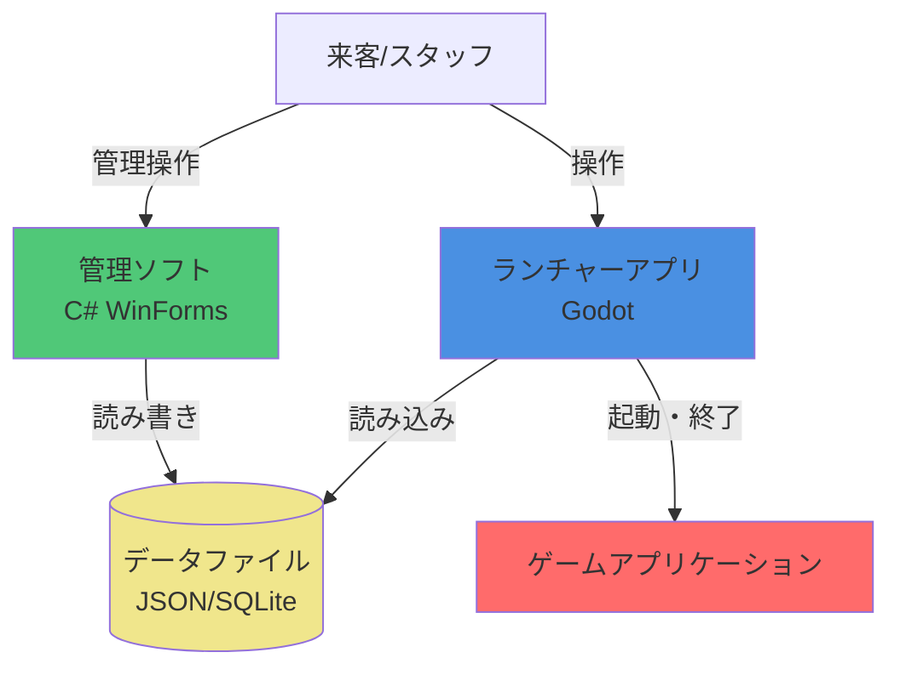
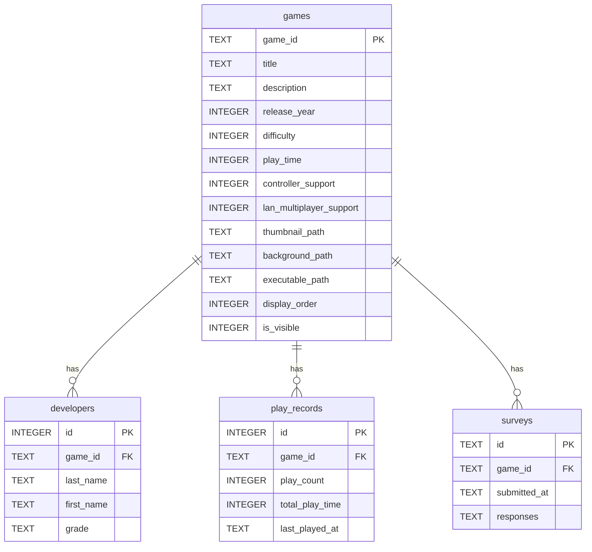

# ゲームセンターTONE 統合ランチャーシステム「Prism」 仕様書

## 1. プロジェクト概要

### 1.1 プロジェクト名

ゲームセンターTONE 統合ランチャーシステム「Prism」

### 1.2 目的

ゲームセンターTONE統合ランチャーシステム「Prism」は、大阪府立刀根山高校パソコン部が文化祭で展示する部員制作ゲームを、スタッフのサポートなしでも誰でも簡単に選択・起動・変更できるようにすることを目的とします。

主な目的：

- 来客が自分でゲームを選択・起動できるようにする
- スタッフ不在時でもゲームの変更・切替が可能になる
- 文化祭の展示をより円滑に運営できるようにする
- ゲーム展示の体験を向上させる

### 1.3 背景

大阪府立刀根山高校パソコン部では、部員が制作したゲームを文化祭で展示し、来客に遊んでもらう活動を行っています。従来は、エクスプローラーから直接ゲームを起動する方式を採用していましたが、以下の課題がありました：

- エクスプローラーからの起動では、来客が自分でゲームを選択・変更できない
- スタッフが不在の場合、ゲームの起動や切替ができない
- 展示の運営に人手が必要で、効率的でない

これらの課題を解決するため、誰でも簡単に操作できる統合ランチャーシステムの開発を決定しました。また、せっかく新しくシステムを作る機会なので、将来の拡張性も考慮し、様々な機能を追加できる設計とすることも目指します。

### 1.4 スコープ

#### 含むもの

このプロジェクトでは、以下の機能を含みます：

- **ゲーム選択・起動機能**（必須）
  - 来客が自分でゲームを選択できる機能
  - 選択したゲームを起動する機能
  
- **ゲーム情報の表示機能**
  - ゲームの説明表示
  - サムネイル画像や背景画像の表示
  
- **その他の機能**
  - 開発を進めながら追加機能を検討・実装（詳細は後述）

#### 含まないもの

このプロジェクトでは、以下の機能は含みません：

- **ゲーム自体の開発・制作**
  - ゲーム制作は別プロジェクトとして扱う
  
- **スタッフ向け管理機能**
  - ゲーム追加・削除などの管理機能は、同プロジェクト内の別アプリケーション（管理ソフト）として開発
  - 注：管理ソフトもこの仕様書内で仕様を定義している（2.2章参照）が、ランチャーとは別の独立したアプリケーションとして実装
  
- **オンライン機能**（現時点では範囲外）
  - ランキング、マルチプレイなどのオンライン機能は、機能実装が進めば将来的に検討
  
- **ゲームの更新・配布機能**（現時点では範囲外）
  - 開発が進めば将来的に検討

#### スコープ外機能の将来検討

実行環境の制約（学校PC）を考慮しつつ、システムの機能実装が進めば、オンライン機能やゲーム更新・配布機能なども視野に入れています。

### 1.5 ターゲットユーザー

#### 主ターゲットユーザー

- **文化祭来客**
  - ゲームセンターTONEの展示を訪れる来場者
  - 自分でゲームを選択・起動したい来客
  - PC操作に不慣れな来客も含む（直感的な操作が必要）

#### サブターゲットユーザー

- **スタッフ（部員兼スタッフ）**
  - パソコン部の部員で、文化祭の展示運営を行うスタッフ
  - 来客のサポートを行う
  - ゲームの切替や簡単なトラブルシューティングを行う
  - 注：詳細な管理機能（ゲーム追加・削除など）は別ソフトウェアで対応

#### ユーザー像

- 来客は、PCゲームに不慣れな人も含まれるため、操作が直感的で分かりやすいUIが求められます
- スタッフは、展示運営中に来客をサポートしつつ、必要に応じてシステムを操作します

---

## 2. 機能要件

### 2.1 ランチャー機能（来客向け）

#### 必須機能

##### 機能1: ゲーム選択・起動機能

- **説明**: 来客が自分でゲームを選択し、選択したゲームを起動する機能
- **優先度**: 高（必須）
- **詳細**:
  - ゲーム一覧からゲームを選択できる
  - 選択したゲームを起動できる
  - ゲーム起動後、ランチャーからの制御が可能（オーバーレイメニューとの連携）

##### 機能2: ゲーム情報表示機能

- **説明**: ゲームの説明や画像などの情報を表示する機能
- **優先度**: 高（必須）
- **詳細**:
  - ゲームの説明文を表示
  - サムネイル画像や背景画像を表示
  - その他ゲームに関する情報の表示

##### 機能3: ゲームフィルター機能

- **説明**: ゲームをジャンル、製作者、制作年などでフィルター分けできる機能
- **優先度**: 中
- **詳細**:
  - ジャンルでのフィルタリング
  - 製作者でのフィルタリング
  - 制作年でのフィルタリング
  - 複数条件の組み合わせフィルター

#### 追加機能（後々実装予定）

##### 機能4: オーバーレイメニュー機能

- **説明**: ゲーム中にホームボタンなどを押すと、ゲーム機のようにオーバーレイメニューが表示される機能
- **優先度**: 中
- **詳細**:
  - ゲーム中に特定のキー/ボタンでメニューを表示
  - メニューからランチャーに戻る、設定変更などが可能

##### 機能5: コントローラー・キーボードマウス両対応

- **説明**: コントローラーとキーボードマウスの両方の操作に対応する機能
- **優先度**: 中
- **詳細**:
  - コントローラーでの操作に対応
  - キーボード・マウスでの操作に対応
  - 操作方式の切り替えが可能

##### 機能6: ローカルキャッシュ機能

- **説明**: 学校サーバーからローカルにゲームをダウンロードしておき、快適に起動できる機能
- **優先度**: 中
- **詳細**:
  - 学校サーバーからゲームファイルをダウンロード
  - ローカルにキャッシュして高速起動を実現
  - キャッシュの更新・管理機能

##### 機能7: JSONベース操作説明設定機能

- **説明**: JSONファイルへの書き込みだけで、ランチャー内での操作説明ができる機能
- **優先度**: 中
- **詳細**:
  - JSONファイルで操作説明を定義
  - ランチャーUIで操作説明を表示
  - 設定の追加・変更が容易

##### 機能8: 操作翻訳機能

- **説明**: 操作説明情報から、コントローラー→キーボードなどへ操作を翻訳できる機能
- **優先度**: 低
- **詳細**:
  - コントローラー操作とキーボード操作の対応表を管理
  - 操作説明を入力方式に応じて自動翻訳

##### 機能9: 予測キャッシュ機能

- **説明**: 来客の選択を予測して、ゲームのキャッシュを事前にダウンロードする機能
- **優先度**: 低
- **詳細**:
  - 人気ゲームや過去の選択履歴を分析
  - 予測に基づいて事前ダウンロード

##### 機能10: アンケート機能

- **説明**: ゲームをプレイし終えたらアンケートが出てきて、その入力内容がゲーム開発した部員に届く機能
- **優先度**: 中
- **詳細**:
  - ゲーム終了後にアンケートを表示
  - アンケート結果を開発部員に送信・保存
  - フィードバック収集の仕組み

##### 機能11: プレイ記録機能

- **説明**: 各ゲームのプレイ回数や時間を記録して保存する機能
- **優先度**: 中
- **詳細**:
  - ゲームごとのプレイ回数を記録
  - ゲームごとのプレイ時間を記録
  - 記録データの保存・集計

##### 機能12: 人気ランキング表示機能

- **説明**: プレイ回数などのデータから人気ランキングを算出し、UIに表示する機能
- **優先度**: 中
- **詳細**:
  - プレイ回数・時間などのデータからランキングを算出
  - ランチャーUIにランキングを表示
  - ランキングの更新

##### 機能13: デバッグ機能

- **説明**: 特定のキーを押すと、PC構成やバージョン情報、エラーログなどを表示する機能
- **優先度**: 低
- **詳細**:
  - PC構成情報の表示
  - バージョン情報の表示
  - エラーログの表示
  - スタッフ向けのトラブルシューティング支援

##### 機能14: 言語選択機能

- **説明**: 複数言語に対応し、言語を選択できる機能
- **優先度**: 低
- **詳細**:
  - 複数言語への対応
  - 言語の切り替え機能
  - 多言語リソースの管理

##### 機能15: 色覚モード機能

- **説明**: 色覚に配慮した表示モードを選択できる機能
- **優先度**: 低
- **詳細**:
  - 色覚タイプに応じた表示モード
  - アクセシビリティの向上

##### 機能16: 音量コントロール機能

- **説明**: いつでも音量をコントロールできる機能
- **優先度**: 中
- **詳細**:
  - オーバーレイメニューなどから音量調整
  - マスター音量・ゲーム音量の制御

##### 機能17: スコアボード機能

- **説明**: ゲームごとの何らかの記録を自動で集計してスコアボードを表示する機能
- **優先度**: 低
- **詳細**:
  - ゲームから記録データを受信・保存
  - 記録の自動集計
  - スコアボードの表示

##### 機能18: ニュースフィード機能

- **説明**: PS3のホーム画面のようなニュースフィード機能
- **優先度**: 低
- **詳細**:
  - ニュース・お知らせの表示
  - フィード形式での情報提供
  - 更新情報の配信

##### 機能19: 操作説明図解機能

- **説明**: 初めての人向けに操作説明を図解で表示する機能
- **優先度**: 中
- **詳細**:
  - 初回起動時や必要に応じて操作説明を表示
  - 図解・アニメーションでの説明
  - わかりやすいUI/UX

### 2.2 管理機能（スタッフ向け）

#### ゲーム管理機能

##### 機能1: ゲーム追加機能

- **説明**: 新しいゲームをシステムに追加する機能
- **優先度**: 高
- **詳細**:
  - ゲームファイルのアップロード・設定
  - ゲーム情報（名前、説明、画像など）の入力
  - メタデータ（ジャンル、製作者、制作年など）の設定

##### 機能2: ゲーム削除機能

- **説明**: 登録されているゲームをシステムから削除する機能
- **優先度**: 高
- **詳細**:
  - ゲームの削除
  - 関連データ（プレイ記録、アンケート結果など）の削除オプション

##### 機能3: ゲーム情報編集機能

- **説明**: 登録されているゲームの情報を編集する機能
- **優先度**: 高
- **詳細**:
  - ゲーム名、説明文の編集
  - サムネイル画像や背景画像の更新
  - メタデータ（ジャンル、製作者、制作年など）の編集
  - ゲームファイルの差し替え

##### 機能4: ゲーム並び順管理機能

- **説明**: ランチャーのデフォルトソート時の並び順を変更する機能
- **優先度**: 中
- **詳細**:
  - ゲームの表示順序を変更
  - ドラッグ&ドロップや数値指定での並び替え

#### データ管理機能

##### 機能5: プレイ記録データ閲覧・エクスポート機能

- **説明**: プレイ記録データを閲覧・エクスポートする機能
- **優先度**: 中
- **詳細**:
  - ゲームごとのプレイ回数・時間の閲覧
  - データのエクスポート（CSV、JSONなど）
  - 期間指定での絞り込み表示

##### 機能6: アンケート結果閲覧・エクスポート機能

- **説明**: アンケート結果を閲覧・エクスポートする機能
- **優先度**: 中
  - ゲームごとのアンケート結果の閲覧
  - データのエクスポート（CSV、JSONなど）
  - 期間指定やゲーム指定での絞り込み表示

##### 機能7: 統計情報表示機能

- **説明**: 各種統計情報を表示する機能
- **優先度**: 中
- **詳細**:
  - 人気ランキングの確認
  - 総プレイ回数・時間の表示
  - グラフやチャートでの可視化

#### 設定管理機能

##### 機能8: ランチャー設定変更機能

- **説明**: ランチャーの各種設定を変更する機能
- **優先度**: 高
- **詳細**:
  - ランチャーの基本設定の変更
  - 表示オプションの変更
  - その他のランチャー関連設定

##### 機能9: フィルター条件管理機能

- **説明**: フィルターで使用する条件（ジャンル、製作者など）を管理する機能
- **優先度**: 中
- **詳細**:
  - ジャンルの追加・削除・編集
  - 製作者リストの管理
  - その他フィルター条件の管理

##### 機能10: その他設定管理機能

- **説明**: その他のシステム設定を管理する機能
- **優先度**: 中
- **詳細**:
  - カラーテーマ設定（アクセントカラーの選択・設定）
  - システム全体の設定変更
  - 必要に応じて追加される設定項目の管理

---

## 3. 非機能要件

### 3.1 パフォーマンス要件

- **レスポンスタイム**:
  - ゲームの重さによって起動時間は様々なため、具体的な秒数での目標は設定しない
  - 待ち時間中にプログレスバーやローディングアニメーションなどのUX要素に注力する
- **スループット**:
  - 同時起動ゲーム数は1つに制限
  - ゲームの多重起動を防止する仕組みが必要
- **リソース使用量**:
  - 想定環境: Core i3 11世代、メモリ8GB程度の学校PC
  - 限られたリソース環境でも快適に動作することを重視

### 3.2 セキュリティ要件

- **認証方式**:
  - 特に認証機能は不要（スタッフ向け管理機能も認証なしで使用）
- **認可方式**:
  - 認証機能がないため、認可も不要
- **データ保護**:
  - 個人情報に関係しないデータ（アンケート結果、プレイ記録など）については、適切に保存・管理する
  - データの安全な保存・管理を実施
- **脆弱性対策**:
  - 一般的なセキュリティベストプラクティスに従う

### 3.3 可用性

- **稼働率**:
  - 文化祭期間中は基本的に常時稼働
  - 人がいない時間も、スクリーンセーバー兼プレビュー機能としてゲームセンターのように表示し続ける
- **ダウンタイム許容範囲**:
  - 基本的にダウンタイムは最小限に抑える
  - トラブル発生時は迅速な復旧が可能なようにする

### 3.4 拡張性

- **ユーザー数**:
  - 現在の想定: 40人キャパのパソコン室が常時3/4程度埋まる（約30人）
- **データ量**:
  - ゲーム数: 現在30個程度、年間10個程度増加を想定
  - プレイ記録、アンケート結果などのデータが年々蓄積されることを考慮
- **機能追加**:
  - 将来的な機能追加（オーバーレイメニュー、ランキング機能など）に対応できるよう、拡張性を考慮した設計を採用する
  - モジュール化やプラグイン的な設計を検討

### 3.5 互換性要件

- **OS**:
  - Windowsのみ対応予定
- **ブラウザ**:
  - デスクトップアプリケーションとして開発するため、ブラウザ要件は該当なし
- **ハードウェア**:
  - 学校PCの仕様に合わせる必要があるため、顧問の先生と要相談
  - 現在想定している環境: Core i3 11世代、メモリ8GB程度

---

## 4. UI/UX設計

### 4.1 画面設計

#### ランチャー（来客向け）の画面

##### 画面1: スクリーンセーバー画面

- **画面名**: スクリーンセーバー画面
- **目的**: 人がいない時間にゲームセンターのように表示し続ける、スクリーンセーバー兼プレビュー画面

- **画面状態1: ロゴ表示画面（初期状態）**
  - **レイアウト**:
    - フルスクリーン表示
    - 画面中央にロゴを表示
    - 背景に各ゲームのプレイ映像をレンガ状（グリッド状）に配置して動的に表示
    - 「AボタンまたはEnterキーを押してスタート」などのメッセージを表示
  - **操作**:
    - AボタンまたはEnterキーを押すとゲーム選択画面に遷移
  - **タイマー**:
    - 一定時間（例：30秒）操作がないと自動的に画面状態2に遷移

- **画面状態2: ゲームプレビュースライドショー**
  - **レイアウト**:
    - フルスクリーン表示
    - 各ゲームのプレイ動画がタイトルと共にフルスクリーンで次々と流れる
    - 1つのゲームを一定時間（例：10-15秒）表示後、次のゲームに自動遷移
  - **操作**:
    - 任意のボタンまたはキーを押すと画面状態1（ロゴ表示画面）に戻る

- **画面遷移**:
  - 画面状態1 → 画面状態2（タイマー経過時）
  - 画面状態2 → 画面状態1（操作時）
  - 画面状態1 → ゲーム選択画面（Aボタン/Enterキー押下時）

##### 画面2: 操作説明画面

- **画面名**: 操作説明画面
- **目的**: 初めての人向けに操作方法を動画形式で説明する画面
- **表示形式**:
  - 動画形式で説明を表示
  - ナレーション付き
  - 図解を豊富に含める
- **説明内容**:
  - ランチャーからゲームを選ぶ手順
  - ゲームを切り替えたいときの案内
  - 席を離れるときの案内
  - 場内の注意事項
- **主要要素**:
  - 動画プレイヤー
  - スキップ機能（動画をスキップして次の画面へ進む）
  - 一時停止・再生機能（オプション）
  - 次へ/戻るボタン（オプション）
- **レイアウト**:
  - フルスクリーン表示
  - 動画を中心に配置
  - 操作ボタン（スキップ、一時停止など）を適切な位置に配置
- **遷移**:
  - 動画終了後、またはスキップボタン押下でゲーム選択画面に遷移
  - 初回起動時のみ表示（設定でスキップ可能にするか検討）

##### 画面3: ゲームメイン画面（Steamストア風）

- **画面名**: ゲームメイン画面
- **目的**: Steamストアの最初の画面のように、グラフィカルにゲームを表示する画面
- **背景**:
  - 基本的に無地（Material Design 3のダークテーマに基づく背景色）
- **レイアウト構成**:
  - **上部エリア（メインカード）**:
    - 画面の上部を占める大型のゲームカード（サイズ可変）
    - ゲームの背景画像（`background_path`）を使用
    - カードの左下にゲームタイトルを表示
  - **スクロール可能エリア**:
    - メインカードの下にスクロール可能なコンテンツを配置
    - 人気ランキングセクション（複数のゲームカードを横並びに配置）
    - ジャンル別セクション（各ジャンルごとに複数のゲームカードを横並びに配置）
    - 各ゲームカードは背景画像（`background_path`）を使用
    - 各カードの左下にタイトルを表示
- **ナビゲーション**:
  - キーボード（方向キー）、マウス、コントローラーで操作可能
  - スクロールでコンテンツを閲覧
  - ゲームカードを選択・決定でゲーム起動または詳細表示
- **主要要素**:
  - 大型のメインゲームカード（可変サイズ）
  - 人気ランキングセクション（ゲームカードの横並び）
  - ジャンル別セクション（各ジャンルごとにゲームカードの横並び）
  - ゲームタイトル表示（各カードの左下）
- **注意事項**:
  - フィルター機能や並び替え機能はこの画面には含めない（画面4のゲーム一覧選択画面で実装）

##### 画面4: ゲーム一覧選択画面

- **画面名**: ゲーム一覧選択画面
- **目的**: 登録されているゲームの一覧を表示し、選択できる画面
- **表示モード**: 2つの表示モードを切り替え可能
  - カルーセル表示モード（デフォルト）
  - グリッド表示モード

- **カルーセル表示モード（デフォルト）**:
  - **レイアウト**:
    - フルスクリーン表示
    - 左側に縦に並んだゲームサムネイル（カルーセル方式）
    - 背景全体に選択中のゲームの背景映像（`background_path`）を表示
    - 右下側にゲーム詳細情報を表示
  - **サムネイルカルーセル**:
    - 右側に縦にサムネイル（`thumbnail_path`）が並ぶ
    - 上下キー/ボタンで移動してゲームを選択
    - 選択中のゲームがハイライト表示
  - **詳細情報表示エリア（右下）**:
    - ゲームタイトル
    - リリース年
    - その他の詳細情報（説明、ジャンル、製作者など）
    - プレイボタン
  - **操作**:
    - 上下キー/ボタンでサムネイルを移動してゲームを選択
    - プレイボタンを押すとゲームを起動
    - グリッド表示ボタンでグリッド表示モードに切り替え

- **グリッド表示モード**:
  - **レイアウト**:
    - フルスクリーン表示
    - ゲーム一覧をグリッド形式で表示
    - フィルター・ソート機能を表示（上部またはサイドバー）
  - **ゲームカード**:
    - サムネイル（`thumbnail_path`）
    - ゲームタイトル
    - その他の情報（オプション）
  - **操作**:
    - ゲームカードを選択すると、カルーセル表示モードに戻り、そのゲームが選択された状態になる
    - フィルター・ソート機能でゲームを絞り込み・並び替え

- **画面遷移**:
  - カルーセル表示 ↔ グリッド表示（グリッド表示ボタンで切り替え）
  - プレイボタン押下でゲーム起動

##### 画面5: オーバーレイ画面

- **画面名**: オーバーレイ画面
- **目的**: ゲーム中に表示されるオーバーレイメニュー
- **表示方法**:
  - ゲーム画面全体が薄黒くなる（背景を暗転）
  - その上にメニューを表示
- **レイアウト**:
  - フルスクリーン表示
  - **左半分**: メニューリスト
    - 「ゲームを続ける」
    - 「オプション」
    - 「ゲームを終了する」
    - 「音量調整」
    - その他のメニュー項目
  - **右半分**: 操作説明図
    - JSONとリンクした操作説明図を表示
    - 現在選択中のゲームの操作説明（`controls`フィールドから取得）
    - 図解形式で表示
- **表示トリガー**:
  - **コントローラー**: ホームボタンやロゴボタン（PSコントローラーのPSボタンなど）
  - **キーボード**: Homeキー
- **操作**:
  - メニュー項目を選択して実行
  - 「ゲームを続ける」でオーバーレイを閉じてゲームに戻る
  - 「オプション」でオプション画面に遷移
  - 「ゲームを終了する」でゲームを終了
  - 「音量調整」で音量を調整
  - ESCキーやBボタンでオーバーレイを閉じる（ゲームを続ける）
- **操作説明図**:
  - 右半分に表示される操作説明は、現在のゲームの`controls`フィールドから取得
  - キーボード操作とコントローラー操作の両方を表示可能
  - 図解形式でわかりやすく表示

##### 画面6: オプション画面

- **画面名**: オプション画面
- **目的**: 各種設定やオプションを変更する画面
- **表示形式**:
  - フルスクリーン表示またはオーバーレイ表示
  - 設定項目をカテゴリ別にリスト形式で配置
- **設定項目（一般的な設計）**:
  - **音量設定**:
    - スライダーで音量を調整
    - マスター音量、ゲーム音量など（将来実装予定）
  - **言語選択**:
    - ドロップダウンまたはリストから言語を選択
  - **色覚モード設定**:
    - トグルまたはリストから色覚モードを選択
  - **その他の設定項目**:
    - 将来追加される設定項目に対応
- **レイアウト**:
  - 設定項目を縦にリスト形式で配置
  - 各設定項目の右側に設定値を表示・変更
  - 下部または上部に「戻る」ボタンを配置
- **操作**:
  - 上下キー/ボタンで設定項目を移動
  - 左右キー/ボタンまたは決定ボタンで設定値を変更
  - 「戻る」ボタンまたはESC/Bボタンで前の画面に戻る
- **設定の保存**:
  - 設定変更は自動保存（または保存ボタンで保存、今後決定）
- **注意事項**:
  - 詳細な設定項目やUIは今後決定予定

#### 管理ソフト（スタッフ向け）の画面

##### 画面7: ゲーム管理画面

- **画面名**: ゲーム管理画面
- **目的**: ゲームの追加・編集・削除を行う画面
- **表示形式（一般的な設計）**:
  - ウィンドウまたはフルスクリーン表示
  - Windowsダイアログ風のUI（WinForms）
- **主要要素**:
  - **ゲーム一覧表示**:
    - テーブル、リスト、またはカード形式でゲーム一覧を表示
    - ゲーム名、ID、表示順序、表示/非表示などの情報を表示
  - **操作ボタン**:
    - 「ゲーム追加」ボタン
    - 「編集」ボタン（選択したゲームを編集）
    - 「削除」ボタン（選択したゲームを削除）
  - **並び順変更機能**:
    - ドラッグ&ドロップ、または上下ボタンで並び順を変更
  - **ゲーム情報入力フォーム（追加・編集時）**:
    - モーダルダイアログまたは別パネルで表示
    - ゲーム情報の各フィールドを入力できるフォーム
    - ファイル選択ダイアログ（実行ファイル、画像ファイルなど）
- **レイアウト**:
  - 左側または上部にゲーム一覧を配置
  - 右側または下部に編集フォームを配置（編集時）
  - 操作ボタンを適切な位置に配置
- **注意事項**:
  - 詳細なレイアウトやUIは今後決定予定

##### 画面8: データ閲覧画面

- **画面名**: データ閲覧画面
- **目的**: プレイ記録やアンケート結果などのデータを閲覧・エクスポートする画面
- **表示形式（一般的な設計）**:
  - ウィンドウまたはフルスクリーン表示
  - Windowsダイアログ風のUI（WinForms）
- **主要要素**:
  - **タブまたはセクション分け**:
    - プレイ記録データ
    - アンケート結果
    - 統計情報
  - **データ表示**:
    - プレイ記録データをテーブル形式で表示
    - アンケート結果をテーブル形式で表示
    - 統計情報をグラフやチャートで表示（将来実装予定）
  - **フィルター・期間指定**:
    - 期間指定（開始日、終了日）
    - ゲーム指定による絞り込み
  - **エクスポート機能**:
    - 「エクスポート」ボタン
    - ファイル保存ダイアログで保存形式（CSV、JSONなど）を選択
- **レイアウト**:
  - 上部にフィルター・期間指定UIを配置
  - 中央にデータテーブル、グラフを配置
  - 下部またはツールバーにエクスポートボタンを配置
- **注意事項**:
  - 詳細なレイアウトやグラフ表示の実装は今後決定予定

##### 画面9: 設定画面（管理ソフト）

- **画面名**: 設定画面（管理ソフト）
- **目的**: システム全体の設定を管理する画面
- **表示形式（一般的な設計）**:
  - ウィンドウまたはフルスクリーン表示
  - Windowsダイアログ風のUI（WinForms）
- **主要要素**:
  - **タブまたはカテゴリ分け**:
    - ランチャー設定
    - フィルター条件管理
    - カラーテーマ設定
    - その他のシステム設定
  - **ランチャー設定**:
    - デフォルトソート順などの設定
  - **フィルター条件管理**:
    - ジャンルの追加・削除・編集
    - 製作者リストの管理
  - **カラーテーマ設定**:
    - アクセントカラーの選択（カラーピッカーまたはプリセットから選択）
    - テーマ名の設定
  - **設定の保存・適用**:
    - 「保存」ボタンで設定を保存
    - 「適用」ボタンでランチャーに設定を反映（必要に応じて）
- **レイアウト**:
  - 左側にカテゴリ一覧（タブまたはリスト）
  - 右側に選択したカテゴリの設定項目を配置
  - 下部に「保存」「キャンセル」ボタンを配置
- **注意事項**:
  - 詳細なレイアウトや設定項目は今後決定予定

### 4.2 ユーザーフロー

#### 来客の基本的な操作フロー

```text
1. 起動
   ↓
2. スクリーンセーバー画面（任意の操作で次へ）
   ↓
3. 操作説明画面（初回のみ、スキップ可能）
   ↓
4. ゲームメイン画面（Steamストア風）
   ↓
5. ゲーム選択
   ↓
6. ゲーム一覧選択画面またはゲーム詳細から起動
   ↓
7. ゲームプレイ中
   ↓
8a. オーバーレイメニューから設定変更・ホームに戻る
   ↓
8b. ゲーム終了
   ↓
9. アンケート表示（オプション機能実装時）
   ↓
10. ゲーム選択画面に戻る
```

#### 主要な遷移フロー

- **スクリーンセーバー → 操作説明 → ゲームメイン画面**
  - 起動時または長時間操作がない場合にスクリーンセーバーが表示
  - 任意のキー/ボタン操作で次の画面へ遷移

- **ゲームメイン画面 → ゲーム選択 → ゲーム起動**
  - Steamストア風のメイン画面からゲームを選択
  - ゲーム一覧画面またはゲーム詳細から起動

- **ゲーム中 → オーバーレイメニュー**
  - 特定のキー/ボタンでオーバーレイメニューを表示
  - ホームに戻る、設定変更、音量調整などが可能

- **ゲーム終了 → アンケート → ゲーム選択画面**
  - ゲーム終了後、アンケートが表示（オプション）
  - アンケート後またはスキップでゲーム選択画面に戻る

#### スタッフの操作フロー（管理ソフト）

```text
1. 管理ソフト起動
   ↓
2. ゲーム管理画面（ゲーム追加・編集・削除）
   または
   データ閲覧画面（プレイ記録・アンケート結果の確認）
   または
   設定画面（システム設定の変更）
   ↓
3. 操作完了
```

### 4.3 デザインガイドライン

#### デザインシステム

GoogleのMaterial Design 3をベースとしたデザインシステムを採用します。ただし、カスタマイズシステム（ダイナミックカラーなど）は使用せず、シンプルに実装します。

#### カラースキーム

- **基本カラーパレット**: Material 3のダークテーマをベースとする
- **アクセントカラー**: 管理ソフトでカラーテーマ（アクセントカラー）を設定可能
- **カラーテーマ設定機能**:
  - 管理ソフトからアクセントカラーを選択・設定できる
  - プリセットカラーパレットから選択、またはカスタムカラーを設定可能
  - 設定したカラーテーマはランチャー全体に反映される
- **カラーパレット構成**:
  - 背景色（ダークテーマ）
  - サーフェス色（カードやパネル用）
  - テキスト色（プライマリ、セカンダリ）
  - アクセントカラー（設定可能）
  - エラー、警告、成功などのセマンティックカラー

#### タイポグラフィ

- **フォント**: Material 3のタイポグラフィシステムを参考
- **日本語対応**: 日本語の可読性を考慮したフォントを選択
- **フォント階層**:
  - 見出し（H1-H6）
  - 本文テキスト
  - キャプション、補助テキスト
- **フォントサイズ**: アクセシビリティを考慮し、適切なサイズを設定

#### アイコン

- **アイコンライブラリ**: Material Iconsまたは同様のスタイルを採用
- **アイコンサイズ**: 統一されたサイズ体系を使用
- **アイコンスタイル**: Material 3のアイコンスタイルに準拠

#### コンポーネント

Material 3のコンポーネントスタイルを参考にしたUIコンポーネントを実装：

- **ボタン**:
  - Filled（塗りつぶし）、Outlined（アウトライン）、Text（テキスト）の3種類
  - ホバー、フォーカス、プレス状態の視覚的フィードバック
  
- **カード**:
  - Elevation（影）による立体感
  - Rounded corners（角丸）
  - ゲームカード表示に使用
  
- **メニュー**:
  - オーバーレイメニュー、ドロップダウンメニューなど
  - Material 3のメニュースタイルに準拠
  
- **入力フィールド**:
  - テキスト入力、選択など
  - 管理ソフトのフォームで使用

- **その他**:
  - ダイアログ、スナックバー、プログレスバーなど
  - Material 3のコンポーネントスタイルを参考

#### アニメーション・トランジション

- **画面遷移**: スムーズなトランジションアニメーション
- **インタラクション**: ボタンクリック、ホバー時の視覚的フィードバック
- **ローディング**: プログレスバーやローディングアニメーション
- **実装方針**: 基本的なアニメーションを実装（過度に複雑なものは避ける）

---

## 5. 技術仕様

### 5.1 アーキテクチャ概要

システムは以下の2つの主要コンポーネントで構成されます：

1. **ランチャーアプリケーション（Godot）**
   - 来客向けのUI表示・操作
   - ゲーム選択、情報表示
   - オーバーレイメニュー表示
   - スクリーンセーバー機能

2. **管理ソフトウェア（C#）**
   - スタッフ向けのゲーム管理機能
   - データ閲覧・エクスポート機能
   - 設定管理機能

#### データ共有

- ランチャーと管理ソフトは、共通のデータファイル（JSON、SQLiteなど）を参照
- ファイルベースまたはローカルデータベースでデータを共有

#### アーキテクチャの将来拡張性

- 後々、OSアクセス部分（オーバーレイ機能、グローバルキーフック、プロセス管理等）をC#に移行する可能性を検討
- 現時点ではGodotで実装し、必要に応じてC#のネイティブライブラリやプロセス間通信を導入

### 5.2 技術スタック

#### ランチャーアプリケーション

##### フロントエンド

- **ゲームエンジン/フレームワーク**: Godot Engine
- **言語**: GDScript（またはC#）
- **UI**: Godotの組み込みUIシステム
- **デザインシステム**: Material Design 3を参考にしたカスタムデザイン

##### データ管理

- **データ形式**: JSON、SQLite（予定）
- **ファイル操作**: Godotの標準ライブラリ
- **プロセス管理**: GodotのProcess API

##### 将来的な検討事項

- OSアクセス部分（オーバーレイ、グローバルキーフックなど）をC#に移行する可能性
- GDExtensionや外部ライブラリによる拡張を検討

#### 管理ソフトウェア

##### 管理ソフトのフロントエンド

- **フレームワーク**: Windows Forms (WinForms)
- **言語**: C#
- **UI**: WinFormsのフォームベースUI
- **デザイン**: Windowsダイアログ風のUI

##### 管理ソフトのデータ管理

- **データ形式**: JSON、SQLite（ランチャーと共通）
- **ファイル操作**: .NET Frameworkの標準ライブラリ
- **データベース**: SQLite（System.Data.SQLiteなど）

##### 機能

- ゲーム管理（追加・編集・削除）
- データ閲覧・エクスポート
- 設定管理（カラーテーマ設定含む）

#### インフラ・開発環境

- **OS**: Windows
- **開発環境**:
  - Godot Editor
  - Visual Studio または Visual Studio Code（C#開発用）
- **バージョン管理**: Git
- **CI/CD**: 未定（将来検討）
- **監視**: 未定（将来検討）

### 5.3 システム構成図



---

## 6. データ仕様

このシステムはローカルアプリケーションのため、HTTP APIではなく、ファイルベースまたはデータベースベースのデータ共有を行います。

### 6.1 データ共有方式

ランチャーと管理ソフトは、共通のデータストレージを介してデータを共有します。

- **方式**: ファイルベースまたはローカルデータベース（SQLite）
- **データ保存場所**: ローカルファイルシステム
- **アクセス方式**:
  - ランチャー: 読み取り専用または読み書き
  - 管理ソフト: 読み書き

### 6.2 データ構造

#### ゲーム情報データ

ゲームの基本情報を格納するデータ構造：

```json
{
  "games": [
    {
      "game_id": "string (ゲームID、一意の識別子)",
      "title": "string (ゲームタイトル)",
      "description": "string (説明文)",
      "developers": [
        {
          "last_name": "string (姓)",
          "first_name": "string (名)",
          "grade": "string (学年、0を指定すると「教員」と表記)"
        }
      ],
      "release_year": "integer (リリース年)",
      "genre": ["string (ジャンルの配列)"],
      "min_players": "integer (最小プレイヤー数)",
      "max_players": "integer (最大プレイヤー数)",
      "difficulty": "integer (難易度、1-3の3段階)",
      "play_time": "integer (プレイ時間の分類: 1=～5分、2=5分～15分、3=15分以上)",
      "controller_support": "boolean (コントローラーサポートの有無)",
      "lan_multiplayer_support": "boolean (LANマルチプレイサポートの有無)",
      "thumbnail_path": "string (サムネイル画像のパス)",
      "background_path": "string (背景画像のパス)",
      "executable_path": "string (実行ファイルのパス)",
      "display_order": "integer (表示順序)",
      "is_visible": "boolean (表示/非表示、true=表示、false=非表示)",
      "controls": {
        "keyboard": {
          "操作名": "string (キー操作の説明)"
        },
        "gamepad": {
          "操作名": "string (ゲームパッド操作の説明)"
        }
      },
      "key_mapping": "object|null (キーマッピング設定、nullの場合はデフォルト)"
    }
  ]
}
```

**フィールドの説明**：

- `game_id`: ゲームを一意に識別するID（例: "2D_adventure"）
- `developers`: 製作者の配列（複数人登録可能）
  - `last_name`: 姓
  - `first_name`: 名
  - `grade`: 学年（0を指定すると「教員」と表記される）
- `genre`: ジャンルの配列（複数ジャンルに対応）
- `difficulty`: 難易度（1-3の3段階）
- `play_time`: 想定プレイ時間の分類（1-3の3段階）
  - 1: ～5分
  - 2: 5分～15分
  - 3: 15分以上
- `controller_support`: コントローラーサポートの有無（true/false）
- `lan_multiplayer_support`: LANマルチプレイサポートの有無（true/false）
- `display_order`: 表示順序（整数、数値が小さいほど先に表示）
- `is_visible`: 表示/非表示フラグ（true=ランチャーに表示、false=非表示）
  - gamesフォルダにゲームファイルがあっても、`is_visible: false`にするとランチャーに表示されない
- `controls`: 操作説明のJSONオブジェクト（キーボードとゲームパッドを分けて管理）
- `key_mapping`: キーマッピング設定（カスタマイズ可能な場合、nullの場合はデフォルト操作）

#### プレイ記録データ

ゲームのプレイ記録を格納するデータ構造：

```json
{
  "play_records": [
    {
      "game_id": "string (ゲームID)",
      "play_count": "integer (プレイ回数)",
      "total_play_time": "integer (総プレイ時間、秒)",
      "last_played_at": "string (最終プレイ日時、ISO8601形式)"
    }
  ]
}
```

#### アンケートデータ

アンケート結果を格納するデータ構造：

```json
{
  "surveys": [
    {
      "id": "string (UUID)",
      "game_id": "string (ゲームID)",
      "submitted_at": "string (提出日時、ISO8601形式)",
      "responses": {
        "question1": "string (回答)",
        "question2": "string (回答)"
      }
    }
  ]
}
```

#### 設定データ

システム設定を格納するデータ構造：

```json
{
  "settings": {
    "color_theme": {
      "accent_color": "string (HEXカラーコード)",
      "theme_name": "string (テーマ名)"
    },
    "launcher_settings": {
      "default_sort_order": "string (デフォルトソート順)"
    },
    "filter_settings": {
      "genres": ["string (ジャンルリスト)"],
      "developers": ["string (製作者リスト)"]
    }
  }
}
```

### 6.3 データファイル形式

#### 形式1: JSONファイル

- 複数のJSONファイルに分けて保存
- 例: `games.json`, `play_records.json`, `settings.json`
- 読み書きが簡単、人間が読める

#### 形式2: SQLiteデータベース

- 単一のデータベースファイルに統合
- クエリが柔軟、パフォーマンスが良い
- より複雑なデータ管理が必要な場合に適する

#### 選択方針

- 初期実装: JSONファイルベース
- 将来的にSQLiteへの移行を検討

### 6.4 データアクセスパターン

#### ランチャーのデータアクセス

- **読み取り**: ゲーム一覧、設定の読み込み
- **書き込み**: プレイ記録の更新、アンケート結果の保存

#### 管理ソフトのデータアクセス

- **読み取り**: 全てのデータの読み込み
- **書き込み**: ゲーム情報の追加・編集・削除、設定の変更

### 6.5 データの整合性

- ランチャーと管理ソフトが同時に書き込みを行う場合は、ファイルロックなどの仕組みで整合性を保つ
- または、管理ソフト使用時はランチャーを閉じる運用とする

---

## 7. データベース設計

### 7.1 データモデル概要

本システムでは、初期実装としてJSONファイルベースのデータ管理を採用します。将来的にSQLiteへの移行も検討しています。

#### データ保存方式

- **初期実装**: JSONファイルベース
  - 各データ種別ごとにJSONファイルを分離
  - 読み書きが簡単、人間が読める形式
- **将来の検討**: SQLiteデータベース
  - より複雑なクエリやデータ管理が必要になった場合に移行を検討

#### データファイル構成

- `games.json`: ゲーム情報データ
- `play_records.json`: プレイ記録データ
- `surveys.json`: アンケートデータ
- `settings.json`: システム設定データ

### 7.2 データモデル図（JSONベース）

JSONファイルベースの場合のデータ構造：

```text
games.json
  └─ games[] (ゲーム情報の配列)
       ├─ game_id
       ├─ title
       ├─ description
       ├─ developers[] (製作者配列)
       │    ├─ last_name
       │    ├─ first_name
       │    └─ grade
       ├─ release_year
       ├─ genre[]
       ├─ difficulty
       ├─ play_time
       ├─ controller_support
       ├─ lan_multiplayer_support
       ├─ thumbnail_path
       ├─ background_path
       ├─ executable_path
       ├─ display_order
       ├─ is_visible
       ├─ controls
       └─ ...

play_records.json
  └─ play_records[] (プレイ記録の配列)
       ├─ game_id (games.game_id を参照)
       ├─ play_count
       ├─ total_play_time
       └─ last_played_at

surveys.json
  └─ surveys[] (アンケート結果の配列)
       ├─ id
       ├─ game_id (games.game_id を参照)
       ├─ submitted_at
       └─ responses

settings.json
  └─ settings
       ├─ color_theme
       ├─ launcher_settings
       └─ filter_settings
```

### 7.3 SQLiteデータベース設計（将来実装用）

将来的にSQLiteに移行する場合のテーブル設計：

#### テーブル1: games

- **テーブル名**: `games`
- **説明**: ゲーム情報を格納するテーブル
- **カラム**:

  | カラム名 | データ型 | 制約 | 説明 |
  |---------|---------|------|------|
  | game_id | TEXT | PRIMARY KEY | ゲームID（一意の識別子） |
  | title | TEXT | NOT NULL | ゲームタイトル |
  | description | TEXT | | 説明文 |
  | release_year | INTEGER | | リリース年 |
  | genre | TEXT | | ジャンルの配列（JSON形式またはカンマ区切り） |
  | min_players | INTEGER | | 最小プレイヤー数 |
  | max_players | INTEGER | | 最大プレイヤー数 |
  | difficulty | INTEGER | CHECK(1-3) | 難易度（1-3の3段階） |
  | play_time | INTEGER | CHECK(1-3) | プレイ時間の分類（1=～5分、2=5分～15分、3=15分以上） |
  | controller_support | INTEGER | DEFAULT 0 | コントローラーサポート（0=false, 1=true） |
  | lan_multiplayer_support | INTEGER | DEFAULT 0 | LANマルチプレイサポート（0=false, 1=true） |
  | thumbnail_path | TEXT | | サムネイル画像のパス |
  | background_path | TEXT | | 背景画像のパス |
  | executable_path | TEXT | NOT NULL | 実行ファイルのパス |
  | display_order | INTEGER | | 表示順序（数値が小さいほど先に表示） |
  | is_visible | INTEGER | DEFAULT 1 | 表示/非表示（0=false=非表示、1=true=表示） |
  | controls | TEXT | | 操作説明（JSON形式） |
  | key_mapping | TEXT | | キーマッピング設定（JSON形式、NULL可） |

#### テーブル2: developers

- **テーブル名**: `developers`
- **説明**: 製作者情報を格納するテーブル（gamesと多対多の関係）
- **カラム**:

  | カラム名 | データ型 | 制約 | 説明 |
  |---------|---------|------|------|
  | id | INTEGER | PRIMARY KEY AUTOINCREMENT | 製作者ID |
  | game_id | TEXT | NOT NULL, FOREIGN KEY | ゲームID（games.game_idを参照） |
  | last_name | TEXT | NOT NULL | 姓 |
  | first_name | TEXT | NOT NULL | 名 |
  | grade | TEXT | | 学年（0を指定すると「教員」と表記） |

#### テーブル3: play_records

- **テーブル名**: `play_records`
- **説明**: プレイ記録を格納するテーブル
- **カラム**:

  | カラム名 | データ型 | 制約 | 説明 |
  |---------|---------|------|------|
  | id | INTEGER | PRIMARY KEY AUTOINCREMENT | レコードID |
  | game_id | TEXT | NOT NULL, FOREIGN KEY | ゲームID（games.game_idを参照） |
  | play_count | INTEGER | DEFAULT 0 | プレイ回数 |
  | total_play_time | INTEGER | DEFAULT 0 | 総プレイ時間（秒） |
  | last_played_at | TEXT | | 最終プレイ日時（ISO8601形式） |

#### テーブル4: surveys

- **テーブル名**: `surveys`
- **説明**: アンケート結果を格納するテーブル
- **カラム**:

  | カラム名 | データ型 | 制約 | 説明 |
  |---------|---------|------|------|
  | id | TEXT | PRIMARY KEY | アンケートID（UUID） |
  | game_id | TEXT | NOT NULL, FOREIGN KEY | ゲームID（games.game_idを参照） |
  | submitted_at | TEXT | NOT NULL | 提出日時（ISO8601形式） |
  | responses | TEXT | | 回答内容（JSON形式） |

#### テーブル5: settings

- **テーブル名**: `settings`
- **説明**: システム設定を格納するテーブル（単一行テーブル）
- **カラム**:

  | カラム名 | データ型 | 制約 | 説明 |
  |---------|---------|------|------|
  | id | INTEGER | PRIMARY KEY DEFAULT 1 | 設定ID（常に1） |
  | color_theme | TEXT | | カラーテーマ設定（JSON形式） |
  | launcher_settings | TEXT | | ランチャー設定（JSON形式） |
  | filter_settings | TEXT | | フィルター設定（JSON形式） |

### 7.4 リレーション

SQLiteデータベースの場合のリレーション：

- `developers.game_id` → `games.game_id` (多対1)
- `play_records.game_id` → `games.game_id` (多対1)
- `surveys.game_id` → `games.game_id` (多対1)

**ER図（SQLite版）**:



---

## 8. 開発計画

### 8.1 フェーズ

#### フェーズ1: 必須機能の実装（MVP）

- **期間**: 約2-3ヶ月（想定）
- **成果物**:
  - 基本的なランチャーアプリケーション
  - ゲーム選択・起動機能
  - ゲーム情報表示機能
  - スクリーンセーバー画面
  - 基本的なUI実装（Material Design 3ベース）
- **タスク**:
  - Godotプロジェクトのセットアップ
  - 基本的な画面構成の実装（スクリーンセーバー、ゲーム選択画面）
  - JSONデータ読み込み機能
  - ゲーム起動・終了処理の実装
  - 基本的なUIコンポーネントの実装

#### フェーズ2: 基本的な追加機能

- **期間**: 約1-2ヶ月（想定）
- **成果物**:
  - ゲームフィルター機能
  - オーバーレイメニュー機能
  - 操作説明画面（動画）
  - オプション画面
  - コントローラー・キーボード両対応
- **タスク**:
  - フィルター機能の実装
  - オーバーレイメニューの実装（GodotまたはC#での実装検討）
  - 操作説明動画の再生機能
  - 音量調整などの基本設定機能
  - コントローラー入力の対応

#### フェーズ3: データ管理機能

- **期間**: 約1-2ヶ月（想定）
- **成果物**:
  - プレイ記録機能
  - アンケート機能
  - 人気ランキング表示機能
  - 統計情報表示機能
- **タスク**:
  - プレイ記録の記録・保存機能
  - アンケートフォームの実装
  - ランキング算出・表示機能
  - 統計情報の集計・表示機能

#### フェーズ4: 管理ソフトの実装

- **期間**: 約1-2ヶ月（想定）
- **成果物**:
  - ゲーム管理ソフト（C# WinForms）
  - ゲーム追加・編集・削除機能
  - データ閲覧・エクスポート機能
  - 設定管理機能（カラーテーマ設定含む）
- **タスク**:
  - C# WinFormsプロジェクトのセットアップ
  - ゲーム管理画面の実装
  - データ閲覧画面の実装
  - 設定画面の実装
  - JSONファイルの読み書き機能

#### フェーズ5: 高度な機能・最適化

- **期間**: 約1-2ヶ月（想定、機能実装が進めば）
- **成果物**:
  - ローカルキャッシュ機能
  - JSONベース操作説明設定機能
  - 予測キャッシュ機能（オプション）
  - スコアボード機能（オプション）
  - その他の追加機能
- **タスク**:
  - サーバーからのダウンロード・キャッシュ機能
  - 操作説明のJSON設定機能
  - パフォーマンス最適化
  - その他、優先度の低い機能の実装

### 8.2 マイルストーン

- **マイルストーン1: MVP完成**（フェーズ1完了時点）
  - 基本的なランチャーとして動作する
  - ゲームの選択・起動ができる
  - 文化祭での基本的な運用が可能

- **マイルストーン2: 基本機能完成**（フェーズ2完了時点）
  - フィルター、オーバーレイなど基本的な追加機能が利用可能
  - コントローラー・キーボード両対応完了

- **マイルストーン3: データ管理機能完成**（フェーズ3完了時点）
  - プレイ記録、アンケートなどのデータ管理機能が利用可能
  - 統計情報の閲覧が可能

- **マイルストーン4: 管理ソフト完成**（フェーズ4完了時点）
  - スタッフ向けの管理機能が利用可能
  - ゲームの追加・編集が容易にできる

- **マイルストーン5: 完全版リリース**（フェーズ5完了時点）
  - 全ての機能が実装完了
  - 最適化が完了し、本番運用可能な状態

---

## 9. 参考資料

### 技術関連

- **Godot Engine**
  - [Godot公式ドキュメント](https://docs.godotengine.org/)
  - Godot GDScript/C#チュートリアル

- **C# / Windows Forms**
  - Microsoft公式ドキュメント（Windows Forms）
  - .NET Framework/C#の学習リソース

- **Material Design 3**
  - [Material Design 3公式サイト](https://m3.material.io/)
  - Material Design 3ガイドライン

- **データ形式**
  - JSON仕様（JSON.org）
  - SQLite公式ドキュメント（将来参照用）

### デザイン・UI関連

- **デザイン参考**
  - SteamストアのUIデザイン（参考として）
  - PS5のUIデザイン（参考として）

### プロジェクト固有

- **ゲームセンターTONE関連**
  - 文化祭反省会資料

---

## 変更履歴

| 日付 | バージョン | 変更内容 | 変更者 |
|------|-----------|---------|--------|
| 2025-12-22 | 1.0.0 | 初版作成、仕様書の全セクションを完成 | - |
