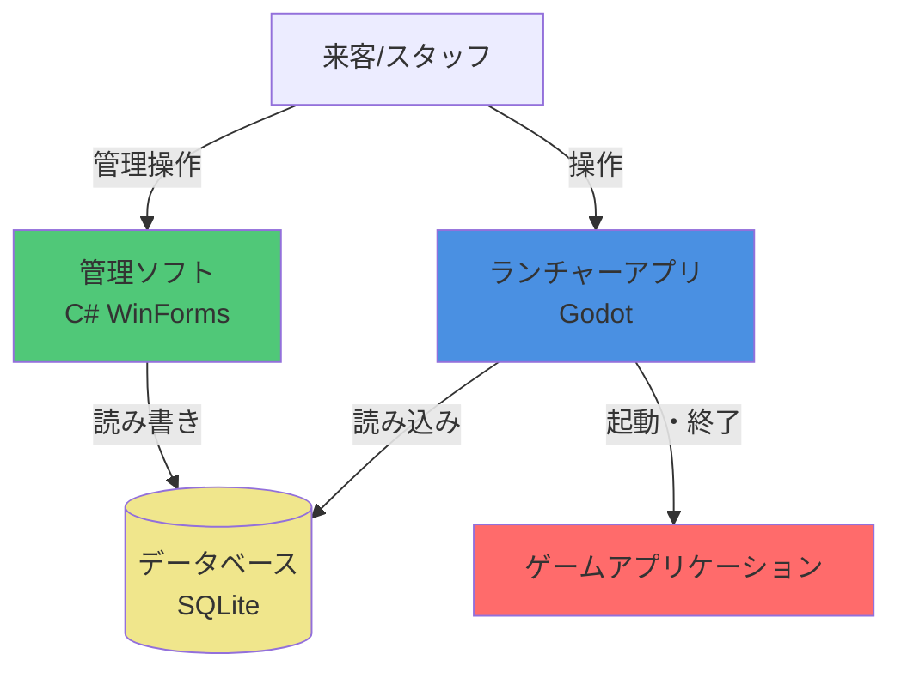
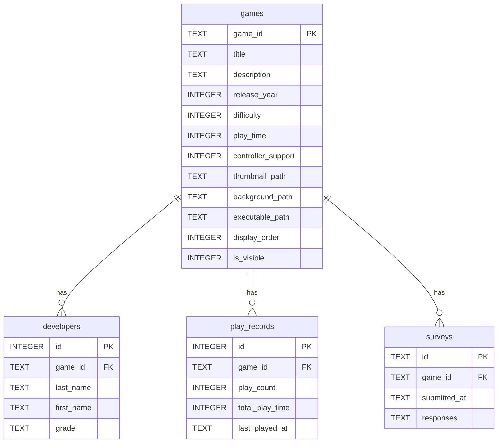

# ゲームセンターTONE 統合ランチャーシステム「Prism」 仕様書

## 1. プロジェクト概要

### 1.1 プロジェクト名

ゲームセンターTONE Prism

### 1.2 目的

ゲームセンターTONE Prismは、大阪府立刀根山高校パソコン部が文化祭で展示する部員制作ゲームを、スタッフのサポートなしでも誰でも簡単に選択・起動・変更できるようにすることを目的とします。

主な目的：

- 来客が自分でゲームを選択・起動できるようにする
- スタッフ不在時でもゲームの変更・切替が可能になる
- 文化祭の展示をより円滑に運営できるようにする
- ゲーム展示の体験を向上させる

### 1.3 背景

大阪府立刀根山高校パソコン部では、部員が制作したゲームを文化祭で展示し、来客に遊んでもらう活動を行っています。従来は、エクスプローラーから直接ゲームを起動する方式を採用していましたが、以下の課題がありました：

- エクスプローラーからの起動では、来客が自分でゲームを選択・変更できない
- スタッフが不在の場合、ゲームの起動や切替ができない
- 展示の運営に人手が必要で、効率的でない

これらの課題を解決するため、誰でも簡単に操作できる統合ランチャーシステムの開発を決定しました。また、せっかく新しくシステムを作る機会なので、将来の拡張性も考慮し、様々な機能を追加できる設計とすることも目指します。

### 1.4 スコープ

#### 含むもの

このプロジェクトでは、以下の機能を含みます：

- **ゲーム選択・起動機能**（必須）
  - 来客が自分でゲームを選択できる機能
  - 選択したゲームを起動する機能
  
- **ゲーム情報の表示機能**
  - ゲームの説明表示
  - サムネイル画像や背景画像の表示
  
- **その他の機能**
  - 開発を進めながら追加機能を検討・実装（詳細は後述）

#### 含まないもの

このプロジェクトでは、以下の機能は含みません：

- **ゲーム自体の開発・制作**
  - ゲーム制作は別プロジェクトとして扱う
  
- **スタッフ向け管理機能**
  - ゲーム追加・削除などの管理機能は、同プロジェクト内の別アプリケーション（管理ソフト）として開発
  - 注：管理ソフトもこの仕様書内で仕様を定義している（2.2章参照）が、ランチャーとは別の独立したアプリケーションとして実装
  
- **オンライン機能**（現時点では範囲外）
  - ランキング、マルチプレイなどのオンライン機能は、機能実装が進めば将来的に検討
  
- **ゲームの更新・配布機能**（現時点では範囲外）
  - 開発が進めば将来的に検討

#### スコープ外機能の将来検討

実行環境の制約（学校PC）を考慮しつつ、システムの機能実装が進めば、オンライン機能やゲーム更新・配布機能なども視野に入れています。

### 1.5 ターゲットユーザー

#### 主ターゲットユーザー

- **文化祭来客**
  - ゲームセンターTONEの展示を訪れる来場者
  - 自分でゲームを選択・起動したい来客
  - PC操作に不慣れな来客も含む（直感的な操作が必要）

#### サブターゲットユーザー

- **スタッフ（部員兼スタッフ）**
  - パソコン部の部員で、文化祭の展示運営を行うスタッフ
  - 来客のサポートを行う
  - ゲームの切替や簡単なトラブルシューティングを行う
  - 注：詳細な管理機能（ゲーム追加・削除など）は別ソフトウェアで対応

#### ユーザー像

- 来客は、PCゲームに不慣れな人も含まれるため、操作が直感的で分かりやすいUIが求められます
- スタッフは、展示運営中に来客をサポートしつつ、必要に応じてシステムを操作します

---

## 2. 機能要件

### 2.1 ランチャー機能（来客向け）

#### 必須機能

##### 機能1: ゲーム選択・起動機能

- **説明**: 来客が自分でゲームを選択し、選択したゲームを起動する機能
- **優先度**: 高（必須）
- **詳細**:
  - ゲーム一覧からゲームを選択できる
  - 選択したゲームを起動できる
  - ゲーム起動後、ランチャーからの制御が可能（オーバーレイメニューとの連携）

##### 機能2: ゲーム情報表示機能

- **説明**: ゲームの説明や画像などの情報を表示する機能
- **優先度**: 高（必須）
- **詳細**:
  - ゲームの説明文を表示
  - サムネイル画像や背景画像を表示
  - その他ゲームに関する情報の表示

##### 機能3: ゲームフィルター機能

- **説明**: ゲームをジャンル、製作者、制作年などでフィルター分けできる機能
- **優先度**: 中
- **詳細**:
  - ジャンルでのフィルタリング
  - 製作者でのフィルタリング
  - 制作年でのフィルタリング
  - 複数条件の組み合わせフィルター

#### 追加機能（後々実装予定）

##### 機能4: オーバーレイメニュー機能

- **説明**: ゲーム中にホームボタンなどを押すと、ゲーム機のようにオーバーレイメニューが表示される機能
- **優先度**: 中
- **詳細**:
  - ゲーム中に特定のキー/ボタンでメニューを表示
  - メニューからランチャーに戻る、設定変更などが可能

##### 機能5: コントローラー・キーボードマウス両対応

- **説明**: コントローラーとキーボードマウスの両方の操作に対応する機能
- **優先度**: 中
- **詳細**:
  - コントローラーでの操作に対応
  - キーボード・マウスでの操作に対応
  - 操作方式の切り替えが可能

##### 機能6: ローカルキャッシュ機能

- **説明**: 学校サーバーからローカルにゲームをダウンロードしておき、快適に起動できる機能
- **優先度**: 中
- **詳細**:
  - 学校サーバーからゲームファイルをダウンロード
  - ローカルにキャッシュして高速起動を実現
  - キャッシュの更新・管理機能

##### 機能7: ランチャー操作説明編集機能（管理ソフト）

- **説明**: 管理ソフトからランチャーの操作説明画面（画面2）の内容（画像・テキスト）を編集できる機能
- **優先度**: 中
- **詳細**:
  - ランチャーの操作説明画面の各ページを画像とテキストで定義
  - 管理ソフトの設定画面から編集可能
  - 画像ファイルのアップロード・差し替え
  - テキストの編集
  - ページの追加・削除・順序変更
  - データベースまたは設定ファイルに保存
  - 注：ゲームの操作説明（`controls`フィールド）とは別の機能

##### 機能8: 操作翻訳機能

- **説明**: 操作説明情報から、コントローラー→キーボードなどへ操作を翻訳できる機能
- **優先度**: 低
- **詳細**:
  - コントローラー操作とキーボード操作の対応表を管理
  - 操作説明を入力方式に応じて自動翻訳

##### 機能9: 予測キャッシュ機能

- **説明**: 来客の選択を予測して、ゲームのキャッシュを事前にダウンロードする機能
- **優先度**: 低
- **詳細**:
  - 人気ゲームや過去の選択履歴を分析
  - 予測に基づいて事前ダウンロード

##### 機能10: アンケート機能

- **説明**: ゲームをプレイし終えたらアンケートが出てきて、その入力内容がゲーム開発した部員に届く機能
- **優先度**: 中
- **詳細**:
  - ゲーム終了後にアンケートを表示
  - アンケート結果を開発部員に送信・保存
  - フィードバック収集の仕組み

##### 機能11: プレイ記録機能

- **説明**: 各ゲームのプレイ回数や時間を記録して保存する機能
- **優先度**: 中
- **詳細**:
  - ゲームごとのプレイ回数を記録
  - ゲームごとのプレイ時間を記録
  - 記録データの保存・集計

##### 機能12: 人気ランキング表示機能

- **説明**: プレイ回数などのデータから人気ランキングを算出し、UIに表示する機能
- **優先度**: 中
- **詳細**:
  - プレイ回数・時間などのデータからランキングを算出
  - ランチャーUIにランキングを表示
  - ランキングの更新

##### 機能13: デバッグ機能

- **説明**: 特定のキーを押すと、PC構成やバージョン情報、エラーログなどを表示する機能
- **優先度**: 低
- **詳細**:
  - PC構成情報の表示
  - バージョン情報の表示
  - エラーログの表示
  - スタッフ向けのトラブルシューティング支援

##### 機能14: 言語選択機能

- **説明**: 複数言語に対応し、言語を選択できる機能
- **優先度**: 低
- **詳細**:
  - 複数言語への対応
  - 言語の切り替え機能
  - 多言語リソースの管理

##### 機能15: 色覚モード機能

- **説明**: 色覚に配慮した表示モードを選択できる機能
- **優先度**: 低
- **詳細**:
  - 色覚タイプに応じた表示モード
  - アクセシビリティの向上

##### 機能16: 音量コントロール機能

- **説明**: いつでも音量をコントロールできる機能
- **優先度**: 中
- **詳細**:
  - オーバーレイメニューなどから音量調整
  - マスター音量・ゲーム音量の制御

##### 機能17: スコアボード機能

- **説明**: ゲームごとの何らかの記録を自動で集計してスコアボードを表示する機能
- **優先度**: 低
- **詳細**:
  - ゲームから記録データを受信・保存
  - 記録の自動集計
  - スコアボードの表示

##### 機能18: ニュースフィード機能

- **説明**: PS3のホーム画面のようなニュースフィード機能
- **優先度**: 低
- **詳細**:
  - ニュース・お知らせの表示
  - フィード形式での情報提供
  - 更新情報の配信

##### 機能19: ランチャー操作説明図解表示機能

- **説明**: 初めての人向けにランチャーの操作方法を画像とテキストで図解表示する機能
- **優先度**: 中
- **詳細**:
  - 初回起動時や必要に応じてランチャーの操作説明画面を表示（画面2参照）
  - 画像とテキストベースの図解で説明
  - 複数ページのスライド形式
  - 管理ソフトで編集した内容を表示

##### 機能20: スタッフ呼び出し機能

- **説明**: 来客が困った時にスタッフを呼び出せる機能
- **優先度**: 中
- **詳細**:
  - ランチャー画面やオーバーレイメニューに「スタッフを呼ぶ」ボタンを配置
  - ボタンを押すとスタッフに通知が送られる
  - 視覚的・音声的なフィードバックで呼び出しが成功したことを来客に通知
  - スタッフ側への通知方法（音声アラート、管理ソフトへの通知など）を実装
  - 緊急時やトラブルシューティング時に来客がスタッフを簡単に呼べるようにする
  - わかりやすいUI/UX

##### 機能21: 自動アップデート通知機能

- **説明**: 新しいバージョンが利用可能な場合にユーザーに通知する機能
- **優先度**: 低
- **詳細**:
  - 起動時に自動でバージョンチェック
  - GitHub Releasesから最新バージョン情報を取得
  - 新バージョンがある場合、通知ダイアログを表示
  - ダウンロードページへのリンクを提供
  - スキップ機能（次回起動時に再度通知）
  - バックグラウンドでチェック（起動を遅延させない）
  - Launcher/Manager両方で実装

### 2.2 管理機能（スタッフ向け）

#### ゲーム管理機能

##### 機能1: ゲーム追加機能

- **説明**: 新しいゲームをシステムに追加する機能
- **優先度**: 高
- **詳細**:
  - **作業フロー**:
    1. 「ゲーム追加」ボタンをクリック
    2. フォルダ選択ダイアログで元のゲームフォルダを選択
    3. 管理ソフトが選択したフォルダを`games/{game_id}/`に自動コピー
    4. ゲームIDの自動生成（または手動入力）
    5. コピー完了後、ゲーム情報入力画面を表示
    6. 実行ファイルの選択（コピーしたフォルダ内から選択、自動検出機能あり）
    7. サムネイル画像の選択（自動検出機能あり）
    8. 背景画像/動画の選択（自動検出機能あり）
    9. ゲーム情報（タイトル、説明、製作者、ジャンル、制作年など）の入力
    10. 設定（難易度、プレイ時間、コントローラーサポートなど）の入力
    11. 「保存」をクリックしてデータベースに保存
  - **自動検出機能**:
    - 実行ファイル: `*.exe`ファイルを自動検出して候補を表示
    - サムネイル画像: `thumbnail.png`, `thumb.jpg`, `icon.png`などを自動検出
    - 背景画像/動画: `background.mp4`, `bg.mp4`, `preview.mp4`などを自動検出
  - **目的**: 管理者がエクスプローラーを直接操作せず、すべて管理ソフトから操作できるようにする

##### 機能2: ゲーム削除機能

- **説明**: 登録されているゲームをシステムから削除する機能
- **優先度**: 高
- **詳細**:
  - ゲームの削除
  - **削除オプション**:
    - データベースからの削除のみ
    - データベースとゲームフォルダの両方を削除
  - 削除前の確認ダイアログを表示
  - 関連データ（プレイ記録、アンケート結果など）の削除オプション

##### 機能3: ゲーム情報編集機能

- **説明**: 登録されているゲームの情報を編集する機能
- **優先度**: 高
- **詳細**:
  - ゲーム名、説明文の編集
  - サムネイル画像や背景画像の更新
  - メタデータ（ジャンル、製作者、制作年など）の編集
  - ゲームファイルの差し替え

##### 機能4: ゲーム並び順管理機能

- **説明**: ランチャーのデフォルトソート時の並び順を変更する機能
- **優先度**: 中
- **詳細**:
  - ゲームの表示順序を変更
  - ドラッグ&ドロップや数値指定での並び替え

#### データ管理機能

##### 機能5: プレイ記録データ閲覧・エクスポート機能

- **説明**: プレイ記録データを閲覧・エクスポートする機能
- **優先度**: 中
- **詳細**:
  - ゲームごとのプレイ回数・時間の閲覧
  - データのエクスポート（CSV、JSONなど）
  - 期間指定での絞り込み表示

##### 機能6: アンケート結果閲覧・エクスポート機能

- **説明**: アンケート結果を閲覧・エクスポートする機能
- **優先度**: 中
  - ゲームごとのアンケート結果の閲覧
  - データのエクスポート（CSV、JSONなど）
  - 期間指定やゲーム指定での絞り込み表示

##### 機能7: 統計情報表示機能

- **説明**: 各種統計情報を表示する機能
- **優先度**: 中
- **詳細**:
  - 人気ランキングの確認
  - 総プレイ回数・時間の表示
  - グラフやチャートでの可視化

#### 設定管理機能

##### 機能8: ランチャー設定変更機能

- **説明**: ランチャーの各種設定を変更する機能
- **優先度**: 高
- **詳細**:
  - ランチャーの基本設定の変更
  - 表示オプションの変更
  - その他のランチャー関連設定

##### 機能9: フィルター条件管理機能

- **説明**: フィルターで使用する条件（ジャンル、製作者など）を管理する機能
- **優先度**: 中
- **詳細**:
  - ジャンルの追加・削除・編集
  - 製作者リストの管理
  - その他フィルター条件の管理

##### 機能10: その他設定管理機能

- **説明**: その他のシステム設定を管理する機能
- **優先度**: 中
- **詳細**:
  - カラーテーマ設定（アクセントカラーの選択・設定）
  - システム全体の設定変更
  - 必要に応じて追加される設定項目の管理

---

## 3. 非機能要件

### 3.1 パフォーマンス要件

- **レスポンスタイム**:
  - ゲームの重さによって起動時間は様々なため、具体的な秒数での目標は設定しない
  - 待ち時間中にプログレスバーやローディングアニメーションなどのUX要素に注力する
- **スループット**:
  - 同時起動ゲーム数は1つに制限
  - ゲームの多重起動を防止する仕組みが必要
- **リソース使用量**:
  - 想定環境: Core i3 11世代、メモリ8GB程度の学校PC
  - 限られたリソース環境でも快適に動作することを重視

### 3.2 セキュリティ要件

- **認証方式**:
  - 特に認証機能は不要（スタッフ向け管理機能も認証なしで使用）
- **認可方式**:
  - 認証機能がないため、認可も不要
- **データ保護**:
  - 個人情報に関係しないデータ（アンケート結果、プレイ記録など）については、適切に保存・管理する
  - データの安全な保存・管理を実施
- **脆弱性対策**:
  - 一般的なセキュリティベストプラクティスに従う

### 3.3 可用性

- **稼働率**:
  - 文化祭期間中は基本的に常時稼働
  - 人がいない時間も、スクリーンセーバー兼プレビュー機能としてゲームセンターのように表示し続ける
- **ダウンタイム許容範囲**:
  - 基本的にダウンタイムは最小限に抑える
  - トラブル発生時は迅速な復旧が可能なようにする

### 3.4 拡張性

- **ユーザー数**:
  - 現在の想定: 40人キャパのパソコン室が常時3/4程度埋まる（約30人）
- **データ量**:
  - ゲーム数: 現在30個程度、年間10個程度増加を想定
  - プレイ記録、アンケート結果などのデータが年々蓄積されることを考慮
- **機能追加**:
  - 将来的な機能追加（オーバーレイメニュー、ランキング機能など）に対応できるよう、拡張性を考慮した設計を採用する
  - モジュール化やプラグイン的な設計を検討

### 3.5 互換性要件

- **OS**:
  - Windowsのみ対応予定
- **ブラウザ**:
  - デスクトップアプリケーションとして開発するため、ブラウザ要件は該当なし
- **ハードウェア**:
  - 学校PCの仕様に合わせる必要があるため、顧問の先生と要相談
  - 現在想定している環境: Core i3 11世代、メモリ8GB程度

---

## 4. UI/UX設計

### 4.1 画面設計

#### ランチャー（来客向け）の画面

##### 画面1: スクリーンセーバー画面

- **画面名**: スクリーンセーバー画面
- **目的**: 人がいない時間にゲームセンターのように表示し続ける、スクリーンセーバー兼プレビュー画面

- **画面状態1: ロゴ表示画面（初期状態）**
  - **レイアウト**:
    - フルスクリーン表示
    - 画面中央にロゴを表示
    - 背景に各ゲームのプレイ映像をレンガ状（グリッド状）に配置して動的に表示
    - 「AボタンまたはEnterキーを押してスタート」などのメッセージを表示
  - **操作**:
    - AボタンまたはEnterキーを押すとゲーム選択画面に遷移
  - **タイマー**:
    - 一定時間（例：30秒）操作がないと自動的に画面状態2に遷移

- **画面状態2: ゲームプレビュースライドショー**
  - **レイアウト**:
    - フルスクリーン表示
    - 各ゲームのプレイ動画がタイトルと共にフルスクリーンで次々と流れる
    - 1つのゲームを一定時間（例：10-15秒）表示後、次のゲームに自動遷移
  - **操作**:
    - 任意のボタンまたはキーを押すと画面状態1（ロゴ表示画面）に戻る

- **画面遷移**:
  - 画面状態1 → 画面状態2（タイマー経過時）
  - 画面状態2 → 画面状態1（操作時）
  - 画面状態1 → ゲーム選択画面（Aボタン/Enterキー押下時）

##### 画面2: ランチャー操作説明画面

- **画面名**: ランチャー操作説明画面
- **目的**: 初めての人向けにランチャーの操作方法を画像とテキストで説明する画面
- **表示形式**:
  - 画像とテキストベースで説明を表示
  - 複数ページ構成（スライド形式）
  - 図解を豊富に含める
  - 管理ソフトで内容を編集可能
- **説明内容**:
  - ランチャーからゲームを選ぶ手順
  - ゲームを切り替えたいときの案内
  - 席を離れるときの案内
  - 場内の注意事項
  - その他、管理ソフトで設定した説明内容
- **主要要素**:
  - 説明画像（各ページごと）
  - 説明テキスト
  - スキップ機能（説明をスキップして次の画面へ進む）
  - 次へ/戻るボタン（ページ送り）
  - ページ番号表示（例：「1 / 5」）
- **レイアウト**:
  - フルスクリーン表示
  - 動画を中心に配置
  - 操作ボタン（スキップ、一時停止など）を適切な位置に配置
- **遷移**:
  - 最後のページで「次へ」を押す、またはスキップボタン押下でゲーム選択画面に遷移
  - 初回起動時のみ表示（設定でスキップ可能にするか検討）

##### 画面3: ゲームメイン画面（Steamストア風）

- **画面名**: ゲームメイン画面
- **目的**: Steamストアの最初の画面のように、グラフィカルにゲームを表示する画面
- **背景**:
  - 基本的に無地（Material Design 3のダークテーマに基づく背景色）
- **レイアウト構成**:
  - **上部エリア（メインカード）**:
    - 画面の上部を占める大型のゲームカード（サイズ可変）
    - ゲームの背景画像（`background_path`）を使用
    - カードの左下にゲームタイトルを表示
  - **スクロール可能エリア**:
    - メインカードの下にスクロール可能なコンテンツを配置
    - 人気ランキングセクション（複数のゲームカードを横並びに配置）
    - ジャンル別セクション（各ジャンルごとに複数のゲームカードを横並びに配置）
    - 各ゲームカードは背景画像（`background_path`）を使用
    - 各カードの左下にタイトルを表示
- **ナビゲーション**:
  - キーボード（方向キー）、マウス、コントローラーで操作可能
  - スクロールでコンテンツを閲覧
  - ゲームカードを選択・決定でゲーム起動または詳細表示
- **主要要素**:
  - 大型のメインゲームカード（可変サイズ）
  - 人気ランキングセクション（ゲームカードの横並び）
  - ジャンル別セクション（各ジャンルごとにゲームカードの横並び）
  - ゲームタイトル表示（各カードの左下）
- **注意事項**:
  - フィルター機能や並び替え機能はこの画面には含めない（画面4のゲーム一覧選択画面で実装）

##### 画面4: ゲーム一覧選択画面

- **画面名**: ゲーム一覧選択画面
- **目的**: 登録されているゲームの一覧を表示し、選択できる画面
- **表示モード**: 2つの表示モードを切り替え可能
  - カルーセル表示モード（デフォルト）
  - グリッド表示モード

- **カルーセル表示モード（デフォルト）**:
  - **レイアウト**:
    - フルスクリーン表示
    - 左側に縦に並んだゲームサムネイル（カルーセル方式）
    - 背景全体に選択中のゲームの背景映像（`background_path`）を表示
    - 右下側にゲーム詳細情報を表示
  - **サムネイルカルーセル**:
    - 右側に縦にサムネイル（`thumbnail_path`）が並ぶ
    - 上下キー/ボタンで移動してゲームを選択
    - 選択中のゲームがハイライト表示
  - **詳細情報表示エリア（右下）**:
    - ゲームタイトル
    - リリース年
    - その他の詳細情報（説明、ジャンル、製作者など）
    - プレイボタン
  - **操作**:
    - 上下キー/ボタンでサムネイルを移動してゲームを選択
    - プレイボタンを押すとゲームを起動
    - グリッド表示ボタンでグリッド表示モードに切り替え

- **グリッド表示モード**:
  - **レイアウト**:
    - フルスクリーン表示
    - ゲーム一覧をグリッド形式で表示
    - フィルター・ソート機能を表示（上部またはサイドバー）
  - **ゲームカード**:
    - サムネイル（`thumbnail_path`）
    - ゲームタイトル
    - その他の情報（オプション）
  - **操作**:
    - ゲームカードを選択すると、カルーセル表示モードに戻り、そのゲームが選択された状態になる
    - フィルター・ソート機能でゲームを絞り込み・並び替え

- **画面遷移**:
  - カルーセル表示 ↔ グリッド表示（グリッド表示ボタンで切り替え）
  - プレイボタン押下でゲーム起動

##### 画面5: オーバーレイ画面

- **画面名**: オーバーレイ画面
- **目的**: ゲーム中に表示されるオーバーレイメニュー
- **表示方法**:
  - ゲーム画面全体が薄黒くなる（背景を暗転）
  - その上にメニューを表示
- **レイアウト**:
  - フルスクリーン表示
  - **左半分**: メニューリスト
    - 「ゲームを続ける」
    - 「オプション」
    - 「ゲームを終了する」
    - 「音量調整」
    - その他のメニュー項目
  - **右半分**: 操作説明図
    - JSONとリンクした操作説明図を表示
    - 現在選択中のゲームの操作説明（`controls`フィールドから取得）
    - 図解形式で表示
- **表示トリガー**:
  - **コントローラー**: ホームボタンやロゴボタン（PSコントローラーのPSボタンなど）
  - **キーボード**: Homeキー
- **操作**:
  - メニュー項目を選択して実行
  - 「ゲームを続ける」でオーバーレイを閉じてゲームに戻る
  - 「オプション」でオプション画面に遷移
  - 「ゲームを終了する」でゲームを終了
  - 「音量調整」で音量を調整
  - ESCキーやBボタンでオーバーレイを閉じる（ゲームを続ける）
- **操作説明図**:
  - 右半分に表示される操作説明は、現在のゲームの`controls`フィールドから取得
  - キーボード操作とコントローラー操作の両方を表示可能
  - 図解形式でわかりやすく表示

##### 画面6: オプション画面

- **画面名**: オプション画面
- **目的**: 各種設定やオプションを変更する画面
- **表示形式**:
  - フルスクリーン表示またはオーバーレイ表示
  - 設定項目をカテゴリ別にリスト形式で配置
- **設定項目（一般的な設計）**:
  - **音量設定**:
    - スライダーで音量を調整
    - マスター音量、ゲーム音量など（将来実装予定）
  - **言語選択**:
    - ドロップダウンまたはリストから言語を選択
  - **色覚モード設定**:
    - トグルまたはリストから色覚モードを選択
  - **その他の設定項目**:
    - 将来追加される設定項目に対応
- **レイアウト**:
  - 設定項目を縦にリスト形式で配置
  - 各設定項目の右側に設定値を表示・変更
  - 下部または上部に「戻る」ボタンを配置
- **操作**:
  - 上下キー/ボタンで設定項目を移動
  - 左右キー/ボタンまたは決定ボタンで設定値を変更
  - 「戻る」ボタンまたはESC/Bボタンで前の画面に戻る
- **設定の保存**:
  - 設定変更は自動保存（または保存ボタンで保存、今後決定）
- **注意事項**:
  - 詳細な設定項目やUIは今後決定予定

#### 管理ソフト（スタッフ向け）の画面

##### 画面7: ゲーム管理画面

- **画面名**: ゲーム管理画面
- **目的**: ゲームの追加・編集・削除を行う画面
- **表示形式（一般的な設計）**:
  - ウィンドウまたはフルスクリーン表示
  - Windowsダイアログ風のUI（WinForms）
- **主要要素**:
  - **ゲーム一覧表示**:
    - テーブル、リスト、またはカード形式でゲーム一覧を表示
    - ゲーム名、ID、表示順序、表示/非表示などの情報を表示
  - **操作ボタン**:
    - 「ゲーム追加」ボタン
    - 「編集」ボタン（選択したゲームを編集）
    - 「削除」ボタン（選択したゲームを削除）
  - **並び順変更機能**:
    - ドラッグ&ドロップ、または上下ボタンで並び順を変更
  - **ゲーム情報入力フォーム（追加・編集時）**:
    - モーダルダイアログまたは別パネルで表示
    - ゲーム情報の各フィールドを入力できるフォーム
    - ファイル選択ダイアログ（実行ファイル、画像ファイルなど）
- **レイアウト**:
  - 左側または上部にゲーム一覧を配置
  - 右側または下部に編集フォームを配置（編集時）
  - 操作ボタンを適切な位置に配置
- **注意事項**:
  - 詳細なレイアウトやUIは今後決定予定

##### 画面8: データ閲覧画面

- **画面名**: データ閲覧画面
- **目的**: プレイ記録やアンケート結果などのデータを閲覧・エクスポートする画面
- **表示形式（一般的な設計）**:
  - ウィンドウまたはフルスクリーン表示
  - Windowsダイアログ風のUI（WinForms）
- **主要要素**:
  - **タブまたはセクション分け**:
    - プレイ記録データ
    - アンケート結果
    - 統計情報
  - **データ表示**:
    - プレイ記録データをテーブル形式で表示
    - アンケート結果をテーブル形式で表示
    - 統計情報をグラフやチャートで表示（将来実装予定）
  - **フィルター・期間指定**:
    - 期間指定（開始日、終了日）
    - ゲーム指定による絞り込み
  - **エクスポート機能**:
    - 「エクスポート」ボタン
    - ファイル保存ダイアログで保存形式（CSV、JSONなど）を選択
- **レイアウト**:
  - 上部にフィルター・期間指定UIを配置
  - 中央にデータテーブル、グラフを配置
  - 下部またはツールバーにエクスポートボタンを配置
- **注意事項**:
  - 詳細なレイアウトやグラフ表示の実装は今後決定予定

##### 画面9: 設定画面（管理ソフト）

- **画面名**: 設定画面（管理ソフト）
- **目的**: システム全体の設定を管理する画面
- **表示形式（一般的な設計）**:
  - ウィンドウまたはフルスクリーン表示
  - Windowsダイアログ風のUI（WinForms）
- **主要要素**:
  - **タブまたはカテゴリ分け**:
    - ランチャー設定
    - フィルター条件管理
    - カラーテーマ設定
    - その他のシステム設定
  - **ランチャー設定**:
    - デフォルトソート順などの設定
  - **フィルター条件管理**:
    - ジャンルの追加・削除・編集
    - 製作者リストの管理
  - **カラーテーマ設定**:
    - アクセントカラーの選択（カラーピッカーまたはプリセットから選択）
    - テーマ名の設定
  - **設定の保存・適用**:
    - 「保存」ボタンで設定を保存
    - 「適用」ボタンでランチャーに設定を反映（必要に応じて）
- **レイアウト**:
  - 左側にカテゴリ一覧（タブまたはリスト）
  - 右側に選択したカテゴリの設定項目を配置
  - 下部に「保存」「キャンセル」ボタンを配置
- **注意事項**:
  - 詳細なレイアウトや設定項目は今後決定予定

### 4.2 ユーザーフロー

#### 来客の基本的な操作フロー

```text
1. 起動
   ↓
2. スクリーンセーバー画面（任意の操作で次へ）
   ↓
3. 操作説明画面（初回のみ、スキップ可能）
   ↓
4. ゲームメイン画面（Steamストア風）
   ↓
5. ゲーム選択
   ↓
6. ゲーム一覧選択画面またはゲーム詳細から起動
   ↓
7. ゲームプレイ中
   ↓
8a. オーバーレイメニューから設定変更・ホームに戻る
   ↓
8b. ゲーム終了
   ↓
9. アンケート表示（オプション機能実装時）
   ↓
10. ゲーム選択画面に戻る
```

#### 主要な遷移フロー

- **スクリーンセーバー → 操作説明 → ゲームメイン画面**
  - 起動時または長時間操作がない場合にスクリーンセーバーが表示
  - 任意のキー/ボタン操作で次の画面へ遷移

- **ゲームメイン画面 → ゲーム選択 → ゲーム起動**
  - Steamストア風のメイン画面からゲームを選択
  - ゲーム一覧画面またはゲーム詳細から起動

- **ゲーム中 → オーバーレイメニュー**
  - 特定のキー/ボタンでオーバーレイメニューを表示
  - ホームに戻る、設定変更、音量調整などが可能

- **ゲーム終了 → アンケート → ゲーム選択画面**
  - ゲーム終了後、アンケートが表示（オプション）
  - アンケート後またはスキップでゲーム選択画面に戻る

#### スタッフの操作フロー（管理ソフト）

```text
1. 管理ソフト起動
   ↓
2. ゲーム管理画面（ゲーム追加・編集・削除）
   または
   データ閲覧画面（プレイ記録・アンケート結果の確認）
   または
   設定画面（システム設定の変更）
   ↓
3. 操作完了
```

### 4.3 デザインガイドライン

#### デザインシステム

GoogleのMaterial Design 3をベースとしたデザインシステムを採用します。ただし、カスタマイズシステム（ダイナミックカラーなど）は使用せず、シンプルに実装します。

#### カラースキーム

- **基本カラーパレット**: Material 3のダークテーマをベースとする
- **アクセントカラー**: 管理ソフトでカラーテーマ（アクセントカラー）を設定可能
- **カラーテーマ設定機能**:
  - 管理ソフトからアクセントカラーを選択・設定できる
  - プリセットカラーパレットから選択、またはカスタムカラーを設定可能
  - 設定したカラーテーマはランチャー全体に反映される
- **カラーパレット構成**:
  - 背景色（ダークテーマ）
  - サーフェス色（カードやパネル用）
  - テキスト色（プライマリ、セカンダリ）
  - アクセントカラー（設定可能）
  - エラー、警告、成功などのセマンティックカラー

#### タイポグラフィ

- **フォント**: Material 3のタイポグラフィシステムを参考
- **日本語対応**: 日本語の可読性を考慮したフォントを選択
- **フォント階層**:
  - 見出し（H1-H6）
  - 本文テキスト
  - キャプション、補助テキスト
- **フォントサイズ**: アクセシビリティを考慮し、適切なサイズを設定

#### アイコン

- **アイコンライブラリ**: Material Iconsまたは同様のスタイルを採用
- **アイコンサイズ**: 統一されたサイズ体系を使用
- **アイコンスタイル**: Material 3のアイコンスタイルに準拠

#### コンポーネント

Material 3のコンポーネントスタイルを参考にしたUIコンポーネントを実装：

- **ボタン**:
  - Filled（塗りつぶし）、Outlined（アウトライン）、Text（テキスト）の3種類
  - ホバー、フォーカス、プレス状態の視覚的フィードバック
  
- **カード**:
  - Elevation（影）による立体感
  - Rounded corners（角丸）
  - ゲームカード表示に使用
  
- **メニュー**:
  - オーバーレイメニュー、ドロップダウンメニューなど
  - Material 3のメニュースタイルに準拠
  
- **入力フィールド**:
  - テキスト入力、選択など
  - 管理ソフトのフォームで使用

- **その他**:
  - ダイアログ、スナックバー、プログレスバーなど
  - Material 3のコンポーネントスタイルを参考

#### アニメーション・トランジション

- **画面遷移**: スムーズなトランジションアニメーション
- **インタラクション**: ボタンクリック、ホバー時の視覚的フィードバック
- **ローディング**: プログレスバーやローディングアニメーション
- **実装方針**: 基本的なアニメーションを実装（過度に複雑なものは避ける）

---

## 5. 技術仕様

### 5.1 アーキテクチャ概要

システムは以下の2つの主要コンポーネントで構成されます：

1. **ランチャーアプリケーション（Godot）**
   - 来客向けのUI表示・操作
   - ゲーム選択、情報表示
   - オーバーレイメニュー表示
   - スクリーンセーバー機能

2. **管理ソフトウェア（C#）**
   - スタッフ向けのゲーム管理機能
   - データ閲覧・エクスポート機能
   - 設定管理機能

#### データ共有

- ランチャーと管理ソフトは、共通のSQLiteデータベースファイルを参照
- SQLiteデータベースでデータを共有

#### アーキテクチャの将来拡張性

- 後々、OSアクセス部分（オーバーレイ機能、グローバルキーフック、プロセス管理等）をC#に移行する可能性を検討
- 現時点ではGodotで実装し、必要に応じてC#のネイティブライブラリやプロセス間通信を導入

### 5.2 技術スタック

#### ランチャーアプリケーション

##### フロントエンド

- **ゲームエンジン/フレームワーク**: Godot Engine 4.5
- **言語**: GDScript（メイン）
- **UI**: Godotの組み込みUIシステム
- **デザインシステム**: Material Design 3を参考にしたカスタムデザイン

##### データ管理

- **データ形式**: SQLite
- **データベースアクセス**: GodotのSQLiteプラグインまたはGDScriptのSQLiteライブラリ
- **プロセス管理**: GodotのProcess API

##### 将来的な検討事項

- OSアクセス部分（オーバーレイ、グローバルキーフックなど）をC#に移行する可能性
- GDExtensionや外部ライブラリによる拡張を検討

#### 管理ソフトウェア

##### 管理ソフトのフロントエンド

- **フレームワーク**: Windows Forms (WinForms)
- **言語**: C#
- **UI**: WinFormsのフォームベースUI
- **デザイン**: Windowsダイアログ風のUI

##### 管理ソフトのデータ管理

- **データ形式**: SQLite（ランチャーと共通の`prism.db`ファイルを参照）
- **データベース**: SQLite（System.Data.SQLiteまたはMicrosoft.Data.SQLite）
- **ファイル操作**: .NET Frameworkの標準ライブラリ（ゲームフォルダのコピー・管理に使用）

##### 機能

- ゲーム管理（追加・編集・削除）
- データ閲覧・エクスポート
- 設定管理（カラーテーマ設定含む）

#### インフラ・開発環境

- **OS**: Windows
- **開発環境**:
  - Godot Editor
  - Visual Studio または Visual Studio Code（C#開発用）
- **バージョン管理**: Git
- **CI/CD**: 未定（将来検討）
- **監視**: 未定（将来検討）

### 5.3 システム構成図



---

## 6. データ仕様

このシステムはローカルアプリケーションのため、HTTP APIではなく、SQLiteデータベースベースのデータ共有を行います。

### 6.1 データ共有方式

ランチャーと管理ソフトは、共通のデータストレージを介してデータを共有します。

- **方式**: SQLiteデータベース
- **データ保存場所**: アプリケーションと同じフォルダ内（例: `C:\Prism\prism.db`）
- **データベースファイル**: `prism.db`（すべてのテーブルが1つのファイルに統合）
- **アクセス方式**:
  - ランチャー: 読み取り専用または読み書き（プレイ記録、アンケート結果の保存など）
  - 管理ソフト: 読み書き（ゲーム情報の追加・編集・削除、設定の変更など）

### 6.2 データ構造

本システムでは、すべてのデータをSQLiteデータベースで管理します。

データ構造の詳細は、**7.3 SQLiteデータベース設計**のセクションを参照してください。

主なデータ種別：

- **ゲーム情報データ**: `games`テーブルに格納（ゲームの基本情報、メタデータなど）
- **製作者情報データ**: `developers`テーブルに格納（ゲームと多対多の関係）
- **プレイ記録データ**: `play_records`テーブルに格納（プレイ回数、プレイ時間など）
- **アンケートデータ**: `surveys`テーブルに格納（アンケート結果）
- **設定データ**: `settings`テーブルに格納（システム設定、カラーテーマなど）

各データのフィールド定義とリレーションについては、**7.3 SQLiteデータベース設計**を参照してください。

### 6.3 データファイル形式

#### 採用方式: SQLiteデータベース

本システムでは、SQLiteデータベースを採用します。

- **データベースファイル**: `prism.db`（アプリケーションと同じフォルダに配置）
- **特徴**:
  - 単一のデータベースファイルにすべてのテーブルが統合
  - クエリが柔軟、パフォーマンスが良い
  - データの整合性を保ちやすい（トランザクション、リレーション制約）
  - 複雑な検索・フィルタリングが高速
  - 管理ソフトでの編集が容易

#### 選択方針

- **採用方式**: SQLiteデータベース（初期実装から採用）
- **理由**:
  - データの整合性を保ちやすい（トランザクション、リレーション制約）
  - 複雑な検索・フィルタリングが高速
  - 管理ソフトでの編集が容易
  - プレイ記録やアンケートなどの蓄積型データにも適している
- **データベースファイル**: `prism.db`（アプリケーションと同じフォルダに配置）

### 6.4 データアクセスパターン

#### ランチャーのデータアクセス

- **読み取り**: ゲーム一覧、設定の読み込み
- **書き込み**: プレイ記録の更新、アンケート結果の保存

#### 管理ソフトのデータアクセス

- **読み取り**: 全てのデータの読み込み
- **書き込み**: ゲーム情報の追加・編集・削除、設定の変更

### 6.5 データの整合性

- **WALモードによる同時アクセス対応**:
  - SQLiteのWAL（Write-Ahead Logging）モードを使用して、ランチャーと管理ソフトの同時アクセスを可能にする
  - ランチャー起動中でも管理ソフトでデータベース操作（ゲーム追加・編集・削除など）が可能
  - 接続時に自動的にWALモードを有効化し、既存データベースにも適用される
  - 接続文字列に`Journal Mode=WAL`と`Busy Timeout=5000`を設定

- **リトライ機構**:
  - ネットワークドライブ経由での一時的なロックエラーに対して自動リトライ機能を実装
  - 最大3回リトライ、指数バックオフ（50ms, 100ms, 200ms）で待機
  - 学校サーバー経由での使用に最適化

- **エラーハンドリング**:
  - SQLiteExceptionを具体的に処理し、ユーザーに分かりやすいエラーメッセージを表示
  - データベースロック時、破損時、読み取り専用時など、エラー種別に応じた適切なメッセージを表示

---

## 7. データベース設計

### 7.1 データモデル概要

本システムでは、SQLiteデータベースを採用します。すべてのデータが1つのデータベースファイル（`prism.db`）に統合されます。

#### データ保存方式

- **採用方式**: SQLiteデータベース
  - すべてのテーブルが1つのデータベースファイル（`prism.db`）に統合
  - ゲーム情報、プレイ記録、アンケート結果、設定などすべてをデータベースで管理
  - データの整合性、検索性能、管理の容易さを実現

#### データファイル構成

- **データベースファイル**: `prism.db`（アプリケーションと同じフォルダに配置）
  - `games`テーブル: ゲーム情報データ
  - `developers`テーブル: 製作者情報データ
  - `play_records`テーブル: プレイ記録データ
  - `surveys`テーブル: アンケートデータ
  - `settings`テーブル: システム設定データ

#### ゲームファイルの配置

- **ゲームファイル**: `games/` フォルダ内に配置
  - フォルダ構造: `games/{game_id}/`（game_idはデータベースのgamesテーブルのgame_idと一致）
  - 各ゲームフォルダには実行ファイル、画像ファイルなどが格納される
  - ゲームファイルは管理ソフトが自動的にコピー・管理する（管理者がエクスプローラーで直接操作する必要はない）

- **パスの保存方式**:
  - `games`テーブルのパスフィールド（`thumbnail_path`, `background_path`, `executable_path`）は、`games/{game_id}/`フォルダからの相対パスで保存される
  - これにより、プロジェクト全体を別の場所に移動してもパスが有効なまま維持される
  - 管理ソフトがファイルを保存・読み込みする際に、相対パスと絶対パスを適切に変換する

### 7.2 データモデル概要図

SQLiteデータベースの構造：

```text
prism.db (SQLiteデータベースファイル)
  ├─ gamesテーブル (ゲーム情報)
  │    ├─ game_id (PRIMARY KEY)
  │    ├─ title
  │    ├─ description
  │    ├─ release_year
  │    ├─ genre (TEXT, JSON形式またはカンマ区切り)
  │    ├─ difficulty
  │    ├─ play_time
       ├─ controller_support
       ├─ thumbnail_path
       ├─ background_path
       ├─ executable_path
       ├─ display_order
       ├─ is_visible
       ├─ controls (JSON形式)
       └─ key_mapping (JSON形式)

  ├─ developersテーブル (製作者情報)
  │    ├─ id (PRIMARY KEY, AUTOINCREMENT)
  │    ├─ game_id (FOREIGN KEY → games.game_id)
  │    ├─ last_name
  │    ├─ first_name
  │    └─ grade

  ├─ play_recordsテーブル (プレイ記録)
  │    ├─ id (PRIMARY KEY, AUTOINCREMENT)
  │    ├─ game_id (FOREIGN KEY → games.game_id)
  │    ├─ play_count
  │    ├─ total_play_time
  │    └─ last_played_at

  ├─ surveysテーブル (アンケート結果)
  │    ├─ id (PRIMARY KEY, UUID)
  │    ├─ game_id (FOREIGN KEY → games.game_id)
  │    ├─ submitted_at
  │    └─ responses (JSON形式)

  └─ settingsテーブル (システム設定)
       ├─ id (PRIMARY KEY, 常に1)
       ├─ color_theme (JSON形式)
       ├─ launcher_settings (JSON形式)
       └─ filter_settings (JSON形式)
```

### 7.3 SQLiteデータベース設計

SQLiteデータベースのテーブル設計：

#### テーブル1: games

- **テーブル名**: `games`
- **説明**: ゲーム情報を格納するテーブル
- **カラム**:

  | カラム名 | データ型 | 制約 | 説明 |
  | --- | --- | --- | --- |
  | game_id | TEXT | PRIMARY KEY | ゲームID（一意の識別子） |
  | title | TEXT | NOT NULL | ゲームタイトル |
  | description | TEXT | | 説明文 |
  | release_year | INTEGER | | リリース年 |
  | genre | TEXT | | ジャンルの配列（JSON形式またはカンマ区切り） |
  | min_players | INTEGER | | 最小プレイヤー数 |
  | max_players | INTEGER | | 最大プレイヤー数 |
  | difficulty | INTEGER | CHECK(1-3) | 難易度（1-3の3段階） |
  | play_time | INTEGER | CHECK(1-3) | プレイ時間の分類（1=～5分、2=5分～15分、3=15分以上） |
  | controller_support | INTEGER | DEFAULT 0 | コントローラーサポート（0=false, 1=true） |
  | thumbnail_path | TEXT | | サムネイル画像のパス（相対パス：games/{game_id}/フォルダからの相対パス） |
  | background_path | TEXT | | 背景画像のパス（相対パス：games/{game_id}/フォルダからの相対パス） |
  | executable_path | TEXT | NOT NULL | 実行ファイルのパス（相対パス：games/{game_id}/フォルダからの相対パス） |
  | display_order | INTEGER | | 表示順序（数値が小さいほど先に表示） |
  | is_visible | INTEGER | DEFAULT 1 | 表示/非表示（0=false=非表示、1=true=表示） |
  | controls | TEXT | | 操作説明（JSON形式） |
  | key_mapping | TEXT | | キーマッピング設定（JSON形式、NULL可） |

#### テーブル2: developers

- **テーブル名**: `developers`
- **説明**: 製作者情報を格納するテーブル（gamesと多対多の関係）
- **カラム**:

  | カラム名 | データ型 | 制約 | 説明 |
  | --- | --- | --- | --- |
  | id | INTEGER | PRIMARY KEY AUTOINCREMENT | 製作者ID |
  | game_id | TEXT | NOT NULL, FOREIGN KEY | ゲームID（games.game_idを参照） |
  | last_name | TEXT | | 姓（NULL可） |
  | first_name | TEXT | NOT NULL | 名 |
  | grade | TEXT | | 学年（0を指定すると「教員」と表記） |

#### テーブル3: play_records

- **テーブル名**: `play_records`
- **説明**: プレイ記録を格納するテーブル
- **カラム**:

  | カラム名 | データ型 | 制約 | 説明 |
  | --- | --- | --- | --- |
  | id | INTEGER | PRIMARY KEY AUTOINCREMENT | レコードID |
  | game_id | TEXT | NOT NULL, FOREIGN KEY | ゲームID（games.game_idを参照） |
  | play_count | INTEGER | DEFAULT 0 | プレイ回数 |
  | total_play_time | INTEGER | DEFAULT 0 | 総プレイ時間（秒） |
  | last_played_at | TEXT | | 最終プレイ日時（ISO8601形式） |

#### テーブル4: surveys

- **テーブル名**: `surveys`
- **説明**: アンケート結果を格納するテーブル
- **カラム**:

  | カラム名 | データ型 | 制約 | 説明 |
  | --- | --- | --- | --- |
  | id | TEXT | PRIMARY KEY | アンケートID（UUID） |
  | game_id | TEXT | NOT NULL, FOREIGN KEY | ゲームID（games.game_idを参照） |
  | submitted_at | TEXT | NOT NULL | 提出日時（ISO8601形式） |
  | responses | TEXT | | 回答内容（JSON形式） |

#### テーブル5: settings

- **テーブル名**: `settings`
- **説明**: システム設定を格納するテーブル（単一行テーブル）
- **カラム**:

  | カラム名 | データ型 | 制約 | 説明 |
  | --- | --- | --- | --- |
  | id | INTEGER | PRIMARY KEY CHECK(id = 1) | 設定ID（常に1） |
  | color_theme | TEXT | | カラーテーマ設定（JSON形式） |
  | launcher_settings | TEXT | | ランチャー設定（JSON形式） |
  | filter_settings | TEXT | | フィルター設定（JSON形式） |

### 7.4 リレーション

SQLiteデータベースの場合のリレーション：

- `developers.game_id` → `games.game_id` (多対1)
- `play_records.game_id` → `games.game_id` (多対1)
- `surveys.game_id` → `games.game_id` (多対1)

**ER図（SQLite版）**:



---

## 8. 開発計画

### 8.1 フェーズ

#### フェーズ1: 必須機能の実装（MVP）

- **期間**: 約2-3ヶ月（想定）
- **成果物**:
  - **管理ソフトの基本機能**（データベース作成・初期化、ゲーム追加機能）
  - 基本的なランチャーアプリケーション
  - ゲーム選択・起動機能
  - ゲーム情報表示機能
  - スクリーンセーバー画面
  - 基本的なUI実装（Material Design 3ベース）
- **タスク**:
  - **管理ソフトの基本機能（優先実装）**:
    - C# WinFormsプロジェクトのセットアップ
    - SQLiteデータベースの作成・初期化機能
    - ゲーム追加機能（最小限：フォルダ選択、コピー、基本情報入力、データベース保存）
    - これによりテストデータを簡単に作成できるようにする
  - Godotプロジェクトのセットアップ
  - 基本的な画面構成の実装（スクリーンセーバー、ゲーム選択画面）
  - SQLiteデータベース読み込み機能
  - ゲーム起動・終了処理の実装
  - 基本的なUIコンポーネントの実装

#### フェーズ2: 基本的な追加機能

- **期間**: 約1-2ヶ月（想定）
- **成果物**:
  - ゲームフィルター機能
  - オーバーレイメニュー機能
  - 操作説明画面（画像・テキストベース）
  - オプション画面
  - コントローラー・キーボード両対応
- **タスク**:
  - フィルター機能の実装
  - オーバーレイメニューの実装（GodotまたはC#での実装検討）
  - 操作説明画面の実装（画像・テキスト表示、ページ送り機能）
  - 音量調整などの基本設定機能
  - コントローラー入力の対応

#### フェーズ3: データ管理機能

- **期間**: 約1-2ヶ月（想定）
- **成果物**:
  - プレイ記録機能
  - アンケート機能
  - 人気ランキング表示機能
  - 統計情報表示機能
- **タスク**:
  - プレイ記録の記録・保存機能
  - アンケートフォームの実装
  - ランキング算出・表示機能
  - 統計情報の集計・表示機能

#### フェーズ4: 管理ソフトの完全版実装

- **期間**: 約1-2ヶ月（想定）
- **成果物**:
  - 管理ソフトの機能拡張（フェーズ1で実装した基本機能の拡張）
  - ゲーム編集・削除機能
  - データ閲覧・エクスポート機能（CSV、JSON形式）
  - 設定管理機能（カラーテーマ設定、フィルター条件管理など）
- **タスク**:
  - ゲーム編集機能の実装
  - ゲーム削除機能の実装
  - データ閲覧画面の実装
  - データエクスポート機能の実装
  - 設定画面の実装
  - 管理ソフトUIの改善・完成

#### フェーズ5: 高度な機能・最適化

- **期間**: 約1-2ヶ月（想定、機能実装が進めば）
- **成果物**:
  - ローカルキャッシュ機能
  - 予測キャッシュ機能（オプション）
  - スコアボード機能（オプション）
  - その他の追加機能
- **タスク**:
  - サーバーからのダウンロード・キャッシュ機能
  - パフォーマンス最適化
  - その他、優先度の低い機能の実装

### 8.2 マイルストーン

**注意**: マイルストーン番号は開発の進捗管理用です。各アプリケーションの実際のバージョン番号は「リリース予定バージョン」を参照してください。

#### マイルストーン1: Godotプロジェクトセットアップ完了

- **リリース予定バージョン**: Launcher v0.1.0
- **開発段階**: 開発版・アルファ版
- **対応フェーズ**: フェーズ1の初期段階
- **目標期間**: 1週間
- **主要機能**:
  - Godotプロジェクトのセットアップ
  - プロジェクト構造の決定（フォルダ構成）
  - SQLiteプラグイン/ライブラリの導入
  - 基本的なデータベース接続の確認
- **達成条件**:
  - Godotプロジェクトが正常に起動する
  - 空のデータベースファイル（prism.db）が作成されている
  - GodotからSQLiteに接続できる（SELECT文が実行できる）
- **技術的達成項目**:
  - Godotエンジンのインストール・セットアップ
  - SQLiteプラグイン/ライブラリの導入（GDScriptまたはC#）
  - GCTonePrism_Launcher/フォルダとGCTonePrism_Manager/フォルダの作成
  - 空のprism.dbファイルの作成
  - 接続確認用の簡単なスクリプト作成

#### マイルストーン2: 管理ソフト基本機能完成

- **リリース予定バージョン**: Manager v0.1.0
- **開発段階**: 開発版・アルファ版
- **対応フェーズ**: フェーズ1の初期段階（優先実装）
- **目標期間**: 1-2週間
- **主要機能**:
  - C# WinFormsプロジェクトのセットアップ
  - SQLiteデータベースの作成・初期化機能
  - ゲーム追加機能（最小限）
  - テストデータの作成
- **達成条件**:
  - 管理ソフトが正常に起動する
  - データベースにテーブルを作成できる
  - ゲームを追加してデータベースに保存できる
  - 2-3個のテストゲームを登録済み
- **技術的達成項目**:
  - C# WinFormsプロジェクトのセットアップ
  - System.Data.SQLite または Microsoft.Data.SQLite の導入
  - データベーステーブルの作成（games, developers, play_records, surveys, settings）
  - ゲーム追加フォームの実装（フォルダ選択、ファイルコピー、基本情報入力）
  - データベースへの保存処理
- **重要性**:
  - このマイルストーンで作成したテストデータを、マイルストーン4（データベース連携）以降で使用する
  - 管理ソフトがないと、以降の開発でテストデータを手動で作成する必要があり非効率

#### マイルストーン3: 基本画面・画面遷移

- **リリース予定バージョン**: Launcher v0.2.0
- **開発段階**: 開発版・アルファ版
- **対応フェーズ**: フェーズ1の初期段階
- **目標期間**: 1-2週間
- **主要機能**:
  - スクリーンセーバー画面の実装（ロゴ表示、基本レイアウト）
  - 画面遷移の基本実装
  - 基本的なUI要素の配置
- **達成条件**:
  - 起動時にスクリーンセーバー画面が表示される
  - 画面遷移が動作する（キー入力で次画面へ）
- **技術的達成項目**:
  - Godotのシーン管理
  - 基本的なUIノードの配置

#### マイルストーン4: データベース連携

- **リリース予定バージョン**: Launcher v0.3.0
- **開発段階**: 開発版・アルファ版
- **対応フェーズ**: フェーズ1の中間段階
- **目標期間**: 1-2週間
- **主要機能**:
  - SQLiteデータベースからのデータ読み込み
  - ゲーム情報の取得（管理ソフトで作成したテストデータで動作確認）
  - データアクセス層の実装
- **達成条件**:
  - データベースからゲーム情報を読み込める
  - ゲーム一覧を取得できる
- **技術的達成項目**:
  - SQLiteクエリの実装
  - データモデルクラスの実装

#### マイルストーン5: ゲーム表示・選択機能

- **リリース予定バージョン**: Launcher v0.4.0
- **開発段階**: 開発版・アルファ版
- **対応フェーズ**: フェーズ1の中間段階
- **目標期間**: 1-2週間
- **主要機能**:
  - ゲームメイン画面の基本レイアウト（Steamストア風）
  - データベースから取得したゲーム一覧の表示
  - ゲームカードの表示（タイトル、サムネイル、基本情報）
  - ゲーム選択機能（クリックで選択可能）
- **達成条件**:
  - ゲーム一覧が画面に表示される
  - ゲームを選択できる（UI操作可能）
- **技術的達成項目**:
  - UIコンポーネント（ゲームカード）の実装
  - データバインディングの実装

#### マイルストーン6: ゲーム起動機能

- **リリース予定バージョン**: Launcher v0.5.0
- **開発段階**: 開発版・ベータ版
- **対応フェーズ**: フェーズ1の後期段階
- **目標期間**: 1-2週間
- **主要機能**:
  - ゲームの起動処理
  - ゲームプロセスの管理（起動・終了の検知）
  - ゲーム終了後にランチャーに戻る
- **達成条件**:
  - 選択したゲームを起動できる
  - ゲーム終了を検知できる
  - ゲーム終了後にランチャーに戻れる
- **技術的達成項目**:
  - OSプロセス管理の実装
  - ゲームプロセスのモニタリング

#### マイルストーン7: UI完成・ゲーム情報詳細表示

- **リリース予定バージョン**: Launcher v0.6.0
- **開発段階**: 開発版・ベータ版
- **対応フェーズ**: フェーズ1の最終段階
- **目標期間**: 1-2週間
- **主要機能**:
  - Material Design 3ベースのUI実装
  - ゲーム詳細情報の表示（説明文、製作者情報など）
  - スクリーンセーバーの完成（プレビュースライドショー機能）
  - UIの視覚的改善・統一
- **達成条件**:
  - 統一されたデザインでUIが完成している
  - すべての基本画面が実装されている
- **技術的達成項目**:
  - Material Design 3コンポーネントの実装
  - アニメーション・トランジションの実装

#### マイルストーン8: MVP完成

- **リリース予定バージョン**: Launcher v1.0.0, Manager v0.2.0
- **開発段階**: 初回リリース（MVP）
- **対応フェーズ**: フェーズ1完了時点
- **目標期間**: 総計2-3ヶ月
- **主要機能**:
  - すべての必須機能が実装済み
  - 基本的なエラーハンドリング
  - 動作確認・テスト完了
- **達成条件**:
  - ゲームの選択・起動が正常に動作する
  - 文化祭での基本的な運用が可能
  - 重大なバグが解消されている
- **技術的達成項目**:
  - 全機能の統合
  - 基本的なテスト完了

#### マイルストーン9: 基本機能完成

- **リリース予定バージョン**: Launcher v1.1.0
- **開発段階**: 機能追加
- **対応フェーズ**: フェーズ2完了時点
- **目標期間**: 1-2ヶ月
- **主要機能**:
  - ゲームフィルター機能（ジャンル、製作者、制作年でのフィルタリング）
  - オーバーレイメニュー機能（ゲーム中にメニュー表示、ホームに戻る）
  - 操作説明画面（画像・テキストベースでの説明、スキップ機能）
  - オプション画面（基本設定の変更）
  - コントローラー・キーボード両対応
- **達成条件**:
  - フィルター機能が正常に動作する
  - オーバーレイメニューからゲームに戻れる
  - コントローラーとキーボードの両方で操作可能
- **技術的達成項目**:
  - 入力デバイスの抽象化レイヤー実装
  - オーバーレイシステムの実装（GodotまたはC#）

#### マイルストーン10: データ管理機能完成

- **リリース予定バージョン**: Launcher v1.2.0
- **開発段階**: 機能追加
- **対応フェーズ**: フェーズ3完了時点
- **目標期間**: 1-2ヶ月
- **主要機能**:
  - プレイ記録機能（プレイ回数、プレイ時間の記録）
  - アンケート機能（ゲーム終了後のアンケート表示、結果保存）
  - 人気ランキング表示機能（プレイ回数、プレイ時間に基づくランキング）
  - 統計情報表示機能（基本的な統計グラフ・チャート）
- **達成条件**:
  - プレイ記録が正確に記録される
  - アンケート結果がデータベースに保存される
  - ランキングが正しく表示される
- **技術的達成項目**:
  - SQLiteへのプレイ記録・アンケート結果の保存
  - 統計情報の集計クエリ実装

#### マイルストーン11: 管理ソフト完全版完成

- **リリース予定バージョン**: Manager v1.0.0
- **開発段階**: メジャーリリース（大きな機能追加）
- **対応フェーズ**: フェーズ4完了時点
- **目標期間**: 1-2ヶ月
- **主要機能**:
  - 管理ソフトの機能拡張（マイルストーン2で実装した基本機能の拡張）
  - ゲーム編集機能（既存ゲーム情報の編集）
  - ゲーム削除機能
  - データ閲覧・エクスポート機能（CSV、JSON形式）
  - 設定管理機能（カラーテーマ設定、フィルター条件管理など）
  - 管理ソフトUIの改善・完成
- **達成条件**:
  - 管理ソフトからゲームの編集・削除が可能
  - プレイ記録やアンケート結果の閲覧・エクスポートが可能
  - 設定の変更がランチャーに反映される
- **技術的達成項目**:
  - データ編集機能の実装
  - データエクスポート機能の実装
  - 設定管理機能の実装

#### マイルストーン12: 完全版リリース

- **リリース予定バージョン**: Launcher v2.0.0, Manager v1.1.0
- **開発段階**: 完全版（機能追加・最適化）
- **対応フェーズ**: フェーズ5完了時点
- **目標期間**: 1-2ヶ月（オプション機能の実装状況による）
- **主要機能**:
  - ローカルキャッシュ機能（サーバーからのゲームダウンロード・キャッシュ）
  - 予測キャッシュ機能（人気ゲームの事前ダウンロード）
  - スコアボード機能（ゲームごとの記録を自動集計・表示）
  - 自動アップデート通知機能（バージョンチェック・通知）
  - パフォーマンス最適化
- **達成条件**:
  - 全ての主要機能が実装完了
  - パフォーマンステストをクリア
  - 本番運用可能な状態
- **技術的達成項目**:
  - キャッシュシステムの実装
  - パフォーマンス最適化の完了
  - エラーハンドリングの強化

---

#### バージョン管理方針

このプロジェクトでは、**3つのバージョンシステム**を使用します：

##### 1. プロジェクトマイルストーン

- **用途**: 開発進捗の管理、GitHub Milestonesとの連携
- **形式**: マイルストーン1, マイルストーン2, ..., マイルストーン12
- **管理場所**: 本仕様書、CHANGELOG.md

##### 2. Launcherバージョン（ランチャー本体）

- **用途**: ランチャーアプリケーションの実際のバージョン
- **形式**: Semantic Versioning（v0.1.0, v1.0.0, v1.1.0...）
- **管理場所**: コード内（`GCTonePrism_Launcher/version.gd`）、Gitタグ（`launcher-vX.Y.Z`）
- **セマンティックバージョニング（SemVer）**を採用:
  - **メジャーバージョン（x.0.0）**: 大きな機能追加、後方互換性のない変更
  - **マイナーバージョン（0.x.0）**: 新機能の追加、後方互換性のある変更
  - **パッチバージョン（0.0.x）**: バグ修正、後方互換性のある小さな修正
- **v0.x.x**: 開発中のバージョン（アルファ版・ベータ版）
  - v0.1.0 - v0.6.0: アルファ版（内部開発・テスト用）
  - v1.0.0以降: 正式リリース版

##### 3. Managerバージョン（管理ソフト）

- **用途**: 管理ソフトウェアの実際のバージョン
- **形式**: Semantic Versioning（v0.1.0, v1.0.0, v1.1.0...）
- **管理場所**: コード内（`Manager/Properties/AssemblyInfo.cs`）、Gitタグ（`manager-vX.Y.Z`）
- LauncherとManagerは独立してバージョンアップ可能

詳細なバージョン管理戦略については、`.cursorrules`の「バージョン管理戦略」セクションを参照してください。

---

## 9. 参考資料

### 技術関連

- **Godot Engine**
  - [Godot 4.5公式ドキュメント](https://docs.godotengine.org/en/stable/)
  - [godot-sqlite プラグイン](https://github.com/2shady4u/godot-sqlite)
  - Godot GDScriptチュートリアル

- **C# / Windows Forms**
  - Microsoft公式ドキュメント（Windows Forms）
  - .NET Framework/C#の学習リソース

- **Material Design 3**
  - [Material Design 3公式サイト](https://m3.material.io/)
  - Material Design 3ガイドライン

- **データ形式**
  - JSON仕様（JSON.org）
  - SQLite公式ドキュメント（将来参照用）

### デザイン・UI関連

- **デザイン参考**
  - SteamストアのUIデザイン（参考として）
  - PS5のUIデザイン（参考として）

### プロジェクト固有

- **ゲームセンターTONE関連**
  - 文化祭反省会資料

---

## 変更履歴

| 日付 | バージョン | 変更内容 | 変更者 |
| --- | --- | --- | --- |
| 2025-12-27 | 1.2.5 | データベース技術仕様を追加：WALモードによる同時アクセス対応、リトライ機構、エラーハンドリングの詳細を6.5データの整合性セクションに追加。パス保存方式（相対パス）を7.3 SQLiteデータベース設計に明記。 | AI Assistant |
| 2025-12-27 | 1.2.4 | データベーススキーマの仕様を実装に合わせて更新：developersテーブルのlast_nameカラムをNULL可に変更、settingsテーブルのidカラムの制約をCHECK制約に明確化 | AI Assistant |
| 2025-12-23 | 1.2.3 | LANマルチプレイサポート機能を削除（lan_multiplayer_supportフィールドを削除） | Kenshiro Kuroga |
| 2025-12-23 | 1.2.2 | Godotのバージョンを4.5に明記、godot-sqliteプラグインの情報を追加、GDScriptをメイン言語として明記 | Kenshiro Kuroga |
| 2025-12-23 | 1.2.1 | 自動アップデート通知機能（機能21）を追加、マイルストーン12に自動アップデート通知機能を追加 | Kenshiro Kuroga |
| 2025-12-22 | 1.2.0 | バージョン管理方針の変更：マイルストーン番号を単純な数字（マイルストーン1～12）に変更し、ランチャー本体とマネージャーのバージョンを独立して管理する方式に変更。CHANGELOG.mdをLauncherとManagerで分割。各マイルストーンに「リリース予定バージョン」を明記。プロジェクト全体のバージョン管理戦略を.cursorrulesに追加。 | Kenshiro Kuroga |
| 2025-12-22 | 1.1.1 | マイルストーン0.2（v0.2.0）を追加：管理ソフト基本機能の実装をデータベース連携（v0.4.0）の前に配置。マイルストーン0.1（v0.1.0）の内容を調整し、Godotプロジェクトセットアップに特化。開発順序を最適化し、テストデータを早期に作成できる体制に変更。 | Kenshiro Kuroga |
| 2025-12-22 | 1.1.0 | データ形式をSQLiteに統一、ゲーム管理ワークフローの詳細化（管理ソフトがフォルダを自動コピーする方式）、ゲームファイル配置方式の決定、開発順序の変更（管理ソフトの基本機能を優先実装）、マイルストーンの詳細化とバージョン番号の関連付け、スタッフ呼び出し機能の追加、ランチャー操作説明を動画から画像・テキストベースに変更（管理ソフトで編集可能） | Kenshiro Kuroga |
| 2025-12-22 | 1.0.0 | 初版作成、仕様書の全セクションを完成 | Kenshiro Kuroga |
