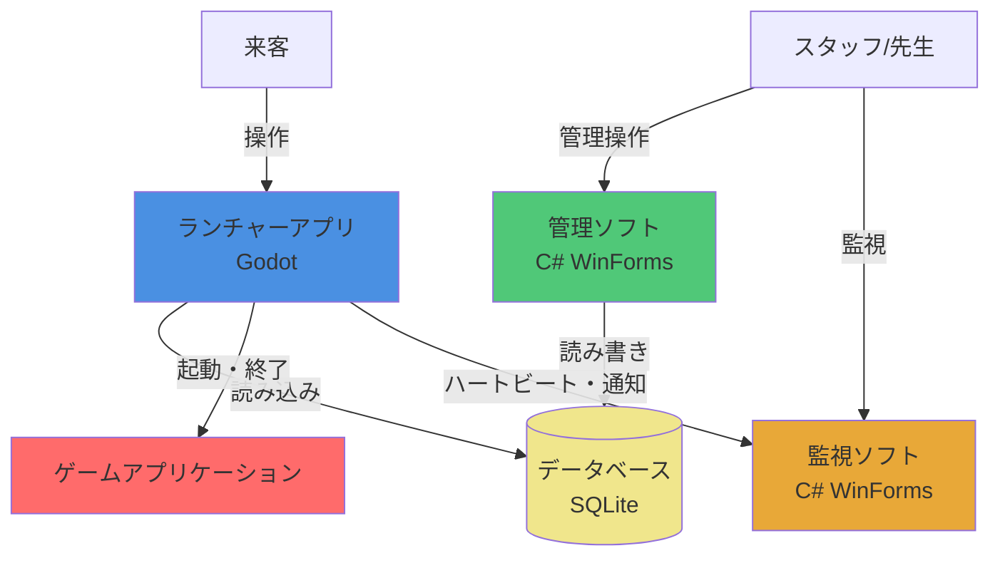
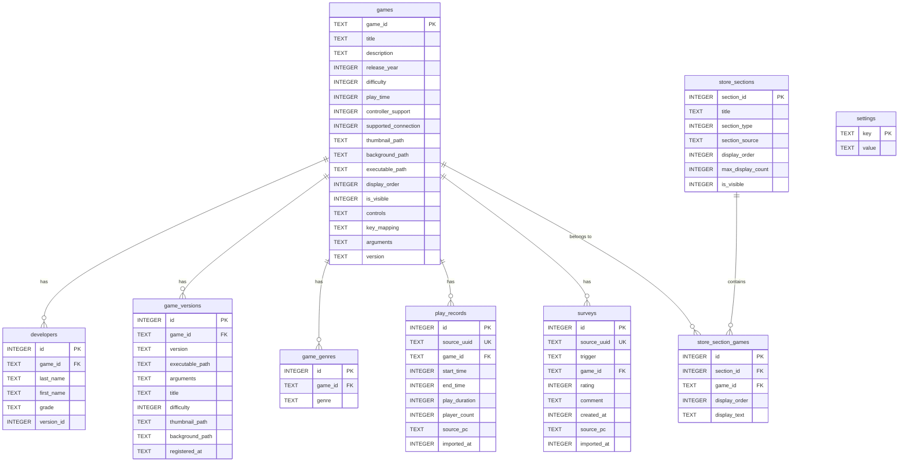

# ゲームセンターTONE 統合ランチャーシステム「Prism」 仕様書

## 1. プロジェクト概要

### 1.1 プロジェクト名

ゲームセンターTONE Prism

### 1.2 目的

ゲームセンターTONE Prismは、大阪府立刀根山高校パソコン部が文化祭で展示する部員制作ゲームを、スタッフのサポートなしでも誰でも簡単に選択・起動・変更できるようにすることを目的とします。

主な目的：

- 来客が自分でゲームを選択・起動できるようにする
- スタッフ不在時でもゲームの変更・切替が可能になる
- 文化祭の展示をより円滑に運営できるようにする
- ゲーム展示の体験を向上させる

### 1.3 背景

大阪府立刀根山高校パソコン部では、部員が制作したゲームを文化祭で展示し、来客に遊んでもらう活動を行っています。従来は、エクスプローラーから直接ゲームを起動する方式を採用していましたが、以下の課題がありました：

- エクスプローラーからの起動では、来客が自分でゲームを選択・変更できない
- スタッフが不在の場合、ゲームの起動や切替ができない
- 展示の運営に人手が必要で、効率的でない

これらの課題を解決するため、誰でも簡単に操作できる統合ランチャーシステムの開発を決定しました。また、せっかく新しくシステムを作る機会なので、将来の拡張性も考慮し、様々な機能を追加できる設計とすることも目指します。

### 1.4 スコープ

#### 含むもの

このプロジェクトでは、以下の機能を含みます：

- **ゲーム選択・起動機能**（必須）
  - 来客が自分でゲームを選択できる機能
  - 選択したゲームを起動する機能
  
- **ゲーム情報の表示機能**
  - ゲームの説明表示
  - サムネイル画像や背景画像の表示
  
- **その他の機能**
  - 開発を進めながら追加機能を検討・実装（詳細は後述）

#### 含まないもの

このプロジェクトでは、以下の機能は含みません：

- **ゲーム自体の開発・制作**
  - ゲーム制作は別プロジェクトとして扱う
  
- **スタッフ向け管理機能・監視機能**
  - ゲーム追加・削除などの管理機能は、同プロジェクト内の別アプリケーション（管理ソフト）として開発
  - 展示PCの監視・スタッフ呼び出し通知の受信は、同プロジェクト内の別アプリケーション（監視ソフト）として開発
  - 注：管理ソフト（2.2章）・監視ソフト（2.3章）もこの仕様書内で仕様を定義しているが、ランチャーとは別の独立したアプリケーションとして実装
  
- **オンライン機能**（現時点では範囲外）
  - ランキング、マルチプレイなどのオンライン機能は、機能実装が進めば将来的に検討
  
- **ゲームの更新・配布機能**（現時点では範囲外）
  - 開発が進めば将来的に検討

#### スコープ外機能の将来検討

実行環境の制約（学校PC）を考慮しつつ、システムの機能実装が進めば、オンライン機能やゲーム更新・配布機能なども視野に入れています。

### 1.5 ターゲットユーザー

#### 主ターゲットユーザー

- **文化祭来客**
  - ゲームセンターTONEの展示を訪れる来場者
  - 自分でゲームを選択・起動したい来客
  - PC操作に不慣れな来客も含む（直感的な操作が必要）

#### サブターゲットユーザー

- **スタッフ（部員兼スタッフ）**
  - パソコン部の部員で、文化祭の展示運営を行うスタッフ
  - 来客のサポートを行う
  - ゲームの切替や簡単なトラブルシューティングを行う
  - 注：詳細な管理機能（ゲーム追加・削除など）は別ソフトウェアで対応

#### ユーザー像

- 来客は、PCゲームに不慣れな人も含まれるため、操作が直感的で分かりやすいUIが求められます
- スタッフは、展示運営中に来客をサポートしつつ、必要に応じてシステムを操作します

---

## 2. 機能要件

### 2.1 ランチャー機能（来客向け）

#### 必須機能

##### 機能1: ゲーム選択・起動機能

- **説明**: 来客が自分でゲームを選択し、選択したゲームを起動する機能
- **優先度**: 高（必須）
- **詳細**:
  - ゲーム一覧からゲームを選択できる
  - 選択したゲームを起動できる
  - ゲーム起動後、ランチャーからの制御が可能（オーバーレイメニューとの連携）

##### 機能2: ゲーム情報表示機能

- **説明**: ゲームの説明や画像などの情報を表示する機能
- **優先度**: 高（必須）
- **詳細**:
  - ゲームの説明文を表示
  - サムネイル画像や背景画像を表示
  - その他ゲームに関する情報の表示

##### 機能3: ゲームフィルター機能

- **説明**: ゲームをジャンル、製作者、制作年などでフィルター分けできる機能
- **優先度**: 中
- **詳細**:
  - ジャンルでのフィルタリング（PlayStation Storeのジャンル分類に準拠、成人を除いた22種類）
  - 製作者でのフィルタリング
  - 制作年でのフィルタリング
  - 複数条件の組み合わせフィルター

#### 追加機能（後々実装予定）

##### 機能4: オーバーレイメニュー機能

- **説明**: ゲーム中にホームボタンなどを押すと、ゲーム機のようにオーバーレイメニューが表示される機能
- **優先度**: 中
- **詳細**:
  - ゲーム中に特定のキー/ボタンでメニューを表示
  - メニューからランチャーに戻る、設定変更などが可能

##### 機能5: コントローラー・キーボードマウス両対応

- **説明**: コントローラーとキーボードマウスの両方の操作に対応する機能
- **優先度**: 中
- **詳細**:
  - コントローラーでの操作に対応
  - キーボード・マウスでの操作に対応
  - 操作方式の切り替えが可能

##### 機能6: ローカルキャッシュ機能

- **説明**: 学校サーバーからローカルにゲームをダウンロードしておき、快適に起動できる機能
- **優先度**: 中
- **詳細**:
  - 学校サーバーからゲームファイルをダウンロード
  - ローカルにキャッシュして高速起動を実現
  - キャッシュの更新・管理機能

##### 機能7: ランチャー操作説明編集機能（管理ソフト）

- **説明**: 管理ソフトからランチャーの操作説明画面（画面2）の内容（画像・テキスト）を編集できる機能
- **優先度**: 中
- **詳細**:
  - ランチャーの操作説明画面の各ページを画像とテキストで定義
  - 管理ソフトの設定画面から編集可能
  - 画像ファイルのアップロード・差し替え
  - テキストの編集
  - ページの追加・削除・順序変更
  - データベースまたは設定ファイルに保存
  - 注：ゲームの操作説明（`controls`フィールド）とは別の機能

##### 機能8: 操作翻訳機能

- **説明**: 操作説明情報から、コントローラー→キーボードなどへ操作を翻訳できる機能
- **優先度**: 低
- **詳細**:
  - コントローラー操作とキーボード操作の対応表を管理
  - 操作説明を入力方式に応じて自動翻訳

##### 機能9: 予測キャッシュ機能

- **説明**: 来客の選択を予測して、ゲームのキャッシュを事前にダウンロードする機能
- **優先度**: 低
- **詳細**:
  - 人気ゲームや過去の選択履歴を分析
  - 予測に基づいて事前ダウンロード

##### 機能10: アンケート機能
- **説明**: ゲーム終了後およびランチャー終了時にアンケートを実施し、プレイヤーのフィードバックを収集する機能
- **優先度**: 中
- **詳細**:
  - **ゲーム個別アンケート**: ゲーム終了時に表示。面白さ(1-5)、コメント（自由記述、上限 200 字）を収集。
  - **全体アンケート**: ランチャー終了時（退出時）に表示。全体の満足度(1-5)、コメントを収集。
  - **スキップ可能**: 強制すると評価品質が下がるため、両アンケートとも明示的にスキップ可能とする。スキップ時はデータを保存しない
  - **保存方式**: Launcher は SQLite に直接書き込まず、JSON として `responses/` フォルダに出力 → Manager が取り込む（drop-folder 方式 / §6.5 参照）
  - **テーブル統合**: ゲーム個別と全体アンケートは `surveys` テーブルに統合し、`trigger` 列（`'game_end'` / `'launcher_end'`）で区別する。`launcher_surveys` テーブルは廃止
  - フィードバック収集の仕組み

##### 機能11: プレイ記録機能

- **説明**: 各ゲームのプレイ回数や時間を記録して保存する機能
- **優先度**: 中
- **詳細**:
  - ゲームごとのプレイ回数を記録
  - ゲームごとのプレイ時間を記録
  - 記録データの保存・集計
  - **保存方式**: Launcher は SQLite に直接書き込まず、JSON として `responses/` フォルダに出力 → Manager が取り込む（drop-folder 方式 / §6.5 参照）

##### 機能12: 人気ランキング表示機能

- **説明**: プレイ回数などのデータから人気ランキングを算出し、UIに表示する機能
- **優先度**: 中
- **詳細**:
  - プレイ回数・時間などのデータからランキングを算出
  - ランチャーUIにランキングを表示
  - ランキングの更新

##### 機能13: デバッグ機能

- **説明**: 特定のキーを押すと、PC構成やバージョン情報、エラーログなどを表示する機能
- **優先度**: 低
- **詳細**:
  - PC構成情報の表示
  - バージョン情報の表示
  - エラーログの表示
  - スタッフ向けのトラブルシューティング支援

##### 機能14: 言語選択機能

- **説明**: 複数言語に対応し、言語を選択できる機能
- **優先度**: 低
- **詳細**:
  - 複数言語への対応
  - 言語の切り替え機能
  - 多言語リソースの管理

##### 機能15: 色覚モード機能

- **説明**: 色覚に配慮した表示モードを選択できる機能
- **優先度**: 低
- **詳細**:
  - 色覚タイプに応じた表示モード
  - アクセシビリティの向上

##### 機能16: 音量コントロール機能

- **説明**: いつでも音量をコントロールできる機能
- **優先度**: 中
- **詳細**:
  - オーバーレイメニューなどから音量調整
  - マスター音量・ゲーム音量の制御

##### 機能17: スコアボード機能

- **説明**: ゲームごとの何らかの記録を自動で集計してスコアボードを表示する機能
- **優先度**: 低
- **詳細**:
  - ゲームから記録データを受信・保存
  - 記録の自動集計
  - スコアボードの表示

##### 機能18: ニュースフィード機能

- **説明**: PS3のホーム画面のようなニュースフィード機能
- **優先度**: 低
- **詳細**:
  - ニュース・お知らせの表示
  - フィード形式での情報提供
  - 更新情報の配信

##### 機能19: ランチャー操作説明図解表示機能

- **説明**: 初めての人向けにランチャーの操作方法を画像とテキストで図解表示する機能
- **優先度**: 中
- **詳細**:
  - 初回起動時や必要に応じてランチャーの操作説明画面を表示（画面2参照）
  - 画像とテキストベースの図解で説明
  - 複数ページのスライド形式
  - 管理ソフトで編集した内容を表示

##### 機能20: スタッフ呼び出し機能

- **説明**: 来客が困った時にスタッフを呼び出せる機能
- **優先度**: 中
- **詳細**:
  - ランチャー画面やオーバーレイメニューに「スタッフを呼ぶ」ボタンを配置
  - ボタンを押すと監視ソフト（Monitor）に呼び出し通知が送信される
  - 視覚的・音声的なフィードバックで呼び出しが成功したことを来客に通知
  - Monitor側で通知音+ポップアップ表示+呼び出し履歴リストに記録（詳細は2.3章参照）
  - 緊急時やトラブルシューティング時に来客がスタッフを簡単に呼べるようにする
  - わかりやすいUI/UX

##### 機能21: 自動アップデート通知機能

- **説明**: 新しいバージョンが利用可能な場合にユーザーに通知する機能
- **優先度**: 低
- **詳細**:
  - 起動時に自動でバージョンチェック
  - GitHub Releasesから最新バージョン情報を取得
  - 新バージョンがある場合、通知ダイアログを表示
  - ダウンロードページへのリンクを提供
  - スキップ機能（次回起動時に再度通知）
  - バックグラウンドでチェック（起動を遅延させない）
  - Launcher/Manager両方で実装

##### 機能22: 終了制御機能（Exit Control）

- **説明**: Alt+F4 やウィンドウの閉じるボタンによる終了を封印し、サービスモード（機能23）からのみアプリケーションを終了可能にする機能
- **優先度**: 高（必須）
- **詳細**:
  - Alt+F4 キーフック（終了要求を無視）
  - ウィンドウの×ボタンによる終了を無効化
  - アプリ終了はサービスモード内の「アプリ終了」ボタンからのみ可能
  - 生徒による誤終了・意図的な終了を完全に防止

##### 機能23: サービスモード機能

- **説明**: カラオケ機器のサービスマンモードに着想を得た、スタッフ向けの診断・管理機能。文化祭当日のトラブル切り分け・復旧を行う
- **優先度**: 中
- **詳細**:
  - **起動方法**: Ctrl+Alt+F12 キーコンボ（スタッフのみが知る）
  - **UI形式**: 全画面オーバーレイ（ランチャーの上に被せる。戻るボタンで通常画面に復帰）
  - **UIデザイン**: 質素なデバッグUI（黒背景+白テキスト基調）。ランチャー本体のテーマとは完全に独立。詳細なレイアウトは実装時に決定
  - **自動復帰**: 60秒無操作で自動的にサービスモードを閉じて通常画面に復帰（サービスモード開いたまま離れる事故の防止）
  - **機能一覧**:

    **診断・テスト:**
    1. 入力チェック+コントローラー接続状況 — ボタン/キーの反応確認、接続中デバイス名・プレイヤー番号・最後に入力があったデバイス・抜き差し検知を表示。「反応しない」がゲーム側の問題かOS側で認識していないのかを切り分け可能
    2. 音声チェック — テスト音を再生。音が出ない問題の即診断
    3. 画面表示テスト — 黒・白・赤・緑・青の全画面表示、解像度/スケーリング確認用グリッド、UIセーフエリア確認。モニター相性・拡大率・解像度ズレの事前発見用
    4. ゲーム一覧状態確認 — 各ゲームのexe存在チェック、パス切れの事前発見
    5. ゲーム起動テスト — ゲームが正常に起動するかを自動テスト。全ゲーム一括テストまたは選択したゲームだけテスト。起動後の待機秒数を設定可能。成功条件はプロセス起動確認→ウィンドウ生成確認→規定の生存時間超え（詳細は実装時に決定）。結果一覧を表示（OK/NG）
    6. ネットワーク接続テスト — 段階的に接続状況を表示。IP取得→ゲートウェイ→DNSまでが共通の幹で、そこからインターネット接続（外部接続確認・応答時間表示）とMonitor接続（先生PC接続確認・応答時間表示）に枝分かれする構造。どの段階で失敗しているか一目でわかる
    7. データベース整合性チェック — DBファイルの存在確認、テーブル存在確認、レコード数表示、読み書きテスト。「データが反映されない」問題の切り分け

    **ログ・情報:**
    8. 簡易ログ確認 — 直近のエラーログ表示（メモリバッファから現セッションのログを取得）
    9. エラー内容表示+マニュアル — 直近のエラー詳細 + エラーコード別の対処法マニュアル（例: E-2001: ゲーム実行ファイルが見つかりません→Managerでパスを確認してください）
    10. システム情報表示 — PC名、OS、解像度、Godotバージョン、Launcherバージョン等

    **設定・操作:**
    11. デバッグオーバーレイ切り替え — ON/OFFトグル。ONにするとサービスモードを閉じても画面隅にFPS・メモリ使用量・PC名・現在のシーン状態・DB/Monitor接続状態等をリアルタイム表示し続ける（マイクラのF3的な常時表示）。メモリのみ保持（再起動でOFF）
    12. フルスクリーン切り替え — フルスクリーン↔ウィンドウの切り替え。モニター違いでの表示崩れ対応用
    13. メンテナンスモード切り替え — ON/OFFトグル1つでアンケートスキップ・アイドルタイマー一時停止（スクリーンセーバーに戻らない）・操作説明スキップをまとめて切り替え。メモリのみ保持（再起動でOFFにリセット）。セットアップ・テストプレイ・展示説明時にON、本番前にOFFにするだけ
    14. ランチャーの再読み込み — DB再読み込み。再起動より軽い
    15. アプリの再起動 — OSプロセスとして再起動
    16. アプリ終了 — 確認ダイアログ付きでランチャーを終了。Alt+F4/×ボタン封印のため唯一の終了手段

  - **将来検討事項**:
    - リモートサービス情報取得 — Monitorから各PCのサービスモード情報（システム情報・エラーログ等）を遠隔で確認。来場者対応中の生徒PCを直接操作せずに診断可能。Monitor-Launcher間通信の拡張として実装

##### ログ基盤仕様

- **説明**: サービスモードと連携する、Launcher全体の統一ログシステム。既存のprint()文を置き換え、エラー追跡・デバッグ・運用監視を体系的に行う
- **優先度**: 中（サービスモードと同時に実装）
- **詳細**:
  - **ログレベル**:
    - ERROR: エラー（E-xxxxコード付き）。必ずファイルに記録
    - WARN: 警告（正常動作に影響しないが注意が必要）
    - INFO: 通常操作ログ（ゲーム起動/終了、画面遷移等）
    - DEBUG: 開発用詳細ログ（リリース時は無効化可能）
  - **ログ出力先**:
    - ファイル: `logs/launcher_YYYYMMDD.log` に日次ローテーション
    - コンソール: Godotの標準出力（開発時）
    - メモリバッファ: 直近N件をリングバッファで保持（サービスモードの簡易ログ表示用、現セッションのみ）
  - **ログフォーマット**: `[日時] [レベル] [コード] メッセージ`（例: `[2026-03-28 14:23:05] [ERROR] [E-2001] ゲーム実行ファイルが見つかりません`）
  - **各モジュールへの統合**: app_manager, error_manager, database_manager, game_launcher 等すべてのマネージャーで使用。既存のprint()文を統一ログシステムに置き換え
  - **サービスモードとの連携**:
    - 「簡易ログ確認」: メモリバッファの直近ログを表示
    - 「エラー内容表示」: ログからERROR/WARNのみフィルタして表示 + 対処法マニュアル

### 2.2 管理機能（スタッフ向け）

#### ゲーム管理機能

##### 機能1: ゲーム追加機能

- **説明**: 新しいゲームをシステムに追加する機能
- **優先度**: 高
- **詳細**:
  - **作業フロー**:
    1. 「ゲーム追加」ボタンをクリック
    2. フォルダ選択ダイアログで元のゲームフォルダを選択
    3. 管理ソフトが選択したフォルダを`games/{game_id}/`に自動コピー
    4. ゲームIDの自動生成（または手動入力）
    5. コピー完了後、ゲーム情報入力画面を表示
    6. 実行ファイルの選択（コピーしたフォルダ内から選択、自動検出機能あり）
    7. サムネイル画像の選択（自動検出機能あり）
    8. 背景画像/動画の選択（自動検出機能あり）
    9. ゲーム情報（タイトル、説明、製作者、ジャンル、制作年など）の入力
       - 製作者情報の入力時、期生欄に0を入力すると「教員」として扱われる
    10. 設定（難易度、プレイ時間、コントローラーサポートなど）の入力
    11. 「保存」をクリックしてデータベースに保存
  - **自動検出機能**:
    - 実行ファイル: `*.exe`ファイルを自動検出して候補を表示
    - サムネイル画像: `thumbnail.png`, `thumb.jpg`, `icon.png`などを自動検出
    - 背景画像/動画: `background.mp4`, `bg.mp4`, `preview.mp4`などを自動検出
  - **目的**: 管理者がエクスプローラーを直接操作せず、すべて管理ソフトから操作できるようにする
  - **UI改善**:
    - **画像プレビュー**: 選択したサムネイル・背景画像をその場でプレビュー表示
    - **テスト起動**: 登録前に実行ファイルをテスト起動して動作確認が可能
  - **gameId 重複検出**（Manager v0.8.4 で実装、#120）:
    - 「保存」押下後、ファイルコピー処理の直前に `games/{gameId}/` フォルダの存在をチェック
    - 残骸が残っていた場合は警告ダイアログで「同バージョン追加時にエラー / 別バージョン追加時に古いファイルが残る / 最悪 Launcher が古い実行ファイルを起動する可能性」を提示
    - 自動削除はせず、データ保護のため手動退避を促す方針（OK で続行 = 古いフォルダはそのまま残る、キャンセル = 追加処理を中止）

##### 機能2: ゲーム削除機能

- **説明**: 登録されているゲームをシステムから削除する機能
- **優先度**: 高
- **詳細**:
  - 削除実行は **DB レコード + `games/{game_id}/` フォルダのセット削除**（Manager v0.8.3 で実装、`DeleteGameConfirmForm`）。「DB のみ削除」のオプション分岐は持たない
    - DB 側は `games` 行と CASCADE で削除される関連レコード（developers / game_versions / game_genres / play_records / surveys / store_section_games）
    - フォルダ側は `Directory.Delete(folder, true)` で物理削除
  - 削除前の確認ダイアログ（`DeleteGameConfirmForm`）に削除対象のフォルダパスを表示し、ディスクから物理的に消える旨を警告色で明示
  - `Enter` キー誤操作を防ぐため `AcceptButton` はキャンセルに割り当て
  - フォルダが存在しない場合（手動削除済み等）は表示を「フォルダが見つかりません。DB のみ削除します」に切り替えて DB 削除のみ実行（無害）
  - 削除フローは **rename rollback パターン** (リセットと同じ 3 フェーズ、Manager v0.8.5 / #122):
    1. `games/{gameId}/` を `games/{gameId}.pending-delete-{guid}/` に rename で退避
    2. DB 削除 (CASCADE で関連レコードも削除)
    3. 退避フォルダを物理削除
  - 失敗パターン別の挙動: (1) rename 失敗 → 再試行 UI、諦めたら全体中止 (何も変わらない) / (2) DB 削除失敗 → 退避を rename で戻してロールバック → throw / (3) 退避物理削除失敗 → 再試行 UI、諦めたらゴミ退避フォルダだけ残る (DB / games は確定状態)
  - フォルダ物理削除前に DB 削除が走るので、DB 削除失敗時にフォルダだけ消える永続データロストを排除 (Codex P1 #122)
  - フォルダ削除中に `IOException`（Launcher など他プロセスがフォルダ内のファイルをロック中）や `UnauthorizedAccessException` が発生した場合は、再試行 UI (`FolderDeletionFailureDialog`) を表示
  - フォルダ削除のリトライ機構は `Services.FolderDeletionService.TryDelete` (5 回 × 200ms) を共通化して使用 (Manager v0.8.5 / #122)

##### 機能3: ゲーム情報編集機能

- **説明**: 登録されているゲームの情報を編集する機能
- **優先度**: 高
- **詳細**:
  - ゲーム名、説明文の編集
  - サムネイル画像や背景画像の更新
  - メタデータ（ジャンル、製作者、制作年など）の編集
    - 製作者情報の編集時、期生欄に0を入力すると「教員」として扱われる
  - ゲームファイルの差し替え

##### 機能4: ゲームバージョン管理機能

- **説明**: ゲームのバージョン（更新履歴）を管理し、特定のバージョンをアクティブにする機能
- **優先度**: 高
- **詳細**:
  - **バージョン追加**: 
    - 現在のバージョンをベースに新しいバージョンを作成
    - バージョン番号（例：1.0.0 -> 1.1.0）の付与
    - 更新内容（Update Note）の記録
  - **バージョン切り替え**:
    - 編集画面で対象バージョンを切り替えて情報を編集可能
    - タイトル、実行ファイルパス、画像、説明などをバージョンごとに保持
  - **アクティブ設定**:
    - ランチャーで起動するバージョン（アクティブバージョン）を選択・保存
    - 選択されたバージョンの情報がランチャーに同期される
  - **起動オプション管理**:
    - バージョンごとに異なる起動引数（Arguments）を設定可能

##### 機能5: ゲーム並び順管理機能

- **説明**: ランチャーのデフォルトソート時の並び順を変更する機能
- **優先度**: 中
- **詳細**:
  - ゲームの表示順序を変更
  - ドラッグ&ドロップや数値指定での並び替え

#### データ管理機能

##### 機能6: プレイ記録データ閲覧・エクスポート機能

- **説明**: プレイ記録データを閲覧・エクスポートする機能
- **優先度**: 中
- **詳細**:
  - ゲームごとのプレイ回数・時間の閲覧
  - データのエクスポート（CSV、JSONなど）
  - 期間指定での絞り込み表示

##### 機能7: アンケート結果閲覧・エクスポート機能

- **説明**: アンケート結果を閲覧・エクスポートする機能
- **優先度**: 中
  - ゲームごとのアンケート結果の閲覧
  - データのエクスポート（CSV、JSONなど）
  - 期間指定やゲーム指定での絞り込み表示

##### 機能8: 統計情報表示機能

- **説明**: 各種統計情報を表示する機能
- **優先度**: 中
- **詳細**:
  - 人気ランキングの確認
  - 総プレイ回数・時間の表示
  - グラフやチャートでの可視化

#### 設定管理機能

##### 機能9: ランチャー設定変更機能

- **説明**: ランチャーの各種設定を変更する機能
- **優先度**: 高
- **詳細**:
  - ランチャーの基本設定の変更
  - 表示オプションの変更
  - その他のランチャー関連設定

##### 機能10: フィルター条件管理機能

- **説明**: フィルターで使用する条件（ジャンル、製作者など）を管理する機能
- **優先度**: 中
- **詳細**:
  - ジャンルの追加・削除・編集（PlayStation Storeのジャンル分類に準拠、成人を除いた22種類）
    - 利用可能なジャンル（22種類）:
      - アクション、アドベンチャー、アーケード、パズル、RPG、カジュアル、シミュレーション、シューティング、ストラテジー、その他、ドライビング/レース、ホラー、ファミリー、スポーツ、シミュレーター、格闘、脳トレ、パーティー、リズムアクション、クイズ、教育、フィットネス
  - 製作者リストの管理
  - その他フィルター条件の管理

##### 機能11: その他設定管理機能

- **説明**: その他のシステム設定を管理する機能
- **優先度**: 中
- **詳細**:
  - カラーテーマ設定（アクセントカラーの選択・設定）
  - システム全体の設定変更
  - 必要に応じて追加される設定項目の管理
  - **データベースリセット機能**（Manager v0.8.4 で実装と整合化）:
    - 設定タブの「データベースリセット」ボタンから起動
    - 確認ダイアログ (`ResetDatabaseConfirmForm`) で「ボタンが逃げる」「確認コード入力」の二重安全機構を経て実行
    - 削除実行は **`prism.db` + `games/` フォルダ配下のセット削除**（旧実装は DB のみ削除で確認画面と齟齬していたが #119 で修正）
    - 実装は **rename rollback 方式**:
      1. `games/` を `games.pending-delete-{guid}/` に rename で退避（同一ボリューム rename は事実上 atomic）
      2. `prism.db` を削除
      3. `games/` を再作成 + DB 再初期化
      4. 退避フォルダを物理削除
    - 失敗パターン別の挙動: (1) games rename 失敗 → 何も変わらず throw / (2) DB 削除失敗 → games を rename で復元 (ロールバック) してから throw / (3) games/ 再作成 or DB 再初期化失敗 → 部分作成された games/ と prism.db を削除 + 退避を games/ に戻して throw（DB だけ消えた状態でバックアップ #96 から復元可能） / (4) 退避フォルダ物理削除失敗 → 戻り値で警告メッセージを返す（DB / games 再構築済み + ゴミ退避フォルダだけ残る、Launcher が起動中ゲームの実行ファイルを掴んでいると起き得る）。**いずれの中間失敗でも Manager は再起動可能**
    - **`ResetDatabase()` の戻り値**: `Services.FolderDeletionService.Result` 型 (Manager v0.8.5 で `string` から構造化)。Success=true は完全成功、Success=false は退避フォルダ削除失敗（DB / games は再構築済み）で Path / LastError に詳細あり。呼び出し側 (`SettingsSectionPanel.btnResetDatabase_Click`) は結果に関わらず `UpdateVersionInfo()` / `DatabaseReset?.Invoke()` を実行し、Success=false なら `FolderDeletionFailureDialog` で再試行ループを提供する
    - **再試行 UI** (`FolderDeletionFailureDialog`、Manager v0.8.5 / #122 Group C): 退避フォルダ削除失敗時、ユーザーが Launcher を閉じてから「再試行」ボタンを押せばロック解放されて削除成功する想定。失敗詳細 (Exception.Message) も表示。「諦める」を選んだ場合は警告 MessageBox で手動削除を案内
    - `backups/` 等の隣接フォルダは触らない（復元用に残す）
    - 確認画面 (`ResetDatabaseConfirmForm`) に「すべての展示PCの Launcher を終了してから実行」警告を表示
    - 実行前にバックアップ機能 (#96 / Manager v0.8.0) で `prism.db` のスナップショット取得を強く推奨

#### バックアップ機能

##### 機能12: データベースバックアップ・復元機能

- **説明**: `prism.db` のスナップショットを取得・管理し、障害・破損・操作ミス発生時に過去の状態へ戻せるようにする機能
- **優先度**: 高（特にプレイ記録・アンケート結果のような再現不可なデータの保全のため）
- **対応リリース**: Manager v0.8.0
- **詳細**:
  - **専用タブ「バックアップ」**を MainForm に追加
  - **手動バックアップ**: 「今すぐバックアップ」ボタンで即時実行
  - **自動バックアップ**: Manager 起動時に「前回バックアップから設定間隔（デフォルト 24h）以上経過していたら走らせる」方式
    - 設置現場の運用上、Manager は常時起動でなく時々開かれる前提のため、起動時チェック方式を採用（cron 型ではない）
  - **バックアップ方式**: SQLite Online Backup API（`SQLiteConnection.BackupDatabase`）を使用
    - Launcher が `prism.db` を開いている状態でもライブDBの整合性を保ったコピーが可能
    - WAL モードのチェックポイント処理も内部で適切に行われる
  - **マルチPC重複防止**: `settings.last_backup_at` を `BEGIN IMMEDIATE` トランザクションで更新する lease 方式
    - 運用上は単一Manager前提だが、防衛的な仕組みとして実装
  - **バックアップ履歴一覧**: `backup_log` テーブルを表示（日時 / 実行PC / トリガ / 状態 / サイズ / ファイルパス）
  - **保存先設定**: デフォルトは `<DBファイルのフォルダ>/backups/`、設定で任意のフォルダに変更可能
  - **ファイル名規則**: `prism_YYYYMMDD_HHmmss.db`
  - **世代管理**: 設定値 `backup_retention_count`（デフォルト 30）を超える古いバックアップは自動削除
  - **リストア機能**:
    1. 履歴一覧から復元したいバックアップを選択
    2. 警告ダイアログ表示（「全Launcher を停止してください」「現DBは退避されます」）
    3. 4桁の確認コード入力による誤操作防止（`ResetDatabaseConfirmForm` と同じパターン）
    4. 現在の `prism.db` を `safety_before_restore_HHmmss.db` として Online Backup API で退避
    5. SQLite 接続プールをクリア
    6. `prism.db` / `prism.db-wal` / `prism.db-shm` を削除
    7. 選択されたバックアップを `prism.db` としてコピー
    8. DB を再初期化、各パネルを再ロード
- **設定値**（`settings` テーブルに保存）:
  - `last_backup_at`（UNIX秒）: 最終バックアップ完了時刻、lease で使用
  - `backup_destination_path`（TEXT）: 保存先フォルダ。空ならデフォルト
  - `backup_auto_interval_hours`（INTEGER, デフォルト 24）: 自動バックアップ間隔
  - `backup_retention_count`（INTEGER, デフォルト 30）: 保持する世代数

### 2.3 監視機能（Monitor - 先生PC向け）

パソコン室内の先生PCで動作し、各展示PCの状態監視とスタッフ呼び出し通知の受信を行う監視ソフトウェア。

#### スタッフ呼び出し通知

##### 機能1: 呼び出し通知受信

- **説明**: Launcherの「スタッフを呼ぶ」ボタン押下時に通知を受信する機能
- **優先度**: 高
- **詳細**:
  - 通知音を鳴らし、どのPCからの呼び出しかをポップアップで表示
  - 呼び出し履歴リストに記録
  - 対応済みマークを付けられる
  - 通知音のON/OFF設定が可能

#### PC状態監視

##### 機能2: 各PC状況一覧

- **説明**: 各展示PCの現在の状態をリアルタイムで一覧表示する機能
- **優先度**: 高
- **詳細**:
  - PC名（ホスト名自動取得）、状態（プレイ中/アイドル/呼び出し/異常）、起動中ゲーム名、経過時間を表示
  - Launcherからのステータス更新メッセージに基づきリアルタイム更新

##### 機能3: Launcher異常検知

- **説明**: Launcherの異常終了やフリーズを検知して通知する機能
- **優先度**: 高
- **詳細**:
  - **エラー通知**: Launcherのクラッシュハンドラ（未処理例外キャッチ）からのエラー通知を受信
  - **ハートビート途絶検知**: 各Launcherは5秒間隔でハートビートを送信し、15秒間（3回分）応答がない場合に「異常」と判定
  - 異常検知時は通知音 + PC状況一覧で赤色表示

#### その他

##### 機能4: プレイ統計ダッシュボード（後日決定）

- **説明**: ゲームごとのプレイ回数・アンケート結果等をリアルタイムで表示する機能
- **優先度**: 未定
- **詳細**:
  - 実装範囲・表示内容は後日決定

##### 機能5: 設定管理

- **説明**: Monitorの各種設定を管理する機能
- **優先度**: 中
- **詳細**:
  - JSON設定ファイルをバックエンドとし、GUI設定画面からも編集可能
  - 設定項目: 通信方式（TCP/UDP or 共有フォルダ）、ポート番号/共有フォルダパス、通知音ON/OFF、通知音ファイルパス、ハートビート間隔（デフォルト5秒）、タイムアウト（デフォルト15秒）

### 2.4 Tools（補助ユーティリティ群）

Godot は Win32 API へのアクセスが弱いため、ウィンドウ検知・常駐オーバーレイ等の OS 機能が必要な処理を補助するための独立ユーティリティ群。Launcher / Manager / Monitor の3大コンポーネントを支える存在。

#### 配置・技術スタック

- **配置**: リポジトリルートの `GCTonePrism_Tools/`
- **言語/環境**: C# / .NET Framework 4.8（Manager と同じ）
- **ビルド管理**: 単一の `GCTonePrism.sln` で Manager / Tools / Monitor を統合管理（VS で一括ビルド・デバッグ可）
- **配布**: ビルド成果物の `.exe` を Launcher と同じディレクトリに配置

#### 構成方針

```
GCTonePrism_Tools/
├── Common/                      共有 Win32 ヘルパー (DllImport 集約等)
│   └── GCTonePrism.Tools.Common.csproj
├── WindowProbe/                 単発クエリ系: 指定 PID の可視ウィンドウ存在確認
│   └── GCTonePrism.Tools.WindowProbe.csproj
└── PauseOverlay/                常駐 GUI 系: ゲーム中断メニュー（将来）
    └── GCTonePrism.Tools.PauseOverlay.csproj
```

#### Launcher との通信規約

- **呼び出し**: Godot 側から `OS.execute()`（単発）または `OS.create_process()`（常駐）
- **戻り値**:
  - 単発系: 標準出力 1 行 + 終了コード
  - 常駐系: 標準出力 1 行 = 1 メッセージ (JSON 形式)、`{"event":"...","payload":{...}}` の構造で双方向通信
- **エラー**: 終了コード非ゼロ + 標準エラー出力にメッセージ

#### 各 Tool の機能

##### Tool 1: WindowProbe（単発クエリ）

- **説明**: 指定 PID のプロセスが可視ウィンドウを持っているかを検知する
- **優先度**: 高
- **用途**: Launcher の「ゲーム起動中 → プレイ中」遷移タイミングを正確化（現状は固定 1 秒待機 + プロセス spawn 直後で切替）
- **入力**: コマンドライン引数 `<pid>`
- **出力**:
  - `visible`: 可視ウィンドウあり（ゲームウィンドウ表示済み）
  - `not_visible`: プロセスは存在するが可視ウィンドウなし
  - `not_found`: プロセス自体が存在しない
- **使用 API**: `EnumWindows`, `GetWindowThreadProcessId`, `IsWindowVisible`

##### Tool 2: PauseOverlay（常駐 GUI、将来実装）

- **説明**: ゲーム実行中にグローバルホットキーで呼び出せる中断メニューを提供
- **優先度**: 中（マイルストーン10〜13 範囲）
- **用途**: フルスクリーンゲーム上に重ねて中断メニューを表示し、終了/再開等の操作を提供
- **必要技術**: 透過 + 常時最前面ウィンドウ（WPF）、低レベルキーボードフック (`SetWindowsHookEx`)
- **通信**: Launcher が `create_process` で起動、Launcher へは stdout/JSON で「閉じた / 終了選択された」等を通知

#### 実装方針の検討事項

- 各 Tool を独立 `.exe` にするか、単一 `.exe` + サブコマンド (`tools.exe probe <pid>` 等) にまとめるか
- Common ライブラリの参照は静的リンクにするか動的にするか（配布物数に影響）

---

## 3. 非機能要件

### 3.1 パフォーマンス要件

- **レスポンスタイム**:
  - ゲームの重さによって起動時間は様々なため、具体的な秒数での目標は設定しない
  - 待ち時間中にプログレスバーやローディングアニメーションなどのUX要素に注力する
- **スループット**:
  - 同時起動ゲーム数は1つに制限
  - ゲームの多重起動を防止する仕組みが必要
- **リソース使用量**:
  - 想定環境: Core i3 11世代、メモリ8GB程度の学校PC
  - 限られたリソース環境でも快適に動作することを重視

### 3.2 セキュリティ要件

- **認証方式**:
  - 特に認証機能は不要（スタッフ向け管理機能も認証なしで使用）
- **認可方式**:
  - 認証機能がないため、認可も不要
- **データ保護**:
  - 個人情報に関係しないデータ（アンケート結果、プレイ記録など）については、適切に保存・管理する
  - データの安全な保存・管理を実施
- **脆弱性対策**:
  - 一般的なセキュリティベストプラクティスに従う

### 3.3 可用性

- **稼働率**:
  - 文化祭期間中は基本的に常時稼働
  - 人がいない時間も、スクリーンセーバー兼プレビュー機能としてゲームセンターのように表示し続ける
- **ダウンタイム許容範囲**:
  - 基本的にダウンタイムは最小限に抑える
  - トラブル発生時は迅速な復旧が可能なようにする

### 3.4 拡張性

- **ユーザー数**:
  - 現在の想定: 40人キャパのパソコン室が常時3/4程度埋まる（約30人）
- **データ量**:
  - ゲーム数: 現在30個程度、年間10個程度増加を想定
  - プレイ記録、アンケート結果などのデータが年々蓄積されることを考慮
- **機能追加**:
  - 将来的な機能追加（オーバーレイメニュー、ランキング機能など）に対応できるよう、拡張性を考慮した設計を採用する
  - モジュール化やプラグイン的な設計を検討

### 3.5 互換性要件

- **OS**:
  - Windowsのみ対応予定
- **ブラウザ**:
  - デスクトップアプリケーションとして開発するため、ブラウザ要件は該当なし
- **ハードウェア**:
  - 学校PCの仕様に合わせる必要があるため、顧問の先生と要相談
  - 現在想定している環境: Core i3 11世代、メモリ8GB程度

---

## 4. UI/UX設計

### 4.1 画面設計

#### ランチャー（来客向け）の画面

##### 画面1: スクリーンセーバー画面

- **画面名**: スクリーンセーバー画面
- **目的**: 人がいない時間にゲームセンターのように表示し続ける、スクリーンセーバー兼プレビュー画面

- **画面状態1: ロゴ表示画面（初期状態）**
  - **レイアウト**:
    - フルスクリーン表示
    - 画面中央にロゴを表示
    - 背景に各ゲームのプレイ映像をレンガ状（グリッド状）に配置して動的に表示
    - 「AボタンまたはEnterキーを押してスタート」などのメッセージを表示
  - **操作**:
    - AボタンまたはEnterキーを押すとゲーム選択画面に遷移
  - **タイマー**:
    - 一定時間（例：30秒）操作がないと自動的に画面状態2に遷移

- **画面状態2: ゲームプレビュースライドショー**
    - **レイアウト**:
      - フルスクリーン表示
      - 各ゲームのプレイ動画がタイトルと共にフルスクリーンで次々と流れる
      - 1つのゲームを一定時間（例：10-15秒）表示後、次のゲームに自動遷移
    - **操作**:
      - 任意のボタンまたはキーを押すと画面状態1（ロゴ表示画面）に戻る

- **画面遷移**:
  - 画面状態1 → 画面状態2（タイマー経過時）
  - 画面状態2 → 画面状態1（操作時）
  - 画面状態1 → ゲーム選択画面（Aボタン/Enterキー押下時）

##### 画面2: ランチャー操作説明画面

- **画面名**: ランチャー操作説明画面
- **目的**: 初めての人向けにランチャーの操作方法を画像とテキストで説明する画面
- **表示形式**:
  - 画像とテキストベースで説明を表示
  - 複数ページ構成（スライド形式）
  - 図解を豊富に含める
  - 管理ソフトで内容を編集可能
- **説明内容**:
  - ランチャーからゲームを選ぶ手順
  - ゲームを切り替えたいときの案内
  - 席を離れるときの案内
  - 場内の注意事項
  - その他、管理ソフトで設定した説明内容
- **主要要素**:
  - 説明画像（各ページごと）
  - 説明テキスト
  - スキップ機能（説明をスキップして次の画面へ進む）
  - 次へ/戻るボタン（ページ送り）
  - ページ番号表示（例：「1 / 5」）
- **レイアウト**:
  - フルスクリーン表示
  - 動画を中心に配置
  - 操作ボタン（スキップ、一時停止など）を適切な位置に配置
- **遷移**:
  - 最後のページで「次へ」を押す、またはスキップボタン押下でゲーム選択画面に遷移
  - 初回起動時のみ表示（設定でスキップ可能にするか検討）

##### 画面3: ゲームメイン画面（Steamストア風）

- **画面名**: ゲームメイン画面
- **目的**: Steamストアの最初の画面のように、グラフィカルにゲームを表示する画面
- **背景**:
  - 基本的に無地（ダークテーマの背景色）
- **レイアウト構成**:
  - **上部エリア（メインカード）**:
    - 画面の上部を占める大型のゲームカード（サイズ可変）
    - ゲームの背景画像（`background_path`）を使用
    - カードの左下にゲームタイトルを表示
  - **スクロール可能エリア**:
    - メインカードの下にスクロール可能なコンテンツを配置
    - 人気ランキングセクション（複数のゲームカードを横並びに配置）
    - ジャンル別セクション（各ジャンルごとに複数のゲームカードを横並びに配置）
    - 各ゲームカードは背景画像（`background_path`）を使用
    - 各カードの左下にタイトルを表示
- **ナビゲーション**:
  - キーボード（方向キー）、マウス、コントローラーで操作可能
  - スクロールでコンテンツを閲覧
  - ゲームカードを選択・決定でゲーム起動または詳細表示
- **主要要素**:
  - 大型のメインゲームカード（可変サイズ）
  - 人気ランキングセクション（ゲームカードの横並び）
  - ジャンル別セクション（各ジャンルごとにゲームカードの横並び）
  - ゲームタイトル表示（各カードの左下）
- **注意事項**:
  - フィルター機能や並び替え機能はこの画面には含めない（画面4のゲーム一覧選択画面で実装）

##### 画面4: ゲーム一覧選択画面

- **画面名**: ゲーム一覧選択画面
- **目的**: 登録されているゲームの一覧を表示し、選択できる画面
- **表示モード**: 2つの表示モードを切り替え可能
  - カルーセル表示モード（デフォルト）
  - グリッド表示モード

- **カルーセル表示モード（デフォルト）**:
  - **レイアウト**:
    - フルスクリーン表示
    - 左側に縦に並んだゲームサムネイル（カルーセル方式）
    - 背景全体に選択中のゲームの背景映像（`background_path`）を表示
    - 右下側にゲーム詳細情報を表示
  - **サムネイルカルーセル**:
    - 右側に縦にサムネイル（`thumbnail_path`）が並ぶ
    - 上下キー/ボタンで移動してゲームを選択
    - 選択中のゲームがハイライト表示
  - **詳細情報表示エリア（右下）**:
    - ゲームタイトル
    - リリース年
    - その他の詳細情報（説明、ジャンル、製作者など）
    - プレイボタン
  - **操作**:
    - 上下キー/ボタンでサムネイルを移動してゲームを選択
    - プレイボタンを押すとゲームを起動
    - グリッド表示ボタンでグリッド表示モードに切り替え

- **グリッド表示モード**:
  - **レイアウト**:
    - フルスクリーン表示
    - ゲーム一覧をグリッド形式で表示
    - フィルター・ソート機能を表示（上部またはサイドバー）
  - **ゲームカード**:
    - サムネイル（`thumbnail_path`）
    - ゲームタイトル
    - その他の情報（オプション）
  - **操作**:
    - ゲームカードを選択すると、カルーセル表示モードに戻り、そのゲームが選択された状態になる
    - フィルター・ソート機能でゲームを絞り込み・並び替え

- **画面遷移**:
  - カルーセル表示 ↔ グリッド表示（グリッド表示ボタンで切り替え）
  - プレイボタン押下でゲーム起動

##### 画面5: オーバーレイ画面

- **画面名**: オーバーレイ画面
- **目的**: ゲーム中に表示されるオーバーレイメニュー
- **表示方法**:
  - ゲーム画面全体が薄黒くなる（背景を暗転）
  - その上にメニューを表示
- **レイアウト**:
  - フルスクリーン表示
  - **左半分**: メニューリスト
    - 「ゲームを続ける」
    - 「オプション」
    - 「ゲームを終了する」
    - 「音量調整」
    - その他のメニュー項目
  - **右半分**: 操作説明図
    - JSONとリンクした操作説明図を表示
    - 現在選択中のゲームの操作説明（`controls`フィールドから取得）
    - 図解形式で表示
- **表示トリガー**:
  - **コントローラー**: ホームボタンやロゴボタン（PSコントローラーのPSボタンなど）
  - **キーボード**: Homeキー
- **操作**:
  - メニュー項目を選択して実行
  - 「ゲームを続ける」でオーバーレイを閉じてゲームに戻る
  - 「オプション」でオプション画面に遷移
  - 「ゲームを終了する」でゲームを終了
  - 「音量調整」で音量を調整
  - ESCキーやBボタンでオーバーレイを閉じる（ゲームを続ける）
- **操作説明図**:
  - 右半分に表示される操作説明は、現在のゲームの`controls`フィールドから取得
  - キーボード操作とコントローラー操作の両方を表示可能
  - 図解形式でわかりやすく表示

##### 画面6: オプション画面

- **画面名**: オプション画面
- **目的**: 各種設定やオプションを変更する画面
- **表示形式**:
  - フルスクリーン表示またはオーバーレイ表示
  - 設定項目をカテゴリ別にリスト形式で配置
- **設定項目（一般的な設計）**:
  - **音量設定**:
    - スライダーで音量を調整
    - マスター音量、ゲーム音量など（将来実装予定）
  - **言語選択**:
    - ドロップダウンまたはリストから言語を選択
  - **色覚モード設定**:
    - トグルまたはリストから色覚モードを選択
  - **その他の設定項目**:
    - 将来追加される設定項目に対応
- **レイアウト**:
  - 設定項目を縦にリスト形式で配置
  - 各設定項目の右側に設定値を表示・変更
  - 下部または上部に「戻る」ボタンを配置
- **操作**:
  - 上下キー/ボタンで設定項目を移動
  - 左右キー/ボタンまたは決定ボタンで設定値を変更
  - 「戻る」ボタンまたはESC/Bボタンで前の画面に戻る
- **設定の保存**:
  - 設定変更は自動保存（または保存ボタンで保存、今後決定）
- **注意事項**:
  - 詳細な設定項目やUIは今後決定予定

#### 管理ソフト（スタッフ向け）の画面

##### 画面7: ゲーム管理画面

- **画面名**: ゲーム管理画面
- **目的**: ゲームの追加・編集・削除を行う画面
- **表示形式（一般的な設計）**:
  - ウィンドウまたはフルスクリーン表示
  - Windowsダイアログ風のUI（WinForms）
- **主要要素**:
  - **ゲーム一覧表示**:
    - テーブル、リスト、またはカード形式でゲーム一覧を表示
    - ゲーム名、ID、表示順序、表示/非表示などの情報を表示
  - **操作ボタン**:
    - 「ゲーム追加」ボタン
    - 「編集」ボタン（選択したゲームを編集）
    - 「削除」ボタン（選択したゲームを削除）
  - **並び順変更機能**:
    - ドラッグ&ドロップ、または上下ボタンで並び順を変更
  - **ゲーム情報入力フォーム（追加・編集時）**:
    - モーダルダイアログまたは別パネルで表示
    - ゲーム情報の各フィールドを入力できるフォーム
    - ファイル選択ダイアログ（実行ファイル、画像ファイルなど）
- **レイアウト**:
  - 左側または上部にゲーム一覧を配置
  - 右側または下部に編集フォームを配置（編集時）
  - 操作ボタンを適切な位置に配置
- **注意事項**:
  - 詳細なレイアウトやUIは今後決定予定

##### 画面8: データ閲覧画面

- **画面名**: データ閲覧画面
- **目的**: プレイ記録やアンケート結果などのデータを閲覧・エクスポートする画面
- **表示形式（一般的な設計）**:
  - ウィンドウまたはフルスクリーン表示
  - Windowsダイアログ風のUI（WinForms）
- **主要要素**:
  - **タブまたはセクション分け**:
    - プレイ記録データ
    - アンケート結果
    - 統計情報
  - **データ表示**:
    - プレイ記録データをテーブル形式で表示
    - アンケート結果をテーブル形式で表示
    - 統計情報をグラフやチャートで表示（将来実装予定）
  - **フィルター・期間指定**:
    - 期間指定（開始日、終了日）
    - ゲーム指定による絞り込み
  - **エクスポート機能**:
    - 「エクスポート」ボタン
    - ファイル保存ダイアログで保存形式（CSV、JSONなど）を選択
- **レイアウト**:
  - 上部にフィルター・期間指定UIを配置
  - 中央にデータテーブル、グラフを配置
  - 下部またはツールバーにエクスポートボタンを配置
- **注意事項**:
  - 詳細なレイアウトやグラフ表示の実装は今後決定予定

##### 画面9: 設定画面（管理ソフト）

- **画面名**: 設定画面（管理ソフト）
- **目的**: システム全体の設定を管理する画面
- **表示形式（一般的な設計）**:
  - ウィンドウまたはフルスクリーン表示
  - Windowsダイアログ風のUI（WinForms）
- **主要要素**:
  - **タブまたはカテゴリ分け**:
    - ランチャー設定
    - フィルター条件管理
    - カラーテーマ設定
    - その他のシステム設定
  - **ランチャー設定**:
    - デフォルトソート順などの設定
  - **フィルター条件管理**:
    - ジャンルの追加・削除・編集
    - 製作者リストの管理
  - **カラーテーマ設定**:
    - アクセントカラーの選択（カラーピッカーまたはプリセットから選択）
    - テーマ名の設定
  - **設定の保存・適用**:
    - 「保存」ボタンで設定を保存
    - 「適用」ボタンでランチャーに設定を反映（必要に応じて）
- **レイアウト**:
  - 左側にカテゴリ一覧（タブまたはリスト）
  - 右側に選択したカテゴリの設定項目を配置
  - 下部に「保存」「キャンセル」ボタンを配置
- **注意事項**:
  - 詳細なレイアウトや設定項目は今後決定予定

#### 監視ソフト（先生PC向け）の画面

##### 画面10: 監視メイン画面

- **画面名**: 監視メイン画面
- **目的**: 各展示PCの状態とスタッフ呼び出し履歴を常時表示する画面
- **表示形式**:
  - 1画面構成（常時表示前提、タブ切り替えなし）
  - Windowsダイアログ風のUI（WinForms）
- **主要要素**:
  - **PC一覧テーブル（上部）**:
    - PC名（ホスト名）、状態（プレイ中/アイドル/呼び出し/異常）、起動中ゲーム名、経過時間
    - 異常時は行を赤色で表示
    - 呼び出し中は行を黄色で表示
  - **呼び出し履歴リスト（下部）**:
    - 時刻、PC名、対応状況（未対応/対応済み）
    - 未対応の呼び出しは強調表示
    - 行をクリックして「対応済み」マークを付けられる
  - **通知ポップアップ**:
    - 呼び出し・異常検知時にポップアップ表示 + 通知音
- **レイアウト**:
  - 上部にPC一覧テーブルを配置
  - 下部に呼び出し履歴リストを配置
  - SplitContainerで上下の比率を調整可能

##### 画面11: 設定画面（監視ソフト）

- **画面名**: 設定画面（監視ソフト）
- **目的**: 監視ソフトの通信・通知設定を管理する画面
- **表示形式**:
  - モーダルダイアログ
- **主要要素**:
  - 通信方式の選択（TCP/UDP or 共有フォルダ）
  - ポート番号 / 共有フォルダパスの設定
  - 通知音ON/OFF
  - 通知音ファイルの選択
  - ハートビート間隔（デフォルト5秒）
  - タイムアウト時間（デフォルト15秒）

#### サービスモード画面（ランチャー内）

##### 画面12: サービスモード画面

- **画面名**: サービスモード画面
- **目的**: スタッフ向けの診断・管理機能を提供するオーバーレイ画面
- **表示形式**:
  - 全画面オーバーレイ（CanvasLayer、ランチャーの上に被せる）
  - Ctrl+Alt+F12 で表示/非表示を切り替え
  - 60秒無操作で自動的に閉じる（自動復帰タイマー）
- **UIデザイン**:
  - 質素なデバッグUI（黒背景+白テキスト基調）
  - ランチャー本体のテーマとは完全に独立
  - 詳細なレイアウトは実装時に決定
- **主要要素**:
  - **メニュー一覧**: 機能23で定義された16項目をカテゴリ別に表示
    - 診断・テスト（7項目）
    - ログ・情報（3項目）
    - 設定・操作（6項目）
  - **戻るボタン**: サービスモードを閉じて通常画面に復帰
  - **各機能のサブ画面**: メニュー項目選択で遷移（詳細は実装時に決定）

### 4.2 ユーザーフロー

#### 来客の基本的な操作フロー

```text
1. 起動
   ↓
2. スクリーンセーバー画面（任意の操作で次へ）
   ↓
3. 操作説明画面（初回のみ、スキップ可能）
   ↓
4. ゲームメイン画面（Steamストア風）
   ↓
5. ゲーム選択
   ↓
6. ゲーム一覧選択画面またはゲーム詳細から起動
   ↓
7. ゲームプレイ中
   ↓
8a. オーバーレイメニューから設定変更・ホームに戻る
   ↓
8b. ゲーム終了
   ↓
9. アンケート表示（オプション機能実装時）
   ↓
10. ゲーム選択画面に戻る
```

#### 主要な遷移フロー

- **スクリーンセーバー → 操作説明 → ゲームメイン画面**
  - 起動時または長時間操作がない場合にスクリーンセーバーが表示
  - 任意のキー/ボタン操作で次の画面へ遷移

- **ゲームメイン画面 → ゲーム選択 → ゲーム起動**
  - Steamストア風のメイン画面からゲームを選択
  - ゲーム一覧画面またはゲーム詳細から起動

- **ゲーム中 → オーバーレイメニュー**
  - 特定のキー/ボタンでオーバーレイメニューを表示
  - ホームに戻る、設定変更、音量調整などが可能

- **ゲーム終了 → アンケート → ゲーム選択画面**
  - ゲーム終了後、アンケートが表示（オプション）
  - アンケート後またはスキップでゲーム選択画面に戻る

#### スタッフの操作フロー（管理ソフト）

```text
1. 管理ソフト起動
   ↓
2. ゲーム管理画面（ゲーム追加・編集・削除）
   または
   データ閲覧画面（プレイ記録・アンケート結果の確認）
   または
   設定画面（システム設定の変更）
   ↓
3. 操作完了
```

### 4.3 デザインガイドライン

#### デザインシステム

ダークテーマをベースとしたカスタムデザインを採用します。

#### カラースキーム

- **アクセントカラー**: 管理ソフトでカラーテーマ（アクセントカラー）を設定可能
- **カラーテーマ設定機能**:
  - 管理ソフトからアクセントカラーを選択・設定できる
  - プリセットカラーパレットから選択、またはカスタムカラーを設定可能
  - 設定したカラーテーマはランチャー全体に反映される
- **カラーパレット構成**:
  - 背景色（ダークテーマ）
  - サーフェス色（カードやパネル用）
  - テキスト色（プライマリ、セカンダリ）
  - アクセントカラー（設定可能）
  - エラー、警告、成功などのセマンティックカラー

#### タイポグラフィ

- **日本語対応**: 日本語の可読性を考慮したフォントを選択
- **フォント階層**:
  - 見出し（H1-H6）
  - 本文テキスト
  - キャプション、補助テキスト
- **フォントサイズ**: アクセシビリティを考慮し、適切なサイズを設定

#### アイコン

- **アイコンサイズ**: 統一されたサイズ体系を使用

#### コンポーネント

- **ボタン**:
  - 塗りつぶし、アウトライン、テキストなどの種類
  - ホバー、フォーカス、プレス状態の視覚的フィードバック

- **カード**:
  - 影による立体感
  - 角丸
  - ゲームカード表示に使用

- **メニュー**:
  - オーバーレイメニュー、ドロップダウンメニューなど

- **入力フィールド**:
  - テキスト入力、選択など
  - 管理ソフトのフォームで使用

- **その他**:
  - ダイアログ、スナックバー、プログレスバーなど

#### アニメーション・トランジション

- **画面遷移**: スムーズなトランジションアニメーション
- **インタラクション**: ボタンクリック、ホバー時の視覚的フィードバック
- **ローディング**: プログレスバーやローディングアニメーション
- **実装方針**: 基本的なアニメーションを実装（過度に複雑なものは避ける）

#### 共通ダイアログシステム

- **CommonDialog**:
  - 全システム共通のデザインを持つモーダルダイアログ
  - `DialogManager` (AutoLoad) で管理
  - **入力ブロック仕様**: ダイアログ表示時は `get_tree().paused = true` を適用し、バックグラウンドのシーンへの入力を完全に遮断する

#### アイドルタイマー仕様

- **30秒無操作**:
  - 「操作がありません」警告ダイアログを表示
  - カウントダウン（残り30秒）を表示
  - 任意の入力でリセット
- **60秒無操作（警告から30秒後）**:
  - スクリーンセーバー画面（画面1）へ自動遷移
  - ゲーム実行中は無効化

---

## 5. 技術仕様

### 5.1 アーキテクチャ概要

システムは以下の3つの主要コンポーネントで構成されます：

1. **ランチャーアプリケーション（Godot）**
   - 来客向けのUI表示・操作
   - ゲーム選択、情報表示
   - オーバーレイメニュー表示
   - スクリーンセーバー機能
   - 監視ソフトへのハートビート送信・スタッフ呼び出し通知送信

2. **管理ソフトウェア（C# WinForms）**
   - スタッフ向けのゲーム管理機能
   - データ閲覧・エクスポート機能
   - 設定管理機能

3. **監視ソフトウェア（C# WinForms）**
   - 先生PC（パソコン室内）で動作
   - スタッフ呼び出し通知の受信・表示
   - 各展示PCの状態監視
   - Launcher異常検知（エラー通知+ハートビート途絶検知）

#### データ共有

- ランチャーと管理ソフトは、共通のSQLiteデータベースファイルを参照
- ランチャーと監視ソフトは、TCP/UDPまたは共有フォルダ経由でリアルタイム通信
- SQLiteデータベースでデータを共有

#### Launcher-Monitor間通信仕様

- **通信方式**: TCP/UDP または 共有フォルダ（パソコン室での疎通確認後に決定）
  - **TCP/UDP方式**: Launcherから直接ネットワーク通信。リアルタイム性が高い
  - **共有フォルダ方式**: LauncherがJSONファイルを共有フォルダに書き込み、MonitorがFileSystemWatcherで検知。ファイアウォール制限に強い
- **PC識別**: 各Launcherがホスト名を自動取得して送信
- **データフォーマット**: JSON
- **メッセージ種別**:
  - `heartbeat`: ハートビート（5秒間隔）。PC名、状態、起動中ゲーム名を含む
  - `call`: スタッフ呼び出し通知。PC名、タイムスタンプを含む
  - `error`: エラー通知。PC名、エラー内容、タイムスタンプを含む
  - `status`: ステータス更新。PC名、状態変更（ゲーム起動/終了/アイドル等）を含む
- **Launcher側実装**:
  - Godot標準機能で実装（外部依存なし）
  - TCP/UDP: `PacketPeerUDP` または `StreamPeerTCP`
  - 共有フォルダ: `FileAccess` でJSON書き込み
  - ハートビート: `Timer` ノードで5秒間隔
  - クラッシュハンドラ: 未処理例外キャッチ時にエラー通知送信

#### アーキテクチャの将来拡張性

- 後々、OSアクセス部分（オーバーレイ機能、グローバルキーフック、プロセス管理等）をC#に移行する可能性を検討
- 現時点ではGodotで実装し、必要に応じてC#のネイティブライブラリやプロセス間通信を導入

### 5.2 技術スタック

#### ランチャーアプリケーション

##### フロントエンド

- **ゲームエンジン/フレームワーク**: Godot Engine 4.6
- **言語**: GDScript（メイン）
- **UI**: Godotの組み込みUIシステム
- **デザインシステム**: ダークテーマベースのカスタムデザイン

##### データ管理

- **データ形式**: SQLite
- **データベースアクセス**: GodotのSQLiteプラグインまたはGDScriptのSQLiteライブラリ
- **プロセス管理**: GodotのProcess API

##### 将来的な検討事項

- OSアクセス部分（オーバーレイ、グローバルキーフックなど）をC#に移行する可能性
- GDExtensionや外部ライブラリによる拡張を検討

#### 管理ソフトウェア

##### 管理ソフトのフロントエンド

- **フレームワーク**: Windows Forms (WinForms)
- **言語**: C#
- **UI**: WinFormsのフォームベースUI
- **デザイン**: Windowsダイアログ風のUI

##### 管理ソフトのデータ管理

- **データ形式**: SQLite（ランチャーと共通の`prism.db`ファイルを参照）
- **データベース**: SQLite（System.Data.SQLiteまたはMicrosoft.Data.SQLite）
- **ファイル操作**: .NET Frameworkの標準ライブラリ（ゲームフォルダのコピー・管理に使用）

##### 機能

- ゲーム管理（追加・編集・削除）
- データ閲覧・エクスポート
- 設定管理（カラーテーマ設定含む）

#### インフラ・開発環境

- **OS**: Windows
- **開発環境**:
  - Godot Editor
  - Visual Studio または Visual Studio Code（C#開発用）
- **バージョン管理**: Git
- **CI/CD**: 未定（将来検討）
- **監視**: 監視ソフト（Monitor）で各展示PCの状態監視・スタッフ呼び出し通知受信

### 5.3 システム構成図



---

## 6. データ仕様

このシステムはローカルアプリケーションのため、HTTP APIではなく、SQLiteデータベースベースのデータ共有を行います。

### 6.1 データ共有方式

ランチャーと管理ソフトは、共通のデータストレージを介してデータを共有します。

- **方式**: SQLiteデータベース
- **データ保存場所**: アプリケーションと同じフォルダ内（例: `C:\Prism\prism.db`）
- **データベースファイル**: `prism.db`（すべてのテーブルが1つのファイルに統合）
- **アクセス方式**:
  - ランチャー: 読み取り専用または読み書き（プレイ記録、アンケート結果の保存など）
  - 管理ソフト: 読み書き（ゲーム情報の追加・編集・削除、設定の変更など）

### 6.2 データ構造

本システムでは、すべてのデータをSQLiteデータベースで管理します。

データ構造の詳細は、**7.3 SQLiteデータベース設計**のセクションを参照してください。

主なデータ種別：

- **ゲーム情報データ**: `games`テーブルに格納（ゲームの基本情報、メタデータなど）
- **製作者情報データ**: `developers`テーブルに格納（ゲームと多対多の関係）
- **プレイ記録データ**: `play_records`テーブルに格納（イベントログ方式：プレイ開始/終了時刻、プレイ時間、プレイヤー数）
- **アンケートデータ**: `surveys`テーブル（ゲーム別：★評価+コメント）、`launcher_surveys`テーブル（全体：★評価+お気に入りゲーム+コメント）に格納
- **設定データ**: `settings`テーブルに格納（キーバリューストア形式）

各データのフィールド定義とリレーションについては、**7.3 SQLiteデータベース設計**を参照してください。

### 6.3 データファイル形式

#### 採用方式: SQLiteデータベース

本システムでは、SQLiteデータベースを採用します。

- **データベースファイル**: `prism.db`（アプリケーションと同じフォルダに配置）
- **特徴**:
  - 単一のデータベースファイルにすべてのテーブルが統合
  - クエリが柔軟、パフォーマンスが良い
  - データの整合性を保ちやすい（トランザクション、リレーション制約）
  - 複雑な検索・フィルタリングが高速
  - 管理ソフトでの編集が容易

#### 選択方針

- **採用方式**: SQLiteデータベース（初期実装から採用）
- **理由**:
  - データの整合性を保ちやすい（トランザクション、リレーション制約）
  - 複雑な検索・フィルタリングが高速
  - 管理ソフトでの編集が容易
  - プレイ記録やアンケートなどの蓄積型データにも適している
- **データベースファイル**: `prism.db`（アプリケーションと同じフォルダに配置）

### 6.4 データアクセスパターン

#### ランチャーのデータアクセス

- **読み取り**: ゲーム一覧、設定の読み込み（SQLite に直接アクセス）
- **書き込み**: **SQLite に直接書き込まない**。プレイ記録・アンケート結果は JSON ファイルとして `responses/` フォルダに出力し、Manager 側で取り込む（drop-folder 方式 / §6.5 参照）

#### 管理ソフトのデータアクセス

- **読み取り**: 全てのデータの読み込み
- **書き込み**: ゲーム情報の追加・編集・削除、設定の変更、`responses/` フォルダからのアンケート・プレイ記録取り込み

### 6.5 データの整合性

- **DELETE モード + busy_timeout による同時アクセス対応** (#103):
  - `prism.db` は学校 SMB ファイルサーバー上で共有運用するため、SQLite 公式が動作保証外と明言している WAL モード（`prism.db-shm` のメモリマップトファイルが SMB で整合性を保証されない）を避け、**`journal_mode=DELETE`** を採用する
  - 接続時に `PRAGMA journal_mode=DELETE` / `PRAGMA busy_timeout=10000` / `PRAGMA synchronous=NORMAL` / `PRAGMA foreign_keys=ON` を実行し、既存データベースにも適用される
  - 接続文字列にも `Busy Timeout=10000` を併設（System.Data.SQLite ライブラリ側のフォールバック）
  - `busy_timeout=10000` により書き込み競合時は SQLite 内部で最大 10 秒待機する「書き込み待機列」として動作し、即時 SQLITE_BUSY を返さない。学校 SMB の遅延を考慮した値
  - 書き込み中は他プロセスからの読み取りもブロックされるが、Manager は時々の操作・Launcher は実質 Read-Only（アンケート/プレイ記録は drop-folder 経由）のため運用上問題ない

- **リトライ機構**:
  - busy_timeout を超える本物のデッドロック対策として、Manager `DatabaseConnection.ExecuteWithRetry` が `Busy/Locked` 例外を**最大 3 回・固定 100ms 間隔**で再試行する
  - 学校サーバー経由での使用に最適化（busy_timeout が主防衛線、ExecuteWithRetry が二重防衛層）

- **エラーハンドリング**:
  - SQLiteExceptionを具体的に処理し、ユーザーに分かりやすいエラーメッセージを表示
  - データベースロック時、破損時、読み取り専用時など、エラー種別に応じた適切なメッセージを表示

#### Launcher 書き込みの drop-folder 方式

ネットワーク共有上で複数 Launcher PC が同時に SQLite へ書き込むと、ロック競合・データ破損のリスクがある。これを根本的に避けるため、Launcher は SQLite に直接書き込まず、JSON ファイルを drop フォルダに出力する方式を採用する:

- **書き込み（Launcher 側）**:
  - プレイ記録・アンケートは 1 件 1 ファイルの JSON として `responses/` フォルダ（パスはユーザー決定の placeholder）に出力
  - 書き込みは「仮ファイル名で書く → 完了後に最終ファイル名へリネーム」の atomic 方式（途中状態の JSON を Manager に読まれないため）
  - JSON には `type`（`survey` / `play_record`）、`source_pc`（`COMPUTERNAME` 環境変数）、`created_at`（UNIX秒）等を含める
  - 1 度書いたら追記しない（書き込み中の読み取り対策）

- **取り込み（Manager 側）**: 3-state folder + 2-phase 方式

  drop フォルダは 3 つの状態を持つフォルダ構造で管理する:

  ```
  responses/
  ├─ *.json        ← pending: Launcher が atomic 書き込み
  ├─ imported/     ← Manager が INSERT 成功時にここへ移動（バックアップ前の保全用）
  └─ failed/       ← INSERT / パース失敗時の隔離先（無限リトライ防止）
  ```

  処理は **取り込みフェーズ**（軽量・高頻度）と **バックアップフェーズ**（startup / 手動 / 定期）に分離:

  - **取り込みフェーズ** — タブ切り替え時など軽量にしたい場面で実行
    1. `responses/` 直下の `*.json` をスナップショット（以降ループ中に追加されたファイルは触らない）
    2. 1 件ずつ SQLite に INSERT
    3. 成功 → `imported/` へ **移動**（削除しない）
    4. 失敗 → `failed/` へ移動 + ログ警告
    - SQLite バックアップは走らない。タブ切り替えがキビキビ動く

  - **バックアップフェーズ** — 既存の v0.8.0 バックアップ機能と統合
    1. **取り込みフェーズを再実行**（取りこぼし防止）
    2. SQLite Online Backup API で `prism.db` のスナップショット取得
    3. バックアップ成功後、`imported/` の中身を全削除（クリーンアップ）

  - **トリガ別動作**:

    | トリガ | 取り込み | バックアップ | `imported/` 削除 |
    | --- | :---: | :---: | :---: |
    | Manager 起動（auto-backup 条件成立時） | ✅ | ✅ | ✅ |
    | Manager 起動（auto-backup 条件不成立） | ✅ | × | × |
    | アンケート/プレイ記録タブ切り替え | ✅ | × | × |
    | 「更新」ボタン押下 | ✅ | × | × |
    | 「今すぐバックアップ」ボタン | ✅ | ✅ | ✅ |
    | 定期バックアップ（将来実装） | ✅ | ✅ | ✅ |

  - **重複 INSERT 対策**（クラッシュ耐性）:
    - JSON ファイル名にランダム UUID を含める（例: `survey_1715379600_PC-A_a3f2b8.json`）
    - DB 側に `source_uuid TEXT UNIQUE` 列を追加し、`INSERT OR IGNORE` で重複時はスキップ
    - これで「INSERT 成功 → ファイル移動失敗」のような中途半端な状態でも、再実行時に重複行が増えない

  - **障害時の挙動**:
    - 取り込みフェーズ中に Manager クラッシュ → `imported/` のファイルは DB に既に入ってるので問題なし。次回起動で残りを処理
    - バックアップフェーズ中に失敗 → `imported/` 残存 → 次回バックアップで救済
    - Launcher がクラッシュして JSON が部分書き込み → atomic write（`.tmp` → rename）で防止

- **タイムスタンプの粒度**:
  - SMB のディレクトリ一覧キャッシュ（既定 ~10 秒）の影響で、PC-A の書き込みが直後に PC-B から見えない場合がある
  - 実害は「次回取り込み時に処理される」だけなので、リアルタイム性を要求しない仕様として割り切る

- **想定規模（年間）**:
  - アンケート: ~100 件（任意回答）
  - プレイ記録: 数千件（毎プレイ自動記録）
  - 運用上、Manager が長期間起動されないと drop フォルダが肥大化するため、展示日は毎朝 Manager を起動して取り込みを行う運用とする

- **任意フィールドの NULL 扱い**:
  - `surveys.comment` 等の任意入力フィールドは **NULLABLE**（NOT NULL 制約を付けない）
  - JSON に該当フィールドが無い or `null` → DB は `NULL` で INSERT
  - JSON に空文字 `""` → DB は `''` で INSERT
  - 「ユーザーが書かなかった (NULL)」と「空欄を送信した (`''`)」を区別できるように設計
  - 集計時は用途に応じて `WHERE comment IS NOT NULL AND comment != ''` などで実コメントのみ抽出

---

## 7. データベース設計

### 7.1 データモデル概要

本システムでは、SQLiteデータベースを採用します。すべてのデータが1つのデータベースファイル（`prism.db`）に統合されます。

#### データ保存方式

- **採用方式**: SQLiteデータベース
  - すべてのテーブルが1つのデータベースファイル（`prism.db`）に統合
  - ゲーム情報、プレイ記録、アンケート結果、設定などすべてをデータベースで管理
  - データの整合性、検索性能、管理の容易さを実現

#### データファイル構成

- **データベースファイル**: `prism.db`（アプリケーションと同じフォルダに配置）
  - `games`テーブル: ゲーム情報データ
  - `developers`テーブル: 製作者情報データ
  - `play_records`テーブル: プレイ記録データ
  - `surveys`テーブル: アンケートデータ
  - `settings`テーブル: システム設定データ

#### ゲームファイルの配置

- **ゲームファイル**: `games/` フォルダ内に配置
  - フォルダ構造: `games/{game_id}/`（game_idはデータベースのgamesテーブルのgame_idと一致）
  - 各ゲームフォルダには実行ファイル、画像ファイルなどが格納される
  - ゲームファイルは管理ソフトが自動的にコピー・管理する（管理者がエクスプローラーで直接操作する必要はない）

- **パスの保存方式**:
  - `games`テーブルのパスフィールド（`thumbnail_path`, `background_path`, `executable_path`）は、`games/{game_id}/`フォルダからの相対パスで保存される
  - これにより、プロジェクト全体を別の場所に移動してもパスが有効なまま維持される
  - 管理ソフトがファイルを保存・読み込みする際に、相対パスと絶対パスを適切に変換する

### 7.2 データモデル概要図

SQLiteデータベースの構造：

```text
prism.db (SQLiteデータベースファイル)
  ├─ gamesテーブル (ゲーム情報)
  │    ├─ game_id (PRIMARY KEY)
  │    ├─ title
  │    ├─ description
  │    ├─ release_year
  │    ├─ genre (TEXT, JSON形式またはカンマ区切り)
  │    ├─ difficulty
  │    ├─ play_time
       ├─ controller_support
       ├─ thumbnail_path
       ├─ background_path
       ├─ executable_path
       ├─ display_order
       ├─ is_visible
       ├─ controls (JSON形式)
       ├─ key_mapping (JSON形式)
       ├─ arguments
       └─ version

  ├─ developersテーブル (製作者情報)
  │    ├─ id (PRIMARY KEY, AUTOINCREMENT)
  │    ├─ game_id (FOREIGN KEY → games.game_id)
  │    ├─ last_name
  │    ├─ first_name
  │    └─ grade

  ├─ play_recordsテーブル (プレイ記録・イベントログ方式 / drop-folder 方式で取り込み)
  │    ├─ id (PRIMARY KEY, AUTOINCREMENT)
  │    ├─ source_uuid (UNIQUE, 重複INSERT防止)
  │    ├─ game_id (FOREIGN KEY → games.game_id)
  │    ├─ start_time (UNIX秒)
  │    ├─ end_time (UNIX秒)
  │    ├─ play_duration
  │    ├─ player_count
  │    ├─ source_pc
  │    └─ imported_at (UNIX秒)

  ├─ surveysテーブル (アンケート統合・drop-folder 方式で取り込み)
  │    ├─ id (PRIMARY KEY, AUTOINCREMENT)
  │    ├─ source_uuid (UNIQUE, 重複INSERT防止)
  │    ├─ trigger ('game_end' | 'launcher_end')
  │    ├─ game_id (FOREIGN KEY → games.game_id, trigger='launcher_end' のとき NULL)
  │    ├─ rating (1-5)
  │    ├─ comment
  │    ├─ created_at (UNIX秒)
  │    ├─ source_pc
  │    └─ imported_at (UNIX秒)

  # launcher_surveysテーブルは #35 実装時に廃止予定（surveys テーブルへ統合）

  ├─ settingsテーブル (システム設定・KVS形式)
  │    ├─ key (PRIMARY KEY)
  │    └─ value

  └─ backup_logテーブル (データベースバックアップ履歴 - v0.8.0で追加)
       ├─ id (PRIMARY KEY, AUTOINCREMENT)
       ├─ started_at (UNIX秒)
       ├─ completed_at (UNIX秒、NULL=進行中)
       ├─ pc_name
       ├─ file_path
       ├─ file_size_bytes
       ├─ status ('in_progress' | 'success' | 'failed')
       ├─ error_message
       └─ trigger_type ('manual' | 'auto' | 'safety')
```

### 7.3 SQLiteデータベース設計

SQLiteデータベースのテーブル設計：

#### テーブル1: games

- **テーブル名**: `games`
- **説明**: ゲーム情報を格納するテーブル
- **カラム**:

  | カラム名 | データ型 | 制約 | 説明 |
  | --- | --- | --- | --- |
  | game_id | TEXT | PRIMARY KEY | ゲームID（一意の識別子） |
  | title | TEXT | NOT NULL | ゲームタイトル |
  | description | TEXT | | 説明文 |
  | release_year | INTEGER | | リリース年 |
  | genre | TEXT | | ジャンルの配列（JSON形式またはカンマ区切り、PlayStation Storeのジャンル分類に準拠、成人を除いた22種類） |
  | min_players | INTEGER | | 最小プレイヤー数 |
  | max_players | INTEGER | | 最大プレイヤー数 |
  | difficulty | INTEGER | CHECK(1-3) | 難易度（1-3の3段階） |
  | play_time | INTEGER | CHECK(1-3) | プレイ時間の分類（1=～5分、2=5分～15分、3=15分以上） |
  | controller_support | INTEGER | DEFAULT 0 | コントローラーサポート（0=false, 1=true） |
  | supported_connection | INTEGER | DEFAULT 0 | 通信対戦対応（0=なし, 1=LAN, 2=Online） |
  | thumbnail_path | TEXT | | サムネイル画像のパス（相対パス：games/{game_id}/フォルダからの相対パス） |
  | background_path | TEXT | | 背景画像のパス（相対パス：games/{game_id}/フォルダからの相対パス） |
  | executable_path | TEXT | NOT NULL | 実行ファイルのパス（相対パス：games/{game_id}/フォルダからの相対パス） |
  | display_order | INTEGER | | 表示順序（数値が小さいほど先に表示） |
  | is_visible | INTEGER | DEFAULT 1 | 表示/非表示（0=false=非表示、1=true=表示） |
  | controls | TEXT | | 操作説明（JSON形式） |
  | key_mapping | TEXT | | キーマッピング設定（JSON形式、NULL可） |
  | arguments | TEXT | | ゲーム実行ファイルへの起動引数（任意） |
  | version | TEXT | | 現行バージョン文字列（`game_versions.version` を参照する代表値、NULL 可） |

#### テーブル2: developers

- **テーブル名**: `developers`
- **説明**: 製作者情報を格納するテーブル（gamesと多対多の関係）
- **カラム**:

  | カラム名 | データ型 | 制約 | 説明 |
  | --- | --- | --- | --- |
  | id | INTEGER | PRIMARY KEY AUTOINCREMENT | 製作者ID |
  | game_id | TEXT | FOREIGN KEY | ゲームID（games.game_idを参照） |
  | last_name | TEXT | | 姓（NULL可） |
  | first_name | TEXT | NOT NULL | 名 |
  | grade | TEXT | | 学年（0を指定すると「教員」と表記） |
  | version_id | INTEGER | | バージョンID（バージョンごとの製作者管理用） |

#### テーブル3: play_records

- **テーブル名**: `play_records`
- **説明**: プレイ記録を格納するテーブル（イベントログ方式：プレイごとに1行記録）

##### 現行スキーマ（Manager v0.8.1 / DB v11 時点）

`MigrateV10ToV11` で SPEC v1.5.1 (2026-03-28) 由来の旧累計方式 drift を修正済み。Launcher は現状 SELECT のみ（書き込みは未実装）。

  | カラム名 | データ型 | 制約 | 説明 |
  | --- | --- | --- | --- |
  | id | INTEGER | PRIMARY KEY AUTOINCREMENT | レコードID |
  | game_id | TEXT | FOREIGN KEY | ゲームID（games.game_idを参照、ON DELETE CASCADE） |
  | start_time | TEXT | | プレイ開始日時（ISO8601 文字列） |
  | end_time | TEXT | | プレイ終了日時（ISO8601 文字列） |
  | play_duration | INTEGER | | プレイ時間（秒） |
  | player_count | INTEGER | | プレイヤー数 |

##### drop-folder 設計（#35 実装時に v11 → v12 で移行予定）

Launcher が JSON として `responses/` フォルダに出力 → Manager が取り込む方式（§6.5 参照）。現行スキーマからの主な変更点: タイムスタンプを INTEGER (UNIX秒) に統一、`source_uuid` で重複 INSERT 防止、`source_pc` / `imported_at` で取り込みメタデータを保持。

  | カラム名 | データ型 | 制約 | 説明 |
  | --- | --- | --- | --- |
  | id | INTEGER | PRIMARY KEY AUTOINCREMENT | レコードID |
  | source_uuid | TEXT | UNIQUE NOT NULL | 重複 INSERT 防止用のランダム UUID（Launcher が JSON 生成時に付与） |
  | game_id | TEXT | FOREIGN KEY | ゲームID（games.game_idを参照） |
  | start_time | INTEGER | NOT NULL | プレイ開始時刻（UNIX秒） |
  | end_time | INTEGER | NOT NULL | プレイ終了時刻（UNIX秒） |
  | play_duration | INTEGER | | プレイ時間（秒、`end_time - start_time` と同義） |
  | player_count | INTEGER | | プレイヤー数 |
  | source_pc | TEXT | | 記録元 PC 名（Windows `COMPUTERNAME` 環境変数の値） |
  | imported_at | INTEGER | NOT NULL | Manager が SQLite に取り込んだ時刻（UNIX秒） |

#### テーブル4: surveys

- **テーブル名**: `surveys`
- **説明**: アンケート結果を格納するテーブル（★評価+コメント形式）

##### 現行スキーマ（Manager v0.8.1 / DB v11 時点）

`MigrateV10ToV11` で SPEC v1.5.1 (2026-03-28) 由来の旧 JSON 形式 drift を修正済み。ゲーム個別アンケート用のシンプルな構造。Launcher は書き込み未実装（現状ゼロ件）。

  | カラム名 | データ型 | 制約 | 説明 |
  | --- | --- | --- | --- |
  | id | INTEGER | PRIMARY KEY AUTOINCREMENT | アンケートID |
  | game_id | TEXT | FOREIGN KEY | ゲームID（games.game_idを参照、ON DELETE CASCADE） |
  | rating | INTEGER | CHECK(rating BETWEEN 1 AND 5) | ★評価（1〜5段階） |
  | comment | TEXT | | コメント |
  | created_at | TEXT | DEFAULT CURRENT_TIMESTAMP | 回答日時 |

##### drop-folder 設計（#35 実装時に v11 → v12 で移行予定）

ゲーム個別アンケートとランチャー全体アンケートを `trigger` 列で区別する統合テーブルへ。Launcher が JSON として `responses/` フォルダに出力 → Manager が取り込む（§6.5 参照）。`launcher_surveys` テーブルはこの設計移行時に廃止される。

  | カラム名 | データ型 | 制約 | 説明 |
  | --- | --- | --- | --- |
  | id | INTEGER | PRIMARY KEY AUTOINCREMENT | アンケートID |
  | source_uuid | TEXT | UNIQUE NOT NULL | 重複 INSERT 防止用のランダム UUID（Launcher が JSON 生成時に付与） |
  | trigger | TEXT | NOT NULL CHECK(trigger IN ('game_end', 'launcher_end')) | アンケートのトリガ種別 |
  | game_id | TEXT | FOREIGN KEY | ゲームID（games.game_idを参照）。`trigger='game_end'` のとき必須、`'launcher_end'` のとき NULL |
  | rating | INTEGER | NOT NULL CHECK(rating BETWEEN 1 AND 5) | ★評価（1〜5段階） |
  | comment | TEXT | | 自由記述コメント（NULL 可、UI 上限 200 字） |
  | created_at | INTEGER | NOT NULL | アンケート提出時刻（UNIX秒、Launcher 側で記録） |
  | source_pc | TEXT | | 記録元 PC 名（Windows `COMPUTERNAME` 環境変数の値） |
  | imported_at | INTEGER | NOT NULL | Manager が SQLite に取り込んだ時刻（UNIX秒） |

#### テーブル5: settings

- **テーブル名**: `settings`
- **説明**: システム設定を格納するテーブル（キーバリューストア形式）
- **カラム**:

  | カラム名 | データ型 | 制約 | 説明 |
  | --- | --- | --- | --- |
  | key | TEXT | PRIMARY KEY | 設定キー |
  | value | TEXT | | 設定値（JSON形式も可） |

#### テーブル6: game_versions

- **テーブル名**: `game_versions`
- **説明**: ゲームのバージョン管理テーブル（バージョンごとに実行ファイル・画像・メタデータを管理）
- **カラム**:

  | カラム名 | データ型 | 制約 | 説明 |
  | --- | --- | --- | --- |
  | id | INTEGER | PRIMARY KEY AUTOINCREMENT | バージョンID |
  | game_id | TEXT | NOT NULL, FOREIGN KEY | ゲームID（games.game_idを参照） |
  | version | TEXT | NOT NULL | バージョン文字列 |
  | executable_path | TEXT | NOT NULL | 実行ファイルのパス（相対パス） |
  | arguments | TEXT | | 起動引数 |
  | description | TEXT | | バージョン説明 |
  | title | TEXT | | タイトル（バージョン別） |
  | genre | TEXT | | ジャンル（バージョン別） |
  | min_players | INTEGER | | 最小プレイヤー数（バージョン別） |
  | max_players | INTEGER | | 最大プレイヤー数（バージョン別） |
  | difficulty | INTEGER | | 難易度（バージョン別） |
  | play_time | INTEGER | | プレイ時間分類（バージョン別） |
  | controller_support | INTEGER | DEFAULT 0 | コントローラーサポート（バージョン別） |
  | supported_connection | INTEGER | DEFAULT 0 | 通信対戦対応（バージョン別） |
  | thumbnail_path | TEXT | | サムネイル画像パス（バージョン別） |
  | background_path | TEXT | | 背景画像パス（バージョン別） |
  | update_note | TEXT | | 更新ノート |
  | registered_at | TEXT | NOT NULL | 登録日時 |

#### テーブル7: game_genres

- **テーブル名**: `game_genres`
- **説明**: ジャンル正規化テーブル（gamesと多対多の関係）
- **カラム**:

  | カラム名 | データ型 | 制約 | 説明 |
  | --- | --- | --- | --- |
  | id | INTEGER | PRIMARY KEY AUTOINCREMENT | ID |
  | game_id | TEXT | FOREIGN KEY | ゲームID（games.game_idを参照） |
  | genre | TEXT | | ジャンル名 |

#### テーブル8: store_sections

- **テーブル名**: `store_sections`
- **説明**: ストアセクション管理テーブル
- **カラム**:

  | カラム名 | データ型 | 制約 | 説明 |
  | --- | --- | --- | --- |
  | section_id | INTEGER | PRIMARY KEY AUTOINCREMENT | セクションID |
  | title | TEXT | NOT NULL | セクションタイトル |
  | section_type | INTEGER | DEFAULT 0 | セクション表示タイプ |
  | section_source | TEXT | DEFAULT 'manual' | セクションのデータソース |
  | display_order | INTEGER | DEFAULT 0 | 表示順序 |
  | max_display_count | INTEGER | DEFAULT 5 | 最大表示件数 |
  | is_visible | INTEGER | DEFAULT 1 | 表示/非表示 |

#### テーブル9: store_section_games

- **テーブル名**: `store_section_games`
- **説明**: セクションとゲームの紐付けテーブル
- **カラム**:

  | カラム名 | データ型 | 制約 | 説明 |
  | --- | --- | --- | --- |
  | id | INTEGER | PRIMARY KEY AUTOINCREMENT | ID |
  | section_id | INTEGER | NOT NULL, FOREIGN KEY | セクションID（store_sections.section_idを参照） |
  | game_id | TEXT | NOT NULL, FOREIGN KEY | ゲームID（games.game_idを参照） |
  | display_order | INTEGER | DEFAULT 0 | セクション内の表示順序 |
  | display_text | TEXT | DEFAULT '' | 表示テキスト |

#### テーブル10: launcher_surveys（**廃止予定**）

- **テーブル名**: `launcher_surveys`
- **状態**: **#35 アンケート機能の実装（drop-folder 設計移行）と同時に廃止予定**
- **現行スキーマ（Manager v0.8.1 / DB v11 時点、廃止までの暫定）**:

  | カラム名 | データ型 | 制約 | 説明 |
  | --- | --- | --- | --- |
  | id | INTEGER | PRIMARY KEY AUTOINCREMENT | アンケートID |
  | rating | INTEGER | CHECK(rating BETWEEN 1 AND 5) | ★評価（1〜5段階） |
  | favorite_game_id | TEXT | FOREIGN KEY | お気に入りゲームID（games.game_idを参照、ON DELETE SET NULL） |
  | comment | TEXT | | コメント |
  | created_at | TEXT | DEFAULT CURRENT_TIMESTAMP | 回答日時 |

- **廃止理由**: ランチャー全体アンケートを `surveys` テーブルに統合し、`trigger` 列（`'launcher_end'`）で区別する設計に変更したため。「最も気に入ったゲーム」（旧 `favorite_game_id`）は、ゲーム個別アンケート（`trigger='game_end'`）の評価平均から算出可能なため不要と判断
- **マイグレーション**: 既存データが存在する場合は、`surveys` テーブルへ移行（`trigger='launcher_end'`, `game_id=NULL`, `rating`/`comment`/`created_at` を移送、`favorite_game_id` は破棄）してからテーブルを DROP する

#### テーブル11: backup_log

- **テーブル名**: `backup_log`
- **説明**: データベースバックアップの実行履歴を格納するテーブル（Manager v0.8.0 / DB スキーマ v9 で追加。v10 で `trigger_type` の CHECK 制約に `'safety'` を追加）
- **カラム**:

  | カラム名 | データ型 | 制約 | 説明 |
  | --- | --- | --- | --- |
  | id | INTEGER | PRIMARY KEY AUTOINCREMENT | 履歴ID |
  | started_at | INTEGER | NOT NULL | 開始時刻（UNIX秒） |
  | completed_at | INTEGER | | 完了時刻（UNIX秒、NULL=進行中） |
  | pc_name | TEXT | NOT NULL | 実行PC名（`Environment.MachineName`） |
  | file_path | TEXT | | バックアップファイルのフルパス（成功時のみ） |
  | file_size_bytes | INTEGER | | バックアップファイルサイズ（成功時のみ） |
  | status | TEXT | NOT NULL CHECK ('in_progress', 'success', 'failed') | 実行状態 |
  | error_message | TEXT | | エラーメッセージ（失敗時のみ） |
  | trigger_type | TEXT | NOT NULL CHECK ('manual', 'auto', 'safety') | 実行トリガ種別（v10 で 'safety' を追加。リストア前の自動退避） |

  **関連 settings キー**（同テーブル内に保存）:

  | キー | デフォルト | 説明 |
  | --- | --- | --- |
  | `last_backup_at` | 0 | 最終バックアップ完了時刻（UNIX秒）。マルチPC実行時の lease で使用 |
  | `backup_destination_path` | （空文字列） | バックアップ保存先フォルダ。空ならデフォルト（`<DBフォルダ>/backups/`） |
  | `backup_auto_interval_hours` | 24 | 自動バックアップの間隔（時間） |
  | `backup_retention_count` | 30 | 保持する世代数（これを超えた古いバックアップは自動削除） |

### 7.4 リレーション

SQLiteデータベースの場合のリレーション：

- `developers.game_id` → `games.game_id` (多対1)
- `game_versions.game_id` → `games.game_id` (多対1)
- `game_genres.game_id` → `games.game_id` (多対1)
- `play_records.game_id` → `games.game_id` (多対1)
- `surveys.game_id` → `games.game_id` (多対1, `trigger='launcher_end'` のとき NULL)
- `store_section_games.section_id` → `store_sections.section_id` (多対1)
- `store_section_games.game_id` → `games.game_id` (多対1)

**ER図（SQLite版）**:



### 7.5 ファイル/フォルダ構成

#### 7.5.1 全体構成

```
GCTonePrism/
├── GCTonePrism_Launcher/   #ランチャー本体（Godotプロジェクト）
├── GCTonePrism_Manager/    #管理ソフト（C# WinFormsプロジェクト）
├── GCTonePrism_Monitor/    #監視ソフト（C# WinFormsプロジェクト）
├── games/                  #ゲームデータ格納フォルダ（データベースと連携）
│   ├── {game_id}/          #各ゲームのルートフォルダ
│   │   ├── v1.0.0/         #バージョンごとのフォルダ（vPrefix必須）
│   │   │   ├── game.exe    #実行ファイル
│   │   │   └── ...         #その他のゲームファイル
│   │   ├── v1.1.0/
│   │   │   └── ...
│   │   ├── thumbnail.png   #サムネイル画像（バージョン共通）
│   │   └── background.mp4  #背景動画（バージョン共通）
│   └── ...
├── prism.db                #SQLiteデータベースファイル
└── ...
```

**バージョンフォルダの命名規則:**
- `v` + `メジャー.マイナー.パッチ` 形式（例: `v1.0.0`, `v2.1.5`）
- `v` のプレフィックスは必須（管理ソフトが自動付与）
- バージョンごとのフォルダ内にゲームの実行ファイル一式が格納される
- サムネイルや背景画像などの共通アセットはゲームルートフォルダに置くことも可能だが、基本的にはバージョンフォルダ内またはルートフォルダどちらでも参照可能（相対パスで解決）

#### 7.5.2 データベースファイル

- **ファイル名**: `prism.db`
- **配置場所**: プロジェクトルート直下
- **形式**: SQLite 3
- **バージョン管理**: `Pragma user_version` を使用してスキーマバージョンを管理

#### 7.5.3 アンケート・プレイ記録 drop フォルダ

- **フォルダ名**: `responses/`（フォルダ名は実装時に確定）
- **配置場所**: プロジェクトルート直下（`prism.db` と同じ階層）
- **目的**: Launcher が出力した JSON ファイルを Manager が取り込むまでの一時保管場所（drop-folder 方式 / §6.5 参照）
- **3-state フォルダ構成**:

  ```
  responses/
  ├─ *.json        ← pending: Launcher が atomic 書き込みする場所
  ├─ imported/     ← Manager が INSERT 成功時に移動する場所（バックアップ前の保全用）
  └─ failed/       ← INSERT/パース失敗時の隔離先（無限リトライ防止）
  ```

- **ファイル命名規則**: 衝突と重複 INSERT を避けるため `{type}_{unix_ts}_{source_pc}_{random_uuid}.json` 形式（命名は実装時に確定）
- **書き込み手順**（Launcher）:
  - 仮ファイル名（例: `xxx.json.tmp`）に書き出す
  - 書き込み完了後に最終ファイル名へリネーム（atomic）
- **取り込み済みファイルの扱い**:
  - 取り込みフェーズで `imported/` へ移動
  - バックアップフェーズで SQLite バックアップ成功確認後にまとめて削除
- **取り込み失敗ファイルの扱い**: `failed/` フォルダに移動 + Manager ログに警告（手動確認用に保持）

#### 7.5.4 開発・運用補助ツール（`tools/` フォルダ）

- **フォルダ名**: `tools/`
- **配置場所**: プロジェクトルート直下
- **目的**: SPEC やマイグレーション検証、運用時の DB 状態確認に使うコマンドラインツールを同梱（インストール不要）
- **構成**:

  ```
  tools/
  └─ sqlite3/
     ├─ sqlite3.exe          ← メインの SQLite CLI
     ├─ sqldiff.exe          ← 2つの DB ファイルの差分検出
     ├─ sqlite3_analyzer.exe ← DB の容量・統計分析
     ├─ sqlite3_rsync.exe    ← rsync 風 DB 同期
     └─ VERSION.txt          ← 同梱バージョンと使い方の案内
  ```

- **ライセンス**: SQLite はパブリックドメイン
- **典型的な使い方**（プロジェクトルートから）:

  ```powershell
  .\tools\sqlite3\sqlite3.exe prism.db "PRAGMA integrity_check;"
  .\tools\sqlite3\sqlite3.exe prism.db "PRAGMA journal_mode;"
  .\tools\sqlite3\sqlite3.exe prism.db "PRAGMA table_info(surveys);"
  ```

- **更新手順**: `tools/sqlite3/VERSION.txt` を参照

---

## 8. 開発計画

### 8.1 フェーズ

#### フェーズ1: 必須機能の実装（MVP）

- **期間**: 約2-3ヶ月（想定）
- **成果物**:
  - **管理ソフトの基本機能**（データベース作成・初期化、ゲーム追加機能）
  - 基本的なランチャーアプリケーション
  - ゲーム選択・起動機能
  - ゲーム情報表示機能
  - スクリーンセーバー画面
  - 基本的なUI実装
- **タスク**:
  - **管理ソフトの基本機能（優先実装）**:
    - C# WinFormsプロジェクトのセットアップ
    - SQLiteデータベースの作成・初期化機能
    - ゲーム追加機能（最小限：フォルダ選択、コピー、基本情報入力、データベース保存）
    - これによりテストデータを簡単に作成できるようにする
  - Godotプロジェクトのセットアップ
  - 基本的な画面構成の実装（スクリーンセーバー、ゲーム選択画面）
  - SQLiteデータベース読み込み機能
  - ゲーム起動・終了処理の実装
  - 基本的なUIコンポーネントの実装

#### フェーズ2: 基本的な追加機能

- **期間**: 約1-2ヶ月（想定）
- **成果物**:
  - ゲームフィルター機能
  - オーバーレイメニュー機能
  - 操作説明画面（画像・テキストベース）
  - オプション画面
  - コントローラー・キーボード両対応
- **タスク**:
  - フィルター機能の実装
  - オーバーレイメニューの実装（GodotまたはC#での実装検討）
  - 操作説明画面の実装（画像・テキスト表示、ページ送り機能）
  - 音量調整などの基本設定機能
  - コントローラー入力の対応

#### フェーズ3: データ管理機能

- **期間**: 約1-2ヶ月（想定）
- **成果物**:
  - プレイ記録機能
  - アンケート機能
  - 人気ランキング表示機能
  - 統計情報表示機能
- **タスク**:
  - プレイ記録の記録・保存機能
  - アンケートフォームの実装
  - ランキング算出・表示機能
  - 統計情報の集計・表示機能

#### フェーズ4: 管理ソフトの完全版実装

- **期間**: 約1-2ヶ月（想定）
- **成果物**:
  - 管理ソフトの機能拡張（フェーズ1で実装した基本機能の拡張）
  - ゲーム編集・削除機能
  - データ閲覧・エクスポート機能（CSV、JSON形式）
  - 設定管理機能（カラーテーマ設定、フィルター条件管理など）
- **タスク**:
  - ゲーム編集機能の実装
  - ゲーム削除機能の実装
  - データ閲覧画面の実装
  - データエクスポート機能の実装
  - 設定画面の実装
  - 管理ソフトUIの改善・完成

#### フェーズ5: 高度な機能・最適化

- **期間**: 約1-2ヶ月（想定、機能実装が進めば）
- **成果物**:
  - ローカルキャッシュ機能
  - 予測キャッシュ機能（オプション）
  - スコアボード機能（オプション）
  - その他の追加機能
- **タスク**:
  - サーバーからのダウンロード・キャッシュ機能
  - パフォーマンス最適化
  - その他、優先度の低い機能の実装

### 8.2 マイルストーン

**注意**: マイルストーン番号は開発の進捗管理用です。各アプリケーションの実際のバージョン番号は「リリース予定バージョン」を参照してください。

#### マイルストーン1: Godotプロジェクトセットアップ完了

- **リリース予定バージョン**: Launcher v0.1.0
- **開発段階**: 開発版・アルファ版
- **対応フェーズ**: フェーズ1の初期段階
- **目標期間**: 1週間
- **主要機能**:
  - Godotプロジェクトのセットアップ
  - プロジェクト構造の決定（フォルダ構成）
  - SQLiteプラグイン/ライブラリの導入
  - 基本的なデータベース接続の確認
- **達成条件**:
  - Godotプロジェクトが正常に起動する
  - 空のデータベースファイル（prism.db）が作成されている
  - GodotからSQLiteに接続できる（SELECT文が実行できる）
- **技術的達成項目**:
  - Godotエンジンのインストール・セットアップ
  - SQLiteプラグイン/ライブラリの導入（GDScriptまたはC#）
  - GCTonePrism_Launcher/フォルダとGCTonePrism_Manager/フォルダの作成
  - 空のprism.dbファイルの作成
  - 接続確認用の簡単なスクリプト作成

#### マイルストーン2: 管理ソフト基本機能完成

- **リリース予定バージョン**: Manager v0.1.0
- **開発段階**: 開発版・アルファ版
- **対応フェーズ**: フェーズ1の初期段階（優先実装）
- **目標期間**: 1-2週間
- **主要機能**:
  - C# WinFormsプロジェクトのセットアップ
  - SQLiteデータベースの作成・初期化機能
  - ゲーム追加機能（最小限）
  - テストデータの作成
- **達成条件**:
  - 管理ソフトが正常に起動する
  - データベースにテーブルを作成できる
  - ゲームを追加してデータベースに保存できる
  - 2-3個のテストゲームを登録済み
- **技術的達成項目**:
  - C# WinFormsプロジェクトのセットアップ
  - System.Data.SQLite または Microsoft.Data.SQLite の導入
  - データベーステーブルの作成（games, developers, play_records, surveys, settings）
  - ゲーム追加フォームの実装（フォルダ選択、ファイルコピー、基本情報入力）
  - データベースへの保存処理
- **重要性**:
  - このマイルストーンで作成したテストデータを、マイルストーン4（データベース連携）以降で使用する
  - 管理ソフトがないと、以降の開発でテストデータを手動で作成する必要があり非効率

#### 追加：エラーハンドリング仕様（E-xxxx）

- **エラーコード体系**:
  - `E-1xxx`: データベース関連 (NOT_FOUND, CONNECTION_FAILED)
  - `E-2xxx`: ゲーム実行関連 (EXECUTION_FAILED, NOT_FOUND)
  - `E-3xxx`: リソース関連 (IMAGE/FONT NOT_FOUND)
  - `E-9xxx`: システム関連 (UNKNOWN, CONFIG_ERROR)
- **表示**:
  - `ErrorManager` シーンを使用し、共通のエラーダイアログを表示
  - ユーザーには「スタッフをお呼びください」等の簡潔なメッセージを表示し、詳細な技術情報はログ出力に留める（または管理者モードでのみ表示）

#### マイルストーン3: 基本画面・画面遷移

- **リリース予定バージョン**: Launcher v0.2.0
- **開発段階**: 開発版・アルファ版
- **対応フェーズ**: フェーズ1の初期段階
- **目標期間**: 1-2週間
- **主要機能**:
  - スクリーンセーバー画面の実装（ロゴ表示、基本レイアウト）
  - 画面遷移の基本実装
  - 基本的なUI要素の配置
- **達成条件**:
  - 起動時にスクリーンセーバー画面が表示される
  - 画面遷移が動作する（キー入力で次画面へ）
- **技術的達成項目**:
  - Godotのシーン管理
  - 基本的なUIノードの配置

#### マイルストーン4: データベース連携

- **リリース予定バージョン**: Launcher v0.4.0 (完了)
- **開発段階**: 実装完了
- **対応フェーズ**: フェーズ1の中間段階
- **目標期間**: 1-2週間
- **主要機能**:
  - SQLiteデータベースからのデータ読み込み
  - ゲーム情報の取得（管理ソフトで作成したテストデータで動作確認）
  - データアクセス層の実装
- **達成条件**:
  - データベースからゲーム情報を読み込める
  - ゲーム一覧を取得できる
- **技術的達成項目**:
  - SQLiteクエリの実装
  - データモデルクラスの実装

#### マイルストーン5: ゲーム表示・選択機能

- **リリース予定バージョン**: Launcher v0.4.0 (完了)
- **開発段階**: 実装完了
- **対応フェーズ**: フェーズ1の中間段階
- **目標期間**: 1-2週間
- **主要機能**:
  - ゲームメイン画面の基本レイアウト（Steamストア風）
  - データベースから取得したゲーム一覧の表示
  - ゲームカードの表示（タイトル、サムネイル、基本情報）
  - ゲーム選択機能（クリックで選択可能）
- **達成条件**:
  - ゲーム一覧が画面に表示される
  - ゲームを選択できる（UI操作可能）
- **技術的達成項目**:
  - UIコンポーネント（ゲームカード）の実装
  - データバインディングの実装

#### マイルストーン6: ゲーム起動機能

- **リリース予定バージョン**: Launcher v0.4.0 (完了)
- **開発段階**: 実装完了
- **対応フェーズ**: フェーズ1の後期段階
- **目標期間**: 1-2週間
- **主要機能**:
  - ゲームの起動処理
  - ゲームプロセスの管理（起動・終了の検知）
  - ゲーム終了後にランチャーに戻る
- **達成条件**:
  - 選択したゲームを起動できる
  - ゲーム終了を検知できる
  - ゲーム終了後にランチャーに戻れる
- **技術的達成項目**:
  - OSプロセス管理の実装
  - ゲームプロセスのモニタリング

#### マイルストーン7: UI完成・ゲーム情報詳細表示

- **リリース予定バージョン**: Launcher v0.5.0
- **開発段階**: 開発版・ベータ版
- **対応フェーズ**: フェーズ1の最終段階
- **目標期間**: 1-2週間
- **主要機能**:
  - 統一されたデザインのUI実装
  - ゲーム詳細情報の表示（説明文、製作者情報など）
  - スクリーンセーバーの完成（プレビュースライドショー機能）
  - UIの視覚的改善・統一
- **達成条件**:
  - 統一されたデザインでUIが完成している
  - すべての基本画面が実装されている
- **技術的達成項目**:
  - UIコンポーネントの実装
  - アニメーション・トランジションの実装

#### マイルストーン8: MVP完成

- **リリース予定バージョン**: Launcher v1.0.0, Manager v0.2.0
- **開発段階**: 初回リリース（MVP）
- **対応フェーズ**: フェーズ1完了時点
- **目標期間**: 総計2-3ヶ月
- **主要機能**:
  - すべての必須機能が実装済み
  - 基本的なエラーハンドリング
  - 動作確認・テスト完了
- **達成条件**:
  - ゲームの選択・起動が正常に動作する
  - 文化祭での基本的な運用が可能
  - 重大なバグが解消されている
- **技術的達成項目**:
  - 全機能の統合
  - 基本的なテスト完了

#### マイルストーン9: 監視ソフト基本機能完成

- **リリース予定バージョン**: Monitor v0.1.0
- **開発段階**: 初回リリース
- **対応フェーズ**: フェーズ2前期
- **目標期間**: 1-2ヶ月
- **主要機能**:
  - 監視ソフト（Monitor）の基本機能実装
  - スタッフ呼び出し通知の受信・表示（音+ポップアップ+履歴リスト）
  - 各PC状況一覧のリアルタイム表示
  - Launcher異常検知（エラー通知+ハートビート途絶検知）
  - Launcher側: ハートビート送信・呼び出し通知送信・ステータス更新の実装
  - 設定管理（JSON設定ファイル+GUI設定画面）
- **達成条件**:
  - Launcherの「スタッフを呼ぶ」ボタンでMonitorに通知が届く
  - 各展示PCの状態がMonitorにリアルタイム表示される
  - Launcher異常終了時にMonitorで検知・通知される
- **技術的達成項目**:
  - Launcher-Monitor間通信の実装（TCP/UDP or 共有フォルダ）
  - ハートビート送受信の実装
  - FileSystemWatcher or ネットワーク受信の実装

#### マイルストーン10: 基本機能完成

- **リリース予定バージョン**: Launcher v1.1.0
- **開発段階**: 機能追加
- **対応フェーズ**: フェーズ2完了時点
- **目標期間**: 1-2ヶ月
- **主要機能**:
  - ゲームフィルター機能（ジャンル、製作者、制作年でのフィルタリング）
  - オーバーレイメニュー機能（ゲーム中にメニュー表示、ホームに戻る）
  - 操作説明画面（画像・テキストベースでの説明、スキップ機能）
  - オプション画面（基本設定の変更）
  - コントローラー・キーボード両対応
  - サービスモード機能（診断・テスト、ログ確認、メンテナンスモード、終了制御）
  - ログ基盤整備（統一ログシステム、ファイル出力、メモリバッファ）
- **達成条件**:
  - フィルター機能が正常に動作する
  - オーバーレイメニューからゲームに戻れる
  - コントローラーとキーボードの両方で操作可能
  - サービスモードから全診断機能が動作する
  - Alt+F4/×ボタンが封印され、サービスモードからのみ終了可能
- **技術的達成項目**:
  - 入力デバイスの抽象化レイヤー実装
  - オーバーレイシステムの実装（GodotまたはC#）
  - 統一ログシステムの実装（ログレベル、ファイル出力、メモリバッファ）

#### マイルストーン11: データ管理機能完成

- **リリース予定バージョン**: Launcher v1.2.0
- **開発段階**: 機能追加
- **対応フェーズ**: フェーズ3完了時点
- **目標期間**: 1-2ヶ月
- **主要機能**:
  - プレイ記録機能（プレイ回数、プレイ時間の記録）
  - アンケート機能（ゲーム終了後のアンケート表示、結果保存）
  - 人気ランキング表示機能（プレイ回数、プレイ時間に基づくランキング）
  - 統計情報表示機能（基本的な統計グラフ・チャート）
- **達成条件**:
  - プレイ記録が正確に記録される
  - アンケート結果がデータベースに保存される
  - ランキングが正しく表示される
- **技術的達成項目**:
  - SQLiteへのプレイ記録・アンケート結果の保存
  - 統計情報の集計クエリ実装

#### マイルストーン12: 管理ソフト完全版完成

- **リリース予定バージョン**: Manager v1.0.0
- **開発段階**: メジャーリリース（大きな機能追加）
- **対応フェーズ**: フェーズ4完了時点
- **目標期間**: 1-2ヶ月
- **主要機能**:
  - 管理ソフトの機能拡張（マイルストーン2で実装した基本機能の拡張）
  - ゲーム編集機能（既存ゲーム情報の編集）
  - ゲーム削除機能
  - データ閲覧・エクスポート機能（CSV、JSON形式）
  - 設定管理機能（カラーテーマ設定、フィルター条件管理など）
  - **データベースバックアップ・復元機能**（Manager v0.8.0 で先行実装、機能12参照）
  - 管理ソフトUIの改善・完成
- **達成条件**:
  - 管理ソフトからゲームの編集・削除が可能
  - プレイ記録やアンケート結果の閲覧・エクスポートが可能
  - 設定の変更がランチャーに反映される
  - バックアップ・復元が手動・自動の両方で動作する
- **技術的達成項目**:
  - データ編集機能の実装
  - データエクスポート機能の実装
  - 設定管理機能の実装
  - データベースバックアップ機能の実装（SQLite Online Backup API）

#### マイルストーン13: 完全版リリース

- **リリース予定バージョン**: Launcher v2.0.0, Manager v1.1.0
- **開発段階**: 完全版（機能追加・最適化）
- **対応フェーズ**: フェーズ5完了時点
- **目標期間**: 1-2ヶ月（オプション機能の実装状況による）
- **主要機能**:
  - ローカルキャッシュ機能（サーバーからのゲームダウンロード・キャッシュ）
  - 予測キャッシュ機能（人気ゲームの事前ダウンロード）
  - スコアボード機能（ゲームごとの記録を自動集計・表示）
  - 自動アップデート通知機能（バージョンチェック・通知）
  - パフォーマンス最適化
- **達成条件**:
  - 全ての主要機能が実装完了
  - パフォーマンステストをクリア
  - 本番運用可能な状態
- **技術的達成項目**:
  - キャッシュシステムの実装
  - パフォーマンス最適化の完了
  - エラーハンドリングの強化

---

#### バージョン管理方針

このプロジェクトでは、**5つのバージョンシステム**を使用します：

##### 1. プロジェクトマイルストーン

- **用途**: 開発進捗の管理、GitHub Milestonesとの連携
- **形式**: マイルストーン1, マイルストーン2, ..., マイルストーン13
- **管理場所**: 本仕様書、CHANGELOG.md

##### 2. Launcherバージョン（ランチャー本体）

- **用途**: ランチャーアプリケーションの実際のバージョン
- **形式**: Semantic Versioning（v0.1.0, v1.0.0, v1.1.0...）
- **管理場所**: コード内（`GCTonePrism_Launcher/version.gd`）、Gitタグ（`launcher-vX.Y.Z`）
- **セマンティックバージョニング（SemVer）**を採用:
  - **メジャーバージョン（x.0.0）**: 大きな機能追加、後方互換性のない変更
  - **マイナーバージョン（0.x.0）**: 新機能の追加、後方互換性のある変更
  - **パッチバージョン（0.0.x）**: バグ修正、後方互換性のある小さな修正
- **v0.x.x**: 開発中のバージョン（アルファ版・ベータ版）
  - v0.1.0 - v0.6.0: アルファ版（内部開発・テスト用）
  - v1.0.0以降: 正式リリース版

##### 3. Managerバージョン（管理ソフト）

- **用途**: 管理ソフトウェアの実際のバージョン
- **形式**: Semantic Versioning（v0.1.0, v1.0.0, v1.1.0...）
- **管理場所**: コード内（`Manager/Properties/AssemblyInfo.cs`）、Gitタグ（`manager-vX.Y.Z`）
- LauncherとManagerは独立してバージョンアップ可能

##### 4. Monitorバージョン（監視ソフト）

- **用途**: 監視ソフトウェアの実際のバージョン
- **形式**: Semantic Versioning（v0.1.0, v1.0.0, v1.1.0...）
- **管理場所**: コード内（`GCTonePrism_Monitor/Properties/AssemblyInfo.cs`）、Gitタグ（`monitor-vX.Y.Z`）
- Launcher・Manager・Monitorは独立してバージョンアップ可能

##### 5. Database Schema Version（データベース構造）

- **用途**: データベース（prism.db）の構造バージョン管理
- **形式**: 整数（1, 2, 3...）
- **管理場所**: `PRAGMA user_version`（SQLite内部）、コード内定数
- **マイグレーション方針**:
  - **前方互換性（Auto-Migration）**:
    - アプリ起動時に古いDBバージョンを検知した場合、自動的に構造変更（ALTER TABLEなど）を行い、データを保持したまま最新バージョンへ更新する
  - **整合性維持**:
    - LauncherとManagerの両方で同じバージョン定数を持ち、バージョン不一致によるデータ破損を防ぐ


詳細なバージョン管理戦略については、`.cursorrules`の「バージョン管理戦略」セクションを参照してください。

---

## 9. 参考資料

### 技術関連

- **Godot Engine**
  - [Godot 4.6公式ドキュメント](https://docs.godotengine.org/en/stable/)
  - [godot-sqlite プラグイン](https://github.com/2shady4u/godot-sqlite)
  - Godot GDScriptチュートリアル

- **C# / Windows Forms**
  - Microsoft公式ドキュメント（Windows Forms）
  - .NET Framework/C#の学習リソース

- **データ形式**
  - JSON仕様（JSON.org）
  - SQLite公式ドキュメント（将来参照用）

### デザイン・UI関連

- **デザイン参考**
  - SteamストアのUIデザイン（参考として）
  - PS5のUIデザイン（参考として）

### プロジェクト固有

- **ゲームセンターTONE関連**
  - 文化祭反省会資料

---

## 変更履歴

| 日付 | バージョン | 変更内容 | 変更者 |
| --- | --- | --- | --- |
| 2026-05-10 | 1.9.10 | Manager UI 改善 (#123)：ノート PC で `EditGameForm` / `AddGameForm` が縦に見切れる問題を `AutoScroll = true` で解消。全 `DataGridView` に `AllowUserToResizeRows = false` を設定し、行と行の境界ドラッグで行高が変わる UX バグを排除。`StoreSectionListForm` の `dgvSections` と Add/Edit の `dgvDevelopers` には `RowHeadersVisible = false` も追加して行ヘッダー自体を消し、誤操作余地を物理的に排除。Manager v0.8.6 で実装。 | Kenshiro Kuroga & Claude |
| 2026-05-10 | 1.9.9 | ゲーム削除を rename rollback パターンに刷新 (Codex P1 #122)：旧実装は「フォルダ物理削除 → DB 削除」順だったため、DB 削除失敗時 (SQLiteException 等) にフォルダだけ消えて戻せない問題があった。新実装はリセットと同じ 3 フェーズ「(1) rename で退避 → (2) DB 削除 → (3) 退避物理削除」に統一し、(2) 失敗時は (1) を rename で戻してロールバックする。永続的データロストを排除。SPEC §2.2 機能2 を新フローで書き直し。Manager v0.8.5 で実装。 | Kenshiro Kuroga & Claude |
| 2026-05-10 | 1.9.8 | ゲーム削除の順序を「フォルダ → DB」に入れ替え (#122 Group C のレビュー反映)：旧実装は「DB 削除 → フォルダ削除 (失敗時警告)」で、フォルダ削除を諦めると「DB から消えたのにファイルだけ残る」中途半端状態だった。新実装ではフォルダ削除を先にやって失敗時は DB を温存 (リセットの rename rollback と同じ思想)。「諦める」を選ぶとゲーム削除全体を中止し、ユーザーに「Launcher を閉じてから再度削除」を案内。SPEC §2.2 機能2 を新挙動で書き直し。Manager v0.8.5 で実装。 | Kenshiro Kuroga & Claude |
| 2026-05-10 | 1.9.7 | フォルダ削除失敗時の再試行 UI を追加 (#122 Group C)：ゲーム削除や DB リセットでフォルダ削除に失敗した場合、新規 `FolderDeletionFailureDialog` で「再試行」「諦める」を選べる UX に。主因の Launcher ロックは「Launcher を閉じてから再試行」で解消する想定。リトライ機構は新規 `Services/FolderDeletionService.TryDelete` (5 回 × 200ms) を `RestoreService.DeleteWithRetry` パターンを参考に共通化。`SchemaManager.ResetDatabase` の戻り値を `string` から `FolderDeletionService.Result` に構造化し、呼び出し側で再試行ループを実装可能に。SPEC §2.2 機能2 (削除) と機能11 (リセット) に再試行 UI を追記。「フォルダをエクスプローラで開く」ボタンはロック中はエクスプローラからも消せないため本質的解決にならず削除。ロックプロセス特定 (Restart Manager API) と Manager ファイルログ (#116) は別 Issue として保留。Manager v0.8.5 で実装。 | Kenshiro Kuroga & Claude |
| 2026-05-10 | 1.9.6 | PR #121 への Codex P1 追加指摘への対応：`SchemaManager.ResetDatabase()` を **rename rollback 方式** に変更し、DB 削除失敗時に games フォルダを復元する設計に。中間失敗時でも Manager は再起動可能な状態を保証 (broken partial-reset 状態を排除)。`ResetDatabaseConfirmForm` に「すべての展示PCの Launcher を終了してから実行」警告を追加、`DeleteGameConfirmForm` に「該当ゲームを起動中の Launcher があれば閉じて」ヒントを追加（フォルダ削除失敗の主原因予防）。Edit/Add/VersionUp は影響軽微 + Launcher 側 `ErrorDialog` で十分対応可能と判断しスコープ外。SPEC §2.2 機能11 のリセット項目を rename rollback 設計に書き直し。 | Kenshiro Kuroga & Claude |
| 2026-05-10 | 1.9.5 | データベースリセット機能の確認画面と実装の整合化 (#119) と AddGameForm の gameId 重複検出 (#120)：§2.2 機能11「その他設定管理機能」配下に「データベースリセット機能」項目を新設し、削除実行 = `prism.db` + `games/` フォルダのセット削除（旧実装は DB のみで確認画面と齟齬していた）+ `backups/` 等の隣接フォルダは触らない方針 + 失敗時の挙動詰めは将来 Issue という整理を明記。§2.2 機能1「ゲーム追加機能」に「gameId 重複検出」項目を追加し、`games/{gameId}/` 残骸検出時は手動退避を促す警告 MessageBox を出す挙動を明記。フォルダ削除失敗時の UX 詰めは別 Issue として保留。Manager v0.8.4 で実装。 | Kenshiro Kuroga & Claude |
| 2026-05-10 | 1.9.4 | ゲーム削除機能（機能2）の挙動を「DB レコード + `games/{game_id}/` フォルダのセット削除」に統一 (#111)：従来は SPEC §2.2 に「DB のみ / DB + フォルダ削除」の 2 オプションが記載されていたが、運用要望としては削除実行 = 両方削除が常に望ましく、Manager は DB 削除しか実装していなかったため `games/{game_id}/` フォルダがディスクに残る運用上の問題があった。オプション分岐は廃止し、新規 `DeleteGameConfirmForm` で削除対象のフォルダパスを表示して何が消えるかを明示した上で、削除実行時に常に `Directory.Delete(folder, true)` を呼び出す設計に変更。フォルダ不在時は表示を切り替えて DB 削除のみ実行（無害）、ファイルロック / 権限エラー時は「DB 削除は成功・フォルダは手動削除を」の警告に切り替える非破壊運用。SPEC §2.2 機能2 の記述を実装に合わせて書き直し。Manager v0.8.3 で実装。 | Kenshiro Kuroga & Claude |
| 2026-05-10 | 1.9.3 | `prism.db` のジャーナルモードを WAL → DELETE へ移行し、`busy_timeout=10000` を追加（#103）：6.5 データの整合性を「DELETE モード + busy_timeout による同時アクセス対応」に書き換え、SMB 共有上で WAL モードが SQLite 公式により動作保証外である旨と DELETE モード採用の理由（`prism.db-shm` のメモリマップ整合性不全リスクの回避）、`busy_timeout=10000` を「書き込み待機列」として 10 秒待機させる挙動を明記。リトライ機構の記述を実装に合わせて「最大 3 回・固定 100ms 間隔」に修正（従来の「指数バックオフ 50/100/200ms」記載は実装と齟齬していた）。Manager v0.8.2 / Launcher v0.5.9 で実装。 | Kenshiro Kuroga & Claude |
| 2026-05-10 | 1.9.2 | PR #113 のレビュー段階で実施したスキーマ整合性 audit の結果を SPEC に反映：7.3 テーブル3 play_records とテーブル4 surveys を「現行スキーマ（Manager v0.8.1 / DB v11 時点）」と「drop-folder 設計（#35 実装時に v11 → v12 で移行予定）」の併記形式に変更（現行は SchemaManager.cs の `CreateTables()` と一致する 5/6 列、将来形は v1.9.0 で記載した 9 列構成を保持）。VerifySchema が比較する `ExpectedSchema` は現行スキーマと同期、drop-folder 設計は #35 実装時に v11 → v12 マイグレーションとして反映する流れを明記。テーブル10 launcher_surveys に「廃止までの暫定」として現行 5 列カラム表を追記。テーブル11 backup_log の `trigger_type` CHECK 制約に v10 で追加された `'safety'` を反映（§7.3 表 / §7.2 階層図）。 | Kenshiro Kuroga & Claude |
| 2026-05-10 | 1.9.1 | スキーマ drift 修正・検出機構を Manager v0.8.1 として実装した内容を SPEC に反映：7.3 テーブル1 games の定義に既存の `arguments` / `version` 列が抜けていたため追記（実 DB と SPEC の整合性回復）、7.3 階層図 / ER 図にも反映、テーブル11 backup_log の説明に v9 → v10（`trigger_type` への `'safety'` 追加）の経緯を補足。マイグレーション機構について、`SchemaManager.cs` の `CreateTables()` を変更したら必ず対応する `MigrateVxToVy` を書くべきこと、`tools/sqlite3/` を使ったマイグレーション前後検証を行うことを `AGENTS.md` に明文化（同 PR で追記）。CurrentDbVersion を v10 → v11 に更新し、SPEC v1.5.1 (2026-03-28) で変更されたが対応マイグレーション未実装だった `surveys` / `play_records` の drift を修正（空テーブルのみ DROP & CREATE 対応）。Manager 起動時の `VerifySchema()` で全テーブルのスキーマ整合性を自動検証する仕組みを追加。 | Kenshiro Kuroga & Claude |
| 2026-05-10 | 1.9.0 | アンケート・プレイ記録の保存方式を drop-folder 方式に変更し、運用補助ツールを同梱：6.4 データアクセスパターンに Launcher が SQLite を直接書き込まない方針を明記、6.5 データの整合性に「Launcher 書き込みの drop-folder 方式」サブセクションを新設（atomic write / 3-state folder 構成 pending・imported・failed / 2-phase 取り込み（取り込みフェーズ + バックアップフェーズ）/ トリガ別動作マトリクス / 重複 INSERT 防止のための source_uuid + INSERT OR IGNORE / 任意フィールドの NULL 扱い等）、7.3 SQLite データベース設計でテーブル4 surveys を「ゲーム個別+ランチャー全体」を `trigger` 列で統合する形にスキーマ刷新（source_uuid / trigger / source_pc / imported_at 追加、created_at を INTEGER UNIX秒に変更）、テーブル3 play_records も同方式採用＋ INTEGER 化（source_uuid / source_pc / imported_at 追加）、テーブル10 launcher_surveys を廃止予定として記載。7.5.3 として `responses/` フォルダの 3-state 構成を追記、7.5.4 として `tools/sqlite3/` 開発・運用補助ツール（sqlite3.exe 等の SQLite CLI）の同梱を追記（#109 closes）。機能10 アンケート機能・機能11 プレイ記録機能の記述を保存方式変更に合わせて更新。新規追加テーブルのタイムスタンプは INTEGER (UNIX秒) で統一する方針を明文化（既存テーブルは段階的移行）。スキーマ実装は #35 の実装時に v10 → v11 マイグレーションとして対応予定。 | Kenshiro Kuroga & Claude |
| 2026-05-07 | 1.8.0 | データベースバックアップ・復元機能（機能12）の仕様追加：2.2 管理機能に手動／自動バックアップ・履歴一覧・リストアの仕様を新設、7.3 SQLite データベース設計にテーブル11 `backup_log` を追加（status / trigger_type / pc_name / file_path 等）、`settings` キー4項目を明記（last_backup_at, backup_destination_path, backup_auto_interval_hours, backup_retention_count）、DB スキーマを v8 → v9 に更新、マイルストーン12 主要機能リストにバックアップ機能を追記。Manager v0.8.0 で先行実装。 | Kenshiro Kuroga & Claude |
| 2026-05-01 | 1.7.0 | Tools（補助ユーティリティ群）の仕様追加：2.4 セクション新設、`GCTonePrism_Tools/` 配置・C# / .NET Framework 4.8 採用・統合 .sln 構成、Launcher との通信規約（OS.execute / stdout JSON）、Tool 1: WindowProbe（ゲームウィンドウ可視化検知）と Tool 2: PauseOverlay（中断メニュー、将来）の仕様、独立 .exe vs サブコマンド方式の検討事項を記載 | Kenshiro Kuroga & Claude |
| 2026-03-30 | 1.6.1 | Material Design 3関連の記述を削除：デザインシステムをMD3ベースからダークテーマベースのカスタムデザインに変更、デザインガイドラインからMD3固有の記述（タイポグラフィ・アイコン・コンポーネントのMD3準拠言及）を削除、参考資料からMD3セクションを削除、マイルストーン7のMD3言及を削除 | Kenshiro Kuroga & Claude |
| 2026-03-28 | 1.6.0 | サービスモード機能（機能23）の仕様追加：診断・テスト7項目、ログ・情報3項目、設定・操作6項目、自動復帰タイマー。ログ基盤仕様（統一ログシステム、ファイル出力、メモリバッファ）追加。機能22を終了制御機能に変更（Alt+F4/×ボタン封印）。画面12（サービスモード画面）追加。マイルストーン10にサービスモード・ログ基盤を追加 | Kenshiro Kuroga & Claude |
| 2026-03-28 | 1.5.1 | DBスキーマ定義を実装に合わせて更新：play_records（累計方式→イベントログ方式）、surveys（JSON→★評価+コメント）、settings（単一行→KVS方式）、developers（version_id追加）。新テーブル5つ追記（game_versions, game_genres, store_sections, store_section_games, launcher_surveys）。ER図・リレーション・データ概要を全テーブル反映に更新。games.difficultyのDB制約をCHECK(1-5)→CHECK(1-3)に修正 | Kenshiro Kuroga & Claude |
| 2026-03-28 | 1.5.0 | 監視ソフトウェア（GCTonePrism_Monitor）の仕様追加：2.3監視機能セクション新設（スタッフ呼び出し通知・PC状況一覧・異常検知・統計ダッシュボード・設定管理）、Launcher-Monitor間通信仕様、画面10-11仕様、マイルストーン9挿入（旧9〜12を10〜13に繰り下げ）、システム構成を2→3アプリに全体更新 | Kenshiro Kuroga & Claude |
| 2026-02-09 | 1.4.0 | データベーススキーマ拡張（v6）：game_versionsテーブルの拡充、argumentsカラムおよびsupported_connectionカラムの追加、Manager v0.6.0/Launcher v0.4.1の機能追加（バージョン管理、テスト起動、プレビュー機能など）を包括的に反映 | Kenshiro Kuroga & Google Antigravity |
| 2026-02-08 | 1.3.1 | データベース設計の更新：play_records（ログ形式）、settings（KVS形式）、surveys（★評価・コメント）、launcher_surveys（★評価・気に入ったゲーム・コメント）の仕様を実装および新要件に合わせて変更 | Kenshiro Kuroga & Google Antigravity |
| 2026-02-08 | 1.3.0 | スクリーンセーバー（ロゴ表示）、ゲーム選択画面（カルーセルのみ）、共通ダイアログシステム、エラーコードシステム（E-xxxx）、管理者用終了確認機能（Alt+F4フック）、アイドルタイマー（30秒警告/60秒リセット）の仕様を反映 | Kenshiro Kuroga & Google Antigravity |
| 2025-12-27 | 1.2.6 | ジャンル分類の準拠先をPlayStation Storeに変更：機能3（ゲームフィルター機能）、機能9（フィルター条件管理機能）、データベース設計のgenreフィールドにPlayStation Store準拠であることを明記。 | Kenshiro Kuroga & Cursor |
| 2025-12-27 | 1.2.5 | データベース技術仕様を追加：WALモードによる同時アクセス対応、リトライ機構、エラーハンドリングの詳細を6.5データの整合性セクションに追加。パス保存方式（相対パス）を7.3 SQLiteデータベース設計に明記。 | Kenshiro Kuroga & Cursor |
| 2025-12-27 | 1.2.4 | データベーススキーマの仕様を実装に合わせて更新：developersテーブルのlast_nameカラムをNULL可に変更、settingsテーブルのidカラムの制約をCHECK制約に明確化 | Kenshiro Kuroga & Cursor |
| 2025-12-23 | 1.2.3 | LANマルチプレイサポート機能を削除（lan_multiplayer_supportフィールドを削除） | Kenshiro Kuroga & Cursor |
| 2025-12-23 | 1.2.2 | Godotのバージョンを4.5に明記、godot-sqliteプラグインの情報を追加、GDScriptをメイン言語として明記 | Kenshiro Kuroga & Cursor |
| 2025-12-23 | 1.2.1 | 自動アップデート通知機能（機能21）を追加、マイルストーン12に自動アップデート通知機能を追加 | Kenshiro Kuroga & Cursor |
| 2025-12-22 | 1.2.0 | バージョン管理方針の変更：マイルストーン番号を単純な数字（マイルストーン1～12）に変更し、ランチャー本体とマネージャーのバージョンを独立して管理する方式に変更。CHANGELOG.mdをLauncherとManagerで分割。各マイルストーンに「リリース予定バージョン」を明記。プロジェクト全体のバージョン管理戦略を.cursorrulesに追加。 | Kenshiro Kuroga & Cursor |
| 2025-12-22 | 1.1.1 | マイルストーン0.2（v0.2.0）を追加：管理ソフト基本機能の実装をデータベース連携（v0.4.0）の前に配置。マイルストーン0.1（v0.1.0）の内容を調整し、Godotプロジェクトセットアップに特化。開発順序を最適化し、テストデータを早期に作成できる体制に変更。 | Kenshiro Kuroga & Cursor |
| 2025-12-22 | 1.1.0 | データ形式をSQLiteに統一、ゲーム管理ワークフローの詳細化（管理ソフトがフォルダを自動コピーする方式）、ゲームファイル配置方式の決定、開発順序の変更（管理ソフトの基本機能を優先実装）、マイルストーンの詳細化とバージョン番号の関連付け、スタッフ呼び出し機能の追加、ランチャー操作説明を動画から画像・テキストベースに変更（管理ソフトで編集可能） | Kenshiro Kuroga & Cursor |
| 2025-12-22 | 1.0.0 | 初版作成、仕様書の全セクションを完成 | Kenshiro Kuroga & Cursor |
