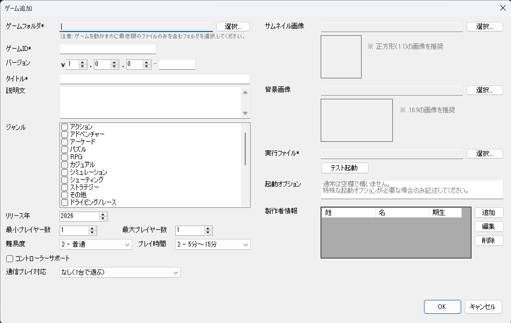

# ゲームの追加・編集・更新（くわしく）

管理ソフト（Manager）の **「ゲーム」タブ**での、ゲームの追加・編集・新バージョンへの更新の手順です。
一覧の上に「ゲーム追加」「編集」「バージョンアップ」「削除」「更新」のボタンがあります。

## ゲームを追加する

「ゲーム」タブで **「ゲーム追加」** を押すと、次のような入力画面が開きます。
上から順に、項目を埋めていきます（**「*」は必須**）。

### 1. ゲームフォルダ（必須）

「選択...」を押して、追加したいゲーム一式が入ったフォルダを選びます。

- そのゲームを**動かすのに必要なファイルだけ**が入ったフォルダにしてください（余計なものは入れない）。
- フォルダを選ぶと、次の項目が**見つかれば自動で入力**されます。
    - **実行ファイル**: フォルダ内の `.exe`（クラッシュ報告ツールなどは除外）
    - **サムネイル**: `thumbnail.png` / `thumb.png` / `thumb.jpg` / `icon.png` / `icon.jpg`
    - **背景画像**: `background.png` / `background.jpg` / `bg.png` / `bg.jpg` / `preview.png` / `preview.jpg`

!!! warning "取り込むフォルダは TonePrism の外から選びます"
    選ぶのは、**あなたの手元にあるゲーム一式（ビルド／配布用フォルダ）**です。
    TonePrism が管理している保存先（`games` フォルダの中）は選べません。
    そこを選ぶと「**コピー元として games フォルダ内のフォルダが選択されています**」と出るので、
    元のフォルダを選び直してください。

### 2. ゲームID（必須）

このゲームを区別するための名前で、**ほかのゲームと重ならない**ものにします。
このIDは、ゲームの保存先フォルダの名前としても使われます。

使える文字は、**半角の英数字（`a`〜`z`、`A`〜`Z`、`0`〜`9`）とアンダースコア（`_`）・ハイフン（`-`）だけ**で、長さは **64 文字以内**です。
日本語やスペース、その他の記号（`/` や `.` など）は使えません。
決まりに合わない文字のまま保存しようとすると Manager が知らせてくれるので、その場合はメッセージに従って入れ直してください。

例: `my_game`、`puzzle-2025`、`tennis01`

### 3. バージョン

ゲームの版（バージョン）です。**3 つの数字ダイヤル**「メジャー．マイナー．パッチ」で選んで入力し、
`v1.0.0` のような形になります。

!!! info "バージョン番号の決め方（セマンティックバージョニング）"
    `v1.2.3` のように **3 つの数字**でできていて、左から **メジャー . マイナー . パッチ** と呼びます。
    変更の大きさに合わせて、どれを 1 増やすかを決めます。

    | 位置 | 名前 | こんなときに 1 増やす |
    | --- | --- | --- |
    | 左 | メジャー | これまでと大きく変わる作り直し（前の版と互換性がない大きな変更） |
    | 中 | マイナー | 遊び方・機能の追加（今までの遊びは壊さない） |
    | 右 | パッチ | 小さな修正・バグ直し |

    増やしたら、**それより右の数字は 0 に戻します**。

    - パッチを上げる: `v1.4.2` → `v1.4.3`（バグを直しただけ）
    - マイナーを上げる: `v1.4.2` → `v1.5.0`（モードを 1 つ追加した、など）
    - メジャーを上げる: `v1.4.2` → `v2.0.0`（大きく作り直した）

    **はじめて登録するとき（最初のバージョン）**

    基本は、**まだ完成していない段階から `v0.1.0` で登録し、バージョンアップしながら完成を目指します**。

    - 左が 0（`v0.x.x`）のあいだは「**まだ完成前**」の目印です。直し＝パッチ／機能追加＝マイナーで増やしていきます（`v0.1.0` → `v0.2.0` → …）。
    - 完成して展示・配布できる状態になったら **`v1.0.0`**（＝メジャーリリース、はじめての完成版）に上げます。

    すでに完成しているゲームなら、**最初から `v1.0.0` で登録してもかまいません**。

    **迷ったら「パッチ」を 1 つ上げれば大丈夫**です。
    （数字の範囲: メジャーは 0〜99、マイナー・パッチは 0〜999）

    **おまけの表記「`-rc1`」など（任意）**

    3 つのダイヤルの右に、`-rc1` のような表記を足せる**小さな入力欄**があります。
    これは「**正式版を出す前のお試し版（リリース候補）**」を表すためのもので、
    たとえば `v1.0.0-rc1` は「`v1.0.0` を出す直前のテスト版」という意味になります（`rc` ＝ release candidate）。

    - 必須ではないので、**よく分からなければ空のままで大丈夫**です。
    - テスト版や候補版を分けて管理したい人は、**ぜひ使ってください**。書式は、英数字とハイフンをピリオドで区切る形です（例: `rc1` / `beta.2` / `rc-1`）。
    - 使える文字は**英数字・ハイフン・ピリオド区切りだけ**、長さは**32文字まで**です。スペースや記号・日本語など、それ以外を入れて保存しようとすると「バージョン入力エラー」が出ます（バージョンはフォルダ名にも使われるための制限です）。

### 4. タイトル（必須）

来場者の画面に表示される**ゲーム名**です。

### 5. 説明文

ゲームの紹介文。来場者がどんなゲームか分かるように書きます。

### 6. ジャンル

アクション・パズルなど、ゲームの種類。

### 7. リリース年

ゲームが作られた年。

### 8. 最小プレイヤー数 / 最大プレイヤー数

何人で遊べるか（例: 1〜2 人）。

### 9. 難易度

むずかしさの目安。

### 10. プレイ時間

1 回遊ぶときのおよその時間。

### 11. コントローラーサポート

コントローラーで遊べるゲームなら、チェックを入れます。

### 12. 通信プレイ対応

通信対戦などに対応していれば設定します。

### 13. サムネイル画像

一覧に出る小さな画像です。**正方形（1:1＝たてとよこが同じ長さ）**がおすすめ。自動で見つかっていれば入っています。

### 14. 背景画像

詳しい画面などで使う背景画像です。**16:9（テレビやパソコンの画面と同じ横長の形）**がおすすめ。

### 15. 実行ファイル（必須）

ゲーム本体の `.exe` です。自動で見つかっていれば入っています。
**「テスト起動」**を押すと、その場でちゃんと起動するか確認できます。

!!! tip "パス欄は直接入力もできます（v0.17.0〜）"
    サムネイル / 背景 / 実行ファイルの**パス欄は、ボタンを押さなくても直接タイピング**で書き換えられます。
    たとえば `v1.0.0/sub/launcher.exe` のような微調整を、ファイル選択ダイアログを開かずに行えます。

    - 区切り文字は `\` でも `/` でも OK（`/` は自動で `\` に直されます）。
    - サムネイル / 背景は `.png` / `.jpg` / `.jpeg` / `.bmp` のいずれかにしてください。
    - 実行ファイルは `.exe` のみ受け付けます。
    - 入力した瞬間にプレビュー画像が追従し、保存しようとした時点で**ファイルが存在しないとエラー**が出ます。

### 16. 起動オプション

ほとんどのゲームでは指定は要りません。**よく分からなければ空のままで大丈夫**です。

!!! info "起動オプションとは？（使う人向け）"
    ゲームを起動するときに、実行ファイル（`.exe`）へ**追加で渡す指示（コマンドライン引数）**です。
    ゲームによっては、これで「最初から全画面で起動する」「ウィンドウ表示にする」「特定のモードで始める」
    といった動作を指定できます。

    - 何を入れられるかは、主に**そのゲームを作ったゲームエンジン（Godot・Unity など）の仕様**で決まります。
      エンジンの公式ドキュメントで使えるオプションを確認してください（作者が独自に追加したものがあれば、それも使えます）。
    - 入れた内容は、起動時にそのままゲームに渡されます（例: `-fullscreen` など、そのゲームが対応している文字列）。

### 17. 製作者情報

そのゲームを作った人を登録します。**複数人**を登録でき、一覧（表）に「姓・名・期生」が並びます。
一覧の下の「追加」「編集」「削除」ボタンで操作します。

- **追加**: 「追加」を押すと入力画面（製作者情報追加）が開きます。次を入れて「OK」を押すと、一覧に加わります。
    - **姓**: 入れなくてもかまいません。
    - **名**（必須）
    - **期生**: 数字で入れます。**`0` を入れると「教員」**と表示され、それ以外はその数字の「○期生」と表示されます（例: `50` → 50期生）。
- **編集**: 一覧で**直したい人の行を選んでから**「編集」を押します（選ばずに押すと「選択してください」と出ます）。
- **削除**: 一覧で**消したい人の行を選んでから**「削除」を押し、確認で「はい」を選ぶと消えます。

---

入力できたら **「OK」** を押します。選んだフォルダが TonePrism の中（`games`）にコピーされ、一覧に追加されます。
やめるときは「キャンセル」。

## ゲームを編集する

すでに登録したゲームの**情報（タイトル・説明など）を直す**ための画面です。

!!! warning "ゲーム本体が新しくなったときは「バージョンアップ」を使ってください"
    新しいビルド（**新しい `.exe`**）に差し替えたいなど、**ゲーム本体が新しくなった**ときは、
    編集で上書きするのではなく、**[バージョンアップ](#新しいバージョンに更新するバージョンアップ)** で新しい版として登録してください。
    そうすれば前の版も残り、ランチャーで表示する版をあとから切り替えられます。

1. 一覧から編集したいゲームを選びます。
2. **「編集」** を押します。
3. 追加のときと同じ項目が並ぶので、直したいところを直して **「OK」** で保存します。

### ランチャーで表示するバージョンを選ぶ

編集画面には「**ランチャーで表示するバージョン**」という選ぶ欄（ドロップダウン）があります。
これは**編集画面だけの特別な項目**で、ここでこのゲームの「表示する版」を切り替えます。

- そのゲームで**これまでに登録したすべてのバージョン**が、この欄に一覧で並びます。
- ここで**選んだバージョンが、ランチャーで起動・表示される版**になります。
- 欄を切り替えると、その版の情報（タイトルや実行ファイルなど、下のほうの項目）が表示され、**版ごとに編集**できます。切り替えても、それまでの編集内容は保たれます。
- 最後に「表示したい版」を選んだ状態で **「OK」** を押すと、その版が「ランチャーで表示する版」として保存されます。

!!! tip "「ランチャーに表示する」チェックとの違い"
    別にある「**ランチャーに表示する**」のチェックは、**そのゲーム自体**をランチャーに出すか／隠すかの切り替えです。
    どの版を表示するか（上の選ぶ欄）とは別の設定です。

!!! note "ゲームID も変えられます"
    編集では**ゲームID も変更できます**。変更して保存すると、保存先フォルダの名前も自動で付け替えられます
    （途中で失敗したときは元に戻されます）。ただし ID はゲームを区別する大事な名前なので、
    **変える必要がなければそのまま**にしておくのがおすすめです。

## 新しいバージョンに更新する（バージョンアップ）

ゲーム本体が新しくなったときに使います。

1. 一覧から更新したいゲームを選んで **「バージョンアップ」** を押します。
2. **現在のバージョン**が表示されます。**「新バージョン」**（必須）は、はじめは現在の番号の
   **パッチを 1 増やした値**になっています。変更の大きさに合わせて、上の「[バージョン](#3-バージョン)」で
   説明した メジャー／マイナー／パッチ の考え方で数字を決めてください。
3. **「ゲームフォルダ」**（必須）で新しい版のフォルダを選びます（**フォルダ全体がコピー**されます）。
4. ほかの項目は追加のときと同じです。必要なところだけ直します。
5. **「更新内容など」**に、何を変えたかをメモできます。
6. **「OK」** で保存します。

!!! warning "新しい版のフォルダも TonePrism の外から選びます"
    手順 3 で選ぶのは、**手元の新しいビルド（配布用フォルダ）**です。
    TonePrism の保存先（`games` フォルダの中）は選べません（選ぶとエラーになります）。
    選んだフォルダは中身まるごと新しい版としてコピーされます。

!!! note "前の版も残ります"
    バージョンアップしても、**前の版はそのまま残ります**（消えません）。
    編集画面の「ランチャーで表示するバージョン」で、いつでも前の版に表示を戻せます。

## ゲームを削除する

1. 一覧から削除したいゲームを選んで **「削除」** を押します。
2. 確認画面で、消すフォルダの場所をたしかめてから削除します（**一覧からも、ゲームのファイルも消えます**）。
3. 来場者向けの画面（Launcher）が開いているなどでファイルが使用中だと、削除に失敗することがあります。
   その場合は Launcher を閉じてから、もう一度試してください。
