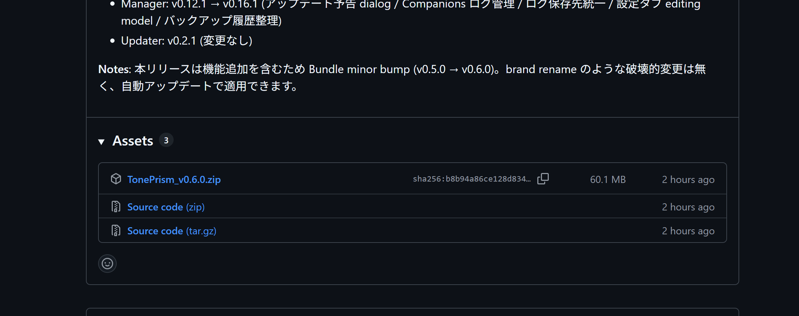

# インストール

TonePrism は、配布ページからダウンロードした zip と、その中の `Install.bat` で導入します。
かかる時間は 1 分ほどです。

!!! tip "くわしい手順は zip の中の説明書にあります"
    手順の最新版は、ダウンロードした zip の中に入っている **`INSTALL_README.txt`**（読んでね、という説明書）に、
    そのバージョン向けの内容で入っています。このページはその要点だけをまとめたものです。

## 入れかた

1. [配布ページ（GitHub）](https://github.com/ken1208git/TonePrism/releases) を開き、いちばん新しいリリースの **「Assets」**（添付ファイル）の中にある `TonePrism_vX.Y.Z.zip` をダウンロードする
    - 同じ場所にある `Source code (zip)` ではなく、**`TonePrism_...` のほう**を選んでください

    

2. ダウンロードした zip を右クリック →「すべて展開」で**解凍する**（解凍せずに中身を直接開くと、文字化けや失敗の原因になります）
3. 解凍してできたフォルダの中の `Install.bat` を**ダブルクリック**する
4. フォルダを選ぶ画面が出るので、**TonePrism を入れたい場所のフォルダ**を選ぶ
    - 例: `D:\Games` を選ぶと、その中に `TonePrism` フォルダが作られて入ります
    - 学校のサーバーに入れるときは、`\\サーバー名\PCクラブ\` のような**書き込みできる場所**を選んでください
5. 終わると「Manager を起動しますか？」と聞かれます（`Y` を入力して Enter を押すと管理ソフトが開きます。何も入力せずに Enter を押すと、そのまま閉じます）

## 入れたあとにできるもの

選んだフォルダの中に、ダブルクリックして使う 2 つのアイコンができます。

```text
D:\Games\                  ← 選んだフォルダ
├── Launcher.bat           ← 来場者向けの画面を開く（展示中に使う）
├── Manager.bat            ← スタッフ用の管理ソフトを開く（準備・管理に使う）
└── TonePrism\             ← 本体（ふだんは開かなくてOK）
```

## 新しいバージョンにする（アップデート）

- **ふつうのとき**: 管理ソフト（Manager）の「アップデート」タブで「今すぐアップデート」を押すだけ。
  ダウンロードから入れ替え、再起動まで自動で進みます（→ [管理ソフトの使い方](manager.md#アップデートの適用)）。
- **管理ソフトが開けないとき**: 新しい zip をもう一度ダウンロードして、同じ `Install.bat` を実行し、
  「すでに入っています」の確認で `Y`（上書き）を選びます。

!!! success "ゲームのデータは消えません"
    アップデートでも上書きでも、**登録したゲームや、たまった記録（プレイ記録・アンケートなど）はそのまま残ります**。
